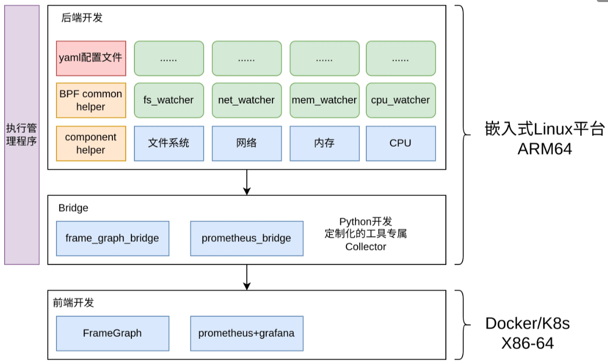

# MagicEyes
## 1. 简介
一款用于Linux内核的可观测性定制工具，覆盖CPU、内存、网络、文件、虚拟化等子系统。

母项目直达：[lmp](https://github.com/linuxkerneltravel/lmp)
## 2. 架构

## 3. 目前已有的工具
- 文件系统部分
- [x] fs_watcher
- 内存部分
- [x] mem_watcher
- 网络部分
- [x] net_watcher
- CPU部分
- [x] cpu_watcher
- [x] proc_image
- 虚拟化部分
- [x] kvm_watcher
- 系统诊断与调优
- [x] stack_analyzer

## 4. 编译安装
```bash
git clone git clone --recurse-submodules <magic_eyes_address>
mkdir build && cd build
# 编译所有工具
cmake -DBUILD_ALL=ON -D -DCMAKE_INSTALL_PREFIX=<install_dir> ..
# 编译单独某个工具，如 fs_watcher
cmake -DBUILD_FS_WATCHER=ON ..
make
make install
```
