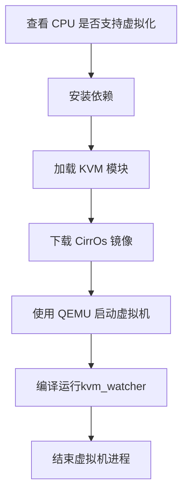

# kvm_watcher项目

## 一、项目简介

`kvm_watcher` 是一个基于 eBPF 技术的项目，旨在在宿主机侧监控和提取 KVM 虚拟机的性能指标，同时对宿主机性能影响较小。该项目基于 eBPF 的实时监控方案，通过在宿主机中执行eBPF程序，实时捕获有关 KVM 虚拟机的关键性能数据和性能事件，提供全面的性能数据，帮助管理员优化虚拟化环境，改善虚拟机的运行效率和响应性，并且允许用户根据实际需求选择监控的指标和事件，实现个性化配置。

## 二、功能介绍

`kvm_watcher`是一款基于eBPF的kvm检测工具，其旨在使用户方便快捷在宿主机侧获取kvm虚拟机中的各种信息。

目前，其实现的功能主要包括：

- **VM Exit 事件分析：** 
  - 捕获 VM Exit 事件，包括发生的时间戳、原因、次数以及处理时延等信息。
- **KVM mmu事件分析：**
  - 监控 KVM 中的 mmu page fault 和mmio page fault 事件，记录gva、hva、pfn、错误类型和处理时延等关键信息。
  - 实时监控kvm虚拟机中产生的dirty page，记录脏页地址、变脏时间、变脏次数和memslot等相关信息。
- **vCPU相关指标分析：**
  - 记录有关vCPU的性能指标，包括唤醒时的时间戳，halt持续时间，vCPU id等相关信息。
  - 实时监控vCPU的halt-polling时间的变化信息，包括vCPU的线程tid，变化类型，变化前后的halt-polling时间等信息。
- **kvm中中断注入时相关信息：**
  - PIC:实时记录PIC芯片类型，中断引脚编号，中断触发方式，是否可屏蔽，处理延时，是否发生合并等信息。
  - IOAPIC:
  - MSI:

## 三、使用方法

> 环境：
>
> Kernel: Linux6.2  
>
> OS: Ubuntu 23.04
>
> QEMU emulator version 7.2.0

**安装依赖：**

```
sudo apt install clang libelf1 libelf-dev zlib1g-dev libbpf-dev linux-tools-$(uname -r) linux-cloud-tools-$(uname -r)
sudo modprobe kvm && sudo modprobe kvm-intel //加载kvm模块
```

**编译运行：**

```
make
sudo ./kvm_watcher [options]
make clean
```

**参数介绍：**

`kvm_watcher`通过一系列命令参数来控制其具体行为：

```
Usage: kvm_watcher [OPTION...]
BPF program used for monitoring KVM event

  -d, --mark_page_dirty      Monitor virtual machine dirty page information.
  -e, --vm_exit              Monitoring the event of vm exit.
  -f, --kvmmmu_page_fault    Monitoring the data of kvmmmu page fault.
  -c, --kvm_irq              Monitor the interrupt information in KVM VM.
  -m, --mmio                 Monitoring the data of mmio page fault..(The -f option must be specified.)
  -n, --halt_poll_ns         Monitoring the variation in vCPU halt-polling time.
  -p, --vm_pid=PID           Specify the virtual machine pid to monitor.
  -s, --stat                 Display statistical data.(The -e option must be specified.)
  -t, --monitoring_time=SEC  Time for monitoring.
  -w, --vcpu_wakeup          Monitoring the wakeup of vcpu.
  -?, --help                 Give this help list
      --usage                Give a short usage message
  -V, --version              Print program version
```

`-h`：输出帮助信息

`-e`：记录vm exit事件信息

`-s`：输出最后的vm exit事件统计信息(需要和`-e`一同使用)

`-f`：记录kvmmmu缺页信息

`-c：记录kvm中断芯片设置相关信息

`-m`：记录mmio缺页信息（需要和`-f`一同使用）

`-d`：记录kvm脏页信息

`-n`：记录vcpu的halt-polling相关信息

`-w`：记录vcpu唤醒时的相关信息

`-p`：指定kvm虚拟机进程pid

`-t`：监控时间

## 四、代码结构

```
├── include
│   ├── kvm_exits.h           //vm exit事件相关的内核bpf程序
│   ├── kvm_mmu.h             //kvmmmu相关的内核bpf程序
│   ├── kvm_irq.h             //kvm中断相关内核bpf程序
│   ├── kvm_vcpu.h            //vcpu相关内核bpf程序
│   └── kvm_watcher.h         //项目公用头文件
├── Makefile                  //编译脚本
├── src
│   ├── kvm_watcher.bpf.c     //内核态bpf入口程序
│   └── kvm_watcher.c         //用户态bpf程序
└── temp
    └── dirty_temp            //脏页临时文件
```

## 五、测试

Makefile 提供了测试命令来进行测试。即使您没有设置过 KVM 虚拟化环境，也可以使用 Makefile 来测试程序的功能。

程序测试流程如下：



- **使用方法**

  要运行测试，请执行以下命令：

  ```
  make test
  ```

  这将自动执行上述测试流程，并在结束后提供测试结果。