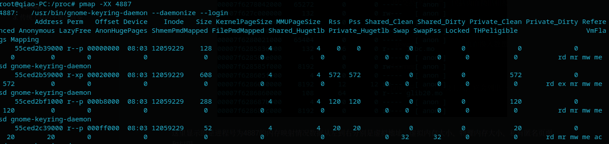

# 从proc目录分析内存使用的性能指标

proc目录是一个位于内存中的伪文件系统。该目录保存这系统所有的运行数据，例如系统内存、磁盘io、cPU和系统配置等。同时，proc目录也是一个系统控制入口，用户可以通过更改其中某些文件数据来改变内核的运行状态。在proc目录下，对于系统级内存指标都在meminfo文件下，这个文件中包含了当前系统内存状态的大部分信息。以下列举了常见的一些指标：

| 参数            | 含义                                           | 参数           | 含义                                                 |
| --------------- | ---------------------------------------------- | -------------- | ---------------------------------------------------- |
| memtotal        | 系统当前可用内存总量                           | memavailable   | 系统当前可使用的页面，包含空闲，文件映射，可回收页面 |
| swaptotal       | 交换分区大小                                   | swapfree       | 交换分区的空闲页面大小                               |
| cached          | 用于页面高速缓存的页面                         | unevictable    | 不能回收的页面                                       |
| active          | 活跃的匿名页，包含匿名页和文件页               | inactive       | 不活跃的匿名页，包含匿名页面和文件页面               |
| dirty           | 脏页大小。由文件脏页统计                       | writeback      | 正在会写的脏页数量，                                 |
| anonpages       | 有反向映射的页面，通常是匿名页面映射到用户空间 | mapped         | 所有映射到用户地址空间的文件缓存页面                 |
| shmem           | 共享内存                                       | kreclaimable   | 内核可以回收的页面                                   |
| slab            | 所有用于slab分配器的页面                       | sreclaimable   | 可回收的slab页面                                     |
| sunreclaim      | 不可回收的slab页面                             | NFS_unstable   | 发送到服务器但是还没有写入磁盘的页面                 |
| writebacktmp    | 回写过程中使用的临时缓存                       | percpu         | percpu机制使用的页面                                 |
| hugepages_total | 普通巨页数量                                   | hugepages_free | 空闲的巨页数量                                       |

对于进程的内存信息都保存在、proc/进程号/status中，在这个文件下保存这有关进程的所有参数信息，内存信息只是其中一部分：

| 参数        | 含义                   | 参数     | 含义                   |
| ----------- | ---------------------- | -------- | ---------------------- |
| vmpeak      | 进程使用的最大虚拟内存 | vmsize   | 进程使用的虚拟内存     |
| vmlack      | 进程锁住的内存         | vmpin    | 进程固定的内存         |
| vmhwm       | 进程使用的最大物理内存 | rssanon  | 进程使用的匿名页面     |
| rssfile     | 进程使用的文件映射页面 | rssshmem | 进程使用的共享页面     |
| vmdata      | 进程私有数据段大小     | vmstk    | 进程用户栈大小         |
| vmexe       | 进程代码段大小         | vmlib    | 进程共享库大小         |
| vmpte       | 进程页表大小           | vmswap   | 进程使用的交换空间大小 |
| hugetlbpage | 进程使用的巨页大小     |          |                        |


## 1. 从内核角度分析proc目录下内存指标来源

核在处理内存状态信息时不会在需要时才会遍历整个内存节点，这样只会消耗大量硬件资源。而是在内存页面状态发生改变时调用内核提供的接口函数进行计算并保存在对应的全局数组中。Linux内核总共定义了三个全局数组，分别是vm_node_stat（内存节点有关统计数据）、vm_zone_stat（内存管理区有关统计数据）、vm_numa_stat（numa相关统计数据），对应在mm/vmstat.c文件中。如下：

```c
/*
 * Manage combined zone based / global counters
 *
 * vm_stat contains the global counters
 */
atomic_long_t vm_zone_stat[NR_VM_ZONE_STAT_ITEMS] __cacheline_aligned_in_smp;
atomic_long_t vm_numa_stat[NR_VM_NUMA_STAT_ITEMS] __cacheline_aligned_in_smp;
atomic_long_t vm_node_stat[NR_VM_NODE_STAT_ITEMS] __cacheline_aligned_in_smp;
EXPORT_SYMBOL(vm_zone_stat);
EXPORT_SYMBOL(vm_numa_stat);
EXPORT_SYMBOL(vm_node_stat);

#ifdef CONFIG_SMP
```

内核总共提供了4个接口函数操作这些全局数组，包含获取数据、增加/递减数据。

```c
/*增加页面数量到内存管理区vm_stat数组和全局vm_zone_stat数组中*/
static inline void zone_page_state_add(long x, struct zone *zone,
                                 enum zone_stat_item item)
{
        atomic_long_add(x, &zone->vm_stat[item]);
        atomic_long_add(x, &vm_zone_stat[item]);
}
/*增加页面数量到内存节点vm_stat数组和全局vm_node_stat数组中*/
static inline void node_page_state_add(long x, struct pglist_data *pgdat,
                                 enum node_stat_item item)
{
        atomic_long_add(x, &pgdat->vm_stat[item]);
        atomic_long_add(x, &vm_node_stat[item]);
}
/*读取全局vm_zone_stat数组中统计数据*/
static inline unsigned long global_zone_page_state(enum zone_stat_item item)
{
        long x = atomic_long_read(&vm_zone_stat[item]);
#ifdef CONFIG_SMP
        if (x < 0)
                x = 0;
#endif
        return x;
}
/*读取全局vm_node_stat数组中统计数据*/
static inline unsigned long global_node_page_state(enum node_stat_item item)
{
        long x = atomic_long_read(&vm_node_stat[item]);
#ifdef CONFIG_SMP
        if (x < 0)
                x = 0;
#endif
        return x;
}
```

同时在pglist_data和zone数据结构中定义了vm_stat数组辅助统计状态信息。而proc目录下和内存有关的数据大部分都会通过三个全局变量和vm_stat获取。剩余数据则通过遍历全部zone数据结构中vm_stat数组成员或者其他独立的全局变量读取。这些单独全局变量的读取函数为atomic_long_read。

对应到meminfo文件中的数据，由内核中的meminfo_proc_show函数打印，这个函数实现在fs/proc/meminfo.c中。函数的实现思路非常简单，就是直接调用有关数组操作函数读取对应的全局变量信息，经过简单计数之后直接打印。具体实现如下：

```c
static int meminfo_proc_show(struct seq_file *m, void *v)
{
		...
        /*调用函数获取全局变量信息*/    
        si_meminfo(&i);
        si_swapinfo(&i);
        committed = percpu_counter_read_positive(&vm_committed_as);

        cached = global_node_page_state(NR_FILE_PAGES) -
                        total_swapcache_pages() - i.bufferram;
        if (cached < 0)
                cached = 0;

        for (lru = LRU_BASE; lru < NR_LRU_LISTS; lru++)
                pages[lru] = global_node_page_state(NR_LRU_BASE + lru);

        available = si_mem_available();
        sreclaimable = global_node_page_state(NR_SLAB_RECLAIMABLE);
        sunreclaim = global_node_page_state(NR_SLAB_UNRECLAIMABLE);
    	/*数据输出*/
		show_val_kb(m, "MemTotal:       ", i.totalram);
    	...
    	show_val_kb(m, "Percpu:         ", pcpu_nr_pages());

        hugetlb_report_meminfo(m);
        arch_report_meminfo(m);
        return 0;
}
```

进程级别的内存状态信息保存在task_struct的mm_struct成员中，其中物理内存的使用情况保存在mm_rss_stat数据结构中,在include/linux/mm_types_task.h 中定义如下:

```c
struct mm_rss_stat {
        atomic_long_t count[NR_MM_COUNTERS];
};

enum {  
        MM_FILEPAGES,   /* 进程使用的文件映射页面数量 */
        MM_ANONPAGES,   /* 进程使用的匿名页面数量 */
        MM_SWAPENTS,    /* 进程使用的交换分区匿名页面数量 */
        MM_SHMEMPAGES,  /* 进程共享的内存页面数量 */
        NR_MM_COUNTERS
};
```

同时内核也为这些数据定义了相关接口函数，这些接口定义在include/linux/mm.h中

```c
/*获取member计数*/
static inline unsigned long get_mm_counter(struct mm_struct *mm, int member)
{       
        long val = atomic_long_read(&mm->rss_stat.count[member]);

#ifdef SPLIT_RSS_COUNTING
        if (val < 0)
                val = 0;
#endif  
        return (unsigned long)val;
}
/*增加value个member计数*/
static inline void add_mm_counter(struct mm_struct *mm, int member, long value)
{
        atomic_long_add(value, &mm->rss_stat.count[member]);
}
/*使member计数加1*/
static inline void inc_mm_counter(struct mm_struct *mm, int member)
{
        atomic_long_inc(&mm->rss_stat.count[member]);
}
/*使member计数减1*/
static inline void dec_mm_counter(struct mm_struct *mm, int member)
{
        atomic_long_dec(&mm->rss_stat.count[member]);
}
```

在proc/j进程号/status文件中，对于进程内存的使用数据都是通过以上的方式采集。具体的实现在

```c
void task_mem(struct seq_file *m, struct mm_struct *mm)
{
		...
        /*调用接口函数读取mm_struct数据结构中的数据*/    
        anon = get_mm_counter(mm, MM_ANONPAGES);
        file = get_mm_counter(mm, MM_FILEPAGES);
        shmem = get_mm_counter(mm, MM_SHMEMPAGES);

        hiwater_vm = total_vm = mm->total_vm;
        if (hiwater_vm < mm->hiwater_vm)
                hiwater_vm = mm->hiwater_vm;
        hiwater_rss = total_rss = anon + file + shmem;
        if (hiwater_rss < mm->hiwater_rss)
                hiwater_rss = mm->hiwater_rss;

        text = PAGE_ALIGN(mm->end_code) - (mm->start_code & PAGE_MASK);
        text = min(text, mm->exec_vm << PAGE_SHIFT);
        lib = (mm->exec_vm << PAGE_SHIFT) - text;

        swap = get_mm_counter(mm, MM_SWAPENTS);
    	/*将数据输出到status文件中*/
        SEQ_PUT_DEC("VmPeak:\t", hiwater_vm);
        ...
        SEQ_PUT_DEC(" kB\nVmSwap:\t", swap);
        seq_puts(m, " kB\n");
        hugetlb_report_usage(m, mm);
}
```

## 2. 传统工具数据来源与信息解读

传统工具的数据来源就是通过读取proc目录下对应的文件数据，之后经过计算之后输出到屏幕上的，而每次读取数据时都proc目录文件都会再次刷新数据之后写到文件中。因此在整个数据提取过程中传统工具都是被动的接受内核提供的数据。而没有以内核接口函数的方式主动获取数据。以下对内存有关工具做一分析。

### 1.vmstat

这个工具会对系统虚拟内存和物理的使用情况进行统计，包括当前内存和换页的系统内存健康程度。


以上信息的单位是kb

swpd：交换到交换空间的内存数量

free：内存中空闲的内存大小

buff：用于缓存的内存大小

cache：用于页缓存的内存大小

si：换入的内存大小

so：换出的内存大小

### 2.swapon

这个工具主要显示交换设备的使用情况，以及他们的使用率


这块显示了当前只有一个交换空间。总内存为20.4G的物理磁盘分区（partition）。同时还显示了当前交换空间的使用量为2G。如果设备没有分配交换空间，那么这块就不会有任何输出。

### 3.sar

这个工具是系统状态报告工具，它和vmstat一样不仅仅输出内存信息。我们可以用它查看当前的系统活动状态和系统历史的统计数据。因此在初次使用需要配置数据库。

这个对应内存的统计有如下参数。

-B:换页的统计信息

| 参数    | 含义                   | 参数    | 含义                     |
| ------- | ---------------------- | ------- | ------------------------ |
| pgpgin  | 页面换入               | pgpgout | 页面换出                 |
| fault   | 轻微缺页               | majflt  | 严重缺页                 |
| pgfree  | 页面加入到空闲链表数量 | pgscank | 被kswapd进程扫描过的页面 |
| pgscand | 直接页面扫描           | pgsteal | 页面及交换缓存回收       |
| vmeff   | 页面扫描速率           |         |                          |

-H:巨页统计报告

| 参数      | 含义         | 参数      | 含义           |
| --------- | ------------ | --------- | -------------- |
| hbhugfree | 空闲巨页数量 | hbhugused | 占用的巨页大小 |
| hugused   | 巨页使用率   |           |                |

-r:内存使用情况报告

| 参数      | 含义         | 参数      | 含义                 |
| --------- | ------------ | --------- | -------------------- |
| kbavail   | 可用内存     | kbmemused | 正在使用的内存       |
| kbmemfree | 空闲的内存   | memused   | 内存使用率           |
| kbbuffers | 高速缓存大小 | kbcached  | 页面高速缓存大小     |
| kbcommit  | 提交的主存   | commit    | 当前负载提交的内存   |
| kbactive  | 活跃链表大小 | kbinact   | 不活跃链表大小       |
| kbdirtyw  | 脏页大小     | kbanonpg  | 匿名页面             |
| kbslab    | slab缓存大小 | kbstack   | 内核栈空间           |
| kbpgtbl   | 页表大小     | kbvmused  | 已使用的虚拟内存大小 |

-S:交换空间使用统计，包含释放的交换空间、占用的交换空间、交换空间使用率、高速缓存的交换空间。

| 参数      | 含义                 | 参数      | 含义               |
| --------- | -------------------- | --------- | ------------------ |
| kbswpfree | 释放的交换空间       | kbswpused | 占用的交换空间     |
| swpused   | 交换空间使用率       | kbswpcad  | 高速缓存的交换空间 |
| swpcad    | 缓存使用交换空间比例 |           |                    |

-W:交换统计信息，包括页面换出和换入统计。

| 参数   | 含义         | 参数    | 含义         |
| ------ | ------------ | ------- | ------------ |
| pswpin | 页面换入数量 | pswpout | 页面换出数量 |

### 4.pmap

pmap是一个进程级工具，它会列出一个进程的内存使用情况


这里显示的是进程号为4887的内存映射情况数据从左到右分别是虚拟地址，虚拟内存大小、物理内存大小、私有匿名页面和权限。

这个工具提供多个参数可以决定打印数据的多少，其中-x会打印扩展字段，-XX则会打印内核提供的所有进程级映射参数，如下：



## 3. 传统工具的不足与借鉴

从传统工具可以看出主要存在以下问题

数据输出固定，输出形式上不够灵活。展示的数据要么过于松散，不同子系统的数据都会展示一些，但是没有具体的输出某个子系统详细信息。要么过于集中，只关注一个模块，但是数据输出缺乏灵活，不能按照使用者需求选择性输出。

借鉴

首先传统工具在数据输出形式上具有一定的可取之处，不同数据以何种形式输出，才能方便使用者观察系统状态变化就成了一个有待考虑的事。而传统工具在经过多次使用和版本迭代优化，在输出格式上相对成熟。所有本项目开发的工具就借鉴了这些输出格式，以方便使用者使用。


