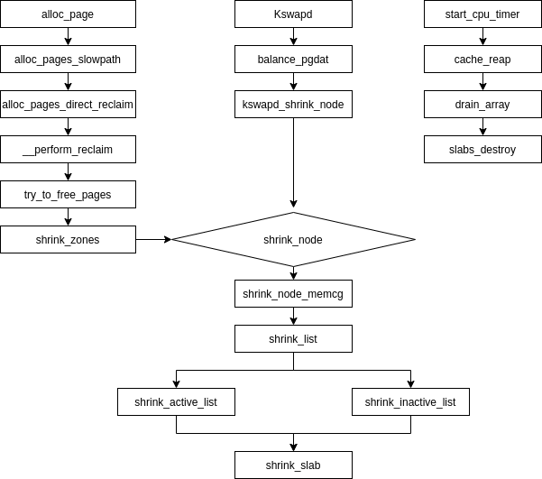

# 内存回收分析

在Linux内核中，内存回收主要存在三个方面，一个是文件缓存页面直接释放、脏页回写并释放、还有就是将部分页面放入磁盘交换分区中从而腾出物理内存空间。而它的扫描对象是LRU链表。当内存不足时，这些存在于LRU链表的页面将称为被换出的候选页面，内核使用双向链表定义LRU链表，并根据页面的不同类型将其分为匿名链表和文件链表，每种类型根据页面的活跃性有分为活跃LRU链表和不活跃LRU链表。因此内核总共定义如下5种LRU链表

LRU_INACTIVE_ANON不活跃匿名链表

LRU_ACTIVE_ANON活跃匿名链表

LRU_INACTIVE_FILE不活跃文件链表

LRU_ACTIVE_FILE活跃文件链表

LRU_UNEVICTABLE不可回收页面链表

之所以这样划分是因为当内存不足时内核总是优先换出文件映射的的页面，而不是匿名页面。在大多数情况下，文件缓存页面并不需要被回写带磁盘，除非页面被修改变成脏页。而匿名页面总要在写入交换分区之后，才能被换出（如果没有配置交换分区，内核就不会扫描匿名链表）。目前内核对LRU链表以内存节点配置（4.8之前按内存管理区配置），也就是说一个内存节点有一套LRU链表，内存节点中的lruvec成员就是用了管理LRU链表的。

```c
#define LRU_BASE 0
#define LRU_ACTIVE 1
#define LRU_FILE 2

enum lru_list {
        LRU_INACTIVE_ANON = LRU_BASE,
        LRU_ACTIVE_ANON = LRU_BASE + LRU_ACTIVE,
        LRU_INACTIVE_FILE = LRU_BASE + LRU_FILE,
        LRU_ACTIVE_FILE = LRU_BASE + LRU_FILE + LRU_ACTIVE,
        LRU_UNEVICTABLE,
        NR_LRU_LISTS
};

struct lruvec {
        struct list_head                lists[NR_LRU_LISTS];
        struct zone_reclaim_stat        reclaim_stat;
        /* Evictions & activations on the inactive file list */
        atomic_long_t                   inactive_age;
        /* Refaults at the time of last reclaim cycle */
        unsigned long                   refaults;
#ifdef CONFIG_MEMCG
        struct pglist_data *pgdat;
#endif
};
```

### 加入LRU链表

页面被加入LRU链表并不是申请到一个页面就会被添加到LRU链表中，而是通过批处理的方式。内核总是将需要被加入LRU链表的页面先放入一个队列中，当这个队列满的时候才会将这个队列中的页面按照类型加入到不同LRU链表中。加入LRU链表接口函数是lru_cache_add。

```c
static void __lru_cache_add(struct page *page)
{
        struct pagevec *pvec = &get_cpu_var(lru_add_pvec);

        get_page(page);
        if (!pagevec_add(pvec, page) || PageCompound(page))
                __pagevec_lru_add(pvec);
        put_cpu_var(lru_add_pvec);
}
```

其中函数首先获取pagevec结构体，这个结构体里面就存在一个前面提到的队列：

```c
struct pagevec {
        unsigned char nr;
        bool percpu_pvec_drained;
        struct page *pages[PAGEVEC_SIZE];
};
```

pagevec_add会向这个队列中添加页面并判断队列是否已经满了（内核通过宏定义最大为15个页面）。如果队列没有空间了，将调用_pagevec_lru_add->__lru_cache_add->_pagevec_lru_add_fn路径代码遍历所有页面按照不同类型添加到相应LRU链表中

```c
static void __pagevec_lru_add_fn(struct page *page, struct lruvec *lruvec,
                                 void *arg)
{
        enum lru_list lru;
        int was_unevictable = TestClearPageUnevictable(page);

        VM_BUG_ON_PAGE(PageLRU(page), page);

        SetPageLRU(page);
		smp_mb();

        if (page_evictable(page)) {//根据page->mapping映射判断页面是否属于不可回收页面
                lru = page_lru(page);//获取页面LRU类型
                update_page_reclaim_stat(lruvec, page_is_file_cache(page),
                                         PageActive(page));
                if (was_unevictable)
                        count_vm_event(UNEVICTABLE_PGRESCUED);
        } else {
                lru = LRU_UNEVICTABLE;//不可回收LRU链表
                ClearPageActive(page);
                SetPageUnevictable(page);
                if (!was_unevictable)
                        count_vm_event(UNEVICTABLE_PGCULLED);
        }

        add_page_to_lru_list(page, lruvec, lru);//将页面添加到对应LRU链表中
        trace_mm_lru_insertion(page, lru);
}
```

### 第二次机会法

第二次机会法是在经典LRU链表算法上做出的一些改进，目的是减少经常被访问的页面频繁的从链表换出，添加的操作。在经典LRU算法中，新产生的页面会被添加到LRU链表头部，并将现有的LRU链表中存在的页面向后移动一个位置。当系统内存短缺时，LRU链表尾部的页面将被换出。当系统在需要这些页面时，这些页面会重新置于LRU链表的表头。显然，这种设计没有考虑到该页面是频繁使用还是很少使用的页面。这将导致频繁使用的页面依然会被LRU链表换出。

第二次机会法为了避免频繁访问的页面被换出做了如下改进：

当选择换出页面时，依然和经典LRU链表算法一样，选择链表尾部的页面。但是第二次机会法设置了一个硬件访问状态位。当需要换出页面时就会检查这个状态位，如果为0就将这个页面换出，如果为1就给这个页面第二次机会，并选择下一个换出。页面在得到第二次机会时会将访问位清0。如果页面在此期间再次被访问，则访问位再次置1.于是，给了第二次机会的页面将不会被淘汰。因此如果一个页面被经常访问到，其访问状态位总是保持为1。将一直不会被淘汰。

Linux内核使用PG_active和PG_referebced两个软件标志位实现第二次机会法。PG_active表示页面是否为活跃页面，PG_referebced表示这个页面是否被引用过。

以内核读取文件为例：

 1. 第一次读文件：

    内核通过add_to_page_cache_lru函数将该页面PG_active标志位清零并添加到不活跃LRU链表中。之后执行mark_page_accessed函数将PG_referenced置位。此时PG_active=0，PG_referenced=1.

 2. 第二次读文件

    内核在次执行到mark_page_accessed函数时，判断此时的标志位为PG_active=0，PG_referenced=1。这时会将标志位设置成PG_active=1，PG_referenced=0，并将这个页面添加到活跃文件LRU链表中。之后的访问标志位处理方式一致，不会设置这两个。

mark_page_accessed函数函数处理如下：

```c
void mark_page_accessed(struct page *page) 
{
        page = compound_head(page);   
 /*如果PG_active=1&&PG_referenced=1(PG_active表示页面是否活跃，PG_referanced表示页面是否被引用过)，
  *则把该页面加入活跃LRU链表，并设置PG_active=1，清除PG_referenced标志位
  */
        if (!PageActive(page) && !PageUnevictable(page) &&
                        PageReferenced(page)) {
                if (PageLRU(page))
                        activate_page(page);
                else
                        __lru_cache_activate_page(page);
                ClearPageReferenced(page);
                if (page_is_file_cache(page))
                        workingset_activation(page);
        } else if (!PageReferenced(page)) {//如果PG_referanced==0，则设置PG_referanced标志位
                SetPageReferenced(page);
        }
        if (page_is_idle(page))
                clear_page_idle(page);
}
```

3. Kswapd扫描活跃链表

   此过程基本将所有有PTE访问和没有PTE访问的文件页面添加到不活跃LRU链表。清除PG_active标志位,PG_referenced标志位不变。

   ```c
   static void shrink_active_list(unsigned long nr_to_scan,//待扫描页面数量
                                  struct lruvec *lruvec,//LRU链表集合
                                  struct scan_control *sc,//页面扫描控制参数
                                  enum lru_list lru)//待扫描的LRU控制参数
   {
          ...
           while (!list_empty(&l_hold)) {//循环扫描临时链表，有些页面会添加到l_active中，有些会添加到l_inactive中
                   cond_resched();
                   page = lru_to_page(&l_hold);//从链表中取出一个页面
                   list_del(&page->lru);
   
                   if (unlikely(!page_evictable(page))) {//如果页面是不可回收的则放在不可回收链表中
                           putback_lru_page(page);
                           continue;
                   }
   		...
                   if (page_referenced(page, 0, sc->target_mem_cgroup,
                                       &vm_flags)) {//此函数会返回该页面最近访问、引用的PTE个数。
                           nr_rotated += hpage_nr_pages(page);//增加最近使用页面的计数
                           if ((vm_flags & VM_EXEC) && page_is_file_cache(page)) {//如果是可执行内容缓存页继续保存在活跃链表
                                   list_add(&page->lru, &l_active);
                                   continue;
                           }
                   }
                   ClearPageActive(page);  /*清除页面PG_Axtive标志*/
                   SetPageWorkingset(page);
                   list_add(&page->lru, &l_inactive);//添加到不活跃链表中
           }
   		...
           nr_activate = move_active_pages_to_lru(lruvec, &l_active, &l_hold, lru);//将临时活跃链表页面迁移到活跃链表中
           nr_deactivate = move_active_pages_to_lru(lruvec, &l_inactive, &l_hold, lru - LRU_ACTIVE);//迁移临时不活跃链表中页面到不活跃链表中
   		...
   }
   ```

   

4. Kswapd扫描不活跃链表

   page_check_references函数检查这个文件页面的PTE引用次数，如果次数不为0并且PG_referenced标志位为0，设置PG_referenced标志位为1，并将该页面保留在不活跃LRU链表里。

   如果引用PTE次数不为0并且PG_referenced标志位为1，则将该页面添加到活跃LRU链表里，设置PG_active=1。

   如果引用PTE次数为0并且PG_referenced标志位为1，清除PG_referenced标志位。

page_check_references函数处理如下：

```c
static enum page_references page_check_references(struct page *page,
                                                  struct scan_control *sc)
{
        int referenced_ptes, referenced_page;
        unsigned long vm_flags;

        referenced_ptes = page_referenced(page, 1, sc->target_mem_cgroup,//检查该页面访问、引用了多少个PTE
                                          &vm_flags);
        referenced_page = TestClearPageReferenced(page);//返回页面PG_referanced标志位的值，并清除该标志位

        if (vm_flags & VM_LOCKED)
                return PAGEREF_RECLAIM;

        if (referenced_ptes) {//该页面有访问、引用的PTE,加入到活跃链表;其余情况都加入到不活跃链表
                if (PageSwapBacked(page))//页面是匿名页面
                        return PAGEREF_ACTIVATE;
                SetPageReferenced(page);

                if (referenced_page || referenced_ptes > 1)//页面是最近第二次访问的页面高速缓存或者共享的页面高速缓存
                        return PAGEREF_ACTIVATE;

                if (vm_flags & VM_EXEC)//页面是可执行文件的页面高速缓存
                        return PAGEREF_ACTIVATE;

                return PAGEREF_KEEP;//保留在不活跃链表
        }

        if (referenced_page && !PageSwapBacked(page))//页面没有访问并且不是匿名页面则回收页面
                return PAGEREF_RECLAIM_CLEAN;

        return PAGEREF_RECLAIM;
}
```

### 页面回收

Linux内核触发页面回收主要分为3种：

1. 直接页面回收。内核在调用alloc_pages函数在分配物理页面时，由于系统内存不足而无法满足分配需求。这时会进入慢速分配路径，内核就会直接进行页面回收，尝试回收部分内存。

2. 周期性页面回收。这是Kswapd内核线程的职责。当内存短缺时没办法在低水位线下分配出内存，就会唤醒Kswapd内核线程来异步回收内存。

3. slab shrinker机制。这个是用了回收slab对象的。当内存不足时，直接页回收和周期性页面回收两种机制都会调用slab shrinker机制来回收slab对象。

   