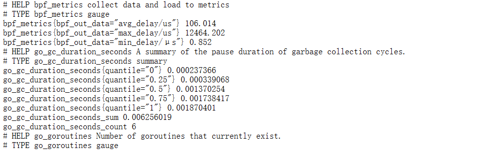
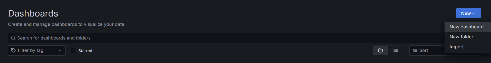
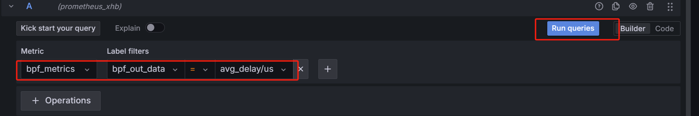
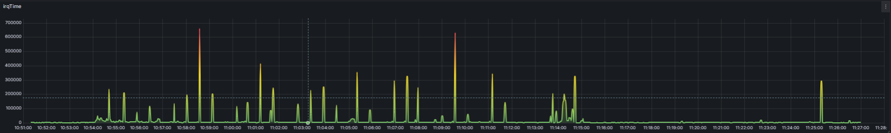
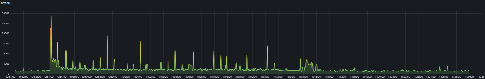
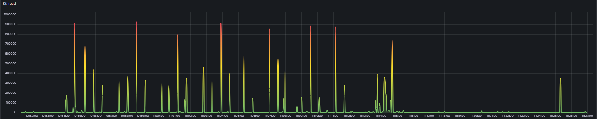
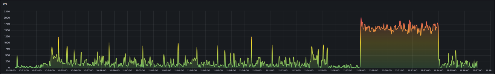
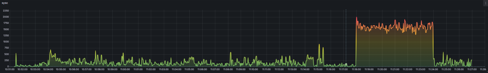
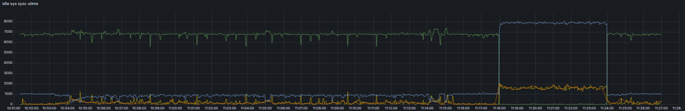
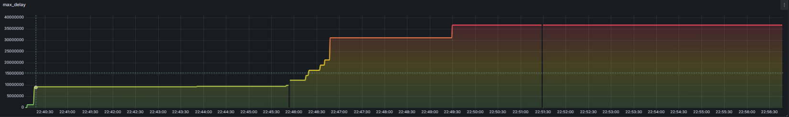

# cpu_wacther的可视化

## 1.配置环境

在使用cpu_watcher可视化之前，请先配置docker、go的环境,具体配置方法可参考：

### 1.1 docker

先参考该链接进行docker-desktop的安装：

* [在 Ubuntu 上安装 Docker Desktop |Docker 文档](https://docs.docker.com/desktop/install/ubuntu/#install-docker-desktop)

在准备启动docker-desktop时，可能遇到打不开docker-desktop的情况，如下所示：


这是因为虚拟机暂时不支持虚拟化，可以先关闭虚拟机，重新编辑虚拟机设置，开启虚拟化引擎的两个选项，再开机配置kvm；

* [在 Linux 上安装 Docker Desktop |Docker 文档](https://docs.docker.com/desktop/install/linux-install/)


### 1.2 go环境：

本可视化功能对go的版本有要求，请安装go1.19+版本，具体安装流程可参考如下链接：

* [go：快速升级Go版本，我几分钟就解决了_go 升级版本-CSDN博客](https://blog.csdn.net/m0_37482190/article/details/128673828)

## 2.使用cpuwatcher 可视化

* 首先先进入lmp目录下的lmp/eBPF_Supermarket/CPU_Subsystem/cpu_watcher文件夹

	```BASH
	cd lmp/eBPF_Supermarket/CPU_Subsystem/cpu_watcher
	```

	在该目录下 进行make编译

	```bash
	make -j 20	
	```

* 在lmp目录下的eBPF_Visualization/eBPF_prometheus文件夹下

* 执行`make`指令，编译可视化的go语言工具

	在执行make指令时，如果出现如下报错，是因为go包管理代理网址无法访问`proxy.golang.org`

	```bash
	go: golang.org/x/exp@v0.0.0-20190731235908-ec7cb31e5a56: Get "https://proxy.golang.org/golang.org/x/exp/@v/v0.0.0-20190731235908-ec7cb31e5a56.mod": dial tcp 172.217.160.113:443: i/o timeout
	```

	只需要换一个国内能访问的2代理地址即可

	```bash
	go env -w GOPROXY=https://goproxy.cn
	```

* 执行`make start_service`指令，配置下载docker镜像并启动grafana和prometheus服务

* 执行如下指令开始采集数据以及相关处理：

	```bash
	./data-visual collect /home/zhang/lmp/eBPF_Supermarket/CPU_Subsystem/cpu_watcher/cpu_watcher -s
	```

* 在网页打开网址：http://192.168.159.128:8090/metrics 此处为`localhost:8090/metrics`,便可以看到暴露在http网页中的数据；

	

* 在网页打开网址：http://192.168.159.128:3000/ 即可进入grafana服务，使用初始密码登录（user:admin pswd: admin）进入管理界面：

	- 点击【Home-Connection-Add new connection】，选择Prometheus，建立与Prometheus服务器的连接：

		

		这个172.17.0.1表示docker0网桥的 IPv4 地址。在 Docker 中，通常会将docker0的第一个 IP 地址分配给Docker主机自身。因此，172.17.0.1是 Docker主机上Docker守护进程的 IP 地址，所以在Grafana数据源这块设置成[http://172.17.0.1:9090](http://172.17.0.1:9090/) ，然后点击下面的【Save & test】按钮

- 进入可视化配置界面：

	
	

- 在下方处进行如图所示的配置，点击Run queries即可以可视化的方式监控avg_delay字段的数据：

	

## 3.cpu_watcher各子工具可视化输出

本次可视化输出样例，是在对比系统正常运行和高负载运行时本工具的使用情况，使用stress加压工具对cpu进行持续5min的加压

```bash
stress --cpu 8 --timeout 300s
```

### 3.1 cpu_watcher -s

**【irq Time】可视化输出结果**



**【softirq Time】可视化输出结果**


**【cswch】可视化输出结果**


**【proc】可视化输出结果**


**【Kthread】可视化输出结果**



**【idle】可视化输出结果**


**【sys】可视化输出结果**



**【sysc】可视化输出结果**



**【utime】可视化输出结果**


**【cpu处于不同状态对比图】可视化输出结果**



### 3.2 cpu_watcher -c

**【cs_delay】可视化输出结果**


### 3.3 cpu_watcher -d

**【schedule_delay】可视化输出结果**

【max_delay】



【avg_delay】


【min_delay】


### 3.4 cpu_watcher -p

**【preempt】可视化输出结果**


## 3.5 cpu_watcher -S

**【syscall_delay】可视化输出结果**

