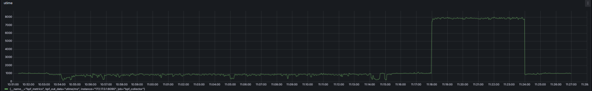

# libbpf_sar功能介绍：

libbpf_sar是cpu_watcher工具中的一个子工具，通过cpu_watcher -s使用；

## 1.应用场景及意义

libbpf_sar是一个基于eBPF的按照指定时间间隔（默认为1s）来统计特定事件发生次数和特定事件占用CPU时间的工具。使用它可以帮助您查看事件发生速率和CPU资源利用率，并提供CPU负载画像以剖析负载的来源及其占用比例。

与传统工具相比，libbpf_sar可提供更为细致的指标，如：

* 1.可把内核态时间剖析为内核线程执行时间sar和进程系统调用时间

* 2.部分linux发行版可能由于内核编译选项确实而不能记录irq时间，本工具可以弥补这一缺陷，并且不需要对内核做出任何更改，可动态检测

3.可附加到指定进程上，对该进程占用的CPU资源进行实时监测

## 2.性能参数及观测意义

在 Linux 中，与 CPU 相关的状态可以分为很多类，如用户态、系统调用、硬中断以及软中断等，同时还有一些内核线程执行的状态，如 kthread，idle 进程。 

同时，也有一些对 CPU 相当重要的事件，如新进程创建，进程切换计数，运行队 列长度等，对这些细分事件进行准确的监测，有利于我们剖析出 CPU 负载根源， 并定位出性能瓶颈。 

libbpf_sar主要是对 CPU 上的关键事件提供的具体信息参数与含义如表3-6所示：

libbpf_sar 实例采集信息及含义

| **性能指标** | **含义**                         |
| ------------ | -------------------------------- |
| Proc         | 新创建的进程数                   |
| Cswch        | 进程切换计数                     |
| runqlen      | 运行队列长度                     |
| irqTime      | 硬中断时间                       |
| Softirq      | 软中断时间                       |
| Idle         | Idle 进程运行时间                |
| Sysc         | 加上内核线程运行时间的系统态时间 |
| Utime        | 用户态执行时间                   |
| sys          | 系统调用执行时间                 |

本实例采集到的信息将系统的 CPU 进行了精准分类，并且也统计了关键事件的触发频率，对于系统的性能分析有重要的意义

## 3.输出格式：

```bash
  time    proc/s  cswch/s  irqTime/us  softirq/us  idle/ms  kthread/us  sysc/ms  utime/ms  sys/ms
15:55:43       48     1389     1646       8866      6811      3243       688      717      691
15:55:44       31     1089     1587       7375      6759      1868       659      707      660
15:55:45       47     1613     1685       8885      6792      3268       796      828      799
15:55:46        0     2133     5938       7797      7643      8106         8       20       17
15:55:47        1     3182     5128      14279      6644      4883       314      363      319
15:55:48        0     1815     1773      11329      6753      4286       282      313      287
15:55:49       31     1249     1605       9859      6752      4442       545      585      549
15:55:50       47     1601     1712      11348      6765      6249       210      242      216
15:55:51        0     1238    10591      12709      6802     13896       238      262      252
15:55:52        0     1145     1658      10000      6863      4593       308      333      313
15:55:53        0     1317     1587       9090      6798      4699       383      414      387
15:55:54       31     1254     1531       9570      6755      4252       381      414      385
15:55:55       47     1547     1624      10985      6769      6516       344      373      350
15:55:56        0     1064     2187       9892      6851      4585       189      212      194
```

* proc/s 列的数据表示 CPU 每秒新创建的进程数；
* cswch/s 列的数据表示 CPU 每秒进程切换的数量；
* runqlen 列的数据表示 CPU 运行队列的长度；
* irqTime/us 列的数据表示 CPU 处理硬中断的时间，以 us 计时；
* softirq/s 列的数据表示 CPU 每秒处理软中断的时间，以 us 计时；
* idle/ms 列的数据表示 系统处于空闲态的时间；
* kthread/us 列的数据表示系统中内核线程执行的时间； 

* sysc/ms 表示系统中内核线程外加系统调用处理的总时间；
* utime/ms 表示进程在用户态执行的总时间；
* sys/ms 表示系统调用执行的总时间。 

事件的统计方式是对每个CPU分开统计然后求和，因此有的项的占用时间可能超过1s。所有事件占用时间的和应当为1s * 总CPU核数。由于技术问题，输出的第一项可能偏差较大，可以不予理会。按Ctrl+C本程序将停止统计，并输出在程序运行的时间段内各表项的平均值按照2s的采样频率显示各事件的CPU占用率。数据是带颜色的，蓝色表示CPU占比小于30%，绿色表示占比大于30%小于60%，红色表示占比大于60%。


## 4.数据可视化


