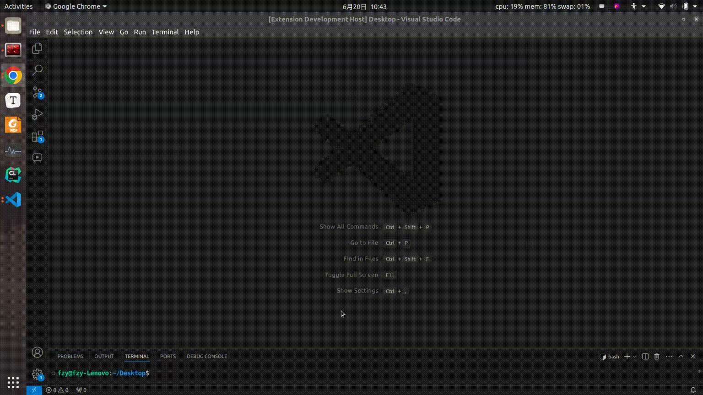
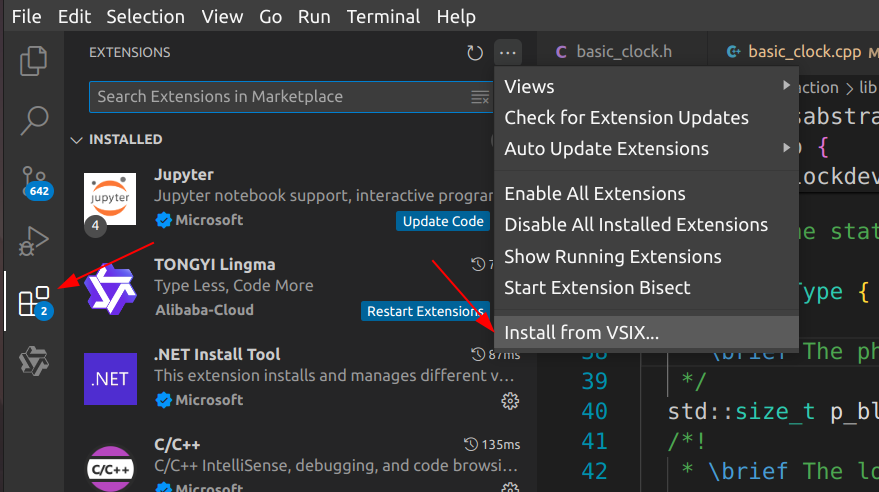
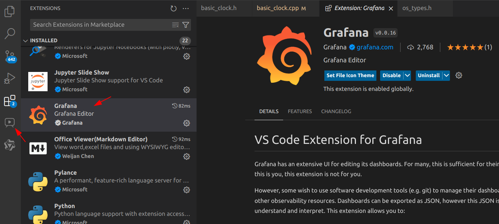
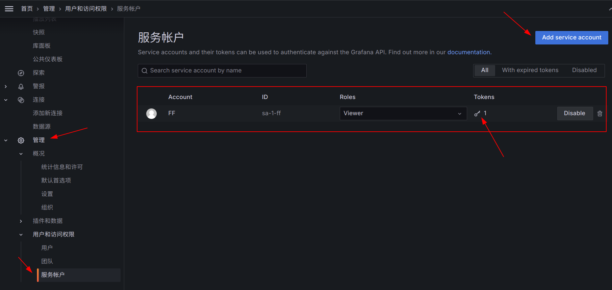
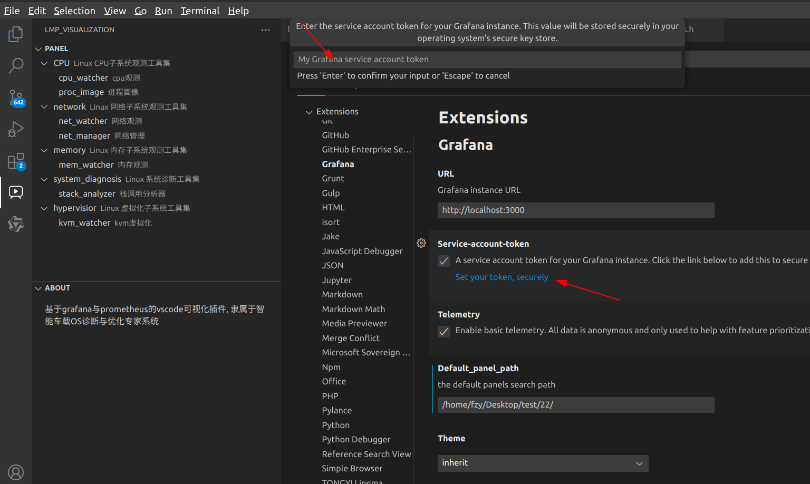
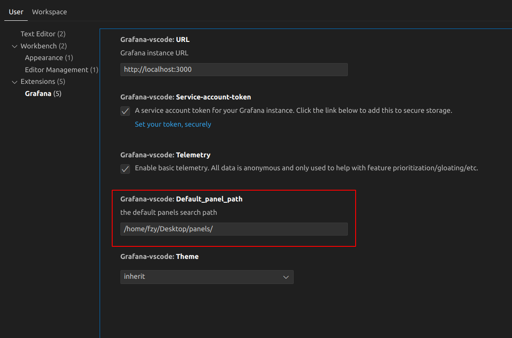
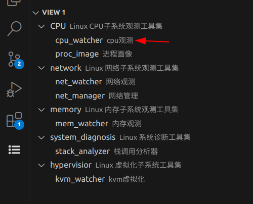
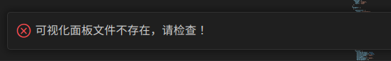

#  lmp vscode 插件使用指南

### 1. 运行效果



### 2. 安装与使用

#### 2.1 导入插件



安装成功如下：



#### 2.2 设置

- 启动grafana（可以在docker中启动），启动prometheus与BPF后端采集程序可以看到数据呈现
- 设置IP地址与端口，默认端口是`localhost:3000`
- 设置token



> [grafana官方_创建token](https://grafana.com/docs/grafana/latest/administration/service-accounts/#create-a-service-account-in-grafana)



- 设置可视化面板存放路径

> 注意：别忘记面板路径后面加 "/"



面板命名必须遵循如下规则:



若面板不存在，或路径，或名称不对，将出现如下错误提示：



- 设置工具配置文件

请将配置文件路径输入在设置中，如`/home/fzy/lmp_tool_ext_config.json`，输入完成后，敲击enter键，程序将根据配置文件中的子系统与工具，生成左侧侧边栏的按钮。

配置文件写法参照 `.../MagicEyes/src/visualization/vscode_ext/tool_config_sample/lmp_tool_ext_config.json`

#### 2.3 如何增加工具

配置文件如下。假如有一个工具，名为 mem_checker，输入 memory子系统，则 subsystem_list 不用修改，只需要在内存子系统处增加即可。如果有一个工具，名为 V4L2_tracer，属于 media子系统，则需要在subsystem_list中增加 media 子系统，并在 subsystem 下相应增加，不再赘述。

```json
{
    "name" : "lmp_tool_vscode_extension_config",
    "version" : "0.0.1",
    "subsystem_list" : [
        "CPU",      
        "memory",
        "fs",
        "network",
        "system_diagnosis",
        "hypervisor"
    ],
    "subsystem" : [
        {
            "description" : "Linux CPU子系统观测工具集",
            "tools" : [......]
        },
        {
            "description" : "Linux 内存子系统观测工具集",
            "tools" : [
                {
                    "name": "mem_watcher",
                    "description" : "内存观测"
                },
        		{
                    "name": "mem_checker",
                    "description" : "内存检查"
                }
            ]
        }
} 
```


### 3. 插件开发

#### 3.1 开发

安装yarn并且通过`yarn install`安装所需依赖

>  tips: 按 F5 开启调试

#### 3.2 开发注意事项

1. yo code生成的框架，vscode最小版本是1.90，需要修改为1.74，不然我当前的版本。1.89无法运行插件
2. tsconfig

```json
{
  "compilerOptions": {
    "module": "commonjs",   // 不要用Node16，不然命令会触发失败
    "target": "ES2021",
    "lib": ["ES2021"],
    "sourceMap": true,
    "rootDir": "src",
    "strict": true /* enable all strict type-checking options */
    /* Additional Checks */
    // "noImplicitReturns": true, /* Report error when not all code paths in function return a value. */
    // "noFallthroughCasesInSwitch": true, /* Report errors for fallthrough cases in switch statement. */
    // "noUnusedParameters": true,  /* Report errors on unused parameters. */
  }
}
```

3.  打包vsix

```bash
# 进入插件开发文件夹
vsce package
```


