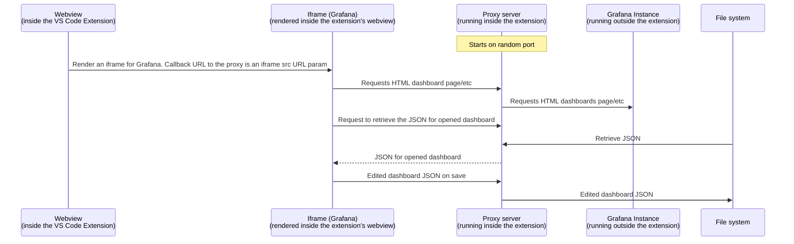

# Extension communication with Grafana

The below diagram explains how this extension communicates with Grafana.

For best viewing, view this page on GitHub.

```mermaid
sequenceDiagram
    participant Webview as Webview <br> (inside the VS Code Extension)
    participant Iframe as Iframe (Grafana) <br> (rendered inside the extension's webview)
    participant ProxyServer as Proxy server <br> (running inside the extension)
    participant Grafana as Grafana Instance <br> (running outside the extension)
    participant FileSystem as File system

    Note over ProxyServer: Starts on random port
    Webview->>Iframe: Render an iframe for Grafana. Callback URL to the proxy is an iframe src URL param 
    Iframe->>ProxyServer: Requests HTML dashboard page/etc
    ProxyServer->>Grafana: Requests HTML dashboards page/etc
    Iframe->>ProxyServer: Request to retrieve the JSON for opened dashboard
    FileSystem->>ProxyServer: Retrieve JSON
    ProxyServer-->>Iframe: JSON for opened dashboard
    Iframe->>ProxyServer: Edited dashboard JSON on save
    ProxyServer->>FileSystem: Edited dashboard JSON
```
