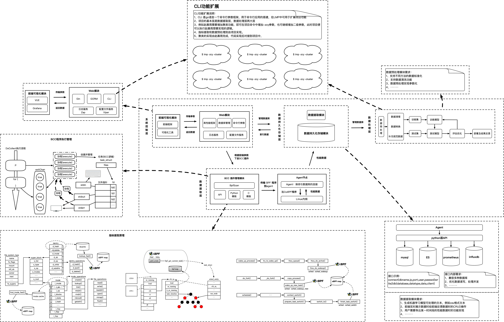
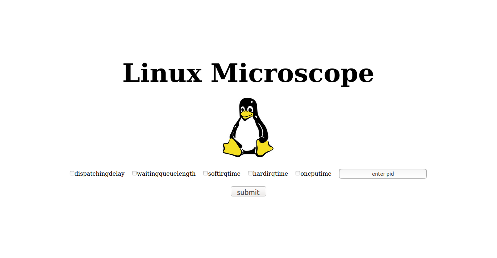
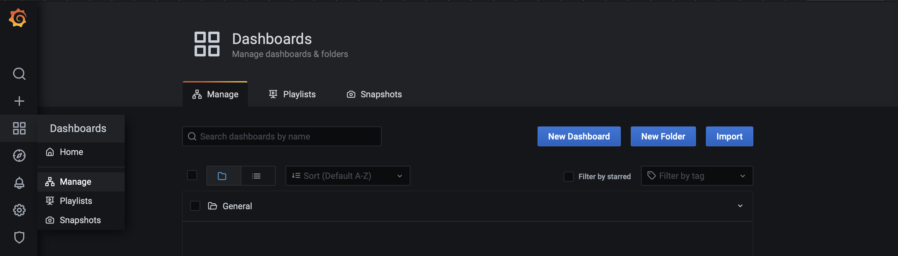
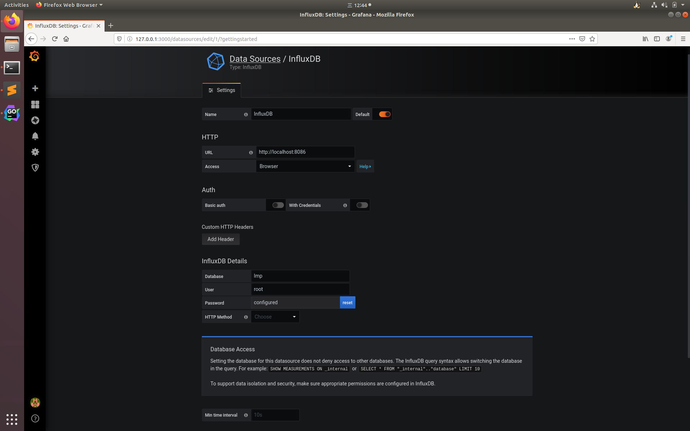

# ZH


# Linux microscope

LMP是一个基于BCC(BPF Compiler Collection)的Linux系统性能数据实时展示的web工具，它使用BPF(Berkeley Packet Filters)，也叫eBPF，目前LMP在ubuntu18.04上测试通过，内核版本4.15.0。

## 项目架构




## 界面截图




##  运行lmp

###  Ubuntu-source

#### 从源码构建lmp，需要的基本环境：

- golang：go1.12及以上；
- docker：influxdb、grafana；
- bcc环境
- mysql：5.7.29测试通过

###  安装依赖docker镜像

```
# For grafana
sudo docker pull grafana/grafana
# For Influxdb
sudo docker pull influxdb
```


### 编译并安装

```
 git clone https://github.com/linuxkerneltravel/lmp
 cd lmp
 sudo make db
 > 输入您的 mysql root用户密码
 make
```

## 单机节点，本地运行

```
# 项目的所有配置均位于config.yaml中，grafana的默认端口为3000端口，influxdb的默认端口为8086，修改配置信息的方式如下：
 vim lmp/config.yaml

#run grafana
 sudo docker run -d \
   -p 3000:3000 \
   --name=grafana \
   grafana/grafana

#run influxdb，按照如下命令启动influxdb之后，会自动带有database lmp，influxdb的用户名和密码位于config.yaml中
 sudo docker run -d \
    -p 8083:8083 \
    -p 8086:8086 \
    --name influxdb \
    -v ${YOUR_PROJECT_PATH}/lmp/test/influxdb_config/default.conf:/etc/influxdb/influxdb.conf \
    -v ${YOUR_PROJECT_PATH}/lmp/test/influxdb_config/data:/var/lib/influxdb/data \
    -v ${YOUR_PROJECT_PATH}/lmp/test/influxdb_config/meta:/var/lib/influxdb/meta \
    -v ${YOUR_PROJECT_PATH}/lmp/test/influxdb_config/wal:/var/lib/influxdb/wal influxdb

#run lmp
 cd lmp/
 make
 sudo ./lmp -h
```

### 观测-步骤

在shell执行`sudo ./lmp`，即启动观测功能

在单机节点上部署完成lmp并启动之后，通过浏览器访问8080端口即可。如果是本地查看，则访问localhost:8080，如果远程访问，则访问remoteip:8080即可。

8080端口返回页面如下，该页面仅用于观测指标下发，输入栏输入的是观测时间，单位是分钟。可一次下发多个指标，但是注意实际环境使用bcc的开销问题，建议单个指标下发对比开销之后，再组合多个指标观测。


另外开启grafana页面，通过浏览器访问3000端口即可。如果是本地查看，则访问localhost:3000，如果远程访问，则访问remoteip:3000即可。

grafana用于指标数据观测，进入grafana之后，首先需要登录进入grafana，初始用户名和密码均为admin，之后需要配置grafana连接influxdb：


按照自己的ip地址配置完成以后，点击save&test按钮，测试influxdb是否连接成功，出现如下提示说明连接成功：


接下来导入/lmp/test/grafana-JSON下的lmp.json文件，即可自动创建grafana的dashboard：



在Dashboards中Manage中，点击Import，上传lmp.json文件即可观测：


统计时间到时后，lmp会自动关闭后台bcc插件，之后继续在8080端口页面下发指标即可。

### 扩展功能：例如机器学习
LMP通过命令行参数引入机器学习模型，你可以自己实现模型后对接到项目中，我们的想法是利用观测功能提取到数据后，利用这些数据来训练模型，目前仅可引入机器学习模型，使用示例如下：
```shell
⇒  ./lmp -h 
NAME:
   LMP - LMP is a web tool for real-time display of Linux system performance data based on BCC (BPF Compiler Collection). 
To get more info of how to use lmp:
  # lmp help


USAGE:
   lmp [global options] command [command options] [arguments...]

VERSION:
   v0.0.1

COMMANDS:
   cluster  Density peak clustering
   help, h  Shows a list of commands or help for one command

GLOBAL OPTIONS:
   --help, -h     show help (default: false)
   --version, -v  print the version (default: false)
```
命令介绍中介绍了cluster命令，在命令行执行：
```shell
⇒  ./lmp cluster -h
NAME:
   lmp cluster - Density peak clustering

USAGE:
   lmp cluster [command options] [APP_NAME]

DESCRIPTION:
   Density peak clustering, Can be used for anomaly detection.
       example: ./lmp cluster --data /YOUR_PATH
       example: ./lmp cluster -d /YOUR_PATH

OPTIONS:
   --data value, -d value  specified the the dataset to run
   --help, -h              show help (default: false)

```
即可看到使用方法，关于如何增加一个模型见→[增加一个模型](docs/增加一个模型.md)

### 如何增加插件
LMP目前支持BCC类型的插件程序，增加的方法见→[增加一个插件](docs/增加一个插件.md)

### 如何调试项目
推荐使用 `postman` 下发web请求，具体调试方法见→[调试项目](docs/调试项目.md)

### 总结出的监控方案
[基于 eBPF 的 prometheus 监控方案](docs/基于eBPF的prometheus监控方案/基于eBPF的prometheus监控方案.md)

[快速实现Linux系统性能数据提取、存储和可视化展示](docs/快速实现Linux系统性能数据提取、存储和可视化展示/快速实现Linux系统性能数据提取、存储和可视化展示.md)

#


# Linux microscope

LMP is a web tool for real-time display of Linux system performance data based on BCC (BPF Compiler Collection), which uses BPF (Berkeley Packet Filter), also known as eBPF. Currently, LMP is tested on ubuntu18.04 and the kernel version is 4.15.0.

## Project architecture


## Interface screenshot





## Project structure overview  

<details>
<summary>Expand to view</summary>
<pre><code>.
.
├── LICENSE
├── README.md
├── bcctest            Hold all test codes, including bcc、influxdb, etc
├── cmd                Store LMP pid number after startup
├── config.yaml        Project profile
├── controllers        Controller layer code stored in CLD layers
├── dao                Dao layer code stored in CLD layers
├── logger             Zap Log Library Initialization Related Code
├── logic              Logic layer code stored in CLD layers
├── main.go
├── makefile
├── middlewares        Holds middleware, such as JWT, used in the project
├── models             Data structure, such as a user、BpfScan, used in a storage project
├── pkg                A third-party library, such as JWT、snowflake, used in a project
├── plugins            Storage bcc plugins
├── routes             Store initialization routing code
├── settings           Hold viper Initialize related code
├── static             Hold static HTML files, pictures, etc
├── test               Store influxdb initial configuration, files, etc
└── vendor             Storage of project dependencies
</code></pre>
</details>


##  install lmp

###  Ubuntu-source

#### Build lmp from source，The basic environment required is as follows：

- golang
- docker
- bcc

###  Install dependent docker image

```
# For prometheus 
sudo docker pull prom/prometheus
# For grafana
sudo docker pull grafana/grafana
# For Influxdb
sudo docker pull influxdb
```

### Compile and install

```
 git clone https://github.com/linuxkerneltravel/lmp
 cd lmp
 make
 sudo make install
```

##  Single machine node, Run locally

```
# Modify configuration file
 vim lmp/config.yaml

#run grafana
 sudo docker run -d \
   -p 3000:3000 \
   --name=grafana \
   -v /opt/grafana-storage:/var/lib/grafana \
   grafana/grafana
   
#run influxdb
 sudo docker run -d \
    -p 8083:8083 \
    -p 8086:8086 \
    --name influxdb \
    -v ${YOUR_PROJECT_PATH}/lmp/test/influxdb_config/default.conf:/etc/influxdb/influxdb.conf \
    -v ${YOUR_PROJECT_PATH}/lmp/test/influxdb_config/data:/var/lib/influxdb/data \
    -v ${YOUR_PROJECT_PATH}/lmp/test/influxdb_config/meta:/var/lib/influxdb/meta \
    -v ${YOUR_PROJECT_PATH}/lmp/test/influxdb_config/wal:/var/lib/influxdb/wal influxdb
    
#run lmp
 cd lmp/
 make
 sudo ./lmp
```

### observation

http://localhost:8080/  After logging in to grafana, view it.

### Uninstall

```
make clean
```

## Thanks for the support of the following open source projects

- [Gin] - [https://gin-gonic.com/](https://gin-gonic.com/)
- [bcc] - [https://github.com/iovisor/bcc](https://github.com/iovisor/bcc)

# 