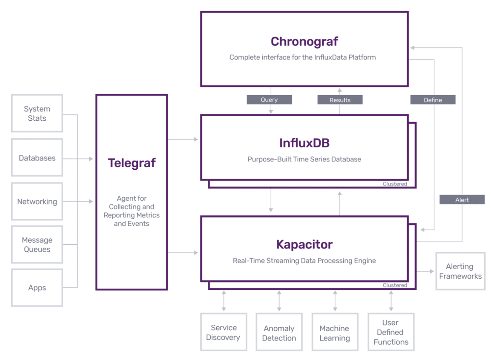

# LMP-Influxdb文档

## 文档说明

该文档对LMP项目中用到的Influxdb部分进行说明，并会整理Influxdb官方文档中LMP用到的部分，该部分内容在网络上有更多的资料，如果需要深入了解，请移步google，文档中会有相关详细文档的链接，该文档目的是降低项目入门门槛，方便大家学习，欢迎大家继续补充。

注意：LMP使用Influxdb的1.x开源版本，InfluxDB的开源版本在单个节点上运行。如果需要高可用性来消除单点故障，请考虑使用[InfluxDB企业版](https://docs.influxdata.com/influxdb/latest/high_availability/)。

[TOC]


## Influxdb 简介

InfluxDB是一个时间序列数据库，为了处理较高的写入和查询负载。是由The TICK Stack组成的 。InfluxDB旨在用作涉及大量时间戳数据的任何用例的后备存储，包括DevOps监控，应用程序指标，IoT传感器数据和实时分析。

什么是[The TICK Stack](https://www.influxdata.com/time-series-platform/)？

The TICK Stack是一组松散耦合但紧密集成的开源项目，旨在处理大量带有时间戳的信息，以支持指标分析需求。是一种解决方案。后期的LMP报警功能可直接考虑采用Kapacitor，即TICK的T。



- Telegraf是一个插件驱动的服务器代理，用于收集和报告指标。Telegraf插件直接从其运行的系统中获取各种指标，从第三方API中提取指标，甚至通过StatsD和Kafka消费者服务来监听指标。它还具有输出插件，可将指标发送到各种其他数据存储，服务和消息队列，包括InfluxDB，Graphite，OpenTSDB，Datadog，Librato，Kafka，MQTT，NSQ等。
- Influxdb
- Chronograf是堆栈的管理用户界面和可视化引擎。它使您可以轻松设置和维护基础架构的监视和警报。它使用简单，并包含模板和库，可让您通过数据的实时可视化快速构建仪表板，并轻松创建警报和自动化规则。
- Kapacitor是本机数据处理引擎。它可以处理来自InfluxDB的流数据和批处理数据。Kapacitor使您可以插入自己的自定义逻辑或用户定义的功能，以处理具有动态阈值的警报，匹配模式的指标，计算统计异常并根据这些警报执行特定操作，例如动态负载平衡。 [Kapacitor](https://www.influxdata.com/products/integrations/) 与HipChat，OpsGenie，Alerta，Sensu，PagerDuty，Slack等[集成](https://www.influxdata.com/products/integrations/)。


## Influxdb关键概念

[官方文档](https://docs.influxdata.com/influxdb/v1.8/concepts/key_concepts/)非常详细，这里直接给出关键概念，黑色加粗字体即Influxdb的关键概念。

下面这张示例表存储了从2015年8月18日午夜到2015年8月18日上午6:12 在两个位置（位置1和位置2）的两位科学家（`langstroth`和`perpetua`）计数的蝴蝶和蜜蜂的数量。

name：census

| 时间                       | **蝴蝶** | **蜜蜂** | **位置** | **科学家**   |
| -------------------------- | -------- | -------- | -------- | ------------ |
| 2015-08-18T00：00：00Z     | 12       | 23       | 1        | Langstroth   |
| 2015-08-18T00：00：00Z     | 1个      | 30       | 1        | perpetua     |
| 2015-08-18T00：06：00Z     | 11       | 28       | 1        | Langstroth   |
| **2015-08-18T00：06：00Z** | **3**    | **28**   | **1**    | **perpetua** |
| 2015-08-18T05：54：00Z     | 2        | 11       | 2        | Langstroth   |
| 2015-08-18T06：00：00Z     | 1个      | 10       | 2        | Langstroth   |
| 2015-08-18T06：06：00Z     | 8        | 23       | 2        | perpetua     |
| 2015-08-18T06：12：00Z     | 7        | 22       | 2        | perpetua     |

- **Measurement**：即 Influxdb 中的数据表的表名，这里是census
- **field key**：表格第一行中的蝴蝶和蜜蜂两列就是field key
- **field value**：即field key列中具体的数值，就是表格中加粗一行的 3 和 28 分别是蝴蝶field key的field value、蜜蜂field key的field value
- **tag key**：表格第一行中的位置和科学家两列就是tag key
- **tag value**：即tag key列中具体的数值，就是就是表格中加粗一行的 1 和 perpetua 分别是位置tag key的tag value、科学家tag key的tag value
- **timestamp**：即时间列

补充：

- timestamp 是以 [RFC3339 UTC](https://www.ietf.org/rfc/rfc3339.txt) 格式存储的
- `field key`和`field value`统称为**field**，上面表格中 `field key` 是字符串；`field value`可以是字符串、浮点数、整数、布尔值等。
- Influxdb是时序数据库，所有的字段值始终和时间戳强相关。
- 上面表格中的数据，`field key`和`field value`的集合构成了一个**field set**，所以上面表格中一共有8个`field sets`。
  - `butterflies = 12 honeybees = 23`
  - `butterflies = 1 honeybees = 30`
  - `butterflies = 11 honeybees = 28`
  - `butterflies = 3 honeybees = 28`
  - `butterflies = 2 honeybees = 11`
  - `butterflies = 1 honeybees = 10`
  - `butterflies = 8 honeybees = 23`
  - `butterflies = 7 honeybees = 22`
- 关于`field`和`field set`，`field`是概念上来说，包括`key`和`value`；而`field set`则是实际的`key-value`的值的组合
- `fields`是Influxdb数据结构必有字段，如果没有`fields`，那么就没有办法在Influxdb中存储数据；另外`fields`是没有被索引的，使用`field value`作为过滤条件的查询必须扫描与查询中其他条件匹配的所有值，所以查询的性能不如tag（后面介绍），所以`fields`中不应该包含通常要查询的数据。

- `tags`同样是`tag key`和`tag value`的统称，`tags`也是字符串。同样的，tag set是所有key-value对的不同组合。上面的表中只有四种`tag sets`。
  - `location = 1`, `scientist = langstroth`
  - `location = 2`, `scientist = langstroth`
  - `location = 1`, `scientist = perpetua`
  - `location = 2`, `scientist = perpetua`

- `tags`是可选的，不是Influxdb必须有的字段，但是使用`tags`通常是一个好办法，因为与`fields`不同，`tags`是索引的。这意味着对`tags`的查询速度更快，并且`tags`是存储常见查询元数据的理想选择。

- 所以`tags`和`fields`的选取要和应用场景匹配，否则查询效率会很低。
- **Measurement**是tags、fields、time列的总和，`measurement`名称就是存储在关联字段中的数据的描述。`measurement`名称是字符串，对于任何SQL用户来说，`measurement`在概念上类似于表。 
- **retention policy** ：单个`measurement`可以属于不同的保留策略，保留策略描述了Influxdb保存数据(DURATION)的时间，以及该数据在集群(REPLICATION，复制因子，不适用于单节点)中存储了多少副本。这方面详细的信息在 [Database Management](https://docs.influxdata.com/influxdb/v1.8/query_language/database_management/#retention-policy-management)。

- `census measurement`中的所有的内容都属于`autogen`保留策略，是Influxdb自动生成的一种保留策略，所有的数据具有无限的持续时间，并且复制因子设置为1。
- **series**：`series`是一个集合，包括`measurement`、`tag sets`、`field key`。上面的`census measurement`有8个`series`：

| Series number | Measurement | Tag set                                 | Field key     |
| ------------- | ----------- | --------------------------------------- | ------------- |
| series 1      | `census`    | `location = 1`,`scientist = langstroth` | `butterflies` |
| series 2      | `census`    | `location = 2`,`scientist = langstroth` | `butterflies` |
| series 3      | `census`    | `location = 1`,`scientist = perpetua`   | `butterflies` |
| series 4      | `census`    | `location = 2`,`scientist = perpetua`   | `butterflies` |
| series 5      | `census`    | `location = 1`,`scientist = langstroth` | `honeybees`   |
| series 6      | `census`    | `location = 2`,`scientist = langstroth` | `honeybees`   |
| series 7      | `census`    | `location = 1`,`scientist = perpetua`   | `honeybees`   |
| series 8      | `census`    | `location = 2`,`scientist = perpetua`   | `honeybees`   |

- **point**：一个`point`代表一个数据记录record，包含四个部分：`measurement`、`tag set`、`field set`、`timestamp`，一个point由它的`series`和`timestamp`唯一标记，一个例子：

  ```sql
  name: census
  -----------------
  time                    butterflies honeybees   location    scientist
  2015-08-18T00:00:00Z    1           30          1           perpetua
  ```

  这就是一个单个`point`，它的`series`是`series 3`，它的tag set是 (`location = 1`, `scientist = perpetua`)，field set 是(`butterflies = 1`, `honeybees = 30`)， timestamp是 `2015-08-18T00:00:00Z`.

- **database**：虽然这个概念在最后，但是在Influxdb中却在最上层的位置。


