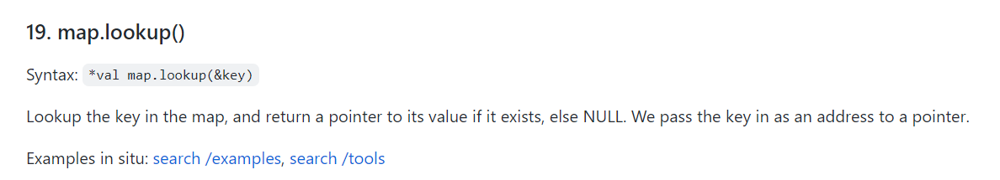

+++
title = "插件：cpu/irqs.py"
description = "针对插件：plugins/cpu/irqs.py 的分析"
weight = 10
+++

## 插件说明

插件地址： plugins/cpu/irq.py

## 插件功能说明

计算进程中断时间，并将结果写入数据库。

## 插件代码解读

py程序组成部分：

```
int handler_start(struct pt_regs *ctx)
{ 
    u64 ts = bpf_ktime_get_ns();    //	第一次获取时间
    u64 pid_tgid = bpf_get_current_pid_tgid();
    struct key_t key;
    
    key.pid = pid_tgid;
    key.tgid = pid_tgid >> 32;
    key.cpu = bpf_get_smp_processor_id();

    enter.update(&key, &ts);  		//把现在这个时间和key绑定，更新到map
    return 0;
}

int handler_end(struct pt_regs *ctx)
{
    u64 ts = bpf_ktime_get_ns();			//	第二次获取时间
    u64 pid_tgid = bpf_get_current_pid_tgid();
    u64 *value;
    u64 delta;
    struct key_t key;

    key.pid = pid_tgid;
    key.tgid = pid_tgid >> 32;
    key.cpu = bpf_get_smp_processor_id();
  
    value = enter.lookup(&key);    //？- 获取之前记录的时间

    if (value == 0) {
        return 0;
    }

    delta = ts - *value;   	// 计算间隔所用的时间
    enter. delete(&key);
    exitt.increment(key, delta);
    return 0;
}


```

在handler_start开始时，通过bpf_ktime_get_ns函数记录当前的时间（纳秒），并把这个时间和key绑定，在 handler_end函数开始时，再次获取当前时间，并把这一时间和上次记录下来的时间相减，就得到了handler_start和handler_end间隔的时间，也就是进程对应的中断时间。


其中，需要注意enter.lookup(&key)函数，也就是map.lookup函数，enter是前面定义的HASH的名字，通过BPF_HASH(enter, struct key_t)语句定义。



```
struct key_t {
    u32 cpu;
    u32 pid;
    u32 tgid;
};

BPF_HASH(enter, struct key_t);
BPF_HASH(exitt, struct key_t);
```

Sockhash类型，也是一个BPFmap类型，通过键的绑定，可以在运行时使用消息传递相互通信，从而获取到value值。在中断结束后，就可以计算中断所用的时间。


## 插件使用

### 后台运行方式

直接命令行运行 python 的方式来执行该 eBPF 程序。


## 插件运行版本

### 已经测试过的版本

ubuntu18 5.4.0-90-generic

## 


