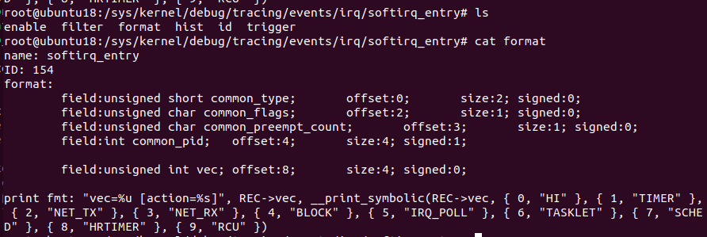

+++
title = "插件：cpu/softirqs.py"
description = "针对插件：plugins/cpu/softirqs.py 的分析"
weight = 15
+++

## 插件说明

插件地址： plugins/cpu/softirqs.py

## 插件功能说明

计算CPU中断，并将结果写入数据库。

## 插件代码解读

py程序组成部分：

```
# import     
# arguments
# define BPF program
# data structure from template
# code substitutions
# load BPF program
# output

```

bpf程序会在softirq事件发生时挂载tracepoint点，获取softirq的索引号vec，vec是程序的核心数据结构，通过vec 能够得到softirq_entry，：


softirq_entry是一个Tracing event ，有固定的格式能获取irq相关的数据：

插件中也需要按照这个格式获取相应的数据：

```
def vec_to_name(vec):
    # copied from softirq_to_name() in kernel/softirq.c
    # may need updates if new softirq handlers are added
    return ["hi", "timer", "net_tx", "net_rx", "block", "irq_poll",
            "tasklet", "sched", "hrtimer", "rcu"][vec]
```


具体的BPF程序：

```c
TRACEPOINT_PROBE(irq, softirq_entry)
{
    account_val_t val = {};
    entry_key_t key = {};

    key.pid = bpf_get_current_pid_tgid();
    key.cpu = bpf_get_smp_processor_id();
    val.ts = bpf_ktime_get_ns();
    val.vec = args->vec;  //传递vec

    start.update(&key, &val);

    return 0;
}

TRACEPOINT_PROBE(irq, softirq_exit)
{
    u64 delta;
    u32 vec;
    account_val_t *valp;
    irq_key_t key = {0};
    entry_key_t entry_key = {};

    entry_key.pid = bpf_get_current_pid_tgid();
    entry_key.cpu = bpf_get_smp_processor_id();

    // fetch timestamp and calculate delta
    valp = start.lookup(&entry_key);
    if (valp == 0) {
        return 0;   // missed start
    }
   delta = bpf_ktime_get_ns() - valp->ts;
    vec = valp->vec;

    // store as sum or histogram
    STORE

    start.delete(&entry_key);
    return 0;
}

```

其中  STORE会根据参数的不同进行对应的替换

```
# code substitutions
if args.dist:
    bpf_text = bpf_text.replace('STORE',
        'key.vec = vec; key.slot = bpf_log2l(delta / %d); ' % factor +
        'dist.increment(key);')
else:
    bpf_text = bpf_text.replace('STORE',
        'key.vec = valp->vec; ' +
        'dist.increment(key, delta);')
if debug or args.ebpf:
    print(bpf_text)
    if args.ebpf:
        exit()
```

输出部分：

```python
  for k, v in sorted(dist.items(), key=lambda dist: dist[1].value):
            #print("%-16s %11d" % (vec_to_name(k.vec), v.value / factor))

            # write to influxdb
            test_data = lmp_data(datetime.now().isoformat(),'glob',vec_to_name(k.vec), v.value / factor)
            #print(test_data)
            write2db(data_struct, test_data, influx_client, DatabaseType.INFLUXDB.value)

```

其中存储的数据结构`data_struct`为：

```python
data_struct = {"measurement":'softirqs',
               "time":[],
               "tags":['glob',],
               "fields":['time','function_name','delta']}
```

内核相关源码：

重要数据结构：

```
/*softirq_vec 中断向量表*/
static struct softirq_action softirq_vec[NR_SOFTIRQS] __cacheline_aligned_in_smp;
```

__do_softirq函数相关代码：

```
restart:
	/* Reset the pending bitmask before enabling irqs */
	set_softirq_pending(0); // pending清0

	local_irq_enable(); // 开中断，softirq handler是开中断执行

	h = softirq_vec; // 软中断描述符

	while ((softirq_bit = ffs(pending))) {
		unsigned int vec_nr;
		int prev_count;

		h += softirq_bit - 1; // 指向pending的软中断描述符

		vec_nr = h - softirq_vec; // 获取softirq number
		prev_count = preempt_count();

		kstat_incr_softirqs_this_cpu(vec_nr);

		trace_softirq_entry(vec_nr); // tracepoint点
		h->action(h); // handler
		trace_softirq_exit(vec_nr); // tracepoint点
		if (unlikely(prev_count != preempt_count())) {
			pr_err("huh, entered softirq %u %s %p with preempt_count %08x, exited with %08x?\n",
			       vec_nr, softirq_to_name[vec_nr], h->action,
			       prev_count, preempt_count());
			preempt_count_set(prev_count);
		}
		h++;
		pending >>= softirq_bit;
	}
```

## 插件使用

### 后台运行方式

直接命令行运行 python 的方式来执行该 eBPF 程序。


## 插件运行版本

### 已经测试过的版本

ubuntu18 5.4.0-90-generic

## 
