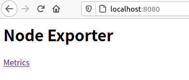
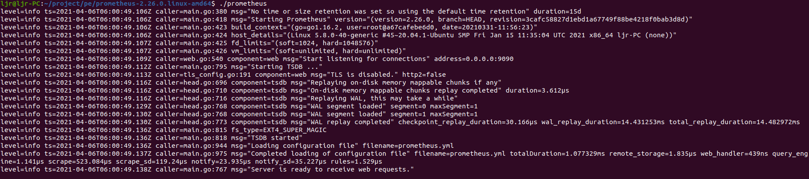
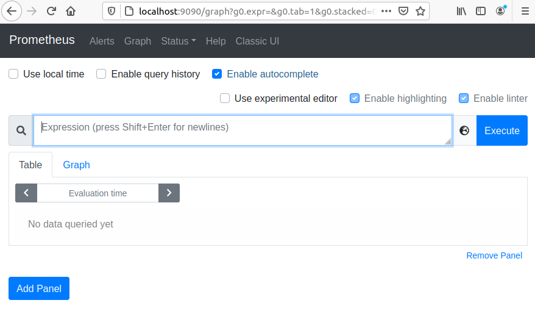
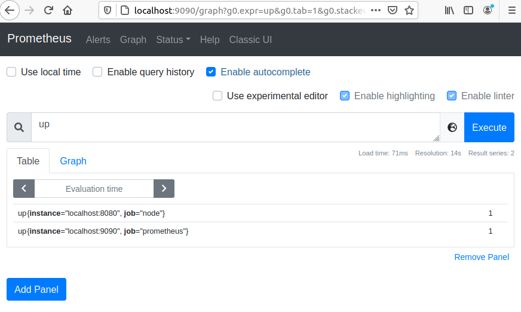
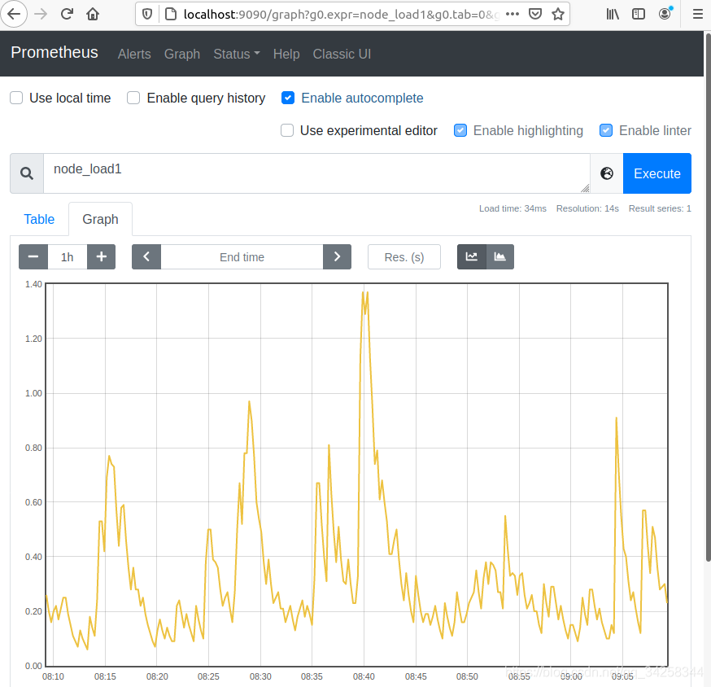
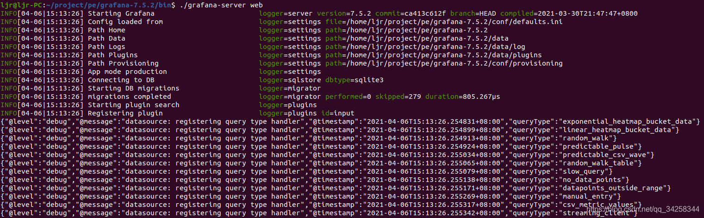
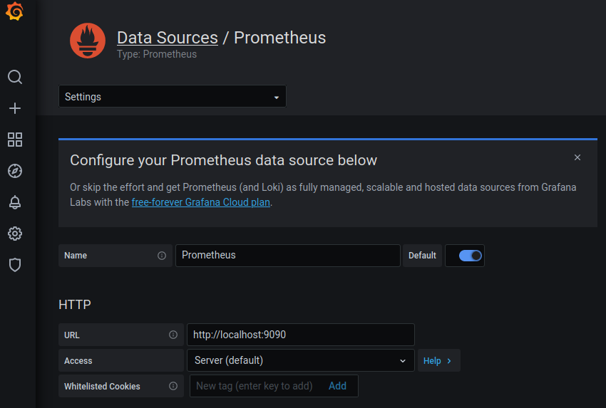
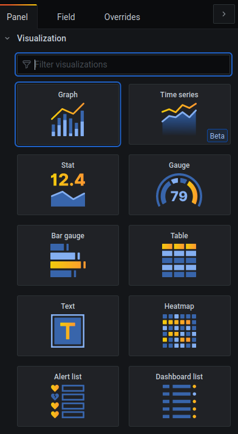

## 1. 前言
本文将通过Node_exporter+Prometheus+Grafana三者结合，快速提取Linux内核数据，数据包括但不限于CPU、内存、磁盘、网络IO等，并进行可视化展示。当然，这一套对于分布式也同样适用。本文档可以用于传统工具测试参考。

## 2. Node_exporter
Node_exporter 是 prometheus 提供的一个可以采集到主机信息的应用程序，它能采集到系统的 CPU、内存、网络、磁盘等信息。

### 2.1 安装 node_exporter
```bash
cd ~ && mkdir npg && cd npg
wget https://github.com/prometheus/node_exporter/releases/download/v1.1.2/node_exporter-1.1.2.linux-amd64.tar.gz
tar -zxvf node_exporter-1.1.2.linux-amd64.tar.gz
```

> 不同系统或其它安装方法请参考：https://prometheus.io/download/

### 2.2 运行 node_exporter
解压后运行 node_exporter，可以使用 8080 端口运行：

```bash
cd node_exporter-1.1.2.linux-amd64
./node_exporter --web.listen-address 127.0.0.1:8080
```
启动成功后，可以看到如下输出：


在浏览器访问 `http://localhost:8080/` 可以看到以下页面：



在浏览器访问 `http://localhost:8080/metrics`，可以看到当前 `node_exporter` 获取到的当前主机的所有监控数据，如下所示：


每一个指标都会有 HELP  和 TYPE，其中 HELP 用于解释当前指标的含义，TYPE 则说明当前指标的数据类型。

> 了解想详细的内容，可以访问：`https://github.com/prometheus/node_exporter`

## 3. Prometheus
Prometheus 是一个数据监控解决方案，能简单快速地搭建起一套可视化的监控系统。Prometheus的基本架构如下图所示：


### 3.1 安装Prometheus
Prometheus Server 负责数据的采集，首先安装 Prometheus Server ，针对Ubuntu，可使用以下命令来安装：
```bash
cd ~/npg
wget https://github.com/prometheus/prometheus/releases/download/v2.26.0/prometheus-2.26.0.linux-amd64.tar.gz
tar -zxvf prometheus-2.26.0.linux-amd64.tar.gz
```

> 不同系统或其它安装方法请参考：https://prometheus.io/download/

### 3.2 运行Prometheus
解压后可以看到如下目录：


其中： 
- data 目录是数据的存储路径，也可以通过运行时的 --storage.tsdb.path="data/" 命令另行指定；
- prometheus.yml 是 Prometheus的配置文件；
- prometheus 是运行的命令。

启动prometheus，会默认加载当前路径下的prometheus.yaml文件，也可以手动指定配置文件地址：
```bash
./prometheus --config.file=prometheus.yml
```
启动 prometheus 后，正常情况下会输出以下内容：



在浏览器输入访问地址：`http://localhost:9090/graph` 可以看到Prometheus 自带的监控管理界面：



### 3.3 配置 prometheus 的监控数据源为 node_exporter
配置 prometheus 的配置 `prometheus.yml` 文件，使 prometheus 服务器定时去业务数据源拉取数据。编辑`prometheus.yml` 并在 `scrape_configs` 节点下添加以下内容：
```yaml
# A scrape configuration containing exactly one endpoint to scrape:
# Here it's Prometheus itself.
scrape_configs:
  # The job name is added as a label `job=<job_name>` to any timeseries scraped from this config.
  - job_name: 'prometheus'
    # metrics_path defaults to '/metrics'
    # scheme defaults to 'http'.
    static_configs:
      - targets: ['localhost:9090']
 
    # 采集node exporter监控数据
  - job_name: 'node'
    static_configs:
      - targets: ['localhost:8080']   
```
上面配置文件配置了两个任务，一个是名为 prometheus 的任务，其从`localhost:9090`地址读取数据，另一个是名为 node 的任务，其从`localhost:8080`地址读取数据。配置完成后，重新启动 prometheus。

```bash
./prometheus --config.file=prometheus.yml
```

配置完 prometheus 读取的数据源之后，prometheus 便可以从 Node Exporter 获取到数据了。

### 3.4 Prometheus UI 查看监控数据

Prometheus UI 是 Prometheus 内置的一个可视化管理界面，通过浏览器访问地址 `http://localhost:9090` 就可以访问到该页面。
通过 Prometheus UI 可以查询 Prometheus 收集到的数据，而 Prometheus 定义了 PromQL 语言来作为查询监控数据的语言。

在浏览器访问 `http://localhost:9090`，进入到 Prometheus Server。输入 up 并且点击执行按钮以后，可以看到如下结果：



可以看到有两个名为 node 和 prometheus 的 job ，其后面的 value 为 1，代表他们是激活状态。

如果想查看 NodeExporter 节点所在机器 CPU 1 分钟的负载情况，可以输入 `node_load1` 查看：



Prometheus UI 提供了快速验证 PromQL 以及临时可视化支持的能力，但其可视化能力却比较弱。我们可以用 Grafana 来实现 Prometheus 的可视化。
## 4. Grafana
Grafana 是一个用来展示各种各样数据的开源软件，只需要在 Grafana 上配置一个 Prometheus 的数据源，然后配置各种图表，Grafana 就会自动去 Prometheus 拉取数据进行展示。

### 4.1 安装 Grafana
可使用以下命令来安装 Grafana：
```bash
cd ~/npg
wget https://dl.grafana.com/oss/release/grafana-7.5.2.linux-amd64.tar.gz
tar -zxvf grafana-7.5.2.linux-amd64.tar.gz
```
> 不同系统或其它安装方法请参考：https://grafana.com/grafana/download

### 4.2 运行 Grafana
解压后使用以下命令来启动 Grafana：
```bash
cd grafana-7.5.2.linux-amd64
./grafana-server web
```
正常启动会输出如下信息：



Grafana 默认使用 3000 端口启动，浏览器访问：`http://localhost:3000` 查看对应页面：


默认的账号：admin，密码： admin，登录后显示如下页面：


### 4.3 配置数据源
设置菜单添加 Prometheus 数据源：


添加一个名为 Prometheus 的数据源，数据获取地址为：`http://localhost:9090` 。



### 4.4 配置面板
Grafana 中有 Dashboard 和 Panel 的概念，Dashboard 可以理解成看板，Panel 可以理解成图表，一个看板中包含了无数个图表。下面创建一个图表来显示系统 1 分钟平均负载。


点击右上角Apply，数据可视化结果如下：


可以展示的图表样式有：



>详细使用方法可以参考：https://grafana.com/docs/?pg=community&plcmt=topnav

## 5. 总结
本文主要通过Node_exporter+Prometheus+Grafana三者结合，介绍了快速提取Linux内核数据，并进行可视化展示。随着eBPF技术的发展，其应用场景也越来越多，本文目前使用传统工具对内核数据进行提取和展示，接下来将基于eBPF技术，结合Prometheus和Grafana进行数据提取，存储和展示，同样也可以应用于分布式场景。

参考资料：

https://shuyi.tech/archives/00-why-learn-prometheus

https://prometheus.io/

https://grafana.com/

https://github.com/prometheus/node_exporter