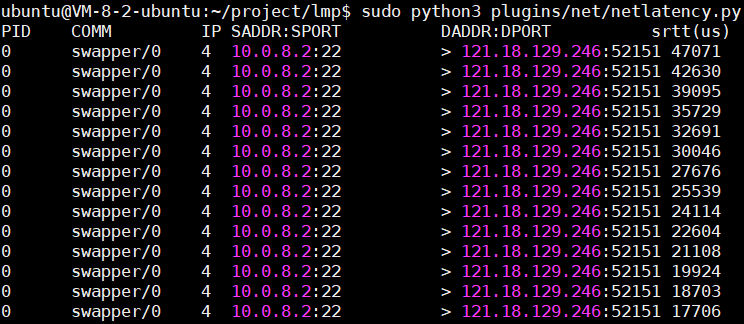

+++
title = "插件：net/netlatency.py"
description = "针对插件：plugins/net/netlatency.py 的分析。"
author = "白宇宣（i@barryx.cn）"
weight = 5

+++

## 插件说明
插件地址： plugins/net/netlatency.py

## 插件功能说明
统计SRTT时间（smoothed round trip time）。

RTT(Round-Trip Time，往返时间)是一项重要性能指标，表示从发送端发送数据开始，到发送端收到来自接收端的确认（接收端收到数据后便立即发送确认，不包含数据传输时间）总共经历的时间。

因为RTT对不同的往返有不同的数值,而且其起伏比较大，以致不能为重传超时做标准，所以使用SRTT即RTT的平滑值作为指标。

## 插件代码解读

- 挂载点：

```c
b.attach_kprobe(event="tcp_ack", fn_name="trace_tcp_ack_entry")
b.attach_kretprobe(event="tcp_ack", fn_name="trace_tcp_ack_return")
```

在TCP输入数据段的处理过程中，如果发现输入段携带了ACK信息，则会调用`tcp_ack()`进行ACK相关的处理。

```c
int trace_tcp_ack_entry(struct pt_regs *ctx, struct sock *sk)
{
    u64 pid = bpf_get_current_pid_tgid();
    tmp.update(&pid, &sk);
    return 0;
}
```

在进入`tcp_ack()`时，`trace_tcp_ack_entry`记录了当前`pid`、`sock`结构体，存入了`tmp`中。`tmp`是以`pid`为key，`struct sock *`为value的哈希表。

```c
BPF_HASH(tmp, u64, struct sock *);
```

在离开tcp_ack（）时，`trace_tcp_ack_return`根据`pid`在tmp中查找到对应的sock结构体。之后将字段：`dport`、`sport`、`family`、`saddr`、`daddr`、`comm`等通过perf_event发送到了发送到了用户态下。

FILTER的作用是根据用户定义的阈值进行过滤：

```python
bpf_text = bpf_text.replace('FILTER',
		'if (srtt >= %s)' % args.rtt)
```

在BPF程序加载之前会通过字符串替换的方法将其改写为if的形式。

用户态下`print_ipv4_event`、`print_ipv6_event`接受`ipv4_events`、`ipv6_events`并输出。

```python
b["ipv4_events"].open_perf_buffer(print_ipv4_event)
b["ipv6_events"].open_perf_buffer(print_ipv6_event)
```

## 插件使用

### 后台运行方式
直接命令行运行 python 的方式来执行该 eBPF 程序。

```
cd lmp
sudo python3 plugins/net/netlatency.py
```



## 插件运行版本
### 插件适用版本
Ubuntu 18.04 (4.15.0-generic)及之后版本
### 已经测试过的版本

Ubuntu 18.04 (4.15.0-generic)

Ubuntu 20.04（5.4.0-77-generic）

