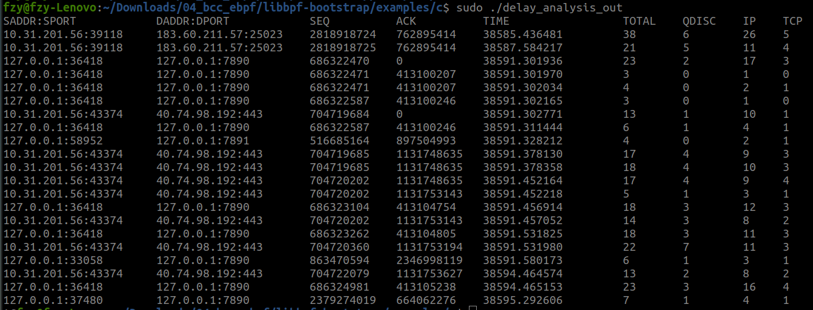
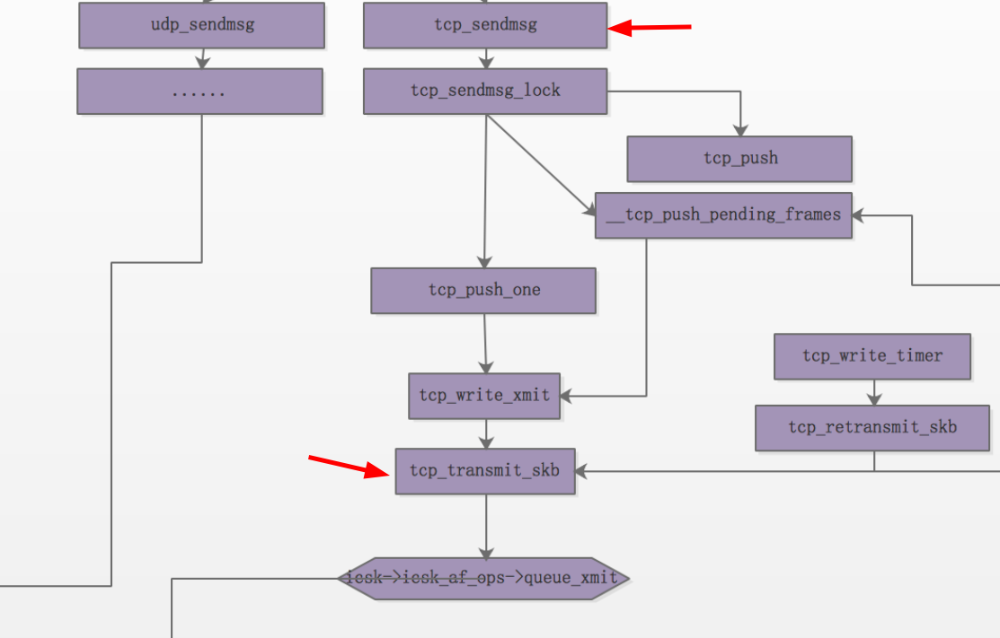
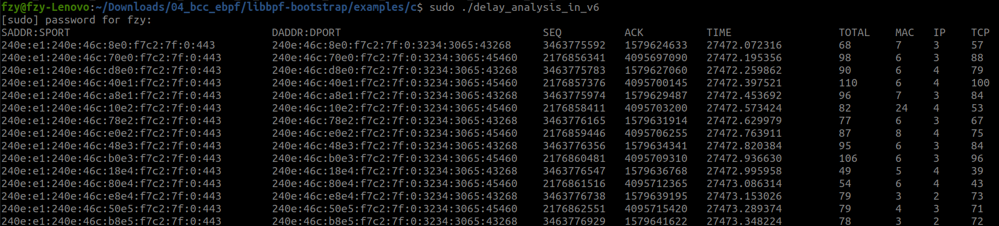

# 2023-02-27_03-03

### 1.上周预计划

1. 尝试在Orin开发板运行delay_analysis
2. 理解 nettrace 原理

### 2. 本周工作

1. orin开发板运行 delay_analysis 

2. 移植 delay_analysis(剩下的)

- delay_analysis_out

TCP层 kprobe点由tcp_transmit_skb修改至tcp_sendmsg，时间计算更精确

- 移植 delay_analysis_out_v6

移植 delay_analysis_in_v6

### 3. 下一步计划
