## 数据是如何从网卡到协议栈的？

Linux内核以及网卡驱动主要实现链路层、网络层、传输层这三层上的功能，内核为更上面的应用层提供socket接口来支持用户进程访问

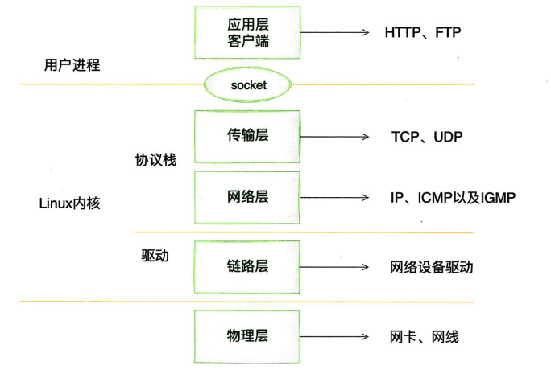

内核和网络设备驱动是通过中断的⽅式来处理的


### 内核收包的路径

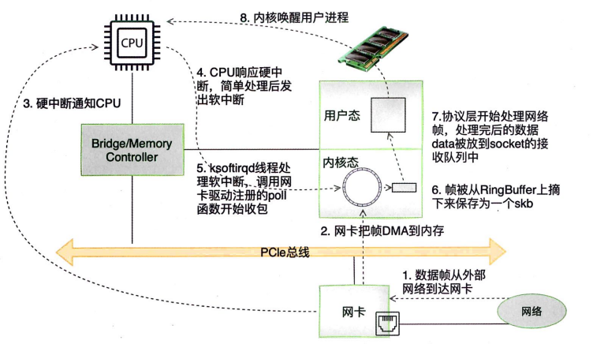

1、当网卡收到数据以后，2、以DMA的⽅式把⽹卡收到的帧写到内存⾥，3、再向CPU发起⼀个中断，以通知CPU有数据到达。当CPU收到中断请求后，4、会去调⽤⽹络设备驱动注册的中断处理函数。⽹卡的中断处理函数并不做过多⼯作，5、发出软中断请求，然后尽快释放CPU资源。ksoftirad内核线程检测到有软中断请求到达，调⽤poll开始轮询收包，6、帧被从RingBuffer上摘下来保存为一个skb7、收到后交由各级协议栈处理。对于TCP包来说，会被放到⽤户socker的接收队列中。

### Linux启动

在能够接收网卡数据包之前需要做以下的准备工作

#### 创建ksoftirqd内核线程

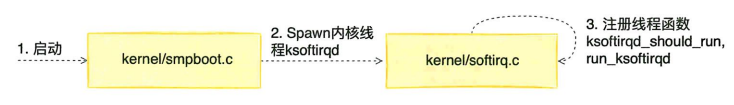

```c
//struct smp_hotplug_thread CPU热插拔相关线程描述符
//在注册时会为每个CPU注册一个内核线程。
static struct smp_hotplug_thread softirq_threads = {
	.store				= &ksoftirqd,//指向每个 cpu 上的 task_struct 结构
	.thread_should_run	= ksoftirqd_should_run,//线程是否应该运行的回调函数
	.thread_fn			= run_ksoftirqd,//关联的功能函数
	.thread_comm		= "ksoftirqd/%u",//名称
};
```

```c
static __init int spawn_ksoftirqd(void)
{
	register_cpu_notifier(&cpu_nfb);

	BUG_ON(smpboot_register_percpu_thread(&softirq_threads));//注册一个percpu线程

	return 0;
}
early_initcall(spawn_ksoftirqd);
```

当ksoftirad被创建出来以后，它就会进⼊⾃⼰的线程循环函数ksoftirad_should_run和run_ksoftirad了。

软中断不仅有网络软中断，还有其他类型，

```C
enum
{
	HI_SOFTIRQ=0,//高优先级软中断
	TIMER_SOFTIRQ,//定时器软中断
	NET_TX_SOFTIRQ,//网络发送软中断
	NET_RX_SOFTIRQ,//网络接收软中断
	BLOCK_SOFTIRQ,//块设备软中断
	BLOCK_IOPOLL_SOFTIRQ,//块设备I/O轮询软中断
	TASKLET_SOFTIRQ,//tasklet软中断
	SCHED_SOFTIRQ,//调度软中断
	HRTIMER_SOFTIRQ,//高精度定时器软中断
	RCU_SOFTIRQ,    //可读复制软中断

	NR_SOFTIRQS//软中断类型的数量
};
```

#### 网络子系统初始化

在⽹络⼦系统的初始化过程中，会为每个CPU初始化softnet _ data，也会为RX

SOFTIRQ和TX SOFTIRQ注册处理函数

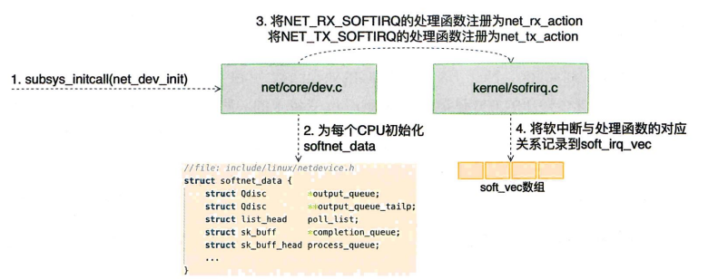

```c
//网络子系统的初始化
static int __init net_dev_init(void)
{
	...
	for_each_possible_cpu(i) {
        //为每个CPU都申请⼀个sotinet data数据结构，这
		struct softnet_data *sd = &per_cpu(softnet_data, i);

		memset(sd, 0, sizeof(*sd));
		skb_queue_head_init(&sd->input_pkt_queue);
		skb_queue_head_init(&sd->process_queue);
		sd->completion_queue = NULL;
		INIT_LIST_HEAD(&sd->poll_list);
		...
    }
    //每⼀种软中断都注册⼀个处理函数。
	open_softirq(NET_TX_SOFTIRQ, net_tx_action);
	open_softirq(NET_RX_SOFTIRQ, net_rx_action);
	...
}
```

```c
void open_softirq(int nr, void (*action)(struct softirq_action *))
{
	softirq_vec[nr].action = action;//注册的⽅式是记录在sottirq vec变量⾥的
}

```

#### 协议栈注册

内核实现了⽹络层的IP协议，也实现了传输层的TCP协议和UDP协议。这些协议对应的实现函数分别是ip_rev()、tcp_v4_rcv()和udp_rcv()。 内核是通过注册的⽅式来实现的

fs_initcall调⽤inet_init 后开始⽹络协议栈注册，通过inet_init， 将这些函数注册到inet_protos和ptype_base数据结构中

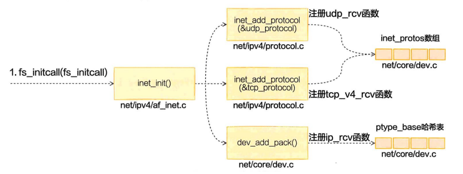

```c
static const struct net_protocol tcp_protocol = {
	.early_demux	=	tcp_v4_early_demux,
	.handler	=	tcp_v4_rcv,
	.err_handler	=	tcp_v4_err,
	.no_policy	=	1,
	.netns_ok	=	1,
};
static int __init inet_init(void)
{
	//添加所有基础协议
	if (inet_add_protocol(&icmp_protocol, IPPROTO_ICMP) < 0)
		pr_crit("%s: Cannot add ICMP protocol\n", __func__);
	if (inet_add_protocol(&udp_protocol, IPPROTO_UDP) < 0)
		pr_crit("%s: Cannot add UDP protocol\n", __func__);
	if (inet_add_protocol(&tcp_protocol, IPPROTO_TCP) < 0)
		pr_crit("%s: Cannot add TCP protocol\n", __func__);
	...
    //各层级初始化
	arp_init();
	ip_init();
	tcp_v4_init();
	tcp_init();
	udp_init();
	udplite4_register();
	ping_init();
	ipv4_proc_init();
	ipfrag_init();

	dev_add_pack(&ip_packet_type);
}
fs_initcall(inet_init);
```

udp_protocol结构体的handle是udp_rcv,udp_protocol结构体的handle是tcp_v4_rcv,它们通过inet_add_protocol来进行初始化

```c
//将协议处理程序添加到哈希表
int inet_add_protocol(const struct net_protocol *prot, unsigned char protocol)
{
	if (!prot->netns_ok) {
		pr_err("Protocol %u is not namespace aware, cannot register.\n",
			protocol);
		return -EINVAL;
	}
	//将TCP和UDP对应的处理函数都注册到net_protocol数组中
	return !cmpxchg((const struct net_protocol **)&inet_protos[protocol],
			NULL, prot) ? 0 : -1;
}
EXPORT_SYMBOL(inet_add_protocol);
```

dev_add_pack将ip_packet_type结构体注册到ptype_base哈希表中

```c
//添加packet的handle
void dev_add_pack(struct packet_type *pt)
{
	struct list_head *head = ptype_head(pt);
	...
}
EXPORT_SYMBOL(dev_add_pack);
//将协议ID添加到ptype_base哈希表中
static inline struct list_head *ptype_head(const struct packet_type *pt)
{
	if (pt->type == htons(ETH_P_ALL))
		return &ptype_all;
	else
		return &ptype_base[ntohs(pt->type) & PTYPE_HASH_MASK];
}

```

#### 网卡驱动初始化

每⼀个驱动程序会使⽤module init向内核注册⼀个初始化函数，当驱动程序被加载时，内核会调⽤这个函数

```c
static struct pci_driver igb_driver = {
	.name     = igb_driver_name,
	.id_table = igb_pci_tbl,
	.probe    = igb_probe,
	.remove   = igb_remove,
	...
};

static int __init igb_init_module(void)
{
	...
	ret = pci_register_driver(&igb_driver);
	return ret;
}
```

驱动的pci_ register_driver调⽤完成后，Linux内核就知道了该驱动的相关信息,当⽹卡设备被识别以后，内核会调⽤其驱动的probe⽅法 ,让设备处于ready状态

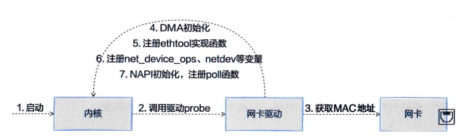

第6步在注册igb_netdev_ops时，其中包含igb_open等函数，其在网卡启动的时候被调用

第7步在igb_probe初始化中，调用了igb_alloc_q_vector，其注册了NAPI所需的poll函数

#### 启动网卡

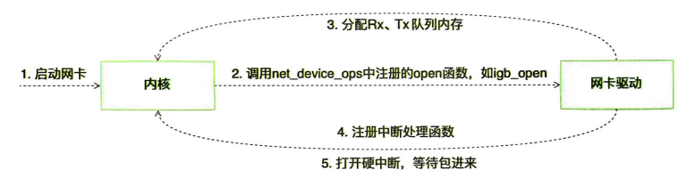

```c
//当网络接口处于活动状态时被调用
static int __igb_open(struct net_device *netdev, bool resuming)
{
	...
    //分配传输描述符数组
	err = igb_setup_all_tx_resources(adapter);
	//分配接收描述符数组
	err = igb_setup_all_rx_resources(adapter);
	//注册中断处理函数
	err = igb_request_irq(adapter);
	if (err)
		goto err_req_irq;

	//启用NAPI
	for (i = 0; i < adapter->num_q_vectors; i++)
		napi_enable(&(adapter->q_vector[i]->napi));
	...
}
```

##### 分配描述符数组

通过igb_setup_all_tx_resources分配了RingBuffer

```c
static int igb_setup_all_tx_resources(struct igb_adapter *adapter)
{
	...
	for (i = 0; i < adapter->num_tx_queues; i++) {
		err = igb_setup_tx_resources(adapter->tx_ring[i]);
	...
	return err;
}
    int igb_setup_tx_resources(struct igb_ring *tx_ring)
{
	//申请igb_rx_buffer数组内存
	size = sizeof(struct igb_tx_buffer) * tx_ring->count;
	tx_ring->tx_buffer_info = vzalloc(size);
	
	//申请e1000_adv_rx_desc DMA数组内存
	tx_ring->size = tx_ring->count * sizeof(union e1000_adv_tx_desc);
	tx_ring->size = ALIGN(tx_ring->size, 4096);

	tx_ring->desc = dma_alloc_coherent(dev, tx_ring->size,
					   &tx_ring->dma, GFP_KERNEL);

	//初始化队列成员
	tx_ring->next_to_use = 0;
	tx_ring->next_to_clean = 0;

	return 0;

}
```

其建立了若干个队列，一个RingBuffer内部有两个环形队列数组，分别是igb_rx_buffer与e1000_adv_rx_desc

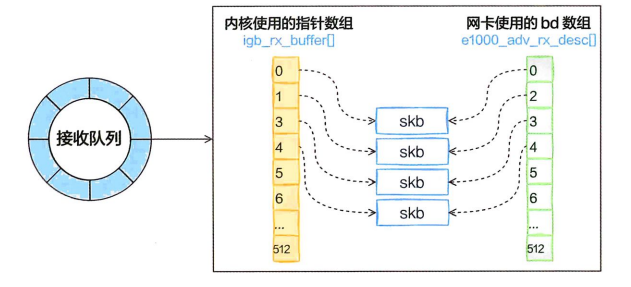

##### 注册中断处理函数

```c
//初始化中断
static int igb_request_irq(struct igb_adapter *adapter)
{
	if (adapter->msix_entries) {
		err = igb_request_msix(adapter);
		if (!err)
			goto request_done;
	...
}                                    
static int igb_request_msix(struct igb_adapter *adapter)
{
    ...
	for (i = 0; i < adapter->num_q_vectors; i++) {
		err = request_irq(adapter->msix_entries[vector].vector,
				  igb_msix_ring, 0, q_vector->name,
				  q_vector);
	...
}
```

对于多队列的⽹卡，为每⼀个队列都注册了中断，其对应的中断处理函数是igb_msix_ring,且在msix⽅式下，每个RX 队列有独⽴的MSI-X中断，从⽹卡硬件中断的层⾯就可以设置让收到的包被不同的CPU处理。

### 迎接数据的到来

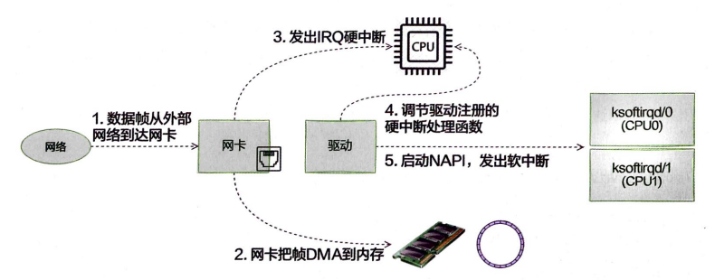

Linux在硬中断⾥只完成简单必要的⼯作，剩下的⼤部分的处理都是转交给软中断的

#### 硬中断处理

前文提到⽹卡的硬中断注册的处理函数是igb_msx ring

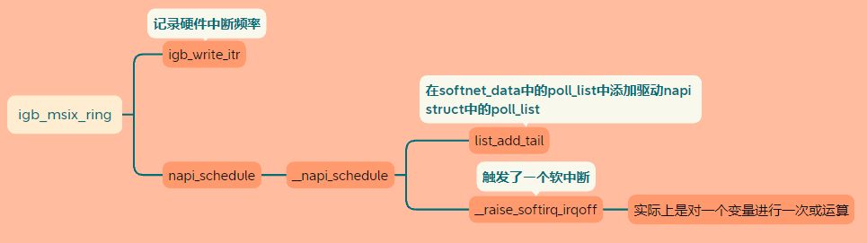

硬中断处理过程⾮常短，只是记录了⼀个寄存器，修改了⼀下CPU的poll_list，然后发出⼀个软中断

#### 软中断处理

⽹络包的接收处理过程主要都在ksoftirad内核线程中完成

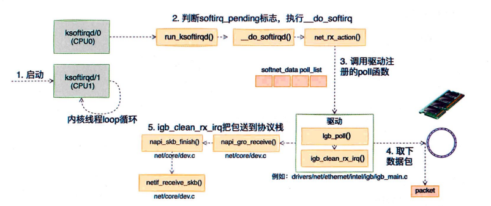

在内核线程初始化时，softirq_threads中有两个函数ksoftirqd_should_run与run_ksoftirqd

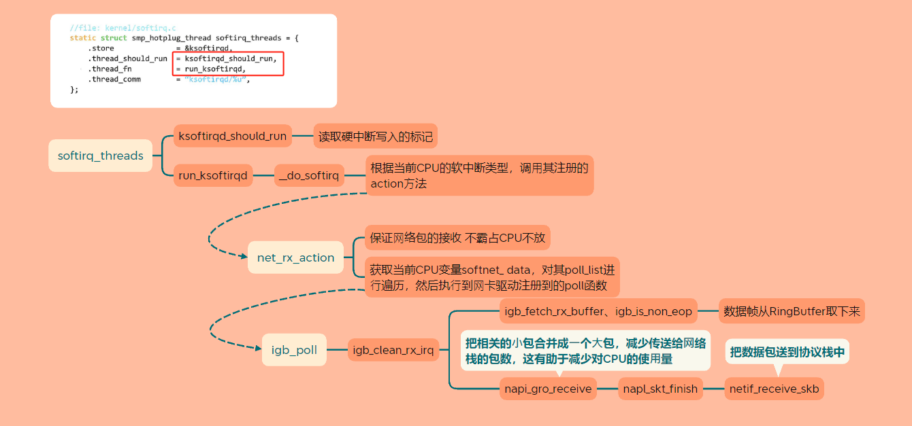

#### 网络协议栈处理

netif_receive_skb函数会根据包的协议进⾏处理

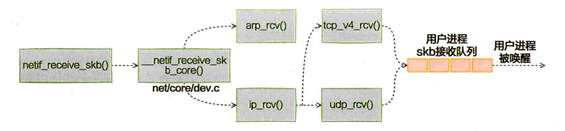

```c
static int __netif_receive_skb_core(struct sk_buff *skb, bool pfmemalloc)
{
	...
	list_for_each_entry_rcu(ptype, &ptype_all, list) {
		if (!ptype->dev || ptype->dev == skb->dev) {
			if (pt_prev)
				ret = deliver_skb(skb, pt_prev, orig_dev);
			pt_prev = ptype;
		}
	}
	...
	list_for_each_entry_rcu(ptype,
			&ptype_base[ntohs(type) & PTYPE_HASH_MASK], list) {
		if (ptype->type == type &&
		    (ptype->dev == null_or_dev || ptype->dev == skb->dev ||
		     ptype->dev == orig_dev)) {
			if (pt_prev)
				ret = deliver_skb(skb, pt_prev, orig_dev);
			pt_prev = ptype;
		}
	}
}
```

