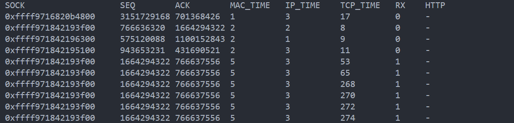
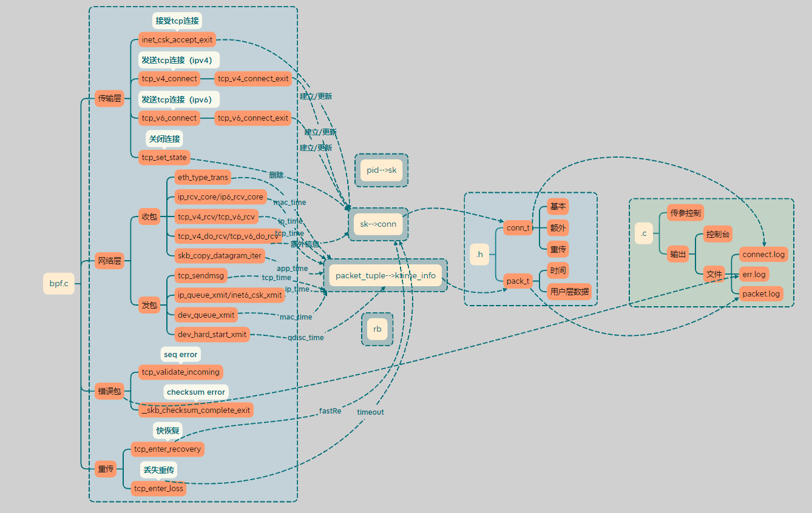
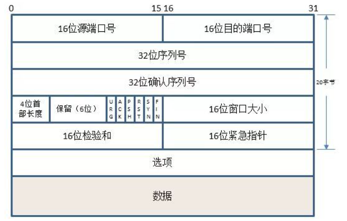
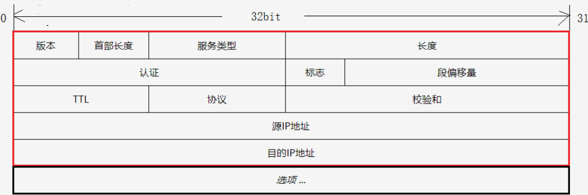
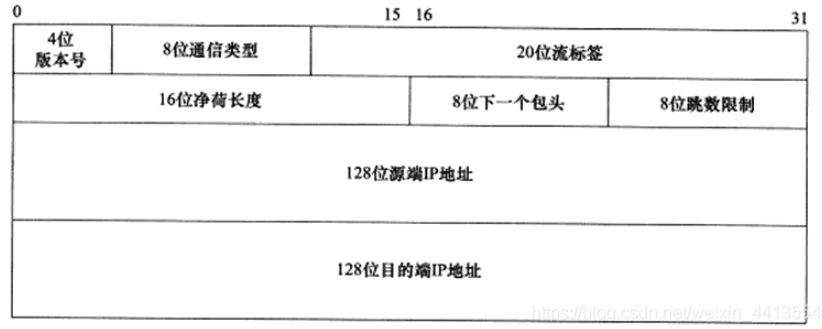

# Network_Subsystem/net_watcher学习注释

## 使用


-a:  显示关闭的连接

-d：过滤指定目标端口

-e：显示错误报文

-i：显示http信息

-r：显示重传信息

-s：过滤指定源端口

-t:显示各层级处理时间

-x：显示额外信息

`make`后使用`sudo ./netwatcher  -tixe`命令运行

**控制台输出：**



可以看到socket的地址、seq号、ack号各层的处理时间、发包/收包、http协议的内容等

**connect.log**

```
connection{pid="45192",sock="0xffff971842193f00",src="192.168.239.132:45514",dst="34.117.237.239:443",is_server="0",backlog="0",maxbacklog="0",rwnd="64028",cwnd="10",ssthresh="2147483647",sndbuf="87040",wmem_queued="1319",rx_bytes="1.027K",tx_bytes="1.689K",srtt="725505",duration="756741",total_retrans="0",fast_retrans="-",timeout_retrans="-"} 
```

**packet.log**

```
packet{sock="0xffff9716820b4800",seq="3151729168",ack="701368426",mac_time="1",ip_time="3",tcp_time="17",http_info="-",rx="0"}
```

**err.log**

没有抓到，需要写测试工具


## 分析

netwatcher.bpf.c：在各个内核探针点对TCP包信息、TCP连接信息以及各个包的HTTP1/1.1信息进行记录

netwatcher.c: 对bpf.c文件中记录的信息进行输出

netwatcher.h: 定义内核态与用户态程序共用的结构体



## 外部结构体

#### struct socket

```c
struct socket {
	socket_state		state;		//套接字所处状态
	short			type;			//套接字所用的流类型
	unsigned long		flags;		//标识字段
	struct file		*file;			
	struct sock		*sk;			//网络层
	const struct proto_ops	*ops;	//操作函数集指针
	struct socket_wq	wq;			//多用户的等待队列
};
```


#### struct sock

sock结构的使用基本贯穿硬件层、设备接口层、ip层、INET socket 层，而且是作为各层之间的一个联系，主要是因为无论是发送还是接收的数据包都要被缓存到sock 结构中的缓冲队列中

```c
struct sock {	//网络层的套接字
	struct sock_common	__sk_common;	//sock_common的结构  即网络层套接字通用结构体
    //下面是struct sock_common 中的结构
#define sk_node			__sk_common.skc_node
#define sk_nulls_node		__sk_common.skc_nulls_node
#define sk_refcnt		__sk_common.skc_refcnt
#define sk_tx_queue_mapping	__sk_common.skc_tx_queue_mapping
#ifdef CONFIG_SOCK_RX_QUEUE_MAPPING
#define sk_rx_queue_mapping	__sk_common.skc_rx_queue_mapping
#endif

#define sk_dontcopy_begin	__sk_common.skc_dontcopy_begin
#define sk_dontcopy_end		__sk_common.skc_dontcopy_end
#define sk_hash			__sk_common.skc_hash
#define sk_portpair		__sk_common.skc_portpair
#define sk_num			__sk_common.skc_num
#define sk_dport		__sk_common.skc_dport
#define sk_addrpair		__sk_common.skc_addrpair
#define sk_daddr		__sk_common.skc_daddr
#define sk_rcv_saddr		__sk_common.skc_rcv_saddr
#define sk_family		__sk_common.skc_family
#define sk_state		__sk_common.skc_state
#define sk_reuse		__sk_common.skc_reuse
#define sk_reuseport		__sk_common.skc_reuseport
#define sk_ipv6only		__sk_common.skc_ipv6only
#define sk_net_refcnt		__sk_common.skc_net_refcnt
#define sk_bound_dev_if		__sk_common.skc_bound_dev_if
#define sk_bind_node		__sk_common.skc_bind_node
#define sk_prot			__sk_common.skc_prot
#define sk_net			__sk_common.skc_net
#define sk_v6_daddr		__sk_common.skc_v6_daddr
#define sk_v6_rcv_saddr	__sk_common.skc_v6_rcv_saddr
#define sk_cookie		__sk_common.skc_cookie
#define sk_incoming_cpu		__sk_common.skc_incoming_cpu
#define sk_flags		__sk_common.skc_flags
#define sk_rxhash		__sk_common.skc_rxhash

	/* early demux fields */
	struct dst_entry __rcu	*sk_rx_dst;	// 
	int			sk_rx_dst_ifindex;		//
	u32			sk_rx_dst_cookie;		//

	socket_lock_t		sk_lock;		// 套接字同步锁
	atomic_t		sk_drops;     		//IP/UDP包丢包统计
	int			sk_rcvlowat;            //SO_RCVLOWAT标记位
	struct sk_buff_head	sk_error_queue;
	struct sk_buff_head	sk_receive_queue;	// 收到的数据包队列
	/*
	 * The backlog queue is special, it is always used with
	 * the per-socket spinlock held and requires low latency
	 * access. Therefore we special case it's implementation.
	 * Note : rmem_alloc is in this structure to fill a hole
	 * on 64bit arches, not because its logically part of
	 * backlog.
	 */
	struct {
		atomic_t	rmem_alloc;
		int		len;
		struct sk_buff	*head;
		struct sk_buff	*tail;
	} sk_backlog;

#define sk_rmem_alloc sk_backlog.rmem_alloc

	int			sk_forward_alloc;
	u32			sk_reserved_mem;
#ifdef CONFIG_NET_RX_BUSY_POLL
	unsigned int		sk_ll_usec;
	/* ===== mostly read cache line ===== */
	unsigned int		sk_napi_id;
#endif
	int			sk_rcvbuf;					// 接收缓存大小

	struct sk_filter __rcu	*sk_filter;
	union {
		struct socket_wq __rcu	*sk_wq;		// 等待队列
		/* private: */
		struct socket_wq	*sk_wq_raw;
		/* public: */
	};
#ifdef CONFIG_XFRM
	struct xfrm_policy __rcu *sk_policy[2];
#endif

	struct dst_entry __rcu	*sk_dst_cache;
	atomic_t		sk_omem_alloc;
	int			sk_sndbuf;					// 发送缓存大小

	/* ===== cache line for TX ===== */
	int			sk_wmem_queued;				// 传输队列大小
	refcount_t		sk_wmem_alloc;			// 已确认的传输字节数
	unsigned long		sk_tsq_flags;		// TCP Small Queue标记位
	union {
		struct sk_buff	*sk_send_head;		// 发送队列队首
		struct rb_root	tcp_rtx_queue;
	};
	struct sk_buff_head	sk_write_queue;		// 发送队列
	__s32			sk_peek_off;
	int			sk_write_pending;
	__u32			sk_dst_pending_confirm;
	u32			sk_pacing_status; 			// 发包速率控制状态
    /* see enum sk_pacing */
	long			sk_sndtimeo;			// SO_SNDTIMEO 标记位
	struct timer_list	sk_timer;			// 套接字清空计时器
	__u32			sk_priority;			// SO_PRIORITY 标记位
	__u32			sk_mark;
	unsigned long		sk_pacing_rate;		//发包速率
    /* bytes per second */
	unsigned long		sk_max_pacing_rate;	//最大发包速率
	struct page_frag	sk_frag;			// 缓存页帧
	netdev_features_t	sk_route_caps;
	int			sk_gso_type;
	unsigned int		sk_gso_max_size;
	gfp_t			sk_allocation;
	__u32			sk_txhash;

	/*
	 * Because of non atomicity rules, all
	 * changes are protected by socket lock.
	 */
	u8			sk_gso_disabled : 1,
				sk_kern_sock : 1,
				sk_no_check_tx : 1,
				sk_no_check_rx : 1,
				sk_userlocks : 4;
	u8			sk_pacing_shift;
	u16			sk_type;
	u16			sk_protocol;
	u16			sk_gso_max_segs;
	unsigned long	        sk_lingertime;
	struct proto		*sk_prot_creator;
	rwlock_t		sk_callback_lock;
	int			sk_err,						// 上次错误
				sk_err_soft;				// 软错误 不会导致失败的错误
	u32			sk_ack_backlog;				// ack队列长度
	u32			sk_max_ack_backlog;			// 最大ack队列长度
	kuid_t			sk_uid;					// user id
	u8			sk_txrehash;				
#ifdef CONFIG_NET_RX_BUSY_POLL
	u8			sk_prefer_busy_poll;
	u16			sk_busy_poll_budget;
#endif
	spinlock_t		sk_peer_lock;			// 套接字对应的peer的id
	int			sk_bind_phc;
	struct pid		*sk_peer_pid;
	const struct cred	*sk_peer_cred;

	long			sk_rcvtimeo;			// 接收超时
	ktime_t			sk_stamp;				// 时间戳
#if BITS_PER_LONG==32
	seqlock_t		sk_stamp_seq;
#endif
	atomic_t		sk_tskey;
	atomic_t		sk_zckey;
	u32			sk_tsflags;
	u8			sk_shutdown;

	u8			sk_clockid;
	u8			sk_txtime_deadline_mode : 1,
				sk_txtime_report_errors : 1,
				sk_txtime_unused : 6;
	bool			sk_use_task_frag;

	struct socket		*sk_socket;			// Identd协议报告IO信号
	void			*sk_user_data;			// RPC层私有信息
#ifdef CONFIG_SECURITY
	void			*sk_security;
#endif
	struct sock_cgroup_data	sk_cgrp_data;	// cgroup数据
	struct mem_cgroup	*sk_memcg;			// 内存cgroup关联
	void			(*sk_state_change)(struct sock *sk);	// 状态变化回调函数
	void			(*sk_data_ready)(struct sock *sk);		// 数据处理回调函数
	void			(*sk_write_space)(struct sock *sk);		// 写空间可用回调函数
	void			(*sk_error_report)(struct sock *sk);	// 错误报告回调函数
	int			(*sk_backlog_rcv)(struct sock *sk,			// 处理存储区回调函数
						  struct sk_buff *skb);
#ifdef CONFIG_SOCK_VALIDATE_XMIT
	struct sk_buff*		(*sk_validate_xmit_skb)(struct sock *sk,
							struct net_device *dev,
							struct sk_buff *skb);
#endif
	void                    (*sk_destruct)(struct sock *sk);// 析构回调函数
	struct sock_reuseport __rcu	*sk_reuseport_cb;			// group容器重用回调函数
#ifdef CONFIG_BPF_SYSCALL
	struct bpf_local_storage __rcu	*sk_bpf_storage;
#endif
	struct rcu_head		sk_rcu;
	netns_tracker		ns_tracker;
	struct hlist_node	sk_bind2_node;
};
```

#### struct sk_buff

sk_buff 是网络数据报在内核中的表现形式，通过源码可以看出，数据包在内核协议栈中是通过这个数据结构来变现的

```c
struct sk_buff {//封装网络数据
	union {
		struct {
			//构成队列
			struct sk_buff		*next;
			struct sk_buff		*prev;

			union {
				struct net_device	*dev;

				unsigned long		dev_scratch; 
			};
		};
		struct rb_node		rbnode; /* used in netem, ip4 defrag, and tcp stack */
		struct list_head	list;
		struct llist_node	ll_node;
	};

	union {
		struct sock		*sk;	//数据包所属的套接字
		int			ip_defrag_offset;
	};

	union {
		ktime_t		tstamp;
		u64		skb_mstamp_ns; /* earliest departure time */
	};
	/*
	 * This is the control buffer. It is free to use for every
	 * layer. Please put your private variables there. If you
	 * want to keep them across layers you have to do a skb_clone()
	 * first. This is owned by whoever has the skb queued ATM.
	 */
	char			cb[48] __aligned(8);

	union {
		struct {
			unsigned long	_skb_refdst;
			void		(*destructor)(struct sk_buff *skb);
		};
		struct list_head	tcp_tsorted_anchor;
#ifdef CONFIG_NET_SOCK_MSG
		unsigned long		_sk_redir;
#endif
	};

#if defined(CONFIG_NF_CONNTRACK) || defined(CONFIG_NF_CONNTRACK_MODULE)
	unsigned long		 _nfct;
#endif
	unsigned int		len,
				data_len;
	__u16			mac_len,
				hdr_len;

	/* Following fields are _not_ copied in __copy_skb_header()
	 * Note that queue_mapping is here mostly to fill a hole.
	 */
	__u16			queue_mapping;

/* if you move cloned around you also must adapt those constants */
#ifdef __BIG_ENDIAN_BITFIELD
#define CLONED_MASK	(1 << 7)
#else
#define CLONED_MASK	1
#endif
#define CLONED_OFFSET		offsetof(struct sk_buff, __cloned_offset)

	/* private: */
	__u8			__cloned_offset[0];
	/* public: */
	__u8			cloned:1,
				nohdr:1,
				fclone:2,
				peeked:1,
				head_frag:1,
				pfmemalloc:1,
				pp_recycle:1; /* page_pool recycle indicator */
#ifdef CONFIG_SKB_EXTENSIONS
	__u8			active_extensions;
#endif

	/* Fields enclosed in headers group are copied
	 * using a single memcpy() in __copy_skb_header()
	 */
	struct_group(headers,

	/* private: */
	__u8			__pkt_type_offset[0];
	/* public: */
	__u8			pkt_type:3; /* see PKT_TYPE_MAX */
	__u8			ignore_df:1;
	__u8			nf_trace:1;
	__u8			ip_summed:2;
	__u8			ooo_okay:1;

	__u8			l4_hash:1;
	__u8			sw_hash:1;
	__u8			wifi_acked_valid:1;
	__u8			wifi_acked:1;
	__u8			no_fcs:1;
	/* Indicates the inner headers are valid in the skbuff. */
	__u8			encapsulation:1;
	__u8			encap_hdr_csum:1;
	__u8			csum_valid:1;

	/* private: */
	__u8			__pkt_vlan_present_offset[0];
	/* public: */
	__u8			remcsum_offload:1;
	__u8			csum_complete_sw:1;
	__u8			csum_level:2;
	__u8			dst_pending_confirm:1;
	__u8			mono_delivery_time:1;	/* See SKB_MONO_DELIVERY_TIME_MASK */
#ifdef CONFIG_NET_CLS_ACT
	__u8			tc_skip_classify:1;
	__u8			tc_at_ingress:1;	/* See TC_AT_INGRESS_MASK */
#endif
#ifdef CONFIG_IPV6_NDISC_NODETYPE
	__u8			ndisc_nodetype:2;
#endif

	__u8			ipvs_property:1;
	__u8			inner_protocol_type:1;
#ifdef CONFIG_NET_SWITCHDEV
	__u8			offload_fwd_mark:1;
	__u8			offload_l3_fwd_mark:1;
#endif
	__u8			redirected:1;
#ifdef CONFIG_NET_REDIRECT
	__u8			from_ingress:1;
#endif
#ifdef CONFIG_NETFILTER_SKIP_EGRESS
	__u8			nf_skip_egress:1;
#endif
#ifdef CONFIG_TLS_DEVICE
	__u8			decrypted:1;
#endif
	__u8			slow_gro:1;
	__u8			csum_not_inet:1;
	__u8			scm_io_uring:1;

#ifdef CONFIG_NET_SCHED
	__u16			tc_index;	/* traffic control index */
#endif

	union {
		__wsum		csum;
		struct {
			__u16	csum_start;
			__u16	csum_offset;
		};
	};
	__u32			priority;
	int			skb_iif;
	__u32			hash;
	union {
		u32		vlan_all;
		struct {
			__be16	vlan_proto;
			__u16	vlan_tci;
		};
	};
#if defined(CONFIG_NET_RX_BUSY_POLL) || defined(CONFIG_XPS)
	union {
		unsigned int	napi_id;
		unsigned int	sender_cpu;
	};
#endif
	u16			alloc_cpu;
#ifdef CONFIG_NETWORK_SECMARK
	__u32		secmark;
#endif

	union {
		__u32		mark;
		__u32		reserved_tailroom;
	};

	union {
		__be16		inner_protocol;
		__u8		inner_ipproto;
	};

	__u16			inner_transport_header;
	__u16			inner_network_header;
	__u16			inner_mac_header;

	__be16			protocol;
	__u16			transport_header;
	__u16			network_header;
	__u16			mac_header;

#ifdef CONFIG_KCOV
	u64			kcov_handle;
#endif

	); /* end headers group */

	/* These elements must be at the end, see alloc_skb() for details.  */
	sk_buff_data_t		tail;
	sk_buff_data_t		end;
	unsigned char		*head,
				*data;
	unsigned int		truesize;
	refcount_t		users;

#ifdef CONFIG_SKB_EXTENSIONS
	/* only useable after checking ->active_extensions != 0 */
	struct skb_ext		*extensions;
#endif
};
```

#### struct tcphdr



```c
struct tcphdr {
	__be16	source;
	__be16	dest;
	__be32	seq;
	__be32	ack_seq;
#if defined(__LITTLE_ENDIAN_BITFIELD)
	__u16	res1:4,
		doff:4,
		fin:1,
		syn:1,
		rst:1,
		psh:1,
		ack:1,
		urg:1,
		ece:1,
		cwr:1;
#elif defined(__BIG_ENDIAN_BITFIELD)
	__u16	doff:4,
		res1:4,
		cwr:1,
		ece:1,
		urg:1,
		ack:1,
		psh:1,
		rst:1,
		syn:1,
		fin:1;
#else
#error	"Adjust your <asm/byteorder.h> defines"
#endif
	__be16	window;
	__sum16	check;
	__be16	urg_ptr;
};
```

#### struct iphdr



```c
struct iphdr {
	__u8	version:4,
  		ihl:4;
	__u8	tos;
	__be16	tot_len;
	__be16	id;
	__be16	frag_off;
	__u8	ttl;
	__u8	protocol;
	__sum16	check;
	__struct_group(/* no tag */, addrs, /* no attrs */,
		__be32	saddr;
		__be32	daddr;
	);
	/*The options start here. */
};
```

#### struct ipv6hdr



```c
struct ipv6hdr {
	__u8			version:4,
				priority:4;
    
	__u8			flow_lbl[3];

	__be16			payload_len;
	__u8			nexthdr;
	__u8			hop_limit;

	__struct_group(/* no tag */, addrs, /* no attrs */,
		struct	in6_addr	saddr;
		struct	in6_addr	daddr;
	);
};
```

#### struct ethhdr


```c
struct ethhdr {
	unsigned char	h_dest[ETH_ALEN];	/* destination eth addr	*/
	unsigned char	h_source[ETH_ALEN];	/* source ether addr	*/
	__be16		h_proto;		/* packet type ID field	*/
} __attribute__((packed));
```


## netwatcher.h

### 宏定义

```c
#define ETH_P_IP 0x0800   /* Internet Protocol packet	*/
#define ETH_P_IPV6 0x86DD /* IPv6 over bluebook		*/

#ifndef AF_INET
#define AF_INET 2
#endif

#ifndef AF_INET6
#define AF_INET6 10 /* IP version 6	*/
#endif

#define TCP_SKB_CB(__skb) ((struct tcp_skb_cb *)&((__skb)->cb[0]))

#define MAX_COMM 16

...
    
#define MAX_PACKET 1000
#define MAX_HTTP_HEADER 256
```

### 结构体

#### struct conn_t

tcp连接相关信息

```c

struct conn_t {
    void *sock;              // 此tcp连接的 socket 地址
    int pid;                 // pid
    unsigned long long ptid; // 此tcp连接的 ptid(ebpf def)
    char comm[MAX_COMM];     // 此tcp连接的 command
    unsigned short family;   // 10(AF_INET6):v6 or 2(AF_INET):v4
    unsigned __int128 saddr_v6;
    unsigned __int128 daddr_v6;
    unsigned int saddr;
    unsigned int daddr;
    unsigned short sport;
    unsigned short dport;
    int is_server; // 1: 被动连接 0: 主动连接

    unsigned int tcp_backlog;          // backlog
    unsigned int max_tcp_backlog;      // max_backlog
    unsigned long long bytes_acked;    // 已确认的字节数
    unsigned long long bytes_received; // 已接收的字节数

    unsigned int snd_cwnd;       // 拥塞窗口大小
    unsigned int rcv_wnd;        // 接收窗口大小
    unsigned int snd_ssthresh;   // 慢启动阈值
    unsigned int sndbuf;         // 发送缓冲区大小(byte)
    unsigned int sk_wmem_queued; // 已使用的发送缓冲区
    unsigned int total_retrans;  // 重传包数
    unsigned int fastRe;         // 快速重传次数
    unsigned int timeout;        // 超时重传次数

    unsigned int srtt;                 // 平滑往返时间
    unsigned long long init_timestamp; // 建立连接时间戳
    unsigned long long duration;       // 连接已建立时长
};
```

#### struct pack_t 

tcp包相关信息

```c
struct pack_t {
    int err;                     // no err(0) invalid seq(1) invalid checksum(2)
    unsigned long long mac_time; // mac layer 处理时间(us)
    unsigned long long ip_time;  // ip layer 处理时间(us)
    unsigned long long tcp_time; // tcp layer 处理时间(us)
    unsigned int seq;            // the seq num of packet
    unsigned int ack;            // the ack num of packet
    unsigned char data[MAX_HTTP_HEADER]; // 用户层数据
    const void *sock;                    // 此包tcp连接的 socket 指针
    int rx;                              // rx packet(1) or tx packet(0)
};
```

## netwatcher.bpf.c

由于代码体量庞大，学习时我们将整个源程序分为不同部分各个函数来分析

### 头文件

### 结构体

#### struct ktime_info

struct ktime_info结构记录着包到达各层的时间戳

```c
struct ktime_info {                      // us time stamp info
    unsigned long long qdisc_time;       // tx包离开mac层时间戳
    unsigned long long mac_time;         // tx、rx包到达mac层时间戳
    unsigned long long ip_time;          // tx、rx包到达ip层时间戳
    unsigned long long tcp_time;         // tx、rx包到达tcp层时间戳
    unsigned long long app_time;         // rx包离开tcp层时间戳
    void *sk;                            // 此包所属 socket
    unsigned char data[MAX_HTTP_HEADER]; // 用户层数据
};
```


#### struct packet_tuple

packet_tuple结构记录tcp包核心信息，以供辅助函数使用

```c
struct packet_tuple {
    unsigned __int128 saddr_v6; //ipv6 源地址
    unsigned __int128 daddr_v6; //ipv6 目的地址
    unsigned int saddr;	//源地址
    unsigned int daddr;	//目的地址
    unsigned short sport;	//源端口号
    unsigned short dport;	//目的端口号
    unsigned int seq;	//seq报文序号
    unsigned int ack;	//ack确认号
};
```


### 辅助函数

#### bpf_map_lookup_or_try_init

操作BPF映射的一个辅助函数

```c
static __always_inline void *//__always_inline强制内联
bpf_map_lookup_or_try_init(void *map, const void *key, const void *init) {
    void *val;
    long err;

    val = bpf_map_lookup_elem(map, key);//在BPF映射中查找具有给定键的条目
    if (val)
        return val;
	//此时没有对应key的value
    err = bpf_map_update_elem(map, key, init, BPF_NOEXIST);//向BPF映射中插入或更新一个条目
    if (err && err != -EEXIST)//插入失败
        return 0;

    return bpf_map_lookup_elem(map, key);//返回对应value值
}
```

#### bpf_map_lookup_elem

以Linux2.6.0内核为例

> void *bpf_map_lookup_elem(struct bpf_map *map, const void *key)
>
> ​	Description
>
>   	Perform a lookup in *map* for an entry associated to *key*. **在*map*中查找与*key关联的条目***
>
> ​	Return
>
> ​		Map value associated to *key*, or **NULL** if no entry was found. **返回key对应的value，未找到返回NULL**

#### bpf_map_update_elem

> long bpf_map_update_elem(struct bpf_map *map, const void *key, const void *value, u64 flags)
>   	Description
>   		Add or update the value of the entry associated to *key* in *map* with *value*. 	**在*map*中添加/修改与key关联的条目**
>
> ​	*flags* is one of:
>
>   		**BPF_NOEXIST** 
>   			The entry for *key* must not exist in the map.		 **key不存在时**
>   		**BPF_EXIST**
>   			The entry for *key* must already exist in the map. 		**key存在时**
>   		**BPF_ANY**
>   			No condition on the existence of the entry for *key*. 		**没有限制条件**
>					
>   		Flag value **BPF_NOEXIST** cannot be used for maps of types **BPF_MAP_TYPE_ARRAY** or **BPF_MAP_TYPE_PERCPU_ARRAY**  (all elements always exist), the helper would return an error. 
>
> ​		**BPF_MAP_TYPE_ARRAY与 BPF_MAP_TYPE_PERCPU_ARRAY 不能使用 BPF_NOEXIST作为flag，因为其所有元素都存在**
>   ​	Return
>   ​		0 on success, or a negative error in case of failure. 	**成功返回0，失败返回错误类型**

### eBPF MAP

`\#define MAX_CONN 1000` 定义最大数量

#### timestamps

存储每个packet_tuple包所对应的ktime_info时间戳

```c
struct {
    __uint(type, BPF_MAP_TYPE_LRU_HASH);//类型
    __uint(max_entries, MAX_CONN *MAX_PACKET);//最大数量
    __type(key, struct packet_tuple);//key 
    __type(value, struct ktime_info);//value
} timestamps SEC(".maps");
```

#### rb

包相关信息通过此buffer提供给user space

```c
struct {
    __uint(type, BPF_MAP_TYPE_RINGBUF);
    __uint(max_entries, 256 * 1024);
} rb SEC(".maps");
```

#### conns_info

存储每个tcp连接所对应的`conn_t`

```c
struct {
    __uint(type, BPF_MAP_TYPE_LRU_HASH);//类型
    __uint(max_entries, MAX_CONN);
    __type(key, struct sock *);//key 
    __type(value, struct conn_t);//value
} conns_info SEC(".maps");
```

#### sock_stores

根据`ptid`存储`sock`指针，从而在上下文无`sock`的内核探测点获得`sock`

```c
struct {
    __uint(type, BPF_MAP_TYPE_LRU_HASH);//类型
    __uint(max_entries, MAX_CONN);
    __type(key, u64);//key 
    __type(value, struct sock *);//value
} sock_stores SEC(".maps");
```

### 宏定义

```
const volatile int filter_dport = 0;
const volatile int filter_sport = 0;
const volatile int all_conn = 0, err_packet = 0, extra_conn_info = 0,
                   layer_time = 0, http_info = 0, retrans_info = 0;
```

#### FILTER_DPORT

如果`filter_dport`的值为非零，并且连接的目标端口与它不匹配，宏会返回0。否则，宏没有返回值，执行继续向下进行。这种宏可以用于筛选连接，根据连接的目标端口是否匹配于`filter_dport`的值来决定是否采取进一步的操作。

```c
#define FILTER_DPORT                                                           \
    if (filter_dport) {                                                        \
        if (conn.dport != filter_dport) {                                      \
            return 0;                                                          \
        }                                                                      \
    }
```

#### FILTER_SPORT 

这个宏的作用是根据`filter_sport`的值来判断是否进行源端口的过滤。如果`filter_sport`的值为非零，并且连接的源端口与它不匹配，宏会返回0。否则，宏没有返回值，执行继续向下进行。这可以用于筛选连接，根据连接的源端口是否匹配于`filter_sport`的值来决定是否采取进一步的操作。

```c
#define FILTER_SPORT                                                           \
    if (filter_sport) {                                                        \
        if (conn.sport != filter_sport) {                                      \
            return 0;                                                          \
        }                                                                      \
    }
```

#### CONN_INIT

初始化conn_t结构

```c
//初始化conn_t结构
#define CONN_INIT
    struct conn_t conn = {0};                        //声明一各conn_t结构,并初始化为0                       
    conn.pid = ptid >> 32;                           //将ptid的高32位赋给pid                          
    conn.ptid = ptid;                                //初始化ptid                           
    u16 protocol = BPF_CORE_READ(sk, sk_protocol);   //读取协议字段                          
    if (protocol != IPPROTO_TCP)                     //检查其协议字段是否为IPPROTO_TCP                                
        return 0;                                                              
    bpf_get_current_comm(&conn.comm, sizeof(conn.comm));        //获取当前进程名字                  
    conn.sock = sk;                                  //套接字指针sk                                                        
    u16 family = BPF_CORE_READ(sk, __sk_common.skc_family);     //地址族字段                
    __be16 dport = BPF_CORE_READ(sk, __sk_common.skc_dport);    //目标端口字段       
    u16 sport = BPF_CORE_READ(sk, __sk_common.skc_num);         //源端口字段             
    conn.family = family;                                                      
    conn.sport = sport;                                                        
    conn.dport = __bpf_ntohs(dport);                  //字节序转换                         
    conn.init_timestamp = bpf_ktime_get_ns() / 1000;  //将当前时间戳(s)          

```

#### CONN_ADD_ADDRESS

初始化conn_t地址相关信息

```c
#define CONN_ADD_ADDRESS                                                     
    if (family == AF_INET) {                                      //Internet IP Protocol               
        conn.saddr = BPF_CORE_READ(sk, __sk_common.skc_rcv_saddr);//获取源地址             
        conn.daddr = BPF_CORE_READ(sk, __sk_common.skc_daddr);    //获取目的地址             
    } else if (family == AF_INET6) {                              //IP version 6             
        bpf_probe_read_kernel(                                    //从sk中读取IPv6连接的源地址           
            &conn.saddr_v6,                                       //存放位置             
            sizeof(sk->__sk_common.skc_v6_rcv_saddr.in6_u.u6_addr32),    //读取大小      
            &sk->__sk_common.skc_v6_rcv_saddr.in6_u.u6_addr32);   //读取位置             
        bpf_probe_read_kernel(                                    //从sk中读取IPv6连接的目的地址            
            &conn.daddr_v6,                                                    
            sizeof(sk->__sk_common.skc_v6_daddr.in6_u.u6_addr32),              
            &sk->__sk_common.skc_v6_daddr.in6_u.u6_addr32);                    
    }
```

#### CONN_ADD_EXTRA_INFO

```c
初始化conn其余额外信息
#define CONN_ADD_EXTRA_INFO                                      //添加额外信息              
    if (extra_conn_info) {                                                     
        struct tcp_sock *tp = (struct tcp_sock *)sk;             //新建tcp_sock结构体             
        conn->srtt = BPF_CORE_READ(tp, srtt_us);                 //平滑往返时间              
        conn->duration = bpf_ktime_get_ns() / 1000 - conn->init_timestamp;  // 已连接建立时长   
        conn->bytes_acked = BPF_CORE_READ(tp, bytes_acked);      //已确认的字节数              
        conn->bytes_received = BPF_CORE_READ(tp, bytes_received);//已接收的字节数              
        conn->snd_cwnd = BPF_CORE_READ(tp, snd_cwnd);            //拥塞窗口大小              
        conn->rcv_wnd = BPF_CORE_READ(tp, rcv_wnd);              //接收窗口大小              
        conn->snd_ssthresh = BPF_CORE_READ(tp, snd_ssthresh);    //慢启动阈值              
        conn->total_retrans = BPF_CORE_READ(tp, total_retrans);  //重传包数              
        conn->sndbuf = BPF_CORE_READ(sk, sk_sndbuf);             //发送缓冲区大小(byte)              
        conn->sk_wmem_queued = BPF_CORE_READ(sk, sk_wmem_queued);//已使用的发送缓冲区              
        conn->tcp_backlog = BPF_CORE_READ(sk, sk_ack_backlog);   //backlog传入连接请求的当前最大排队队列大小             
        conn->max_tcp_backlog = BPF_CORE_READ(sk, sk_max_ack_backlog);      //max_backlog传入连接请求的最大挂起队列大小  
    }
```

#### CONN_INFO_TRANSFER

`#define **CONN_INFO_TRANSFER** tinfo->sk = conn->sock;`

#### PACKET_INIT_WITH_COMMON_INFO

```c
初始化pack_t结构
#define PACKET_INIT_WITH_COMMON_INFO                                           
    struct pack_t *packet;        //创建pack_t指针                  
    packet = bpf_ringbuf_reserve(&rb, sizeof(*packet), 0);  //为pack_t结构体分配内存空间                 
    if (!packet) {                //分配失败                   
        return 0;                                                              
    }                                                                          
    packet->err = 0;             //err                                              
    packet->sock = sk;           //socket 指针                                              
    packet->ack = pkt_tuple.ack; //确认号                                              
    packet->seq = pkt_tuple.seq; //序号
```

### 全局静态函数

#### tcp_sk

```c
//将struct sock类型的指针转化为struct tcp_sock类型的指针
static struct tcp_sock *tcp_sk(const struct sock *sk) {
    return (struct tcp_sock *)sk;
}

```

#### skb_to_tcphdr

```c
//将struct sk_buff类型的指针转化为struct tcphdr类型的指针
static struct tcphdr *skb_to_tcphdr(const struct sk_buff *skb) {
    return (struct tcphdr *)((BPF_CORE_READ(skb, head) +                //报文头部偏移
                              BPF_CORE_READ(skb, transport_header)));   //传输层部分偏移
}

```

#### skb_to_iphdr
```c
//将struct sk_buff类型的指针转化为struct iphdr类型的指针
static inline struct iphdr *skb_to_iphdr(const struct sk_buff *skb) {
    return (struct iphdr *)(BPF_CORE_READ(skb, head) +
                            BPF_CORE_READ(skb, network_header));
}

```

#### skb_to_ipv6hdr
```c
//将struct sk_buff类型的指针转化为struct ipv6hdr类型的指针
static inline struct ipv6hdr *skb_to_ipv6hdr(const struct sk_buff *skb) {
    return (struct ipv6hdr *)(BPF_CORE_READ(skb, head) +
                              BPF_CORE_READ(skb, network_header));
}

```

#### get_pkt_tuple
```c
//初始化packet_tuple结构指针pkt_tuple
static void get_pkt_tuple(struct packet_tuple *pkt_tuple, struct iphdr *ip,
                          struct tcphdr *tcp) {
    pkt_tuple->saddr = BPF_CORE_READ(ip, saddr);
    pkt_tuple->daddr = BPF_CORE_READ(ip, daddr);
    u16 sport = BPF_CORE_READ(tcp, source);
    u16 dport = BPF_CORE_READ(tcp, dest);
    pkt_tuple->sport = __bpf_ntohs(sport);
    //__bpf_ntohs根据字节序来转化为真实值(16位) 网络传输中为大端序(即为真实值)
    pkt_tuple->dport = __bpf_ntohs(dport);
    u32 seq = BPF_CORE_READ(tcp, seq);
    u32 ack = BPF_CORE_READ(tcp, ack_seq);
    pkt_tuple->seq = __bpf_ntohl(seq);
    //__bpf_ntohls根据字节序来转化为真实值(32位)
    pkt_tuple->ack = __bpf_ntohl(ack);
}

```
#### get_pkt_tuple_v6

接受tcp连接

```c
//初始化packet_tuple结构指针pkt_tuple
static void get_pkt_tuple_v6(struct packet_tuple *pkt_tuple,
                             struct ipv6hdr *ip6h, struct tcphdr *tcp) {
    bpf_probe_read_kernel(&pkt_tuple->saddr_v6, sizeof(pkt_tuple->saddr_v6),
                          &ip6h->saddr.in6_u.u6_addr32);
    bpf_probe_read_kernel(&pkt_tuple->daddr_v6, sizeof(pkt_tuple->daddr_v6),
                          &ip6h->daddr.in6_u.u6_addr32);
    u16 sport = BPF_CORE_READ(tcp, source);
    u16 dport = BPF_CORE_READ(tcp, dest);
    pkt_tuple->sport = __bpf_ntohs(sport);
    pkt_tuple->dport = __bpf_ntohs(dport);

    u32 seq = BPF_CORE_READ(tcp, seq);
    u32 ack = BPF_CORE_READ(tcp, ack_seq);
    pkt_tuple->seq = __bpf_ntohl(seq);
    pkt_tuple->ack = __bpf_ntohl(ack);
}

```

### 挂载函数

#### 协议字段数据

#### inet_csk_accept_exit

接受tcp连接

```c
SEC("kretprobe/inet_csk_accept")
int BPF_KRETPROBE(inet_csk_accept_exit,//接受tcp连接
                  struct sock *sk) { // this func return a newsk
    // bpf_printk("inet_accept_ret\n");
    if (sk == NULL) { //newsk is null
        // bpf_printk("inet_accept_ret err: newsk is null\n");
        return 0;
    }
    u64 ptid = bpf_get_current_pid_tgid();//获取当前进程pid

    CONN_INIT   //初始化conn_t结构中基本信息
    conn.is_server = 1;

    FILTER_DPORT//过滤目标端口
    FILTER_SPORT//过滤源端口

    CONN_ADD_ADDRESS//conn_t结构中增加地址信息

    //更新/插入map键值对
    int err = bpf_map_update_elem(&conns_info, &sk, &conn, BPF_ANY);
    if (err) {//更新错误
        // bpf_printk("inet_accept update err.\n");
        return 0;
    }

    return 0;
}
```

#### tcp_v4_connect

发送tcp连接

```c
SEC("kprobe/tcp_v4_connect")//进入tcp_v4_connect
int BPF_KPROBE(tcp_v4_connect, const struct sock *sk) {
    // bpf_printk("tcp_v4_connect\n");
    u64 ptid = bpf_get_current_pid_tgid();  //获取当前pid
    int err = bpf_map_update_elem(&sock_stores, &ptid, &sk, BPF_ANY);
    //更新/插入sock_stores中的键值对
    if (err) {
        // bpf_printk("tcp_v4_connect update sock_stores err.\n");
        return 0;
    }
    return 0;
}
```

#### tcp_v4_connect_exit

退出tcp_v4_connect

```c

SEC("kretprobe/tcp_v4_connect")//退出tcp_v4_connect
int BPF_KRETPROBE(tcp_v4_connect_exit, int ret) {
    u64 ptid = bpf_get_current_pid_tgid();//获取当前pid
    struct sock **skp = bpf_map_lookup_elem(&sock_stores, &ptid);
    //获得sock_stores中ptid对应的*sk 用skp指向
    if (skp == NULL) {
        return 0;
    }
    // bpf_printk("tcp_v4_connect_exit\n");
    if (ret != 0) {//连接失败
        // bpf_printk("tcp_v4_connect_exit but ret %d\n", ret);
        bpf_map_delete_elem(&sock_stores, &ptid);//删除对应键值对
        return 0;
    }
    struct sock *sk = *skp;
    CONN_INIT   //初始化conn_t结构中基本信息
    conn.is_server = 0; //主动连接

    FILTER_DPORT    //过滤目标端口
    FILTER_SPORT    //过滤源端口

    CONN_ADD_ADDRESS    //conn_t结构中增加地址信息

    long err = bpf_map_update_elem(&conns_info, &sk, &conn, BPF_ANY);
    //更新conns_info中sk对应的conn
    if (err) {
        // bpf_printk("tcp_v4_connect_exit update err.\n");
        return 0;
    }
    // bpf_printk("tcp_v4_connect_exit update sk: %p\n", sk);
    return 0;
}

```

#### tcp_v6_connect

```c
SEC("kprobe/tcp_v6_connect")//进入tcp_v6_connect函数
int BPF_KPROBE(tcp_v6_connect, const struct sock *sk) {
    // bpf_printk("tcp_v6_connect\n");
    u64 pid = bpf_get_current_pid_tgid();//获取pid
    int err = bpf_map_update_elem(&sock_stores, &pid, &sk, BPF_ANY);
    //更新sock_stores中对应pid对应的sk
    if (err) {
        // bpf_printk("tcp_v6_connect update sock_stores err.\n");
        return 0;
    }
    return 0;
}
```

#### tcp_v6_connect_exit

```c

SEC("kretprobe/tcp_v6_connect")//退出tcp_v6_connect函数
int BPF_KRETPROBE(tcp_v6_connect_exit, int ret) {
    u64 ptid = bpf_get_current_pid_tgid();//获取pid
    struct sock **skp = bpf_map_lookup_elem(&sock_stores, &ptid);
    //获得sock_stores中ptid对应的*sk 用skp指向
    if (skp == NULL) {
        return 0;
    }
    // bpf_printk("tcp_v6_connect_exit\n");
    if (ret != 0) {//错误
        // bpf_printk("tcp_v6_connect_exit but return %d\n", ret);
        bpf_map_delete_elem(&sock_stores, &ptid);//删除对应键值对
        return 0;
    }
    struct sock *sk = *skp;

    CONN_INIT               //初始化conn_t结构中基本信息
    conn.is_server = 0;     //主动连接

    FILTER_DPORT            //过滤目标端口
    FILTER_SPORT            //过滤源端口

    CONN_ADD_ADDRESS        //conn_t结构中增加地址信息

    long err = bpf_map_update_elem(&conns_info, &sk, &conn, BPF_ANY);
    //更新conns_info中sk对应的conn
    if (err) {
        // bpf_printk("tcp_v6_connect_exit update err.\n");
        return 0;
    }
    // bpf_printk("tcp_v4_connect_exit update sk: %p.\n", sk);
    return 0;
}
```

#### tcp_set_state

清除关闭的tcp连接

```c
SEC("kprobe/tcp_set_state")
int BPF_KPROBE(tcp_set_state, struct sock *sk, int state) {
    if (all_conn) {
        return 0;
    }
    struct conn_t *value = bpf_map_lookup_elem(&conns_info, &sk);
    //查找sk对应的conn_t
    if (state == TCP_CLOSE && value != NULL) {//TCP_CLOSE置1 说明关闭连接
        // delete
        bpf_map_delete_elem(&sock_stores, &value->ptid);//删除sock_stores
        bpf_map_delete_elem(&conns_info, &sk);//删除conns_info
    }
    return 0;
}
```

#### 计时模块

> in_ipv4:
>
>   kprobe/eth_type_trans
>
>   kprobe/ip_rcv_core.isra.0
>
>   kprobe/tcp_v4_rcv
>
>   kprobe/tcp_v4_do_rcv
>
>   kprobe/skb_copy_datagram_iter
>
> 
>
> in_ipv6:
>
>   kprobe/eth_type_trans
>
>   kprobe/ip6_rcv_core.isra.0
>
>   kprobe/tcp_v6_rcv
>
>   kprobe/tcp_v6_do_rcv
>
>   kprobe/skb_copy_datagram_iter
>
> 
>
> out_ipv4:
>
>   kprobe/tcp_sendmsg
>
>   kprobe/ip_queue_xmit
>
>   kprobe/dev_queue_xmit
>
>   kprobe/dev_hard_start_xmit
>
> 
>
> out_ipv6:
>
>   kprobe/tcp_sendmsg
>
>   kprobe/inet6_csk_xmit
>
>   kprobe/dev_queue_xmit
>
>   kprobe/dev_hard_start_xmit

#### 收包

#### eth_type_trans

```c
SEC("kprobe/eth_type_trans")//进入eth_type_trans
int BPF_KPROBE(eth_type_trans, struct sk_buff *skb) {//
    const struct ethhdr *eth = (struct ethhdr *)BPF_CORE_READ(skb, data);//读取里面的报文数据
    u16 protocol = BPF_CORE_READ(eth, h_proto); //读取包ID
    // bpf_printk("protocol: %d\n", __bpf_ntohs(protocol));
    if (protocol == __bpf_htons(ETH_P_IP)) { // Protocol is IP  0x0800
        //14 --> sizeof(struct ethhdr)   / define 
        struct iphdr *ip = (struct iphdr *)(BPF_CORE_READ(skb, data) + 14);//链路层头部长度为14 源端口6字节 目的端口6字节 类型2字节
        struct tcphdr *tcp = (struct tcphdr *)(BPF_CORE_READ(skb, data) +
                                               sizeof(struct iphdr) + 14);
        struct packet_tuple pkt_tuple = {0}; //声明packet_tuple结构pkt_tuple
        get_pkt_tuple(&pkt_tuple, ip, tcp);  //初始化pkt_tuple

        struct ktime_info *tinfo, zero = {0};   //定义ktime_info结构zero以及tinfo
        //查找或初始化与key对应value。如果映射中没有当前信息，它会使用 zero 结构体进行初始化
        tinfo = (struct ktime_info *)bpf_map_lookup_or_try_init(
            &timestamps, &pkt_tuple, &zero);
        if (tinfo == NULL) {
            // bpf_printk("v4 rx tinfo init fail.\n");
            return 0;
        }
        tinfo->mac_time = bpf_ktime_get_ns() / 1000;//将当前时间(微秒)赋给对应mac_time
        // bpf_printk("v4 rx init.\n");
    } else if (protocol == __bpf_htons(ETH_P_IPV6)) { // Protocol is IPV6
        struct ipv6hdr *ip6h =
            (struct ipv6hdr *)(BPF_CORE_READ(skb, data) + 14); //获取ipv6hdr 
        struct tcphdr *tcp = (struct tcphdr *)(BPF_CORE_READ(skb, data) +
                                               sizeof(struct ipv6hdr) + 14);//获取tcphdr
        struct packet_tuple pkt_tuple = {0};//声明packet_tuple结构pkt_tuple
        get_pkt_tuple_v6(&pkt_tuple, ip6h, tcp); //初始化pkt_tuple

        struct ktime_info *tinfo, zero = {0}; //定义ktime_info结构zero以及tinfo
        //查找或初始化与key对应value。如果映射中没有当前信息，它会使用 zero 结构体进行初始化
        tinfo = (struct ktime_info *)bpf_map_lookup_or_try_init(
            &timestamps, &pkt_tuple, &zero);
        if (tinfo == NULL) {
            // bpf_printk("v6 rx tinfo init fail.\n");
            return 0;
        }
        tinfo->mac_time = bpf_ktime_get_ns() / 1000;//将当前时间(微秒)赋给对应mac_time
        // bpf_printk("v6 rx init.\n");
    }
    return 0;
}
```

#### ip_rcv_core

```c
SEC("kprobe/ip_rcv_core")//接受ip包
int BPF_KPROBE(ip_rcv_core, struct sk_buff *skb) {
    if (!layer_time) {
        return 0;
    }
    if (skb == NULL)
        return 0;
    struct iphdr *ip = skb_to_iphdr(skb);//存储ip头
    struct tcphdr *tcp = skb_to_tcphdr(skb);//存储tcp头
    struct packet_tuple pkt_tuple = {0};
    get_pkt_tuple(&pkt_tuple, ip, tcp);//初始化packet_tuple结构

    struct ktime_info *tinfo;
    tinfo = bpf_map_lookup_elem(&timestamps, &pkt_tuple);//查找pkt_tuple对应的ktime_info结构
    if (tinfo == NULL) {
        return 0;
    }
    tinfo->ip_time = bpf_ktime_get_ns() / 1000;//将当前时间(微秒)赋给对应ip_time
    // bpf_printk("rx enter ipv4 layer.\n");
    return 0;
}
```

#### ip6_rcv_core

```c
SEC("kprobe/ip6_rcv_core")//同上
int BPF_KPROBE(ip6_rcv_core, struct sk_buff *skb) {
    if (!layer_time) {
        return 0;
    }
    if (skb == NULL)
        return 0;
    struct ipv6hdr *ip6h = skb_to_ipv6hdr(skb);
    struct tcphdr *tcp = skb_to_tcphdr(skb);
    struct packet_tuple pkt_tuple = {0};
    get_pkt_tuple_v6(&pkt_tuple, ip6h, tcp);

    struct ktime_info *tinfo;
    tinfo = bpf_map_lookup_elem(&timestamps, &pkt_tuple);
    if (tinfo == NULL) {
        return 0;
    }
    tinfo->ip_time = bpf_ktime_get_ns() / 1000;
    // bpf_printk("rx enter ipv6 layer.\n");
    return 0;
}
```

#### tcp_v4_rcv

```c
SEC("kprobe/tcp_v4_rcv")
int BPF_KPROBE(tcp_v4_rcv, struct sk_buff *skb) {
    if (!layer_time) {
        return 0;
    }
    if (skb == NULL)
        return 0;
    struct iphdr *ip = skb_to_iphdr(skb);//存储ip头
    struct tcphdr *tcp = skb_to_tcphdr(skb);//存储tcp头
    struct packet_tuple pkt_tuple = {0};
    get_pkt_tuple(&pkt_tuple, ip, tcp);//初始化packet_tuple结构

    struct ktime_info *tinfo;
    tinfo = bpf_map_lookup_elem(&timestamps, &pkt_tuple);//查找pkt_tuple对应的ktime_info结构
    if (tinfo == NULL) {
        return 0;
    }
    tinfo->tcp_time = bpf_ktime_get_ns() / 1000;//将当前时间(微秒)赋给对应tcp_time
    // bpf_printk("rx enter tcp4 layer.\n");
    return 0;
}
```

#### tcp_v6_rcv

```c
SEC("kprobe/tcp_v6_rcv")//同上
int BPF_KPROBE(tcp_v6_rcv, struct sk_buff *skb) {
    if (!layer_time) {
        return 0;
    }
    if (skb == NULL)
        return 0;
    struct ipv6hdr *ip6h = skb_to_ipv6hdr(skb);
    struct tcphdr *tcp = skb_to_tcphdr(skb);
    struct packet_tuple pkt_tuple = {0};
    get_pkt_tuple_v6(&pkt_tuple, ip6h, tcp);

    struct ktime_info *tinfo;
    tinfo = bpf_map_lookup_elem(&timestamps, &pkt_tuple);
    if (tinfo == NULL) {
        return 0;
    }
    tinfo->tcp_time = bpf_ktime_get_ns() / 1000;
    // bpf_printk("rx enter tcp6 layer.\n");
    return 0;
}
```

#### tcp_v4_do_rcv

```c
SEC("kprobe/tcp_v4_do_rcv")//获取sk和其他信息
int BPF_KPROBE(tcp_v4_do_rcv, struct sock *sk, struct sk_buff *skb) {

    if (sk == NULL || skb == NULL)
        return 0;
    struct conn_t *conn = bpf_map_lookup_elem(&conns_info, &sk);//查找对应sk的conn_t
    if (conn == NULL) {
        // bpf_printk("get a v4 rx pack but conn not record, its sock is: %p",
        // sk);
        return 0;
    }
    struct iphdr *ip = skb_to_iphdr(skb);//获取ip头
    struct tcphdr *tcp = skb_to_tcphdr(skb);//获取tcp头
    struct packet_tuple pkt_tuple = {0};
    get_pkt_tuple(&pkt_tuple, ip, tcp);//初始化packet_tuple结构

    struct ktime_info *tinfo;
    tinfo = bpf_map_lookup_elem(&timestamps, &pkt_tuple);//查找pkt_tuple对应的ktime_info结构
    if (tinfo == NULL) {
        return 0;
    }

    CONN_INFO_TRANSFER  //将conn->sock赋给tinfo->sk

    // bpf_printk("rx enter tcp4_do_rcv, sk: %p \n", sk);

    CONN_ADD_EXTRA_INFO  //将conn->sock赋给tinfo->sk

    return 0;
}
```

#### tcp_v6_do_rcv

```c
SEC("kprobe/tcp_v6_do_rcv")//获取sk和其他信息
int BPF_KPROBE(tcp_v6_do_rcv, struct sock *sk, struct sk_buff *skb) {
    if (sk == NULL || skb == NULL)
        return 0;
    // bpf_printk("rx enter tcp6_do_rcv. \n");
    struct conn_t *conn = bpf_map_lookup_elem(&conns_info, &sk);//查找对应sk的conn_t
    if (conn == NULL) {
        // bpf_printk("get a v6 rx pack but conn not record, its sock is: %p",
        // sk);
        return 0;
    }

    struct ipv6hdr *ip6h = skb_to_ipv6hdr(skb);//获取ip头
    struct tcphdr *tcp = skb_to_tcphdr(skb);//获取tcp头
    struct packet_tuple pkt_tuple = {0};
    get_pkt_tuple_v6(&pkt_tuple, ip6h, tcp);//初始化packet_tuple结构

    struct ktime_info *tinfo;
    tinfo = bpf_map_lookup_elem(&timestamps, &pkt_tuple);//查找pkt_tuple对应的ktime_info结构
    if (tinfo == NULL) {
        return 0;
    }

    CONN_INFO_TRANSFER  //将conn->sock赋给tinfo->sk

    // bpf_printk("rx enter tcp6_do_rcv, sk: %p \n", sk);

    CONN_ADD_EXTRA_INFO //将conn->sock赋给tinfo->sk

    return 0;
}
```

#### skb_copy_datagram_iter

```c
SEC("kprobe/skb_copy_datagram_iter")
int BPF_KPROBE(skb_copy_datagram_iter, struct sk_buff *skb) {
    if (skb == NULL)
        return 0;
    __be16 protocol = BPF_CORE_READ(skb, protocol);//获取其协议类型
    struct tcphdr *tcp = skb_to_tcphdr(skb);//获取tcp头
    struct packet_tuple pkt_tuple = {0};//初始化packet_tuple结构
    struct ktime_info *tinfo;
    if (protocol == __bpf_htons(ETH_P_IP)) { /** ipv4 */

        struct iphdr *ip = skb_to_iphdr(skb);//获取ip头
        get_pkt_tuple(&pkt_tuple, ip, tcp);//初始化packet_tuple结构

        tinfo = bpf_map_lookup_elem(&timestamps, &pkt_tuple);//在map中通过pkt_tuple找到对应的ktime_info
        if (tinfo == NULL) {
            return 0;
        }

        tinfo->app_time = bpf_ktime_get_ns() / 1000;//将当前时间（微妙）赋给应用层（离开传输层）
    } else if (protocol == __bpf_ntohs(ETH_P_IPV6)) {
        /** ipv6 */
        struct ipv6hdr *ip6h = skb_to_ipv6hdr(skb);//获取ip头
        get_pkt_tuple_v6(&pkt_tuple, ip6h, tcp);//初始化packet_tuple结构

        if ((tinfo = bpf_map_lookup_elem(&timestamps, &pkt_tuple)) == NULL) {//在map中通过pkt_tuple找到对应的ktime_info
            return 0;
        }
        tinfo->app_time = bpf_ktime_get_ns() / 1000;//将当前时间（微妙）赋给应用层（离开传输层）
    } else {
        return 0;
    }
    /*----- record packet time info ------*/

    if (tinfo == NULL) {
        return 0;
    }
    struct sock *sk = tinfo->sk;
    if (sk == NULL) {
        return 0;
    }
    // bpf_printk("rx enter app layer.\n");

    PACKET_INIT_WITH_COMMON_INFO    //初始化pack_t结构

    if (layer_time) {//将各层的时间信息传入pack_t结构
        packet->mac_time = tinfo->ip_time - tinfo->mac_time;
        packet->ip_time = tinfo->tcp_time - tinfo->ip_time;
        packet->tcp_time = tinfo->app_time - tinfo->tcp_time;
    }
    packet->rx = 1; //收包

    // RX HTTP INFO
    if (http_info) {
        int doff =
            BPF_CORE_READ_BITFIELD_PROBED(tcp, doff); // 得用bitfield_probed 读取TCP头长度（4字节为单位）
        unsigned char *user_data =
            (unsigned char *)((unsigned char *)tcp + (doff * 4));//获得data字段
        bpf_probe_read_str(packet->data, sizeof(packet->data), user_data);
    }
    bpf_ringbuf_submit(packet, 0); //提交到ringbuf
    return 0;
}
```

#### 发包

#### tcp_sendmsg

进入tcp层

```c
/**** send path ****/
/*!
 * \brief: 获取数据包进入TCP层时刻的时间戳, 发送tcp层起始点
 *         out ipv4 && ipv6
 */
SEC("kprobe/tcp_sendmsg")
int BPF_KPROBE(tcp_sendmsg, struct sock *sk, struct msghdr *msg, size_t size) {

    struct conn_t *conn = bpf_map_lookup_elem(&conns_info, &sk);//通过sk查找conn
    if (conn == NULL) {
        return 0;
    }

    u16 family = BPF_CORE_READ(sk, __sk_common.skc_family);//获取协议族
    struct ktime_info *tinfo, zero = {0};
    struct packet_tuple pkt_tuple = {0};
    /** ipv4 */
    if (family == AF_INET) {//ipv4
        //为相关字段赋值
        u16 dport = BPF_CORE_READ(sk, __sk_common.skc_dport);//
        pkt_tuple.saddr = BPF_CORE_READ(sk, __sk_common.skc_rcv_saddr);
        pkt_tuple.daddr = BPF_CORE_READ(sk, __sk_common.skc_daddr);
        pkt_tuple.sport = BPF_CORE_READ(sk, __sk_common.skc_num);
        pkt_tuple.dport = __bpf_ntohs(dport);

        u32 snd_nxt = BPF_CORE_READ(tcp_sk(sk), snd_nxt);
        u32 rcv_nxt = BPF_CORE_READ(tcp_sk(sk), rcv_nxt);
        pkt_tuple.seq = snd_nxt;
        pkt_tuple.ack = rcv_nxt;
        ////查找或初始化与key对应value。如果映射中没有当前信息，它会使用 zero 结构体进行初始化
        tinfo = (struct ktime_info *)bpf_map_lookup_or_try_init(
            &timestamps, &pkt_tuple, &zero);
        if (tinfo == NULL) {
            return 0;
        }
        tinfo->tcp_time = bpf_ktime_get_ns() / 1000; //当前时间（微妙）赋给tcp_time
    } else if (family == AF_INET6) {
        //从第三个参数读第二个参数大小到第一个参数
        bpf_probe_read_kernel(
            &pkt_tuple.saddr_v6,
            sizeof(sk->__sk_common.skc_v6_rcv_saddr.in6_u.u6_addr32),
            &sk->__sk_common.skc_v6_rcv_saddr.in6_u.u6_addr32);

        bpf_probe_read_kernel(
            &pkt_tuple.daddr_v6,
            sizeof(sk->__sk_common.skc_v6_daddr.in6_u.u6_addr32),
            &sk->__sk_common.skc_v6_daddr.in6_u.u6_addr32);

        pkt_tuple.sport = BPF_CORE_READ(sk, __sk_common.skc_num);
        u16 dport = BPF_CORE_READ(sk, __sk_common.skc_dport);
        pkt_tuple.dport = __bpf_ntohs(dport);

        u32 snd_nxt = BPF_CORE_READ(tcp_sk(sk), snd_nxt);
        u32 rcv_nxt = BPF_CORE_READ(tcp_sk(sk), rcv_nxt);
        pkt_tuple.seq = snd_nxt;
        pkt_tuple.ack = rcv_nxt;

        tinfo = (struct ktime_info *)bpf_map_lookup_or_try_init(
            &timestamps, &pkt_tuple, &zero);
        if (tinfo == NULL) {
            return 0;
        }
        tinfo->tcp_time = bpf_ktime_get_ns() / 1000;
    }

    CONN_INFO_TRANSFER  //将conn->sock赋给tinfo->sk

    CONN_ADD_EXTRA_INFO //增添额外信息

    // TX HTTP info
    if (http_info) {
        //读取数据
        unsigned char *user_data = BPF_CORE_READ(msg, msg_iter.iov, iov_base);
        tinfo = (struct ktime_info *)bpf_map_lookup_or_try_init(//获取/初始化
            &timestamps, &pkt_tuple, &zero);
        if (tinfo == NULL) {
            return 0;
        }
        bpf_probe_read_str(tinfo->data, sizeof(tinfo->data), user_data);//读取用户数据
    }
    return 0;
}
```

#### ip_queue_xmit

进入ip层（ipv4）

```c
/*!
* \brief: 获取数据包进入IP层时刻的时间戳
* tips:   此时ip数据段还没有数据，不能用 get_pkt_tuple(&pkt_tuple, ip,
tcp)获取ip段的数据 out only ipv4
*/
SEC("kprobe/ip_queue_xmit")
int BPF_KPROBE(ip_queue_xmit, struct sock *sk, struct sk_buff *skb) {
    if (!layer_time) {
        return 0;
    }
    u16 family = BPF_CORE_READ(sk, __sk_common.skc_family);//读取协议族
    struct packet_tuple pkt_tuple = {0};
    struct ktime_info *tinfo;
    struct tcphdr *tcp = skb_to_tcphdr(skb);//获取tcp头
    if (family == AF_INET) {//ipv4
        u16 dport;
        u32 seq, ack;
        //为相关数据赋值
        pkt_tuple.saddr = BPF_CORE_READ(sk, __sk_common.skc_rcv_saddr);
        pkt_tuple.daddr = BPF_CORE_READ(sk, __sk_common.skc_daddr);
        pkt_tuple.sport = BPF_CORE_READ(sk, __sk_common.skc_num);
        dport = BPF_CORE_READ(sk, __sk_common.skc_dport);
        pkt_tuple.dport = __bpf_ntohs(dport);
        seq = BPF_CORE_READ(tcp, seq);
        ack = BPF_CORE_READ(tcp, ack_seq);
        pkt_tuple.seq = __bpf_ntohl(seq);
        pkt_tuple.ack = __bpf_ntohl(ack);

        if ((tinfo = bpf_map_lookup_elem(&timestamps, &pkt_tuple)) == NULL) {
            return 0;
        }
        tinfo->ip_time = bpf_ktime_get_ns() / 1000;//获取当前时间赋给ip_time
    }
    return 0;
};

```

#### inet6_csk_xmit

进入ip层（ipv6）

```c
/*!
* \brief: 获取数据包进入IP层时刻的时间戳
* tips:   此时ip数据段还没有数据，不能用 get_pkt_tuple(&pkt_tuple, ip,
tcp)获取ip段的数据 out only ipv6
*/
SEC("kprobe/inet6_csk_xmit")
int BPF_KPROBE(inet6_csk_xmit, struct sock *sk, struct sk_buff *skb) {
    if (!layer_time) {
        return 0;
    }
    u16 family = BPF_CORE_READ(sk, __sk_common.skc_family);//读取协议族
    struct tcphdr *tcp = skb_to_tcphdr(skb);//获取tcp头
    struct packet_tuple pkt_tuple = {0};
    struct ktime_info *tinfo;
    if (family == AF_INET6) {//ipv6
        u16 dport;
        u32 seq, ack;
        //填充响应信息
        bpf_probe_read_kernel(
            &pkt_tuple.saddr_v6,
            sizeof(sk->__sk_common.skc_v6_rcv_saddr.in6_u.u6_addr32),
            &sk->__sk_common.skc_v6_rcv_saddr.in6_u.u6_addr32);

        bpf_probe_read_kernel(
            &pkt_tuple.daddr_v6,
            sizeof(sk->__sk_common.skc_v6_daddr.in6_u.u6_addr32),
            &sk->__sk_common.skc_v6_daddr.in6_u.u6_addr32);

        pkt_tuple.sport = BPF_CORE_READ(sk, __sk_common.skc_num);
        dport = BPF_CORE_READ(sk, __sk_common.skc_dport);
        pkt_tuple.dport = __bpf_ntohs(dport);
        seq = BPF_CORE_READ(tcp, seq);
        ack = BPF_CORE_READ(tcp, ack_seq);
        pkt_tuple.seq = __bpf_ntohl(seq);
        pkt_tuple.ack = __bpf_ntohl(ack);
        //获取tinfo
        if ((tinfo = bpf_map_lookup_elem(&timestamps, &pkt_tuple)) == NULL) {
            return 0;
        }
        tinfo->ip_time = bpf_ktime_get_ns() / 1000;//填充时间
    }
    return 0;
};
```

#### __dev_queue_xmit

进入数据链路层

```c
/*!
* \brief: 获取数据包进入数据链路层时刻的时间戳
    out ipv4 && ipv6
*/
SEC("kprobe/__dev_queue_xmit")
int BPF_KPROBE(__dev_queue_xmit, struct sk_buff *skb) {
    if (!layer_time) {
        return 0;
    }
    const struct ethhdr *eth = (struct ethhdr *)BPF_CORE_READ(skb, data);//获取链路层头
    u16 protocol = BPF_CORE_READ(eth, h_proto);//读取协议族
    struct tcphdr *tcp = skb_to_tcphdr(skb);//获取tcp头
    struct packet_tuple pkt_tuple = {0};
    struct ktime_info *tinfo;
    if (protocol == __bpf_ntohs(ETH_P_IP)) {//ipv4
        /** ipv4 */
        struct iphdr *ip = skb_to_iphdr(skb);//获取ip头
        get_pkt_tuple(&pkt_tuple, ip, tcp);//初始化

        // FILTER_DPORT
        // FILTER_SPORT
        //获取tinfo
        if ((tinfo = bpf_map_lookup_elem(&timestamps, &pkt_tuple)) == NULL) {
            return 0;
        }
        tinfo->mac_time = bpf_ktime_get_ns() / 1000;//填充时间
    } else if (protocol == __bpf_ntohs(ETH_P_IPV6)) {//ipv6
        /** ipv6 */
        struct ipv6hdr *ip6h = skb_to_ipv6hdr(skb);//获取ip头
        get_pkt_tuple_v6(&pkt_tuple, ip6h, tcp);//初始化

        //获取tinfo
        if ((tinfo = bpf_map_lookup_elem(&timestamps, &pkt_tuple)) == NULL) {
            return 0;
        }
        tinfo->mac_time = bpf_ktime_get_ns() / 1000;//填充时间
    }
    return 0;
};
```

#### dev_hard_start_xmit

获取数据包发送时刻的时间戳

```c
/*!
* \brief: 获取数据包发送时刻的时间戳
    out ipv4 && ipv6
*/
SEC("kprobe/dev_hard_start_xmit")
int BPF_KPROBE(dev_hard_start_xmit, struct sk_buff *skb) {
    const struct ethhdr *eth = (struct ethhdr *)BPF_CORE_READ(skb, data);//获取链路层头
    u16 protocol = BPF_CORE_READ(eth, h_proto);//获取协议族
    struct tcphdr *tcp = skb_to_tcphdr(skb);//获取tcp头
    struct packet_tuple pkt_tuple = {0};
    struct ktime_info *tinfo;
    if (protocol == __bpf_ntohs(ETH_P_IP)) {//ipv4
        /** ipv4 */
        struct iphdr *ip = skb_to_iphdr(skb);//获取ip头
        get_pkt_tuple(&pkt_tuple, ip, tcp);//初始化

        //获取tinfo结构
        if ((tinfo = bpf_map_lookup_elem(&timestamps, &pkt_tuple)) == NULL) {
            return 0;
        }
        tinfo->qdisc_time = bpf_ktime_get_ns() / 1000; //填充时间
    } else if (protocol == __bpf_ntohs(ETH_P_IPV6)) {//ipv6
        /** ipv6 */
        struct ipv6hdr *ip6h = skb_to_ipv6hdr(skb);
        get_pkt_tuple_v6(&pkt_tuple, ip6h, tcp);

        if ((tinfo = bpf_map_lookup_elem(&timestamps, &pkt_tuple)) == NULL) {
            return 0;
        }
        tinfo->qdisc_time = bpf_ktime_get_ns() / 1000;
    } else {
        return 0;
    }
    /*----- record packet time info ------*/
    if (tinfo == NULL) {
        return 0;
    }
    struct sock *sk = tinfo->sk;
    if (sk == NULL) {
        return 0;
    }

    PACKET_INIT_WITH_COMMON_INFO    //初始化pack_t结构

    //更新时间
    if (layer_time) {
        packet->tcp_time = tinfo->ip_time - tinfo->tcp_time;
        packet->ip_time = tinfo->mac_time - tinfo->ip_time;
        packet->mac_time = tinfo->qdisc_time - tinfo->mac_time;
    }
    packet->rx = 0;

    // TX HTTP Info
    if (http_info) {
        //读取数据
        bpf_probe_read_str(packet->data, sizeof(packet->data), tinfo->data);
    }
    bpf_ringbuf_submit(packet, 0); //提交

    return 0;
};
```

#### tcp_enter_recovery

```c
/* 在进入快速恢复阶段时，不管是基于Reno或者SACK的快速恢复，
 * 还是RACK触发的快速恢复，都将使用函数tcp_enter_recovery进入
 * TCP_CA_Recovery拥塞阶段。
 */
SEC("kprobe/tcp_enter_recovery")
int BPF_KPROBE(tcp_enter_recovery, struct sock *sk) {
    if (!retrans_info) {
        return 0;
    }
    struct conn_t *conn = bpf_map_lookup_elem(&conns_info, &sk);//获取对应conn
    if (conn == NULL) {
        // bpf_printk("get a v4 rx pack but conn not record, its sock is: %p",
        // sk);
        return 0;
    }
    conn->fastRe += 1;  //增加快重传

    return 0;
}
```

#### tcp_enter_loss

```c
/* Enter Loss state. If we detect SACK reneging, forget all SACK information
 * and reset tags completely, otherwise preserve SACKs. If receiver
 * dropped its ofo queue, we will know this due to reneging detection.
 * 在报文的重传定时器到期时，在tcp_retransmit_timer函数中，进入TCP_CA_Loss拥塞状态。
 */
SEC("kprobe/tcp_enter_loss")
int BPF_KPROBE(tcp_enter_loss, struct sock *sk) {
    if (!retrans_info) {
        return 0;
    }
    struct conn_t *conn = bpf_map_lookup_elem(&conns_info, &sk);//获取conn
    if (conn == NULL) {
        // bpf_printk("get a v4 rx pack but conn not record, its sock is: %p",
        // sk);
        return 0;
    }
    conn->timeout += 1;//超时重传次数
    return 0;
}

```

#### 错误包

#### tcp_validate_incoming

```c
/* TCP invalid seq error */
SEC("kprobe/tcp_validate_incoming")
int BPF_KPROBE(tcp_validate_incoming, struct sock *sk, struct sk_buff *skb) {
    if (!err_packet) {
        return 0;
    }
    if (sk == NULL || skb == NULL)
        return 0;
    struct conn_t *conn = bpf_map_lookup_elem(&conns_info, &sk);//获取sk对应的conn
    if (conn == NULL) {
        return 0;
    }
    struct tcp_skb_cb *tcb = TCP_SKB_CB(skb);//初始化tcp_skb_cb结构
    u32 start_seq = BPF_CORE_READ(tcb, seq);//获取seq号
    u32 end_seq = BPF_CORE_READ(tcb, end_seq);//SEQ + FIN + SYN + datalen
    struct tcp_sock *tp = tcp_sk(sk);//初始化tcp_sock结构
    u32 rcv_wup = BPF_CORE_READ(tp, rcv_wup);//rcv_nxt 发送的最后一个窗口更新  左边沿
    u32 rcv_nxt = BPF_CORE_READ(tp, rcv_nxt);//下次接收                 
    u32 rcv_wnd = BPF_CORE_READ(tp, rcv_wnd);//当前接收窗口 右边沿=rcv_wup+rcv_wnd
    u32 receive_window = rcv_wup + rcv_nxt - rcv_wnd;   //还能接受包的窗口大小
    if (receive_window < 0)
        receive_window = 0;
    //接受包不在窗口范围
    if (end_seq >= rcv_wup && rcv_nxt + receive_window >= start_seq) {
        // bpf_printk("error_identify: tcp seq validated. \n");
        return 0;
    }
    // bpf_printk("error_identify: tcp seq err. \n");
    //  invalid seq
    //读取协议族
    u16 family = BPF_CORE_READ(sk, __sk_common.skc_family);
    struct packet_tuple pkt_tuple = {0}; //声明pkt_tuple
    if (family == AF_INET) {//ipv4
        struct iphdr *ip = skb_to_iphdr(skb);   //获取ip头
        struct tcphdr *tcp = skb_to_tcphdr(skb);//获取tcp头
        get_pkt_tuple(&pkt_tuple, ip, tcp); //初始化pkt_tuple
    } else if (family == AF_INET6) {//ipv6
        struct ipv6hdr *ip6h = skb_to_ipv6hdr(skb);
        struct tcphdr *tcp = skb_to_tcphdr(skb);
        get_pkt_tuple_v6(&pkt_tuple, ip6h, tcp);
    } else {
        return 0;
    }
    struct pack_t *packet;
    packet = bpf_ringbuf_reserve(&rb, sizeof(*packet), 0);//申请ringbuf空间
    if (!packet) {
        return 0;
    }
    //赋值
    packet->err = 1;    
    packet->sock = sk;
    packet->ack = pkt_tuple.ack;
    packet->seq = pkt_tuple.seq;
    bpf_ringbuf_submit(packet, 0);  //提交信息
    return 0;
}
```

#### __skb_checksum_complete_exit

```c
/* TCP invalid checksum error*/
SEC("kretprobe/__skb_checksum_complete")
int BPF_KRETPROBE(__skb_checksum_complete_exit, int ret) {
    if (!err_packet) {
        return 0;
    }
    u64 pid = bpf_get_current_pid_tgid();//获取当前pid
    struct sock **skp = bpf_map_lookup_elem(&sock_stores, &pid);//根据pid获取对应sock结构
    if (skp == NULL) {
        return 0;
    }
    if (ret == 0) {
        // bpf_printk("error_identify: tcp checksum validated. \n");
        return 0;
    }
    // bpf_printk("error_identify: tcp checksum error. \n");
    struct sock *sk = *skp;
    struct conn_t *conn = bpf_map_lookup_elem(&conns_info, &sk);//通过sk获取对应的conn
    if (conn == NULL) {
        return 0;
    }
    struct pack_t *packet;
    packet = bpf_ringbuf_reserve(&rb, sizeof(*packet), 0);//获取空间
    if (!packet) {
        return 0;
    }
    //赋值
    packet->err = 2;
    packet->sock = sk;
    bpf_ringbuf_submit(packet, 0);//提交

    return 0;
}

```

#### 

## netwatcher.c

```c
// Copyright 2023 The LMP Authors.
//
// Licensed under the Apache License, Version 2.0 (the "License");
// you may not use this file except in compliance with the License.
// You may obtain a copy of the License at
//
// https://github.com/linuxkerneltravel/lmp/blob/develop/LICENSE
//
// Unless required by applicable law or agreed to in writing, software
// distributed under the License is distributed on an "AS IS" BASIS,
// WITHOUT WARRANTIES OR CONDITIONS OF ANY KIND, either express or implied.
// See the License for the specific language governing permissions and
// limitations under the License.
//
// author: blown.away@qq.com
//
// netwatcher libbpf 用户态代码

#include "netwatcher.h"
#include "netwatcher.skel.h"
#include <argp.h>
#include <arpa/inet.h>
#include <bpf/bpf.h>
#include <bpf/libbpf.h>
#include <netinet/in.h>
#include <netinet/tcp.h>
#include <signal.h>
#include <stdio.h>
#include <stdlib.h>
#include <string.h>
#include <unistd.h>

static volatile bool exiting = false;

static char connects_file_path[1024];
static char err_file_path[1024];
static char packets_file_path[1024];

static int sport = 0, dport = 0; // for filter
static int all_conn = 0, err_packet = 0, extra_conn_info = 0, layer_time = 0,
           http_info = 0, retrans_info = 0; // flag

static const char argp_program_doc[] = "Watch tcp/ip in network subsystem \n";

static const struct argp_option opts[] = {
    {"all", 'a', 0, 0, "set to trace CLOSED connection"},
    {"err", 'e', 0, 0, "set to trace TCP error packets"},
    {"extra", 'x', 0, 0, "set to trace extra conn info"},
    {"retrans", 'r', 0, 0, "set to trace extra retrans info"},
    {"time", 't', 0, 0, "set to trace layer time of each packet"},
    {"http", 'i', 0, 0, "set to trace http info"},
    {"sport", 's', "SPORT", 0, "trace this source port only"},
    {"dport", 'd', "DPORT", 0, "trace this destination port only"},
    {}};

static error_t parse_arg(int key, char *arg, struct argp_state *state) {
    char *end;
    switch (key) {
    case 'a':
        all_conn = 1;
        break;
    case 'e':
        err_packet = 1;
        break;
    case 'x':
        extra_conn_info = 1;
        break;
    case 'r':
        retrans_info = 1;
        break;
    case 't':
        layer_time = 1;
        break;
    case 'i':
        http_info = 1;
        break;
    case 's':
        sport = strtoul(arg, &end, 10);//将字符串转化为无符号长整形
        break;
    case 'd':
        dport = strtoul(arg, &end, 10);
        break;
    default:
        return ARGP_ERR_UNKNOWN;
    }
    return 0;
}

static const struct argp argp = {
    .options = opts,
    .parser = parse_arg,
    .doc = argp_program_doc,
};

static void sig_handler(int signo) { exiting = true; }
//根据数位大小取值赋给str
static void bytes_to_str(char *str, unsigned long long num) {
    if (num > 1e9) {
        sprintf(str, "%.8lfG", (double)num / 1e9);
    } else if (num > 1e6) {
        sprintf(str, "%.6lfM", (double)num / 1e6);
    } else if (num > 1e3) {
        sprintf(str, "%.3lfK", (double)num / 1e3);
    } else {
        sprintf(str, "%llu", num);
    }
}

//打印连接信息 即conn_t结构
static int print_conns(struct netwatcher_bpf *skel) {

    FILE *file = fopen(connects_file_path, "w+");//data/connects.log  可读可写，若文件不存在，创建
    if (file == NULL) {//打开失败
        fprintf(stderr, "Failed to open connects.log: (%s)\n", strerror(errno));
        return 0;
    }

    int map_fd = bpf_map__fd(skel->maps.conns_info);//从skel中获取conns_info
    struct sock *sk = NULL; 

    //获取eBPF映射对象中的下一个键 
    while (bpf_map_get_next_key(map_fd, &sk, &sk) == 0) {
        // fprintf(stdout, "next_sk: (%p)\n", sk);
        struct conn_t d = {};
        //查找当前键值对应的value 即conn_t结构
        int err = bpf_map_lookup_elem(map_fd, &sk, &d);
        if (err) {//未查找到
            fprintf(stderr, "Failed to read value from the conns map: (%s)\n",
                    strerror(errno));
            return 0;
        }
        //INET_ADDRSTRLEN 16
        char s_str[INET_ADDRSTRLEN];
        char d_str[INET_ADDRSTRLEN];
 
        //INET6_ADDRSTRLEN 48
        char s_str_v6[INET6_ADDRSTRLEN];
        char d_str_v6[INET6_ADDRSTRLEN];

        //+6 给端口号预留空间
        char s_ip_port_str[INET6_ADDRSTRLEN + 6];
        char d_ip_port_str[INET6_ADDRSTRLEN + 6];

        if (d.family == AF_INET) {//ipv4
            //源
            sprintf(s_ip_port_str, "%s:%d", //拼接ip和端口号 存储在s_ip_port_str中
                    //将二进制转化为点分十进制
                    inet_ntop(AF_INET, &d.saddr, s_str, sizeof(s_str)),
                    d.sport);
            //目的
            sprintf(d_ip_port_str, "%s:%d",
                    inet_ntop(AF_INET, &d.daddr, d_str, sizeof(d_str)),
                    d.dport);
        } else { // AF_INET6
            sprintf(
                s_ip_port_str, "%s:%d",
                inet_ntop(AF_INET6, &d.saddr_v6, s_str_v6, sizeof(s_str_v6)),
                d.sport);
            sprintf(
                d_ip_port_str, "%s:%d",
                inet_ntop(AF_INET6, &d.daddr_v6, d_str_v6, sizeof(d_str_v6)),
                d.dport);
        }
        char received_bytes[11], acked_bytes[11];
        bytes_to_str(received_bytes, d.bytes_received); //已接受字节数
        bytes_to_str(acked_bytes, d.bytes_acked);      //已确认的字节数
        fprintf(file,//写入基本信息
                "connection{pid=\"%d\",sock=\"%p\",src=\"%s\",dst=\"%s\","
                "is_server=\"%d\"",
                d.pid, d.sock, s_ip_port_str, d_ip_port_str, d.is_server);
        if (extra_conn_info) { //传参x 即需要额外信息
            fprintf(file,
                    ",backlog=\"%u\""
                    ",maxbacklog=\"%u\""
                    ",rwnd=\"%u\""
                    ",cwnd=\"%u\""
                    ",ssthresh=\"%u\""
                    ",sndbuf=\"%u\""
                    ",wmem_queued=\"%u\""
                    ",rx_bytes=\"%s\""
                    ",tx_bytes=\"%s\""
                    ",srtt=\"%u\""
                    ",duration=\"%llu\""
                    ",total_retrans=\"%u\"",
                    d.tcp_backlog, d.max_tcp_backlog, d.rcv_wnd, d.snd_cwnd,
                    d.snd_ssthresh, d.sndbuf, d.sk_wmem_queued, received_bytes,
                    acked_bytes, d.srtt, d.duration, d.total_retrans);
        } else {//不需要时 赋默认值
            fprintf(file,
                    ",backlog=\"-\",maxbacklog=\"-\",cwnd=\"-\",ssthresh=\"-\","
                    "sndbuf=\"-\",wmem_queued=\"-\",rx_bytes=\"-\",tx_bytes=\"-"
                    "\",srtt=\"-\",duration=\"-\",total_retrans=\"-\"");
        }
        if (retrans_info) {//传参r 额外重传信息
            fprintf(file, ",fast_retrans=\"%u\",timeout_retrans=\"%u\"",
                    d.fastRe, d.timeout);
        } else {
            fprintf(file, ",fast_retrans=\"-\",timeout_retrans=\"-\"");
        }
        fprintf(file, "} \n");
    }
    fclose(file);
    return 0;
}

//打印包信息 
static int print_packet(void *ctx, void *packet_info, size_t size) {

    const struct pack_t *pack_info = packet_info;
    if (pack_info->err) {//出错
        FILE *file = fopen(err_file_path, "a");//以追加模式打开文件
        char reason[20];
        if (pack_info->err == 1) {//错误类型1
            printf("[X] invalid SEQ: sock = %p,seq= %u,ack = %u\n",
                   pack_info->sock, pack_info->seq, pack_info->ack);
            sprintf(reason, "Invalid SEQ");
        } else if (pack_info->err == 2) {//错误类型2
            printf("[X] invalid checksum: sock = %p\n", pack_info->sock);
            sprintf(reason, "Invalid checksum");
        } else {//其余错误
            printf("UNEXPECTED packet error %d.\n", pack_info->err);
            sprintf(reason, "Unkonwn");
        }//打印其余信息
        fprintf(file,
                "error{sock=\"%p\",seq=\"%u\",ack=\"%u\","
                "reason=\"%s\"} \n",
                pack_info->sock, pack_info->seq, pack_info->ack, reason);
        fclose(file);
    } else {
        FILE *file = fopen(packets_file_path, "a");//以追加模式打开文件
        char http_data[256];
        //printf("%s\n",pack_info->data);
        //搜索 pack_info->data 中是否包含子字符串 "HTTP/1"
        if (strstr((char *)pack_info->data, "HTTP/1")) {
            for (int i = 0; i < sizeof(pack_info->data); ++i) {
                if (pack_info->data[i] == '\r') {
                    http_data[i] = '\0';
                    break;
                }
                http_data[i] = pack_info->data[i];
            }
        } else {
            sprintf(http_data, "-");
        }
        if (layer_time) {//传参t 打印相关处理时间
            printf("%-22p %-10u %-10u %-10llu %-10llu %-10llu %-5d %s\n",
                   pack_info->sock, pack_info->seq, pack_info->ack,
                   pack_info->mac_time, pack_info->ip_time, pack_info->tcp_time,
                   pack_info->rx, http_data);
            fprintf(file,
                    "packet{sock=\"%p\",seq=\"%u\",ack=\"%u\","
                    "mac_time=\"%llu\",ip_time=\"%llu\",tcp_time=\"%llu\",http_"
                    "info=\"%s\",rx=\"%"
                    "d\"} 0\n",
                    pack_info->sock, pack_info->seq, pack_info->ack,
                    pack_info->mac_time, pack_info->ip_time,
                    pack_info->tcp_time, http_data, pack_info->rx);
        } else {
            printf("%-22p %-10u %-10u %-10s %-10s %-10s %-5d %s\n",
                   pack_info->sock, pack_info->seq, pack_info->ack, "-", "-",
                   "-", pack_info->rx, http_data);
            fprintf(file,
                    "packet{sock=\"%p\",seq=\"%u\",ack=\"%u\","
                    "mac_time=\"-\",ip_time=\"-\",tcp_time=\"-\",http_"
                    "info=\"%s\",rx=\"%"
                    "d\"} 0\n",
                    pack_info->sock, pack_info->seq, pack_info->ack, http_data,
                    pack_info->rx);
        }

        fclose(file);
    }
    return 0;
}

int main(int argc, char **argv) {
    //argv[0]包含了启动程序的可执行文件的名称或完整路径
    char *last_slash = strrchr(argv[0], '/');//查找在argv[0]字符串中最后一个斜杠("/")的位置
    if (last_slash) {//获得程序所在的目录路径
        *(last_slash+1) = '\0';//将斜杠的下一个字符设置为字符串终止符（'\0'），从而截断字符串
    }
    printf("%s\n------------",argv[0]);
    //将当前路径赋值给对应的变量
    strcpy(connects_file_path, argv[0]);
    strcpy(err_file_path, argv[0]);
    strcpy(packets_file_path, argv[0]);
    //和对应的log文件路径进行拼接
    strcat(connects_file_path, "data/connects.log");
    strcat(err_file_path, "data/err.log");
    strcat(packets_file_path, "data/packets.log");
    struct ring_buffer *rb = NULL;
    struct netwatcher_bpf *skel;
    int err;
    /* Parse command line arguments */
    if (argc > 1) {
        err = argp_parse(&argp, argc, argv, 0, NULL, NULL);
        if (err)
            return err;
    }

    /* Cleaner handling of Ctrl-C */
    signal(SIGINT, sig_handler);
    signal(SIGTERM, sig_handler);

    /* Open load and verify BPF application */
    skel = netwatcher_bpf__open();
    if (!skel) {
        fprintf(stderr, "Failed to open BPF skeleton\n");
        return 1;
    }

    /* Parameterize BPF code */
    //将传参对应的值传到内核态
    skel->rodata->filter_dport = dport;
    skel->rodata->filter_sport = sport;
    skel->rodata->all_conn = all_conn;
    skel->rodata->err_packet = err_packet;
    skel->rodata->extra_conn_info = extra_conn_info;
    skel->rodata->layer_time = layer_time;
    skel->rodata->http_info = http_info;
    skel->rodata->retrans_info = retrans_info;

    err = netwatcher_bpf__load(skel);
    if (err) {
        fprintf(stderr, "Failed to load and verify BPF skeleton\n");
        goto cleanup;
    }

    /* Attach tracepoint handler */
    err = netwatcher_bpf__attach(skel);
    if (err) {
        fprintf(stderr, "Failed to attach BPF skeleton\n");
        goto cleanup;
    }

    /* Set up ring buffer polling */
    rb = ring_buffer__new(bpf_map__fd(skel->maps.rb), print_packet, NULL, NULL);
    if (!rb) {
        err = -1;
        fprintf(stderr, "Failed to create ring buffer\n");
        goto cleanup;
    }

    printf("%-22s %-10s %-10s %-10s %-10s %-10s %-5s %s\n", "SOCK", "SEQ",
           "ACK", "MAC_TIME", "IP_TIME", "TCP_TIME", "RX", "HTTP");
    FILE *err_file = fopen(err_file_path, "w+");//清空源文件内容
    if (err_file == NULL) {
        fprintf(stderr, "Failed to open err.log: (%s)\n", strerror(errno));
        return 0;
    }
    fclose(err_file);
    FILE *packet_file = fopen(packets_file_path, "w+");//清空源文件内容
    if (packet_file == NULL) {
        fprintf(stderr, "Failed to open packets.log: (%s)\n", strerror(errno));
        return 0;
    }
    fclose(packet_file);

    /* Process events */
    while (!exiting) {
        err = ring_buffer__poll(rb, 100 /* timeout, ms */);

        print_conns(skel);
        sleep(1);
        /* Ctrl-C will cause -EINTR */
        if (err == -EINTR) {
            err = 0;
            break;
        }
        if (err < 0) {
            printf("Error polling perf buffer: %d\n", err);
            break;
        }
    }

cleanup:
    netwatcher_bpf__destroy(skel);
    return err < 0 ? -err : 0;
}

```

