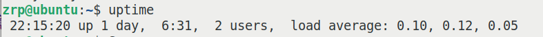
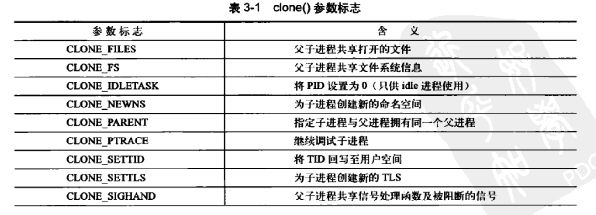
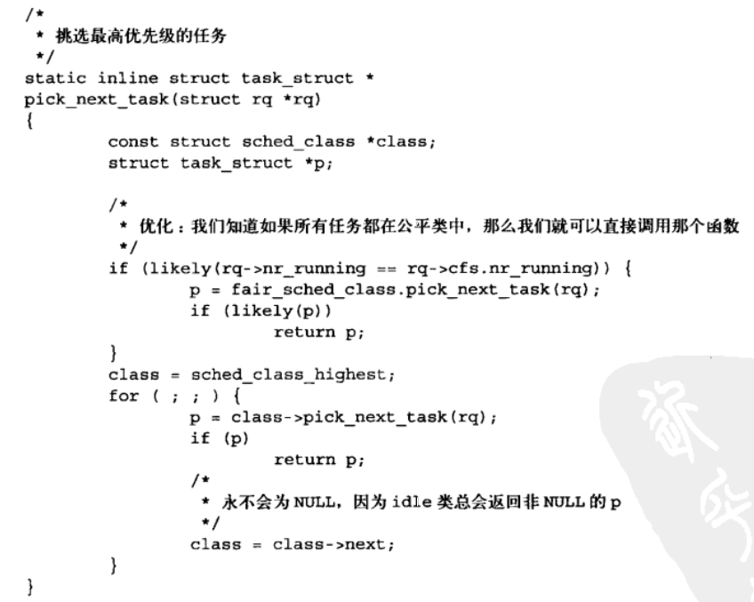
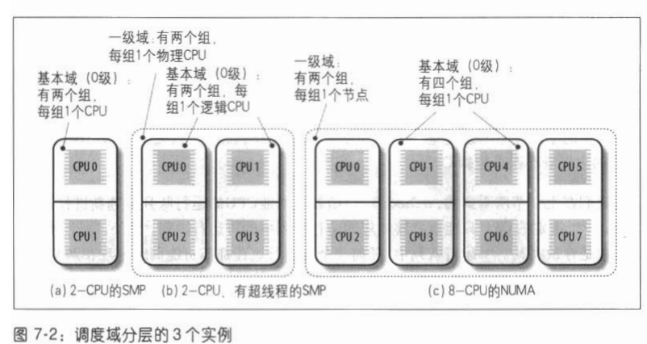

## 传统CPU监测工具学习：

#### 1. proc文件系统的构成--进程信息

man proc

| 路径              | 描述                                                         |
| ----------------- | ------------------------------------------------------------ |
| /proc/PID/cmdline | 启动进程的命令行                                             |
| /proc/PID/cwd     | 进程工作目录的**符号链接**                                   |
| /proc/PID/environ | 影响进程运行的环境变量的名称和值(**初始时的**环境)           |
| /proc/PID/exe     | 最初的可执行文件的**符号链接**（有些可能会不存在）           |
| /proc/PID/fd      | 目录，保存打开的文件描述符的符号链接（文件描述符以数字的形式标识） |
| /proc/PID/fdinfo  | 存储文件描述符的内容。以/proc/12015/fdinfo/4为例，文本中含有3个字段： **pos**: 文件的偏移offset；**flags**: 文件的打开模式；**mnt_id**: 此文件的挂载点 |
| /proc/PID/status  | 包含进程的基本信息，包括运行状态、内存使用                   |
| /proc/PID/task    | 目录，包含了**硬链接**到该进程启动的所有任务（指向那个任务的/proc文件系统） |
| /proc/PID/maps    | 文本文件，包含内存映射文件与块的信息                         |
| /proc/PID/io      | 文本文件，存储进程IO的统计信息。包括rchar, wchar等等。       |

> 注：符号链接又称“软连接”，类似于windows里面的快捷方式。
>
> 使用 ln -s \<file\> \<link\> 可以创建符号链接
>
> 使用 file \<link\> 可以查询符号链接指向的文件

比如top就是循环扫描proc文件系统来获取进程信息的。

#### 2. proc文件系统——根目录信息

| 路径              | 描述                                                         |
| ----------------- | ------------------------------------------------------------ |
| /proc/self        | 当一个进程访问这个目录时，会进入到这个进程自己的进程信息目录 |
| /proc/thread-self | 对应/proc/self/task/[tid]                                    |

/proc/sys文件系统：相比proc更加结构化。

/proc/sys/kernel （内核调度的相关信息）

| 路径                     | 描述                                                         |
| ------------------------ | ------------------------------------------------------------ |
| ./pid_max                | 系统的最大进程数（最大进程号）                               |
| ./sched_child_runs_first | 标识fork()之后，子进程是否先执行（若为0，表示父进程先执行）  |
| ./sched_rr_timeslice_ms  | round-robin（时间片轮转）调度的最小时间片(ms)                |
| ./sched_rt_period_us     | 定义为满带宽下的调度周期（用于比较，没有具体含义），默认为1000_000（1s） |
| ./sched_rt_runtime_us    | 在**上一项**定义的基础上，定义在一个周期内可用于**实时进程和限期进程**的时间，默认为950_000，表示一个周期内**最少5%时间**可用于运行**普通进程**。为-1表示不为普通进程留下任何时间。 |

#### 2. uptime命令

查看**系统**（而不是CPU）在一段时间内的负载，如：



第一个数值是**当前的时间**;

第二个数值是**自开机以来系统运行的总时间**；

第三个数值表示**登录的用户数**；（取自/var/run/utmp）

最后显示平均的负载，分别是最近1min，5min和15min内的平均负载。

**平均负载**：处于**可运行状态**（正在运行和等待被运行）或**不可被打断阻塞状态**的**平均进程数。**其并不是简单的数学均值，而是按指数衰减的累加值。（具体资料较为复杂）

**注意**：如果CPU有多个核，负载的数值并不会除以总CPU的核数，所以数值可能会大于1。一般如果负载大于CPU核数，说明CPU的负载较重。

uptime命令的数据取自 /proc/loadavg


loadavg文件的前三个数即为1min, 5min, 15min内的负载值；第四个数由 / 分开，前面的数表示当前处于 **可运行状态** 的任务数，后面的数表示内核调度的总任务数。第五个数（最后一个）表示最近创建的进程的pid（最新的一个进程）。

#### 3. mpstat

mpstat命令可按照CPU核的分类来输出每个核的指标。


其中在每个核的指标中：

**usr**: 表示CPU运行在user（用户模式）下的占用率。

**nice**: 表示在用户模式下运行nice优先级所占用的**CPU时间比例**。

**sys**：表示运行在内核状态下的CPU占用率。（不包括处理软中断和硬中断的时间）

**iowait**: CPU**因为等待磁盘IO请求而空闲**的时间占比。

**irq**：CPU处理硬中断的时间占比。

**soft**: CPU处理软中断的时间占比。

**steal**：CPU的hypervisor(管理层)在将CPU核资源用于虚拟CPU处理器时程序发生的**无意识等待时间**占比。


**guest**: CPU运行**虚拟处理器**的时间占比。

**gnice**：CPU运行一个**拥有nice优先级的虚拟处理器**的时间占比。

**idle**：CPU处于空闲模式，且CPU没有未完成的IO请求（完全空闲）的时间占比。

#### 4. ps命令

示例：ps -eo state,uid,pid,ppid,rtprio,time,comm

作用：按照上面的**表项定义**挨个显示系统中所有进程的信息

​	**ppid**: Process ID of the parent process (父进程PID)

​	**state**：进程的状态。


​	**uid**：用户的ID。

​	**time**: CPU使用时间。

​	**comm**: 进程的命令行。（可认为是进程名）

​	**class**：进程的调度类类型。


#### 4. cpustat命令

cpustat按照一定的时间间隔显示**长期在CPU上执行的进程的执行信息**。相比于top命令，该命令不关注那些只占用很短时间的进程，因此运行cpustat对CPU整体负载的影响较小，常用于**嵌入式设备上**进程执行信息的观测。


## 进程和线程概念的理解：

#### 1. 什么是进程和线程？

进程是**资源分配**的基本单位（内存映射、打开的文件、设备访问、锁等）；

而线程是**内核调度的基本单位**。

linux中的fork() 是通过**clone()**系统调用通过**一系列不同的参数组合**而成的。fork的参数是——。常用的参数如下：



#### 2. 进程的状态：

**TASK_RUNNING**: 进程时可执行的。或者正在执行，或者在运行队列中等待。

**TASK_INTERRUPTIBLE**: 可中断。进程正在睡眠（也就是说被阻塞），等待某些条件的达成。一旦这些条件达成，内核就会把进程设置成可执行。并且如果接收到信号，它们可被提前唤醒并随时准备投入运行。

**TASK_UNINTERRUPTIBLE**：不可中断。同**可中断**，进程正在睡眠，等待某些条件的达成，一旦条件达成，内核就会把进程设置为可执行。但是，这些进程在接收到信号不会被唤醒。

**\__TASK\_STOPPED**: 进程停止执行。（通常在进程接收到SIGSTOP，SIGTSTP、SIGTTIN等**信号**时发生）


#### 3. 用户进程**有关调度的系统调用**：

* nice()
* getpriority(), setpriority()
* sched_setscheduler(), sched_getscheduler()
* sched_yield()
* ......

#### 4. **调度算法**（调度类）

* SCHED_OTHER  普通进程调度算法（2.6版本至今是CFS）
* SCHED_FIFO  先进先出调度，非抢占式
* SCHED_RR  时间片轮转，抢占式
* SCHED_BATCH
* SCHED_ISO
* SCHED_IDLE
* SCHED_DEADLINE  限期调度，保证每个进程都能在指定周期内执行一次

**调度过程**：linux为每个CPU维护一个调度队列，先按照优先级循环扫描各个调度类，若有能够调度的进程，就执行；没有就跳过，检查下一个调度类。

## Linux完全公平调度CFS：

源码位置：kernel/sched/fair.c

CFS解决了Unix传统调度所面临的几个问题。CFS摒弃了使用**时间片**的调度思路，而是分配给进程一个处理器使用比重。通过这种方式，CFS确保了进程调度中能有**恒定的公平性**，而将切换频率置于不断变动中。

#### 1. nice值：

nice值可理解为一个进程对其他进程的”友好“程度。nice值越大，其自身**所占用的CPU运行时间越少**，与优先级相反。

在CFS中，任何进程所获得的处理器事件是由它自己和其他所有可运行进程**nice值的相对差值**决定的。nice值对时间片的作用不再是算数加权，而是**几何加权**。

#### 2. 调度器实体结构：

用于维护每个进程运行的时间记账。


update_curr()函数周期性调用，用于更新当前进程的虚拟运行时间vruntime。这个运行时间是根据nice值和可运行进程总数加权的。

#### 3. 进程选择

CFS试图利用一个简单的规则来均衡进程的虚拟运行时间：选择具有最小vruntime的可执行任务，然后执行。

由于IO密集型程序每次被唤醒后一小段时间又会进入阻塞状态，因此**IO密集型程序**按优先级所应当分配的虚拟运行时间永远不能平分，所以其虚拟运行时间是最小的，因此一旦有IO密集型程序就绪，**CFS会立即调度其执行**。

调度器的主要入口点是**schedule()**。其主要任务是以优先级为顺序，从高到低，依次检查每一个调度类，并且从**最高优先级的调度类**（比如说CFS调度类）中，选择最高优先级的进程。



```c
static inline struct task_struct *
pick_next_task(struct rq *rq)
{
	const struct sched_class *class;
	struct task_struct *p;

	/*
	 * Optimization: we know that if all tasks are in
	 * the fair class we can call that function directly:
	 */
	if (likely(rq->nr_running == rq->cfs.nr_running)) {
		p = fair_sched_class.pick_next_task(rq);
		if (likely(p))
			return p;
	}

	class = sched_class_highest;
	for ( ; ; ) {
		p = class->pick_next_task(rq);
		if (p)
			return p;
		/*
		 * Will never be NULL as the idle class always
		 * returns a non-NULL p:
		 */
		class = class->next;
	}
}
```

#### 4. SMP处理机上CPU负载的平衡

**调度域**：实际上是一个CPU集合，他们的工作量应当由内核保持平衡。一般来说，调度域采用**分层**的组织形式：最上层的调度域（通常包括系统中的所有CPU）包含多个**子调度域**，每个子调度域包含一个**CPU的子集**。

**调度域的工作量平衡**：每个调度域依次被划分为1~多个组，每个组代表调度域的一个CPU子集（**子调度域**）。工作量的平衡总是在调度域的组之间完成。只有某一个组的工作量远远低于同一个调度域另一个组的工作量时，才把进程从1个CPU迁移到另一个CPU。

**现代计算机的调度域**：在现代计算机结构中，CPU层级自底向上可划分为：**同一个CPU核的不同超线程**、**同一个CPU的对称多核**、**NUMA节点中有专属内存的CPU**。且从迁移的成本来说成本逐渐升高。其组织结构如下所示：



##### 4.1 rebalance_tick() 函数

为了保持系统中运行队列的平衡，每**经过一个时钟节拍**，schedule_tick()就调用rebalance_tick()函数。它接收的参数有：

* 本地CPU的下标this_cpu
* 本地运行队列的地址this_rq
* 标志idle，可取SCHED_IDLE, NOT_IDLE（表示当前CPU是否空闲）

**任务**：根据是否idle，决定调用load_balance的时间间隔。idle时频率高，not_idle时频率低。其原理是在内部保存时钟计数，当计数到达指定数值时，就调用load_balance。调用load_balance的过程是自底(基本的调度域)向上的。

##### 4.2 load_balance() 函数

检查调度域是否平衡，如不平衡，就尝试迁移进程。

接收参数：

* this_cpu
* this_rq
* sd （指向被检查的调度域）
* idle

过程：（忽略掉繁琐的获取锁和释放锁的步骤）

1. 调用find_busiest_group() 函数分析调度域中各组的工作量，返回最繁忙的组的描述符sched_group.
2. 调用find_busiest_queue() 函数查找上面最繁忙组里的最繁忙CPU，返回其运行队列busiest。
3. 调用move_tasks(), 尝试从busiest中把一些进程迁移到本地运行队列this_rq中。

##### 4.3 move_tasks() 函数

move_tasks()函数把源运行队列迁移到本地运行队列，接收的参数：

* this_rq, this_cpu
* busiest
* max_nr_move （被迁移进程的最大数）
* sd（发生的调度域的描述符）
* idle

过程：扫描busiest队列的**过期进程**和**活动进程**，从优先级高的进程开始（必须符合若干条件），然后使用pull_task() 将进程迁移到本地运行队列。如果刚被迁移的进程比当前进程有更高的动态优先级，则调用resched_task() 抢占本地CPU的当前进程。

## 安装Perf

1. 在terminal输入如下命令，安装**与当前内核版本一致的**工具

   sudo apt-get install linux-tools-common
   sudo apt-get install linux-tools-"$(uname -r)"
   sudo apt-get install linux-cloud-tools-"$(uname -r)"
   sudo apt-get install linux-tools-generic
   sudo apt-get install linux-cloud-tools-generic

2. 出现的问题：

   ubuntu**国内源**未包含最新（或较新的）的linux-tools包，所以安装时记得切换回原来的**ubuntu默认源**，然后输入sudo apt update更新源的软件列表。

llcstat-bpfcc会区分是否是虚拟机还是真机。如果是虚拟机的话会加载不出来，所以需要安装在真机上。

## 参考文献：

man sched

man proc

man cpustat

《Linux内核设计与实现原书第三版》

《深入理解linux内核第三版》

《BPF之巅：洞悉linux系统和应用性能》
