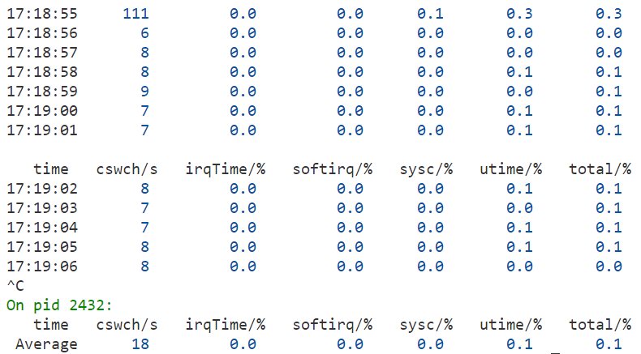
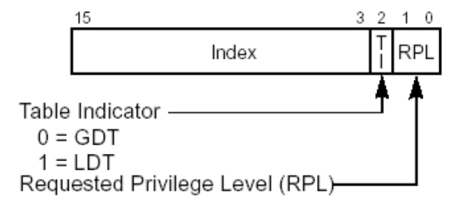

### BCC_sar Tutorial

BCC_sar是一个**基于eBPF的**按照指定时间间隔（默认为1s）来统计**特定事件发生次数**和**特定事件占用CPU时间**的工具。使用它可以帮助您查看**事件发生速率**和**CPU资源利用率**，并提供**CPU负载画像**以剖析负载的来源及其占用比例。

与传统工具相比，BCC_sar可提供更为细致的指标，如：

* 可把内核态时间剖析为**内核线程执行时间**和进程**系统调用时间**
* 部分linux发行版可能由于内核编译选项确实而不能记录**irq时间**，本工具可以弥补这一缺陷，并且不需要对内核做出任何更改，可动态检测
* 可附加到**指定进程上**，对该进程占用的CPU资源进行实时监测

#### 1. 概览

* 显示帮助信息：

```shell
sudo python3 sar.py -h
```


* 显示各事件（包括irqTime, softirq, idle, ...）的占用时间:

```shell
sudo python3 sar.py
```


注意：

1. 事件的统计方式是对每个CPU分开统计然后加和的，因此有的项的占用时间可能超过1s。所有事件占用时间的和应当为1s * 总CPU核数。

2. 由于技术问题，输出的第一项可能偏差较大，可以不予理会。

3. 按Ctrl+C本程序将停止统计，并输出在程序运行的时间段内各表项的平均值。

   

* 按照2s的采样频率显示各事件的CPU占用率：

数据是带颜色的，蓝色表示CPU占比小于30%，绿色表示占比大于30%小于60%，红色表示占比大于60%.

```shell
sudo python3 sar.py -i 2 -t percent
```


* 将监测器绑定到pid为2432的进程上：

```shell
sudo python3 sar.py -p 2432 -t percent
```



#### 2. 工具准确性分析

将各个指标与标准工具进行比较，得出其差值所占比例（误差）。

测量方式是**连续执行60s**，对平均值进行比较。

执行几种任务：

* 静态
* stress --cpu 1
* dd if=/dev/sda of=/dev/null (访问固态硬盘)
* dd if=/dev/sdb of=/dev/null (访问慢速U盘)
* cd / && grep 13222443 -r *(IO与CPU兼具)

1. 静态

| 指标    | 传统工具 | 传统工具数值 | BCC_sar | 误差         |
| ------- | -------- | ------------ | ------- | ------------ |
| proc/s  | sar -q 1 | 10.85        | 10      | -8.4%        |
| cswch/s | sar -q 1 | 425.23       | 431     | 1.3%         |
| runqlen | vmstat   | -            | -       | 基本一致     |
| irqTime | mpstat 1 | 0            | 0       | mpstat不准确 |
| softIrq | mpstat 1 | 0.05         | 0.1     | 0.05         |
| idle    | mpstat 1 | 98.52        | 96.9    | -1.62        |
| utime   | mpstat 1 | 0.23         | 0.5     | 0.27         |
| sys     | mpstat 1 | 1.18         | 0.4     | -0.78        |

误差为正数，表示: BCC_sar测得值 > 传统工具

误差为负数，表示: BCC_sar测得值 < 传统工具

**产生误差的主要原因包括**：

* BPF记录时间的问题，导致时间统计存在不可避免的误差。比如在计算softirq时，BCC_sar计算的是softirq起始两个tracepoint之间的时间差，而sar计算的是从softirq处理流程时，到softirq处理结束，在这段时间内，包括了两个BPF探针，所以**sar的统计值会比BCC_sar多出BPF的执行时间**。

* 某些数值传统工具没有记录，如irq，导致数值存在偏差

**传统工具的原理**：

定时采样，将采样时的状态算作此次采样到上次采样期间的状态，统计到最终的时间内

**平均BPF执行次数**：4695

由ftrace统计可知，每个BPF探针的执行时间大概在1.5us~6us之间，在us量级。取中值 **3us**，算得BPF执行时间大概占总CPU时间的 **0.7%**.

2. stress --cpu 1

| 指标    | 传统工具 | 传统工具数值 | BCC_sar | 误差         |
| ------- | -------- | ------------ | ------- | ------------ |
| proc/s  | sar -q 1 | 9.49         | 8       | -15.7%       |
| cswch/s | sar -q 1 | 408.85       | 415     | 1.5%         |
| runqlen | vmstat   | -            | -       | 基本一致     |
| irqTime | mpstat 1 | 0            | 0       | mpstat不准确 |
| softIrq | mpstat 1 | 0.28         | 0.2     | -0.08        |
| idle    | mpstat 1 | 48.78        | 48.7    | -1.6%        |
| utime   | mpstat 1 | 50.23        | 50      | -0.46%       |
| sys     | mpstat 1 | 0.71         | -0.1    | -0.81        |

**备注**：

* stress是典型的以usr时间为主的负载类型（甚至可能全部运行时间都是usr类型）

* 上面可知，sys项为-0.1，表示计算中可能存在问题。但实际情况中sys时间占比其实很少，故可以先不关注。

**平均BPF执行次数**：4286

**BPF执行CPU时间占比**：0.64%

3. dd if=/dev/sda of=/dev/null (访问固态硬盘)

| 指标    | 传统工具 | 传统工具数值 | BCC_sar | 误差         |
| ------- | -------- | ------------ | ------- | ------------ |
| proc/s  | sar -q 1 | 10.06        | 9       | -10.5%       |
| cswch/s | sar -q 1 | 1924.33      | 1911    | -0.69%       |
| runqlen | vmstat   | -            | -       | 基本一致     |
| irqTime | mpstat 1 | 0            | 1.0     | mpstat不准确 |
| softIrq | mpstat 1 | 0.51         | 1.0     | 0.49         |
| idle    | mpstat 1 | 43.63        | 44.8    | 2.7%         |
| utime   | mpstat 1 | 4.14         | 6.6     | 59.4         |
| sys     | mpstat 1 | 50.50        | 47.0    | -6.9%        |

* dd是典型的以内核态执行时间为主的进程
* dd属于连续性的硬盘读写，每次读写的量大，因此消耗的irq次数偏少
* 由于sda是固态硬盘，读写迅速，传输数据量大，主要的IO时间是数据拷贝而不是irq
* irq次数与其对应的BPF探针执行次数多，因此会占用比较多的CPU时间，因而导致误差

**平均BPF执行次数**：31163

**BPF执行CPU时间占比**：4.6%

4. dd if=/dev/sdb of=/dev/null (访问慢速U盘)

| 指标    | 传统工具 | 传统工具数值      | BCC_sar | 误差         |
| ------- | -------- | ----------------- | ------- | ------------ |
| proc/s  | sar -q 1 | 10.22             | 9       | -11.9%       |
| cswch/s | sar -q 1 | 3735.03           | 3768    | 0.88%        |
| runqlen | vmstat   | -                 | -       | 基本一致     |
| irqTime | mpstat 1 | 0                 | 0.9     | mpstat不准确 |
| softIrq | mpstat 1 | 1.69              | 0.9     | -0.79        |
| idle    | mpstat 1 | 94.8(idle+iowait) | 93.8    | -1%          |
| utime   | mpstat 1 | 0.42              | 1.0     | 0.58         |
| sys     | mpstat 1 | 3.10              | 7.3     | 4.2          |

* sdb是慢速U盘，读取慢，irq频率低，CPU大部分时间花费在等待设备的irq响应上。传统工具显示dd if=/dev/sdb的iowait高达46.48%，系统复制数据的时间较短(3.1%~7.3%)。

**平均BPF执行次数**：27620

**BPF执行CPU时间占比**：4.1%

5. cd / && grep 13222443 -r *

| 指标    | 传统工具 | 传统工具数值        | BCC_sar | 误差         |
| ------- | -------- | ------------------- | ------- | ------------ |
| proc/s  | sar -q 1 | 9.62                | 10      | 3.9%         |
| cswch/s | sar -q 1 | 8022.93             | 7643    | -4.7%        |
| runqlen | vmstat   | -                   | -       | 基本一致     |
| irqTime | mpstat 1 | 0                   | 2.6     | mpstat不准确 |
| softIrq | mpstat 1 | 15.56               | 1.8     | -13.76       |
| idle    | mpstat 1 | 62.83 (idle+iowait) | 73.5    | 17.0%        |
| utime   | mpstat 1 | 3.2                 | 9.1     | 5.9          |
| sys     | mpstat 1 | 18.41               | 19.6    | 6.5%         |

* grep 13222443 -r *读取了几乎所有文件（除了没有权限的），同时做了目录结构查询和文件内容读取两种操作，在读取时对文件内容进行了检索，在此过程中消耗CPU。
* 在目录查询和文件读取过程中，大多数的磁盘访问是较小的磁盘访问请求，所以**对磁盘的irq访问次数较多**。
* 此过程**CPU和IO的使用量大体相当**，可模拟现实中的业务高负载场景，如数据库查询等。

* softirq值的差距较大，需要好好检查一下问题所在。

**平均BPF执行次数**：43866

**BPF执行CPU时间占比**：6.6%


**总结**：

1. BPF测量时间方法的问题：

   * 难以获得准确的状态转变时机
   * BPF占用的时间难以统计。若发生的事件时间短，BPF占用的时间也被统计为对应的时间，时间量级相当甚至略大，导致统计数值存在难以避免的误差。

2. 优化目标：

   减少BPF探针数目（改变测量方式），更细地梳理内核的运行原理等


### 更新说明 2022/8/27

#### 1. 旧的BPF测量方法的问题

1. 目前，测量系统态和用户态时间的机制存在问题，测量到的数据中，usr时间的占比偏高。经过研究发现是由于eBPF本身的执行需要时间，当syscall频率很高且每一个syscall的占用时间较低时，eBPF探针的执行时间与syscall执行时间量级接近，每一次计算始末时间都会积攒一个误差，误差累积就会导致数据不准。具体地，偏移方向是向着用户态偏移。

2. 下图描述了一个syscall过程的时间划分：

   

3. 事实上**这一整段**都需要被计入到syscall中，但是由于eBPF中记录时间一定要调用bpf_ktime_get_ns()和对map的读取更新函数，因此，对时间的记录**永远不可能做到绝对的准确**，具体来说，用eBPF记录的syscall时间永远比实际的少。又因为对用户时间的记录又依赖于syscall的起止插桩点，因此用户时间永远比实际的多。偏差的部分主要有**插桩点的偏差**（我们永远不能找到最接近转换时机的插桩点）和**bpf程序的执行时间偏差**（时间的记录本身就花费时间，且bpf不能获取自己的执行时间）。因此bpf在现阶段基本不能做到对时间的及其精准的统计，尤其不能用于细粒度的时间过程。

4. 基于此，我认为目前bpf准确时间统计的适用场景应该在**低频率、且对时长统计不敏感**的领域。在时间统计方面，相较于传统工具的时间统计，它更擅长**对时刻的记录**。

5. 旧的测量方法对应的程序在BCC_sar/legacy，与他同目录下的readme.md文档记录了它存在的问题。

#### 2. 新的BPF测量方法

我们可以不监测每一个syscall的起止时刻，而是按一定的采样频率去采样当前系统处于什么状态。在内核态，我们可以用user_mode()函数获取到当前是用户态还是内核态。在BPF中，我们同样可以这么做，因为这个函数默认只使用了pt_regs结构体。其定义如下：

```c
/*
 * user_mode(regs) determines whether a register set came from user
 * mode.  On x86_32, this is true if V8086 mode was enabled OR if the
 * register set was from protected mode with RPL-3 CS value.  This
 * tricky test checks that with one comparison.
 *
 * On x86_64, vm86 mode is mercifully nonexistent, and we don't need
 * the extra check.
 */
static __always_inline int user_mode(struct pt_regs *regs)
{
#ifdef CONFIG_X86_32
	return ((regs->cs & SEGMENT_RPL_MASK) | (regs->flags & X86_VM_MASK)) >= USER_RPL;
#else
	return !!(regs->cs & 3);
#endif
}
```

**原理**：在x86_64状态下，cs寄存器是代码段的**段选择子**，只要查看其中的RPL值（RPL：请求特权等级），便可知道其来自哪一个特权级。



x86 CPU的特权级有4个，为0~3，0最高，通常由操作系统使用，3最低，由普通的用户态程序使用。2~3的特权级一般用于驱动程序。

所以，若RPL为0，则是来自内核态，若不为0（可为1~3），则是来自用户态。

我们不需要引入额外的头文件，直接使用user_mode()函数即可，因为BCC包含了其所在的头文件arch/x86/include/asm/ptrace.h。事实上，BCC默认包含了几乎所有的必要内核头文件。

注：**bcc**默认引入的头文件貌似包含内核源码中所有的头文件，包括体系结构头文件arch/x86/include/asm/ptrace.h。后续需要进一步调查bcc自动引入的头文件种类。
