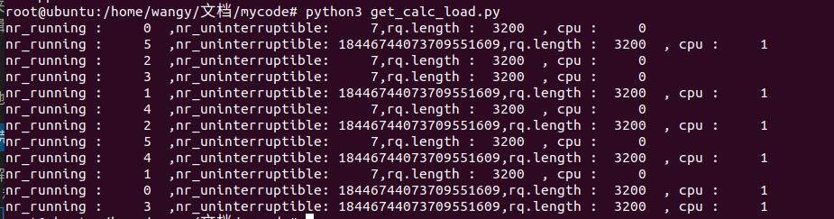
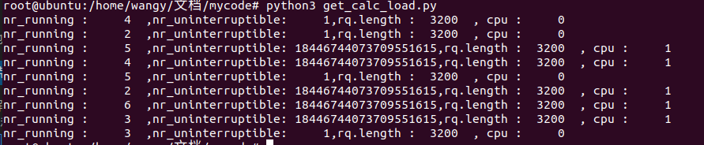
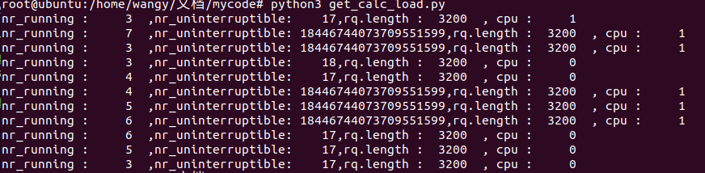

## 平均负载计算

关于负载的计算，它的结果是包含有小数的一个浮点数，内核中是不能使用float变量的，那么这里就采用了一个整型变量的低11位来表示小数部分。那么对于数值1来说，它就是FIXED_1，也就是需要对1进行左移11bit。实际上此时这个整型变量保存的值是1024。

```
cat /proc/loadavg
0.43 0.58 0.65 5/7010 45102
```

我们通过cat命令查看负载值如上所示，它显示的是带有两个小数表示的一个浮点数，所以最后在输出这个数值时还需要做一个转换，如果从1024个值中得出这100小数部分，实际上也很简单，小学生都会计算，公式如下：

```
小数部分 = 低11位的值 / 1024  * 100
```

内核中为了实现这个功能定义了一些宏如下所示：

```
#define FSHIFT      11      /* nr of bits of precision */
#define FIXED_1     (1<<FSHIFT) /* 1.0 as fixed-point */
#define LOAD_FREQ   (5*HZ+1)    /* 5 sec intervals */
#define EXP_1       1884        /* 1/exp(5sec/1min) as fixed-point */
#define EXP_5       2014        /* 1/exp(5sec/5min) */
#define EXP_15      2037        /* 1/exp(5sec/15min) */
```

系统负载这个指标表示的是系统中当前正在运行的进程数量，它等于running状态的进程数 + uninterrupt状态的进程数：

```
load = runing tasks num + uninterrupt tasks num
```

问题来了，这个值一直都是动态变化的每秒钟都不一样，如果我们仅仅是要求平均值，那么能够想到的比较容易算的方式，假如以5秒为采样单位，然后每次计算都累加在一起，最后除以采样次数，这样就获取到了一个平均负载值。

这样计算有一个缺点，就是我们获取到的负载值实际上并不能反应当下系统中的负载情况，因为它计算了从系统启动开始以来的平均值，无法反应当下系统的运行情况，因此系统中实际并不是这样计算的，会求最近1min，5min和15min之内的平均值，那么计算方法是怎样的呢？

对于平均算法来说有很多种实现，比如：
*（1）可以使用所有数据相加后处于数据个数，缺点是实时性不够好；*
*（2）也可以去除过时数据，只保存最近的多个数据做加权平均。*

前面已经介绍了第一种方式的实现缺点，那么根据平均负载的需求来看，应该要使用第2种方法才行，每次计算时需要丢弃掉1min、5min、和15min之前的数据，记录最近的数据来计算平均值，但是这种算法依然不够好，它维护的数据太多了。

因此内核采用了另外一种维护数据量更少的算法，**一次指数平滑法**，内核在实现时引入了一个衰减系数（小于1的值），利用这个衰减系数，来达到丢弃旧数据的目的。只需要知道衰减因子、上一次计算的平均值、本次采样的值，这三个就可以计算出最新的平均值了。主要原理就是使用一个小数作为衰减系数e，从开始计算的时刻a0开始，不做衰减，那么存在如下公式：

```
a1 = a0 * e + a * (1 - e)
a2 = a1 * e + a * (1 - e)
a3 = a2 * e + a * (1 - e)
an = an-1 * e + a * (1 - e)
```

通过这种方法反复计算，那么很久远的采样数据就在当前的计算结果中无限趋近于0了。

内核中的代码实现：

```c
//linux2.6.36/kernel/sched.c
/*
 * calc_load - update the avenrun load estimates 10 ticks after the
 * CPUs have updated calc_load_tasks.
 */
void calc_global_load(void)
{
	unsigned long upd = calc_load_update + 10;
	long active;

	if (time_before(jiffies, upd))
		return;

	active = atomic_long_read(&calc_load_tasks);
	active = active > 0 ? active * FIXED_1 : 0;

	avenrun[0] = calc_load(avenrun[0], EXP_1, active);
	avenrun[1] = calc_load(avenrun[1], EXP_5, active);
	avenrun[2] = calc_load(avenrun[2], EXP_15, active);

	calc_load_update += LOAD_FREQ;
}
```

```c
//linux4.19/kernel/sched/loadavg.c
/*
 * calc_load - update the avenrun load estimates 10 ticks after the
 * CPUs have updated calc_load_tasks.
 *
 * Called from the global timer code.
 */
void calc_global_load(unsigned long ticks)
{
	unsigned long sample_window;
	long active, delta;

	sample_window = READ_ONCE(calc_load_update);
	if (time_before(jiffies, sample_window + 10))
		return;

	/*
	 * Fold the 'old' NO_HZ-delta to include all NO_HZ CPUs.
	 */
	delta = calc_load_nohz_fold();
	if (delta)
		atomic_long_add(delta, &calc_load_tasks);

	active = atomic_long_read(&calc_load_tasks);
	active = active > 0 ? active * FIXED_1 : 0;

	avenrun[0] = calc_load(avenrun[0], EXP_1, active);
	avenrun[1] = calc_load(avenrun[1], EXP_5, active);
	avenrun[2] = calc_load(avenrun[2], EXP_15, active);

	WRITE_ONCE(calc_load_update, sample_window + LOAD_FREQ);

	/*
	 * In case we went to NO_HZ for multiple LOAD_FREQ intervals
	 * catch up in bulk.
	 */
	calc_global_nohz();
}
```

其中：

1.calc_load_tasks就是上面介绍时所说的runnable进程数量和uninterruptable进程数量之和。因为是SMP系统可能涉及到同步问题，因此采用atomic原子变量来保存。
2.calc_load_update为下次采样时间，每次都需要加5*HZ，因此系统每5秒进行一次更新计算3.avenrun数组中保存的是1min，5min，15min时间所计算的平均值，实际上就是通过调整衰减因子来达到目的的，衰减因子越小，那么衰减越快。

在calc_load中进行一次指数平滑算法的计算：

```c
//linux2.6.36/kernel/sched.c
static unsigned long
calc_load(unsigned long load, unsigned long exp, unsigned long active)
{
	load *= exp;
	load += active * (FIXED_1 - exp);
	return load >> FSHIFT;
}
```

而更新平均负载是在一个系统周期timer中实现的：

```c
//linux2.6.36/kernel/timer.c
/*
 * The 64-bit jiffies value is not atomic - you MUST NOT read it
 * without sampling the sequence number in xtime_lock.
 * jiffies is defined in the linker script...
 */

void do_timer(unsigned long ticks)
{
	jiffies_64 += ticks;
	update_wall_time();
	calc_global_load();
}
```

```c
//linux4.19/kernel/time/timekeeping.c
/*
 * Must hold jiffies_lock
 */
void do_timer(unsigned long ticks)
{
	jiffies_64 += ticks;
	calc_global_load(ticks);
}
```

计算 `calc_load_tasks` 的地方:

```c
calc_load_fold_idle()                                       //CPU进入nohz之前会把数据进行保存
calc_load_migrate()-->calc_load_fold_active()               //CPU hotplug时，如果下线CPU需要做记录保存，加入最后更新时计算
calc_load_account_active()-->calc_load_fold_active()        //CPU没有idle，那么会执行定期更新，在每个CPU都会执行这个计算

```

在计算负载时：
1.每个CPU都需要定时更新 calc_load_tasks的数值，该值记录的是所有CPU上可运行和uninterruptable数量的总和（**calc_load_account_active**）

```c
long calc_load_fold_active(struct rq *this_rq, long adjust)
{
	long nr_active, delta = 0;

	nr_active = this_rq->nr_running - adjust;
	nr_active += (long)this_rq->nr_uninterruptible;

	if (nr_active != this_rq->calc_load_active) {
		delta = nr_active - this_rq->calc_load_active;
		this_rq->calc_load_active = nr_active;
	}

	return delta;
}
```

2.处理idle的情况，进入idle前需要保存（calc_load_fold_idle）
3.处理CPUhotplug情况，下线前需要保存值(calc_load_migrate)

最后根据calc_load_tasks执行一次global平均值计算：

1.timer中触发5HZ周期的平均值计算（calc_global_load）

# 采集数据

挂载点是update_rq_clock，下图是在内核rq中取出的nr_running，nr_uninterruptible和cpu的值，观察取出的值可以看出，nr_running的值没有问题，nr_uninterruptible的值在不同的CPU上不同，甚至出现了18446744073709551615这种大数。


再取几次，还是同样的问题






那么为什么会出现这种问题，在内核中寻找可以修改nr_uninterruptible的代码

```c
#define task_contributes_to_load(task)	\
				((task->state & TASK_UNINTERRUPTIBLE) != 0 && \
				 (task->flags & PF_FROZEN) == 0)
/kernel/sched/core.c
void activate_task(struct rq *rq, struct task_struct *p, int flags)
{
	if (task_contributes_to_load(p))
		rq->nr_uninterruptible--;

	enqueue_task(rq, p, flags);

	p->on_rq = TASK_ON_RQ_QUEUED;
}

void deactivate_task(struct rq *rq, struct task_struct *p, int flags)
{
	p->on_rq = (flags & DEQUEUE_SLEEP) ? 0 : TASK_ON_RQ_MIGRATING;

	if (task_contributes_to_load(p))
		rq->nr_uninterruptible++;

	dequeue_task(rq, p, flags);
}

static void
ttwu_do_activate(struct rq *rq, struct task_struct *p, int wake_flags,
		 struct rq_flags *rf)
{
	int en_flags = ENQUEUE_WAKEUP | ENQUEUE_NOCLOCK;

	lockdep_assert_held(&rq->lock);

#ifdef CONFIG_SMP
	if (p->sched_contributes_to_load)
		rq->nr_uninterruptible--;

	if (wake_flags & WF_MIGRATED)
		en_flags |= ENQUEUE_MIGRATED;
#endif

	activate_task(rq, p, en_flags);
	ttwu_do_wakeup(rq, p, wake_flags, rf);
}
```

一般来说，linux kernel 的task状态可以为TASK_RUNNING ,TASK_INTERRUPTIBLE(sleep), TASK_UNINTERRUPTIBLE(Deactivate Task,此时Task会从rq中移除)或TASK_STOPPED.透过这个变数会统计目前rq中有多少task属于TASK_UNINTERRUPTIBLE的状态。当呼叫函数active_task时，会把nr_uninterruptible值减一，并透过该函数enqueue_task把对应的task依据所在的scheduling class放在 对应的rq中，并把目前rq中nr_running值加一。

随后在查看内核源码过程中发现nr_uninterruptible上边有注释

```c
This is part of a global counter where only the total sum
	 * over all CPUs matters. A task can increase this counter on
	 * one CPU and if it got migrated afterwards it may decrease
	 * it on another CPU. Always updated under the runqueue lock:
```

在计算平均负载时也有说明

```c
/kernel/sched/loadavg.c
 *  - cpu_rq()->nr_uninterruptible isn't accurately tracked per-CPU because
 *    this would add another cross-CPU cacheline miss and atomic operation
 *    to the wakeup path. Instead we increment on whatever CPU the task ran
 *    when it went into uninterruptible state and decrement on whatever CPU
 *    did the wakeup. This means that only the sum of nr_uninterruptible over
 *    all CPUs yields the correct result.
```

当任务进入不可中断状态时，我们在任务运行的CPU上递增，在进行唤醒的CPU上递减。这意味着只有所有cpu上的nr_uninterruptible之和才能产生正确的结果。所以才会出现大数。使用vmstat验证




结果大致相同。


# 仍然存在的疑问

1.内核如何把不同的CPU的负载整合到一起，计算出平均负载

2.使用vmstat所显示的r（等待运行的进程数）和b（不可被唤醒的进程数量）与rq中的nr_running,nr_uninterruptible有何区别，vmstat如何实现r和b的读取