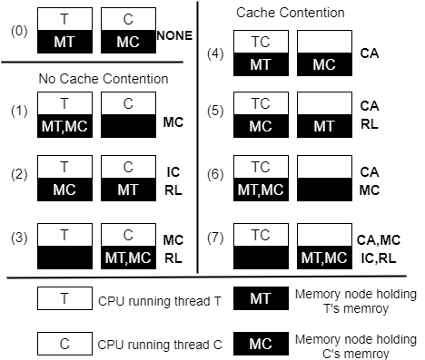
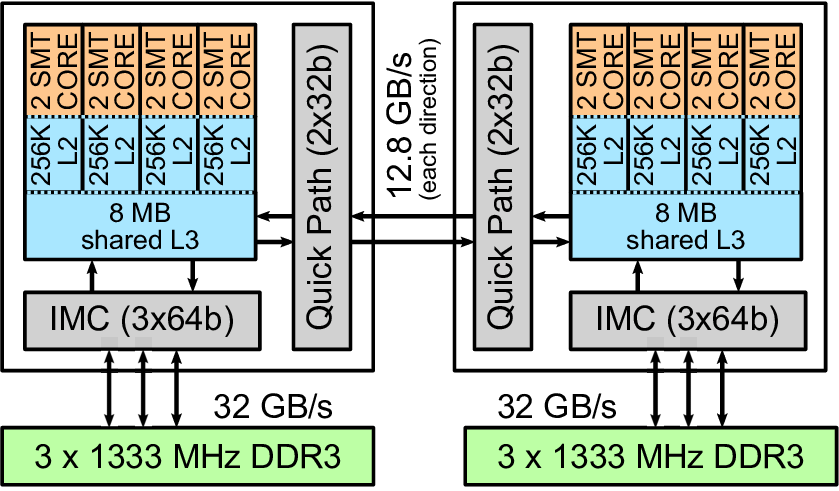
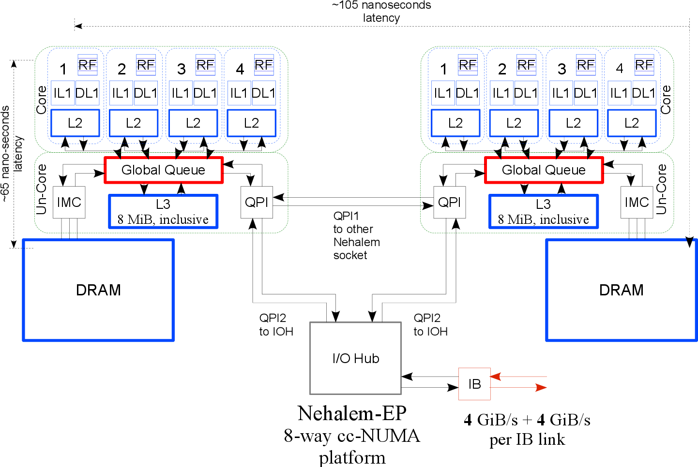
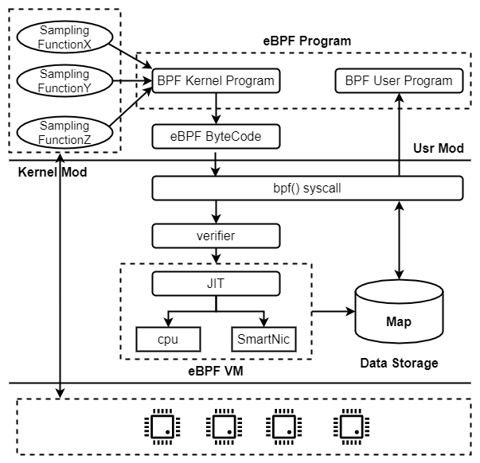
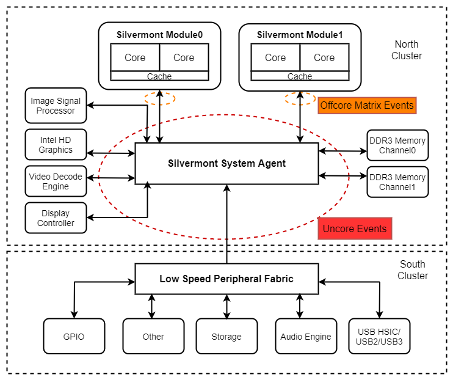
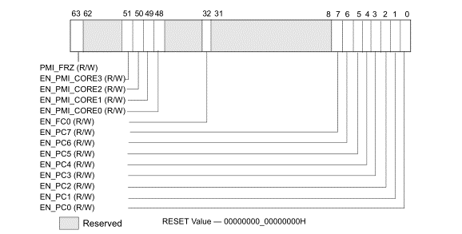
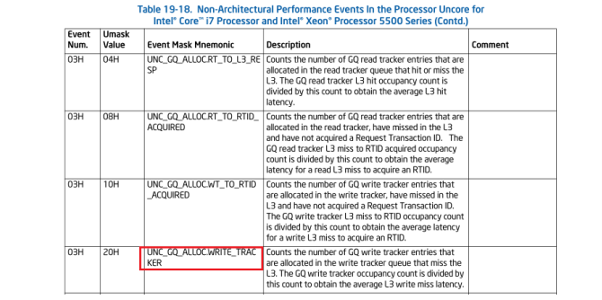
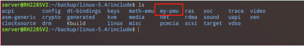
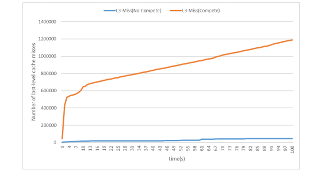

### NUMA 节点的 CPU Uncore 共享资源的争用感知

#### 一、NUMA 竞争感知框架设计

​		NUMA 竞争感知框架由 3 个主要的模块构成，包括硬件事件采样模块， eBPF 探测模块和竞争感知模块，如下图所示：


​		在框架层的底部，是硬件事件采样模块。在该模块中实现了内核采样函数库。采样函数库以静态方式编译到内核中。采样函数库中实现的接口可对 NUMA 节点中三种主要的共享资源进行动态采集，这需要在一个专用的加载器中调用这些接口。框架层的中间部分是 eBPF 探测模块，它是连接底层采样模块和用户层竞争感知调度模块的桥接层。eBPF 探测模块会跟踪所有类型的采样函数，并且转储采样函数的返回数据到内核中创建的 Hash Map 中。框架层最顶部是竞争感知模块，分析各个节点共享资源的负载，感知节点的资源竞争情况。

#### 二、NUMA 竞争感知框架的工作原理

NUMA 竞争感知框架的工作原理如下：

1. 在 Linux 内核中实现 my-PMU 库，设计多个控制 MSR(型号特定寄存器)的 API，包括初始化 MSR，配置性能事件 MSR，开启 MSR 计数器，并实现性能事件采样函数，采样函数通过读取处理器 PMU 的型号特定寄存器 MSRs，获取性能事件计数值，并将采样结
   果即性能事件计数值作为返回值返回。
2. 在内核模块中调用采样函数对指定的性能事件进行周期性采样。
3. eBPF 探测模块监测采样函数，接收采样函数返回的性能事件计数值并保存在 Map 中，并根据周期性采样结果更新 Map 中的值。
4. 用户态的线程重映射模块通过 Map 读取到性能事件计数值。    

#### 三、NUMA 共享资源竞争分析  

According to how threads and their memory are placed in NUMA nodes, the impact of performance degradation on multi-core NUMA systems can be quantified. In the modern NUMA architecture, there are four possible sources of performance degradation. The contention for sharing the last level of cache (CA), memory controller contention (MC), interconnection link contention (IC), and remote access latency (RL) . As shown in Figure 1, a quantitative method is used to show the contention of shared resources under the different placement of threads and memory.



When thread T and thread C run on two different nodes, and their memories belong to their respective nodes, there is no resource competition between T and C, such as (0). If C accesses memory across nodes, and its memory is on the same node as T's memory, contention for the memory controller will occur, such as (1). (2) It is shown that both T and C need to access memory across nodes, because their memory is in the remote node, and memory access needs to pass through the interconnection link. At this time, T and C have contention for the interconnection link. The remote access delay is also introduced. The situation shown in (3) is similar to (1). For thread T, it has an additional remote memory access delay. In the various situations discussed above, the thread position is not changed, but the memory position is moved, so T and C do not compete for the last-level cache.

Since the a chip multiprocessor (CMP) has multiple physical cores, multiple threads may run on different physical cores in the same socket at the same time. At this time, the shared last-level cache will also become a resource contention between the cores. As shown in (4), when T and C are scheduled to run in the same node, there will be contention for the last-level cache. When T needs to access memory across nodes, for thread T, in addition to the last-level cache contention, the delay overhead of remote access is also introduced, such as (5). When T and C run on the same node at the same time, and their memory is also in the same node, the last-level cache and memory controller will be the main competing resources, such as (6). (7) Shows the most serious contention for shared resources. T and C run on the same node at the same time, which creates contention for the last-level cache. In addition, the memory of T and C are all located in the remote node, and all memory accesses of T and C need to pass through the interconnection link and pass through the memory controller of the remote node. Therefore, the interconnection link and the memory controller are generated contention. At the same time, both T and C introduce the overhead of remote access delay.

#### 四、NUMA 内存访问控制流分析  

​		NUMA 系统的具体实现与平台相关， AMD 与 Intel 有着不同的实现，即使同一平台但不同型号处理器之间在实现上也会有差别。本项目所研究的平台为 Intel Nehalem 微架构。 Nehalem 微架构的 NUMA 系统拓扑结构如下图所示。  



​		Nehalem 微架构中每个 socket 内有 4 个物理核心，一个独立的集成内存控制器，两个 QPI 快速互连通道。 4 个物理核心共享一个 8M 的末级缓存。项目中所使用的处理器为 Xeon E5520，属于此架构的 Intel Xeon 5500 系列处理器。该系列处理器内部的架构如下图所示。  



​		NUMA 节点内共享的内存层次结构依次为末级缓存，内存控制器(IMC)，快速互连通道(QPI)。 在 core 的私有缓存(L1、 L2)失效以后，无论是对内存的读还是写，都需要先到达 全局队列 ( Global Queue, GQ ) 排队，读写请求会分成读队列和写队列。以读操作为例， GQ 会向次级缓存代理 LLC 发送一个 Cache Lookup 的信号以请求需要的 cache line，如果 LLC 命中，且满足缓存一致性，则直接将请求的 cache line 返回；如果 LLC 没有命中，则向 GQ 应答 cache miss 信号。接下来， GQ 发现次级缓存代理没有命中，于是会向所有的缓存代理发送 snoop 窥探信号。所有的缓存代理包括远程 socket 的次级缓存代理 LLC，主代理，和本地的主代理。接下来等待回复。回复可能会来自三个方向，最快的是来自远程 socket 中的 LLC(如果它恰好拥有请求的 cache line 且满足缓存一致性协议)；接下来可能是来自本地的主代理，即通过IMC(集成内存控制器)将请求的数据从内存返回；最差的情况是来自远程 socket 的主代理。

#### 五、eBPF 内核跟踪技术研究与应用  

​		NUMA 竞争感知框架在实现上借助 eBPF 机制建立起了内核态与用户态通信的桥梁。eBPF 机制可跟踪内核符号表中导出的内核函数，这为跟踪自定义的基于 PMU 的硬件性能事件采样函数提供了可能。 eBPF 在内核中实现了一个内置的虚拟机， eBPF 程序经过编译后会生成 BPF 字节码，这些字节码就是钩子函数。在钩子函数中可以构造处理逻辑。当目标函数被跟踪后，钩子函数的内部处理逻辑就会被虚拟机执行。   

​		本项目在 Linux 内核中实现了多种性能事件采样函数，这些采样函数通过 eBPF 的 kprobe 钩子进行探测，并通过 eBPF 的 Map 机制存储数据， eBPF 的用户态程序可通过系统调用的方式读取 Map。通过 eBPF 机制实现 NUMA 竞争感知框架的内核态与用户态通信的过程如下图所示。  



#### 六、通过 PMU 获取处理器的硬件性能事件 

​		对微体系结构的性能分析是在微体系结构下对给定指令和数据流的响应的实验研究。因此，需要合理地理解微体系结构，才能理解可用性能事件实际测量的是什么。 处理器性能监控事件可分为架构性的和非架构性的。非架构相关的事件依赖于具体的处理器，架构相关的事件可以认为是通用的，也就是基于这种架构的处理器都可以监控的性能事件。监控处理器的性能事件需要使用特定的寄存器，它们被称为 MSR(型号特定寄存器)。对于 core 类型的性能事件，这两种 MSR 分别是 IA32_PERFVTSELx 和 IA32_PMCx。IA32_PERFEVTSEL 是性能监视选择寄存器， IA32_PMC 是性能监视计数器。性能监视计数器与性能监视选择寄存器配对。每个逻辑处理器都有自己的一组 IA32_PERFEVTSEL 和 IA32_PMC。逻辑处理器之间不共享计数器。
​		除了处理器的 core 事件，还有 uncore 事件。处理器依据工作的时钟频率划分为core 和 uncore 两部分。 core 以较高的时钟频率工作， uncore 的时钟频率低于 core。在处理大量数据占用的应用程序中，内存访问操作可能决定应用程序的性能。 通常，加载操作将 cacheline 的连续子集复制到寄存器中，而存储操作将寄存器的内容复制回cacheline 的本地副本中。每个 core 都有一个多级 TLB 系统。对于数据缓存和指令缓存，一级缓存的 TLB 分别为 64 项和 128 项。二级 TLB 有 512 个条目。如果在一二级缓存中都未命中，硬件页面读取器（ HPW）与操作系统的转换数据结构一起工作，检索所需的 translation 并更新 TLB。硬件页遍历器开始在缓存中搜索表项，如果没有找到继续在内存中搜索。 uncore 包含 LLC， IMC 和 QPI，这三个部分会由处理器的核心之间共享，所以它们是 NUMA 架构下主要的竞争资源。所以监控 uncore 性能事件有助于了解 NUMA 架构下的资源竞争压力，为优化决策提供基础数据。  

##### 1、处理器硬件事件抽样  

​		现代处理器通常会在内部实现用于性能监控的单元，称为 PMU。通过 PMU 的方式提取硬件事件的数据所带来的开销很小。NUMA 节点中竞争的共享资源属于处理器的 Uncore 子系统。 Uncore 是处理器中由多个核心共享的部分，如下图所示。 处理器依据工作的时钟频率划分为 core 和 uncore 两部分。 core 以较高的时钟频率工作， uncore 的时钟频率低于 core。 uncore 包含 LLC， IMC 和 QPI，这三个部分会由处理器的核心之间共享， 它们是 NUMA 架构下主要的竞争资源。



​		Uncore 子系统并不是处理器架构中通用的部分，不同处理器架构中 Ucore 子系统中所提供的硬件事件监控是有差别的。 uncore 本质上是一个共享的最后一级缓存（ L3 Cache）、一个内存访问芯片组(Northbridge)和一个集成到处理器包中的 socket 互连接口。socket 之间的接口进行通信时使用 QPI 协议。 来自核心或远程处理器包或 I/O 集线器的 Cacheline 请求由 Uncore 的全局队列（ GQ）处理。 GQ 包含 3 个用于此目的的请求队列。一个用于 16 个条目的写，一个用于 12 个由 Intel QPI 交付的包外请求，一个用于 32 个来自核心的请求。当从一个核心接收 cacheline 请求时， GQ 首先检查最后一级缓存，看这个缓存行是否在本包（ CPU package）中。如果该缓存行在本包的 L3 Cache 中，并且为请求核心所拥有，则直接从 L3 Cache 中将该行返回给核心。如果该缓存行被多个核心使用， GQ 将窥探其他核心，检查是否有修改过的副本。如果有，则更新 L3缓存并将该行发送到请求核心。 L3 Cache 缺失会导致对来自所有缓存代理(GQ 和 L3 Cache)和主代理(IMC)(无论它在哪里)同时进行查询。 IMC 有用于处理本地和远程读写请求的队列。 本项目所使用的处理器是 Intel Nehalem E5500 系列的处理器 E5520，在Intel 的手册中提供了可用于记录特定硬件事件的方法。经过分析，本项目选取了可反
映 NUMA 三种共享资源负载的硬件性能事件。所选取的 UNCORE 性能事件见下表：  


​		硬件事件的数量要远多于处理器中所提供的性能计数器的数量，所以性能事件选取是一个有挑战的问题。但是，在所有的性能事件中，三种共享资源都有较为明确的硬件事件，这为 NUMA 竞争感知提供了更加细粒度和更底层的数据源。  

##### 2、处理器硬件采样的步骤  

​		uncore 指的是处理器的 package(处理器的 socket)中由多个物理核心共享的部分，包括 L3 缓存、 QPI、 IMC。 uncore 部分与 core 部分有着不同的时钟频率，且 uncore 的频率低于 core 的频率。
​		(一)与 uncore 事件相关的 MSR(型号特定寄存器)：
​		(1)MSR 计数器
​		8 个通用计数器(MSR_UNCORE_PerfCntr0 - MSR_UNCORE_PerfCntr7)。
​		(2)MSR 事件选择寄存器
​		事件选择寄存器 MSR_UNCORE_PerfEvtSelx，与 MSR 计数器关联。如下图。


 		 (3)MSR 控制寄存器
 		uncore performance counter 启用/溢出/状态寄存器。如下图。

 

​		MSR_UNCORE_PERF_GLOBAL_CTRL 用于启用/禁用通用计数器。位[0:7]是 EN_PCn 位，每一位对应一个 MSR_UNCORE_PerfCntr 通用计数器。设置其中某位可启用对应位的计数器。
​		(二)通过性能计数器获取数据的步骤：
​		(1)配置 uncore 性能事件，使用 MSR_UNCORE_PerfEvtSelx(x=0,7)选择性能事件并且配置计数器 MSR_UNCORE_PerfCntr(x=0,7)。
​		(2)启用计数器，通过 MSR_UNCORE_PERF_GLOBAL_CTRL 中的 EN_PCx(x=0,7)位。
​		(3)通过绑定处理器器物理核心以获取 NUMA 节点的 UNCORE 事件计数值。
​		(4)关闭事件选择寄存器
​		(5)关闭全局控制寄存器和 PMC。
​		(三)通过 MSR_UNCORE_PerfEvtSelx 开起本地的性能计数器的方式：
​		首先，每一个 MSR_UNCORE_PerfEvnSel 的编号都对应一个 MSR_UNCORE_PerfCntr。即 uncore 性 能 事 件 选 择 器 MSR_UNCORE_PerfEvnSel7 对 应 的 计 数 器 是MSR_UNCORE_PerfCntr7,启用计数器的方式是通过设置 MSR_UNCORE_PerfEvnSel7 中的EN 位 (bit 22) 。 启 用 位 开 启 并 不 代 表 计 数 器 可 以 工 作 了 ， 还 需 要 通 过 设 置 MSR_UNCORE_PERF_GLOBAL_CTRL 的 EN_PC7 位，计数器才可以开始计数。
​		(四)Xeon 5000 系列 UNCORE 性能事件列表(部分)
​		在 Intel 手册中给出了某架构下某型号处理器可监控的处理器硬件性能事件，这些硬件性能事件以列表的形式给出。 如图 9。其中， UNC_GQ_ALLOC_WRITE_TRACKER 是一个 uncore 事件，表示当前写队列中访存请求的个数。  



##### 3、my-PMU 库的基础框架设计

my-PMU 库的结构如下图所示：

```c
Linux kernel
    |
    o------> include
    |           |
    |           o------> my-pmu
    |                       |
    |                       o---------> my_pmu.h
    |
    o------> mm
              |
              o------> my_pmu.c
              |
              o------> my_pmu.o
    
```

 my-pmu 库头文件位置，如下图所示：



my-pmu 采样函数声明， 如下图所示 ：


##### 4、共享资源争用感知：

​	NUMA 节点内竞争的共享资源为内存控制器，互连通道和末级缓存。本实验通过 NUMA 竞争感知框架得到 NUMA 系统内三种共享资源在争用情况下的数值变化。内存控制器的争用变化如 18 所示，互连通道的争用情况如图 19 所示，最后一级缓存的争用变化如下图所示。三种共享资源在存在严重竞争的节点内其数值变化非常明显，资源使用负载具有更大的负载值和更快的斜率。





​		通过 NUMA 竞争感知框架可以自下而上的动态感知底层的节点中共享资源负载的变化，更严重的资源使用负载也意味着更严重的竞争。  