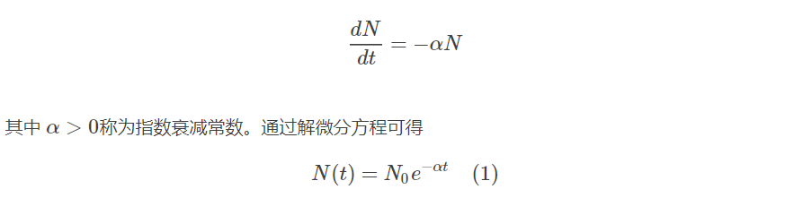
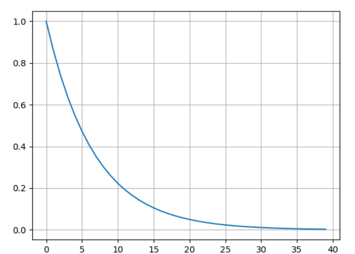

## 按指数衰减的负载：

记录在 /proc/loadavg

#### 1. proc 挂载代码：

fs/proc/loadavg.c

```c
static int loadavg_proc_show(struct seq_file *m, void *v)
{
	unsigned long avnrun[3];

	get_avenrun(avnrun, FIXED_1/200, 0);

	// 向proc文件系统中输出内容，读文件时可以看到
	seq_printf(m, "%lu.%02lu %lu.%02lu %lu.%02lu %u/%d %d\n",
		LOAD_INT(avnrun[0]), LOAD_FRAC(avnrun[0]),
		LOAD_INT(avnrun[1]), LOAD_FRAC(avnrun[1]),
		LOAD_INT(avnrun[2]), LOAD_FRAC(avnrun[2]),
		nr_running(), nr_threads,
		idr_get_cursor(&task_active_pid_ns(current)->idr) - 1);
	return 0;
}
```

linux内核中为了避免使用浮点计算，而用long型数据结构存储**伪定点数**：

类似 XXXXXX.xxxxxxxxx。数的后11位表示小数位，前面的位表示整数位，

普通浮点数乘以2^11即可得到此法表示的定点数。

**由代码可知负载保存在avnrun数组中。**

avnrun数组保存在 kernel/sched/loadavg.c , 在调度时动态维护这个数组。

这个文件同时也写了有关loadavg计算方式的注释，需要详细研究的话可以一读。

```c
/**
 * get_avenrun - get the load average array
 * @loads:	pointer to dest load array
 * @offset:	offset to add
 * @shift:	shift count to shift the result left
 *
 * These values are estimates at best, so no need for locking.
 */
void get_avenrun(unsigned long *loads, unsigned long offset, int shift)
{
	loads[0] = (avenrun[0] + offset) << shift;
	loads[1] = (avenrun[1] + offset) << shift;
	loads[2] = (avenrun[2] + offset) << shift;
}
```

#### 2. 概念讲解

* LOAD_FREQ: 负载计算的时间间隔。Linux内核为了减少负载计算的时间间隔，将其设为**每5秒**计算（更新）一次。

* 按指数衰减：这种数学方法用于描述一个参数逐渐变小的过程。如原子核衰变时原子数目呈指数级减少，媒体热度也是呈指数级降低等。

  >#### 指数衰减过程
  >
  >在计算诸如新闻热度、**特征重要度**等场合下，我们需要一种具有这样特性的过程，一个数值随着时间的推移呈现指数形式逐渐放缓的衰减，即这个数值的衰减速度和当前值成正比。
  >
  >
  >
  >图像如下所示：
  >
  >

* 衰减指数：由于我们**采样的周期是5s**，因此上次采样的数据在这5s间**发生了自然的衰减**，衰减的指数与时间正相关，时间越长，数据衰减的越多，符合高负载在一定时间后逐渐衰减为0的规律。

  计算公式：1/exp(采样周期/负载观测时间段)，其中负载观测时间段表示要监测的负载时间段，有1min, 5min, 15min三种取值，实际上loadavg就是表示在一段时间内负载**按指数衰减的**平均值（不是真正意义上的平均）。

  

* nr_active：当前活跃的进程数，包括处于可运行状态的进程和不可中断状态（等待磁盘或者其它IO过程）的进程。

#### 3. 计算方法和计算公式

1. 每次LOAD_FREQ时，计算nr_active（活跃的进程数）：

   ```c
   nr_active = 0;
   for_each_possible_cpu(cpu)
   	nr_active += cpu_of(cpu)->nr_running + cpu_of(cpu)->nr_uninterruptible;
   ```

   注：由于在多CPU机器上遍历各个CPU获取其运行进程数是个及其耗时的操作，因此Linux内核对此的实现更加复杂，在此不做讨论。

2. 计算**按指数衰减的负载**平均值：

   *avenrun[n] = avenrun[n] \* **exp_n** + nr_active \* **(1 - exp_n)***

   这个等式包括两个相加项：前一个是之前的负载按指数衰减的值，后一个是当前新的负载对平均负载的影响。两个系数分别为 exp_n 和 1 - exp_n，加起来正好是负载的汇总。

   可以想见，若负载稳定不变，长期来看avenrun就等于负载，avenrun == nr_active，avenrun保持不变，符合负载的定义；

   若一段时间内，负载不稳定。如1min内，前30s维持负载为2，后30s维持负载在0.1，则前10s的负载会叠加到近1min的负载计算中，但不是**平均值**1.05，而是按指数衰减的。这就表明 loadavg 计算的负载并非是**瞬时值**，而是汇总了**一段时间内**所有负载信息的按指数衰减的平均值。因此，我们可以根据平均负载推断一分钟内机器的负载情况。
   
   更多的，由于指数衰减是**先快后慢**的，意味着一个时间片开始的时候产生的负载影响会很快衰减掉，时间靠后的**负载信息**对平均负载的影响更大。因此平均负载的结果更偏向于最近时间的负载情况。当然，按照计算方法的定义，1min的衰减速度最快，5min次之，15min最慢，这也就是为什么可以通过比较3个平均负载的大小关系来判断**负载的变化趋势**。

#### 4. 负载信息维护代码

kernel/sched/loadavg.c

```c
void get_avenrun(unsigned long *loads, unsigned long offset, int shift)
{
	loads[0] = (avenrun[0] + offset) << shift;
	loads[1] = (avenrun[1] + offset) << shift;
	loads[2] = (avenrun[2] + offset) << shift;
}
```

```c
void calc_global_load(void)
{
	unsigned long sample_window;
	long active, delta;

	sample_window = READ_ONCE(calc_load_update);
	if (time_before(jiffies, sample_window + 10))
		return;

	/*
	 * Fold the 'old' NO_HZ-delta to include all NO_HZ CPUs.
	 */
	delta = calc_load_nohz_read();
	if (delta)
		atomic_long_add(delta, &calc_load_tasks);

	active = atomic_long_read(&calc_load_tasks);
	active = active > 0 ? active * FIXED_1 : 0;
	
    /*计算负载的核心代码*/
	avenrun[0] = calc_load(avenrun[0], EXP_1, active);
	avenrun[1] = calc_load(avenrun[1], EXP_5, active);
	avenrun[2] = calc_load(avenrun[2], EXP_15, active);
    /*END*/

	WRITE_ONCE(calc_load_update, sample_window + LOAD_FREQ);

	/*
	 * In case we went to NO_HZ for multiple LOAD_FREQ intervals
	 * catch up in bulk.
	 */
	calc_global_nohz();
}
```

```c
/*
 * a1 = a0 * e + a * (1 - e)
 */
static inline unsigned long
calc_load(unsigned long load, unsigned long exp, unsigned long active)
{
	unsigned long newload;

	newload = load * exp + active * (FIXED_1 - exp);
	if (active >= load)
		newload += FIXED_1-1;

	return newload / FIXED_1;
}
```