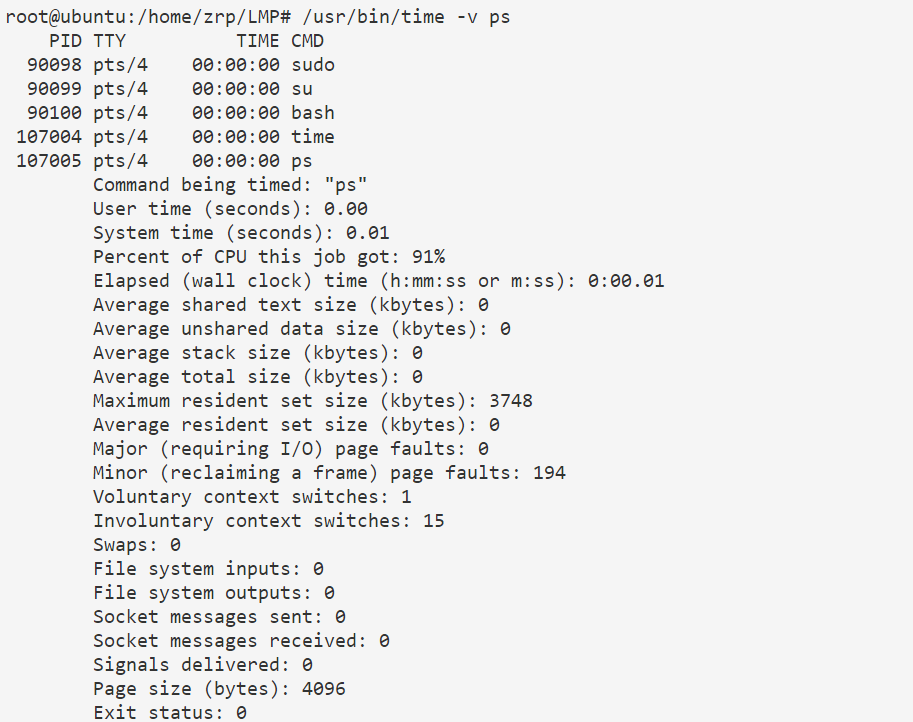
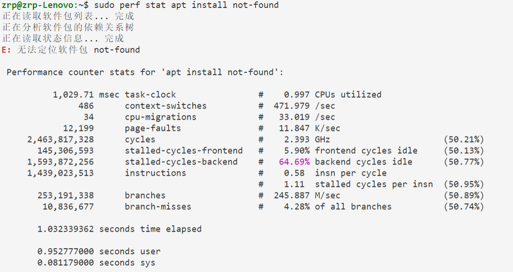
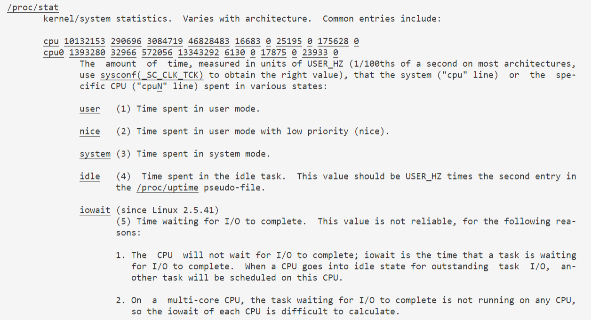
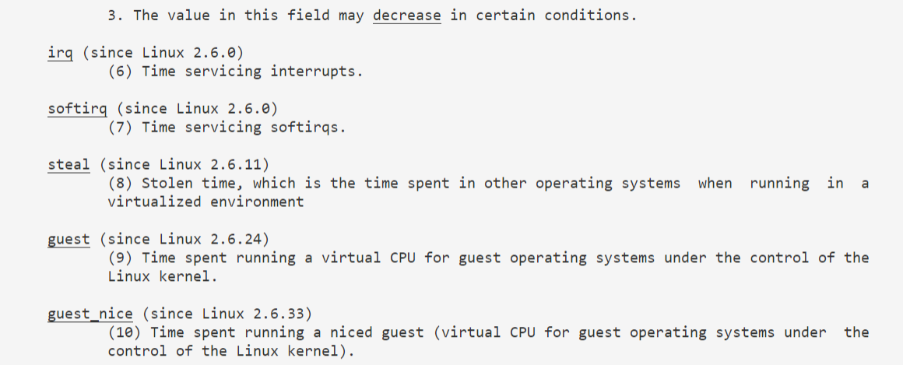
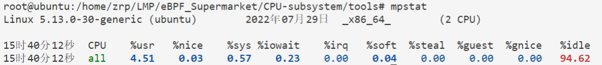
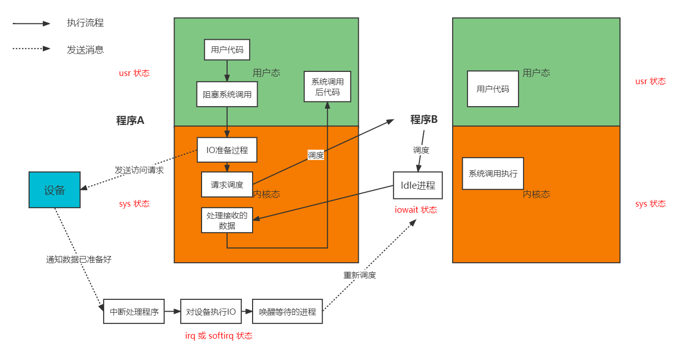

## 实现传统工具并完成扩展的功能（sar工具）：

#### 1. 各传统工具比较

* sar工具：能够采样linux内核中关于CPU、内存、交换空间、网络、文件系统、调度等方面的**非常详细**的数据。采样的形式为**快照**，即最短每隔1s采样系统里的这些数据，并打印到屏幕上。

* vmstat：能展示linux内核的内存、swap、IO、系统、CPU、调度方面的**大致**数据，可帮助我们获得系统运行的概况。采样的形式为快照。

* uptime：展示系统在1min、5min和15min内按指数衰减的**负载**。

* mpstat：展示各个CPU和全部CPU的占用率信息，包括用户态和内核态时间占比、IO等待时间比例、软件中断用量、空闲时间等。

* pidstat：**按进程或线程**打印CPU用量信息，包括用户态和内核态时间的分解、运行的CPU编号等。

* /usr/bin/time -v \<command\>：打印**进程执行过程**中的详细信息，包括执行时间、栈用量、上下文切换次数、页面错误次数、文件系统IO数等。

  

* perf stat \<command\>：打印进程执行过程中的信息，包括PMC（硬件性能计数器）信息。

  

| 工具名称      | 说明                                    | 监测对象             | 数据来源      | 数据详细程度 | 采样时间   |
| ------------- | --------------------------------------- | -------------------- | ------------- | ------------ | ---------- |
| sar           | 定时展示系统里几乎所有信息              | linux内核            | /proc和/sys   | 非常详细     | 周期性     |
| vmstat        | 定时展示系统的大致信息                  | linux内核            | /proc         | 详细         | 周期性     |
| uptime        | 展示系统的负载信息                      | 系统负载             | /proc/loadavg | 非常简略     | 周期性, 5s |
| mpstat        | 按CPU展示CPU占用率信息                  | 各CPU占用率          | ——            | 详细         | 周期性     |
| pidstat       | 按进程展示CPU占用率信息                 | 各进程               | ——            | 详细         | 周期性     |
| /usr/bin/time | 展示进程整个运行过程的总体信息          | 某进程的整个运行过程 | ——            | 详细         | 过程       |
| perf stat     | 展示进程整个运行过程的总体信息（含PMC） | 某进程的整个运行过程 | perf          | 详细         | 过程       |

目前缺乏一种以**具体进程**为监测对象，由进程执行某个事件或执行某个事件特定次数为触发条件的记录方式。

且当前的所有传统工具要么是采集/proc，要么像perf采集的是固定的tracepoint，无法灵活设计采样指标。

#### 2. sar功能介绍

基本使用：sar [命令行选项] interval(时间间隔) count(执行次数)

sysstat版本：12.5.2（不同版本的命令行选项可能略有不同）

命令行选项列表如下：

```
-B：分页的统计数据
-b：IO和传输的统计数据，包括每秒系统向物理设备提出的读写请求数
-d：展示每个块设备的活动信息
-F [MOUNT]：展示被挂载的某个文件系统的统计数据，MOUNT表示挂载点
-H：展示hugepage的使用情况
--human：以可读的形式展示数据（如1K,1.2M等）
-I {int_list | SUM | ALL}：展示中断的统计数据。int_list表示展示特定中断编号的发生频率，格式如0-16,35,400-。SUM表示统计中断的总数，ALL表示全部输出。
--iface=iface_list：展示特定网络设备的网络统计信息
-m {CPU|FAN|FREQ|IN|TEMP|USB|ALL}：展示电源管理统计信息。
	CPU：CPU频率等。
	FAN：风扇的转速等信息。
	TEMP：温度
	USE：USE设备信息
-n { <关键词> [,...] | ALL }  网络统计信息
		关键词可以是： 
	    	DEV	     网卡信息统计
		    EDEV	 网卡的错误统计
		    NFS	     NFS客户端
		    NFSD	 NFS服务器
		    SOCK	 Sockets (IPV4套接字）
		    IP	     IP流(IPV4)
		    EIP	     IP流的错误统计(IPV4)
		    ICMP	 ICMP流(IPV4)
		    EICMP	 ICMP流的错误统计(IPV4)
		    TCP	     TCP流(IPV4)
		    ETCP	 TCP流的错误统计(IPV4) 
		    UDP	     UDP流(IPV4)
		    SOCK6	 Sockets(IPV6套接字)
		    IP6	     IP流(IPV6)
		    EIP6	 IP流的错误统计(IPV6)
		    ICMP6	 ICMP流(IPV6)
		    EICMP6   ICMP流的错误统计 (IPV6) 
		    UDP6	 UDP流(IPV6) 
-P {cpu_list| ALL}：展示逐CPU的统计数据
-q ALL：展示详细的系统负载信息
-r ALL：展示内存使用信息
-S：展示交换空间使用信息
-W：展示内存交换的数据
-u ALL：展示所有CPU的总使用量信息
-w：展示任务创建和上下文切换的活动信息
-y：展示终端设备的活动信息
```

要实现的功能包括-P，-q，-u，-w。

其中，-u的功能包括了-P，所以只需实现-u即可。即只需要实现-u，-q，-w。

#### 3. 用到的kprobe挂载点和tracepoint

任务创建：

syscalls: sys_enter_execve;

sched: sched_process_exec；新进程使用exec更改本进程的执行环境因而变成其他进程的操作。此时pid == old_pid.

### 4. proc文件系统相关说明





### 5. proc文件系统中统计CPU上进程的系统时间和用户时间的过程

#### 5.1 内核中对cpu运行时间的核算

主文件在kernel\sched\cputime.c

* kcpustat_cpu_fetch() : 获取某个cpu的各种运行时间，包括用户态、内核态时间。数据存放在kernel_cpustat结构体中。如下所示：

```c
struct kernel_cpustat {
	u64 cpustat[NR_STATS];
};
```

* kcpustat_cpu_fetch_vtime() ：获取某个进程对CPU的运行时间贡献，并累加到kernel_cpustat结构体中。
* task_cputime() ：获取某个进程的用户时间（包括guest time）和系统时间，并累加到指定变量中。

重要函数(仅做源码说明，实测并不能添加kprobe)：

* vtime_user_enter(task_struct *): 开始时表示了**内核态的结束**
* vtime_user_exit(task_struct *): 退出之后**直接进入内核态**
* vtime_guest_enter(task_struct *): 开始时也表示了内核态的结束
* vtime_guest_exit(task_struct *): 退出之后进入内核态

task_struct进程结构体中重要元素：vtime，记录进程运行状态和运行时间

```c
struct vtime {
	seqcount_t		seqcount;
	unsigned long long	starttime;
	enum vtime_state	state;
	unsigned int		cpu;
	u64			utime;
	u64			stime;
	u64			gtime;
};
```

* vtime_task_switch_generic(task_struct *prev): 在上下文切换时进行进程执行时间的核算。具体为：将被换出进程的系统时间核算出来（**内核态结束**），同时记录当前进程的开始时间(vtime->starttime)为当前时刻.

#### 5.2 CPU运行的几种状态



单个cpu运行的状态大致可分为usr, sys, iowait, idle四种。其中usr表示用户运行的时间，sys表示CPU在内核态下运行的时间，iowait表示CPU处于空闲状态下，但有IO任务**未执行完毕需要等待**的时间，idle表示CPU处于空闲状态下且无IO任务的时间。注意，iowait高表示的是CPU空闲状态下有IO请求在等待，并不代表**IO是当前系统运行的瓶颈**。实际的意义应当是代表进程在等待IO，空出的时间**可以运行更多进程**。

单个cpu运行的状态**细分**可分为usr（用户时间），sys（内核时间）, nice（nice值大于0的进程占用的用户时间，因为新进程的nice值都是0，所以大于0的nice值表示进程友好），iowait（CPU处于空闲状态，但有IO任务需要等待），irq，...，idle（空闲状态，没有IO任务需要等待）。

分析一个典型的程序执行过程。程序A在执行了一段用户空间代码后，发起了一个**IO阻塞的系统调用**。此时，A陷入**内核态**，内核态执行了一些必要的代码后（**处于一段时间的sys状态**），等待IO设备响应。这段时间如果有其他进程可供调度，那么CPU可被调度到那个进程上（上下文切换后，新进程的状态**可能是内核态，也可能是用户态**，因为进程通过系统调用陷入内核态后，同样可以让出CPU给其他进程）。如果没有其他进程，则CPU进入**IO等待状态**，边执行IDLE进程边等待。设备响应时，中断处理程序运行在 **irq 或 softirq 状态**，通常持续的时间很短，即**回到内核态**向用户空间发送数据，完成系统调用回到用户态。如下图所示：


