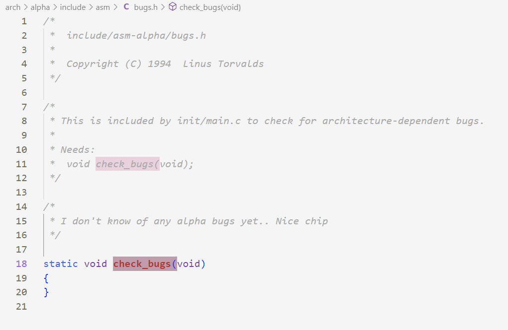
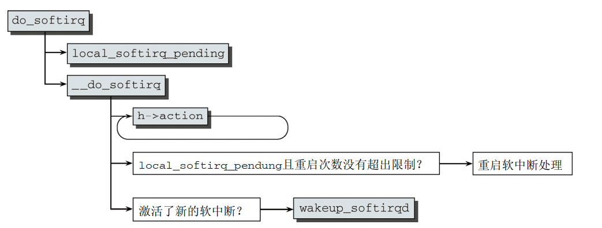
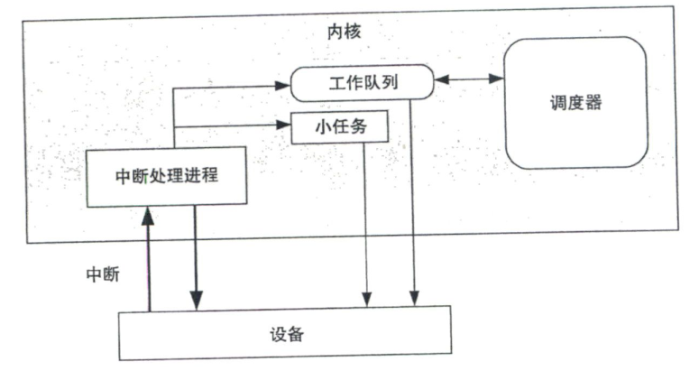

### 调度和中断处理的基本原理

### 1. 调度类

调度类按照优先级可分为以下几种类型：

* **停机调度类 stop_sched_class**：参与实现stop_machine机制，用来实现CPU的热插拔、CPU任务迁移、内存热插拔、内核增删模块等功能；原理是**中止其他调度类的调度过程**

  停机进程可以任意抢占其他进程，但其他进程不能抢占停机进程

* **限期调度类 dl_sched_class**: 按照优先算法调度进程，将进程按照绝对截止期限从小到大在红黑树中进行排序，调度时每次选择离截止期限最近的进程执行

* **实时调度类 rt_sched_class**: 包括SCHED_RR和SCHED_FIFO

* **完全公平调度类 fair_sched_clas**s: 最常用的调度类

* **空闲调度类 idle_sched_class**: 兜底的调度类，用于在没有进程时执行**空闲进程**

#### 1.1 stop_sched_class

调度类stop_sched_class用于**停止cpu**,在SMP系统上使用,用于负载均衡和cpu热插拔.此类具有最高的调度优先级.

此调度类的定义在kernel/sched/stop_task.c，

而定义停止CPU这个动作的文件在kernel/stop_machine.c，停止cpu的函数为stop_cpus()。定义如下：

```c
/**
 * stop_cpus - stop multiple cpus
 * @cpumask: cpus to stop
 * @fn: function to execute
 * @arg: argument to @fn
 *
 * Execute @fn(@arg) on online cpus in @cpumask.  On each target cpu,
 * @fn is run in a process context with the highest priority
 * preempting any task on the cpu and monopolizing it.  This function
 * returns after all executions are complete.
 *
 * This function doesn't guarantee the cpus in @cpumask stay online
 * till @fn completes.  If some cpus go down in the middle, execution
 * on the cpu may happen partially or fully on different cpus.  @fn
 * should either be ready for that or the caller should ensure that
 * the cpus stay online until this function completes.
 *
 * All stop_cpus() calls are serialized making it safe for @fn to wait
 * for all cpus to start executing it.
 *
 * CONTEXT:
 * Might sleep.
 *
 * RETURNS:
 * -ENOENT if @fn(@arg) was not executed at all because all cpus in
 * @cpumask were offline; otherwise, 0 if all executions of @fn
 * returned 0, any non zero return value if any returned non zero.
 */
static int stop_cpus(const struct cpumask *cpumask, cpu_stop_fn_t fn, void *arg)
{
	int ret;

	/* static works are used, process one request at a time */
	mutex_lock(&stop_cpus_mutex);
	ret = __stop_cpus(cpumask, fn, arg);
	mutex_unlock(&stop_cpus_mutex);
	return ret;
}
```

* 轻松一刻

  

  内核开发者认为alpha架构的CPU没有bug（笑）！

### 2. 中断及其下半部

#### 2.1 中断(irq)

##### 2.1.1 相关数据

中断irq过程所对应的全部**tracepoints**:

```txt
irq:irq_handler_entry
irq:irq_handler_exit 
irq:softirq_entry    
irq:softirq_exit     
irq:softirq_raise    
```

展示irq列表：/proc/interrupts

irq详细信息的保存目录：/proc/irq/\<irq编号\>/...

##### 2.1.2 简要说明

除非特别说明，否则一般的中断处理程序是可以在多个处理器（处理器核）上同时执行的，但是**同一个irq**所指向的中断处理程序**不能在同一个对称CPU上执行**（显而易见）。


因此，区分一个中断处理程序执行的信息为 **(irq, cpu)** 二元组，这可在**eBPF探针程序**中应用。

同样，区分一个softirq的信息为 **(softirq, cpu)** 二元组。

#### 2.2 下半部

下半部是内核中处理中断剩余操作的一种机制。由于中断对时间要求很高，因此中断处理程序只完成必要的工作，剩余对时间要求不紧，但工作量大、流程复杂的操作应当交给下半部来执行。

目前内核实现**中断下半部**的方法有三种：软中断（由内核在编译时期硬编码）、tasklet（微型进程，由软中断实现）、工作队列（由内核工作进程实现）。

##### 2.2.1 软中断 softirq

1. 软中断简述

软中断是在编译时期静态分配的，不能像tasklet那样被动态地注册和注销。

软中断的结构表示为softirq_action:

```c
struct softirq_action
{
	void	(*action)(struct softirq_action *);
};
```

内核中一共定义了32个包含**软中断结构体**的数组，因此最多有32个软中断。目前，内核中总共的软中断数目为9个，如下图所示：


2. 软中断的执行

   一个注册的软中断只有在被标记后才会执行，这被称为**触发软中断**。在以下地方，待处理的软中断会被执行：

   * 从硬件中断代码返回时
   * 在ksoftirqd内核守护进程中
   * 在内核中显示检查和执行软中断的代码中。如网络子系统中

   无论在哪个地方被触发，都会调用**do_softirq检查并执行目前所有的软中断**。

   入口执行函数do_softirq：

   

   最后的流程是，若do_softirq频繁重启检查软中断位图**若干次后**仍有新出现的软中断，则将此任务交给ksoftirqd守护进程执行。

   内核与softirq相关的tracepoints的含义如下：

   * softirq_raise：触发softirq，设置相应softirq的标志位，待之后do_softirq时就执行相应的softirq
   * softirq_exit：退出softirq
   * softirq_entry：进入softirq

##### 2.2.2 tasklet

tasklet是**通过软中断**实现的。其原理是在软中断表中注册了两个软中断HI_SOFTIRQ和TASKLET_SOFTIRQ，分别负责高优先级tasklet和普通优先级tasklet的管理。由于tasklet是通过软中断实现的，因此其总是在软中断执行时才执行。

##### 2.2.3 工作队列


##### 2.2.4 选择下半部实现机制的方法


由于软中断可以在多个处理器上并行执行，因此软中断需要是可重入的。

其中，tasklet（小任务）和工作队列的流程图如下：



#### 2.3 后记

研究中断（实际上是中断的上半部）、下半部（软中断、tasklet、工作队列）、IO这三者之间的关系。目前只研究了中断和下半部。中断是用来执行一些具有强实时性、访问设备的、不能被打断的代码所用到的；而下半部是用来处理中断剩余的工作的，是为了减少中断过程占用CPU的时间，使其他中断或同类型的中断能够及时响应而设计的。

如果对外设的访问仅仅有中断、IO，那么内核对IO访问的调度就不复存在了。并且，IO访问的方式包括轮询、中断、DMA、通道等，不只包括中断，并且以上针对中断的描述未涉及到实际的数据处理，不能算作完整的IO过程。因此，有必要研究内核对于IO的处理，来明确**文件系统、IO操作、中断**这三者的关系，进而更深层次理解内核IO子系统的原理。