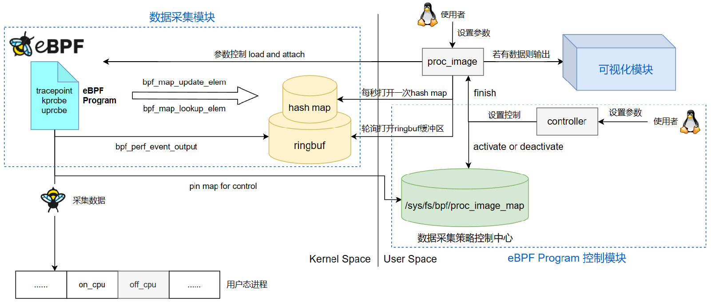

# 基于eBPF的进程生命周期画像

## 一、介绍

本项目是一个Linux进程生命周期画像工具，可以清晰地展示出目标线程、目标线程组甚至系统中所有线程从创建到终止的完整生命周期，所展示出的进程生命周期信息包括关键时间点信息（execve、exit、fork、vfork、pthread_create、上下CPU等）、持有锁信息、资源使用信息、调度信息、系统调用序列信息等，并在特定的信息中加入了系统相关信息以作为参考和对比，考虑到对系统性能的影响和在高负载环境下的使用，该工具支持预先挂载使用激活的操作模式，同时在这些功能的前提下，基于Prometheus和Grafana构建了一个进程可视化平台，以实现进程画像的目的，并且通过清晰的进程画像即可察觉到进程的异常行为。

eBPF_proc_image 工具的框架图：

<div align='center'></div>

## 二、安装工具

运行环境：Ubuntu 22.04，内核版本 6.2

```
sudo apt update
sudo apt install libbpf-dev clang llvm libelf-dev libpcap-dev gcc-multilib build-essential
git submodule update --init --recursive
make
```

## 三、proc_image 工具

proc_image 工具用于挂载 eBPF 的内核态程序，但不进行采集数据，并在用户态循环遍历 map，若有数据则输出

proc_image 工具的参数信息：

| 参数                 | 描述                                              |
| -------------------- | ------------------------------------------------- |
| -a, --all | 挂载所有的 eBPF 内核态程序，但不进行采集数据 |
| -k, --keytime | 挂载进程关键时间点相关的 eBPF 内核态程序，但不进行采集数据 |
| -l, --lock | 挂载进程用户态持有锁相关的 eBPF 内核态程序，但不进行采集数据 |
| -r, --resource | 挂载进程资源使用情况相关的 eBPF 内核态程序，但不进行采集数据 |
| -s, --syscall  | 挂载进程系统调用相关的 eBPF 内核态程序，但不进行采集数据 |
| -S, --schedule | 挂载进程调度相关的 eBPF 内核态程序，但不进行采集数据 |
| -h, --help           | 显示帮助信息                                      |

## 四、controller 工具

controller 工具用于控制eBPF程序的执行，可动态调整数据的采集策略

controller 工具的参数信息：

| 参数                   | 描述                                                         |
| ---------------------- | ------------------------------------------------------------ |
| -a, --activate         | 设置 proc_image 工具的启动策略                               |
| -d, --deactivate       | 初始化为原始的失活状态                                       |
| -f, --finish           | 结束 proc_image 工具的运行                                   |
| -p, --pid=PID          | 指定跟踪进程的pid                                            |
| -P, --tgid=TGID        | 指定跟踪进程的tgid                                           |
| -c, --cpuid=CPUID      | 为每CPU进程设置，其他进程不需要设置该参数                    |
| -t, --time=TIME-SEC    | 设置程序的最大运行时间（0表示无限），默认一直运行            |
| -r, --resource         | 采集进程的资源使用情况，包括CPU利用率、内存利用率、每秒读写字节数（可持续开发） |
| -l, --lock             | 采集进程持有用户态锁的时间信息，包括用户态互斥锁、用户态读写锁、用户态自旋锁（可持续开发） |
| -k, --keytime=KEYTIME  | 采集进程关键时间点的相关信息，包括fork、vfork、pthread_create、execve、exit、onCPU、offCPU及offCPU的原因（可持续开发） |
| -s, --syscall=SYSCALLS | 采集进程以及系统的系统调用信息，进程的系统调用信息包括系统调用序列、前三个调用最频繁的系统调用、系统调用的平均延迟、最大延迟以及最小延迟，同时也采集了系统的这些延迟信息以作为参考和对比 |
| -S, --schedule         | 采集进程及系统的调度信息，其中系统的调度信息具有参考和对比的作用，调度信息包括调度的平均延迟、最大延迟以及最小延迟 |
| -h, --help             | 显示帮助信息                                                 |

## 四、tools

tools文件夹中的eBPF程序是按照进程生命周期中数据的类型分别进行实现的：

| 工具            | 描述                            |
| --------------- | ------------------------------- |
| resource_image | 对进程的资源使用情况进行画像           |
| lock_image      | 对进程/线程持有锁的区间进行画像 |
| keytime_image   | 对进程的关键时间点进行画像      |
| syscall_image   | 对进程的系统调用序列进行画像      |
| schedule_image   | 对进程的调度信息进行画像      |

## 五、基于 Prometheus 和 Grafana 的可视化平台

基于 Prometheus 和 Grafana 的可视化平台框架图：

<div align='center'></div>

eBPF_proc_image 工具的可视化操作可以参考：[进程画像可视化指南](docs/proc_image_vis_guide.md)