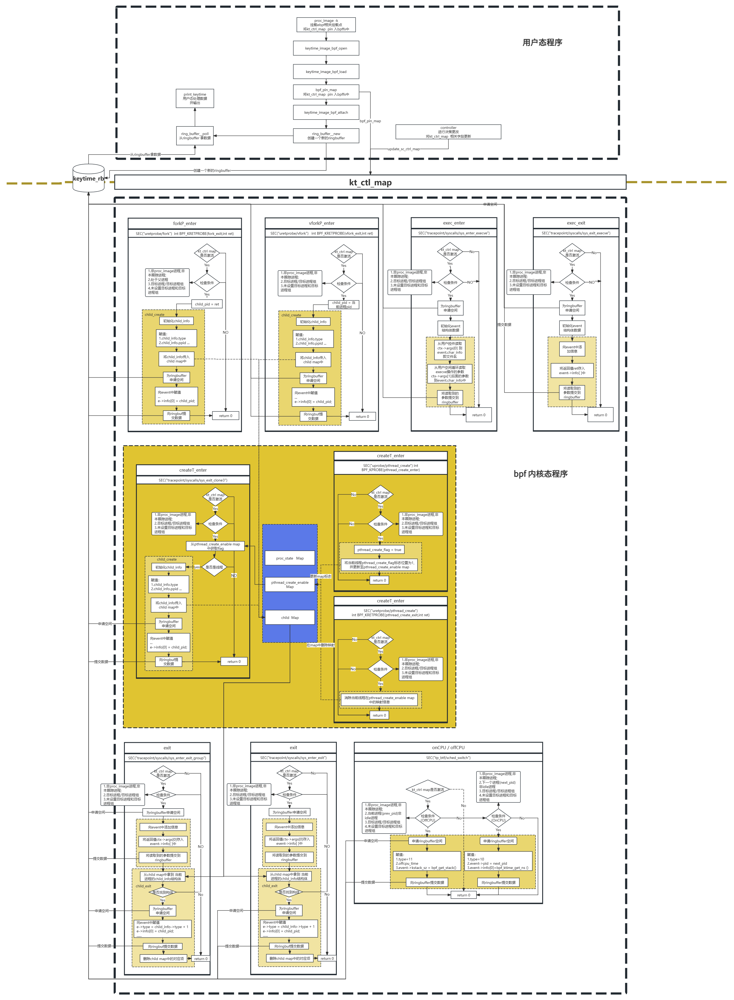
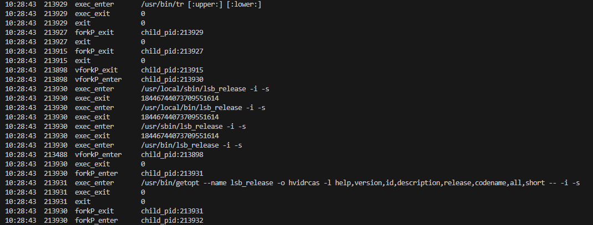

# keytime_image工具使用说明:

keytime_image主要是用于采集进程创建与退出、进程以什么方式创建(fork、vfork、clone)、进程何时上cpu何时下cpu等信息。本工具可用于监测进程全生命周期，并获取对应的数据；

## 1.代码逻辑图：



## 2.使用方法：

### 2.1.编译

首先在`lmp/eBPF_Supermarket/CPU_Subsystem/eBPF_proc_image`目录下进行编译操作；

```shell
sudo make
```

编译成功后，会生成两个可执行文件`proc_image`,`controller`, 后面的数据监测均围绕这两个可执行文件；

### 2.2.挂载

在`lmp/eBPF_Supermarket/CPU_Subsystem/eBPF_proc_image`目录下运行 `proc_image`可执行文件，

通过`proc_image -h`命令可查看进程画像的使用方法:

```shell
xhb@1:~/lmp/eBPF_Supermarket/CPU_Subsystem/eBPF_proc_image$ sudo ./proc_image -h
Usage: proc_image [OPTION...]
Trace process to get process image.

  -a, --all                  Attach all eBPF functions(but do not start)
  -k, --keytime              Attach eBPF functions about keytime(but do not
                             start)
  -l, --lock                 Attach eBPF functions about lock(but do not start)
                            
  -r, --resource             Attach eBPF functions about resource usage(but do
                             not start)
  -s, --syscall              Attach eBPF functions about syscall sequence(but
                             do not start)
  -S, --schedule             Attach eBPF functions about schedule (but do not
                             start)
  -?, --help                 Give this help list
      --usage                Give a short usage message
```

挂载syscall_image工具相关挂载点；

```shell
sudo ./proc_image -k
```

```shell
xhb@1:~/lmp/eBPF_Supermarket/CPU_Subsystem/eBPF_proc_image$ sudo ./proc_image -k
libbpf: loading object 'keytime_image_bpf' from buffer
libbpf: elf: section(2) .symtab, size 2736, link 1, flags 0, type=2
libbpf: elf: section(3) tracepoint/syscalls/sys_enter_execve, size 17888, link 0, flags 6, type=1
libbpf: sec 'tracepoint/syscalls/sys_enter_execve': found program 'tracepoint__syscalls__sys_enter_execve' at insn offset 0 (0 bytes), code size 2236 insns (17888 bytes)
libbpf: elf: section(4) tracepoint/syscalls/sys_exit_execve, size 496, link 0, flags 6, type=1
libbpf: sec 'tracepoint/syscalls/sys_exit_execve': found program 'tracepoint__syscalls__sys_exit_execve' at insn offset 0 (0 bytes), code size 62 insns (496 bytes)
...
libbpf: prog 'sched_switch': relo #3: patched insn #37 (ALU/ALU64) imm 2460 -> 2460
libbpf: unpinned map 'kt_ctrl_map' from '/sys/fs/bpf/proc_image_map/kt_ctrl_map'
libbpf: pinned map '/sys/fs/bpf/proc_image_map/kt_ctrl_map'
libbpf: elf: symbol address match for 'fork' in '/usr/lib/x86_64-linux-gnu/libc.so.6': 0xefac0


```

### 2.3.控制策略：

可使用`controller`工具进行策略控制，策略切换。

重启一个终端, 在`lmp/eBPF_Supermarket/CPU_Subsystem/eBPF_proc_image`目录下运行 `controller`可执行文件。

通过`controller -h`命令可查看进程画像策略切换方法:

```shell
xhb@1:~/lmp/eBPF_Supermarket/CPU_Subsystem/eBPF_proc_image$ sudo ./controller -h 
Usage: controller [OPTION...]
Trace process to get process image.

  -a, --activate             Set startup policy of proc_image tool
  -c, --cpuid=CPUID          Set For Tracing  per-CPU Process(other processes
                             don't need to set this parameter)
  -d, --deactivate           Initialize to the original deactivated state
  -f, --finish               Finish to run eBPF tool
  -k, --keytime=KEYTIME      Collects keytime information about
                             processes(0:except CPU kt_info,1:all kt_info,any 0
                             or 1 when deactivated)
  -l, --lock                 Collects lock information about processes
  -m, --myproc               Trace the process of the tool itself (not tracked
                             by default)
  -p, --pid=PID              Process ID to trace
  -P, --tgid=TGID            Thread group to trace
  -r, --resource             Collects resource usage information about
                             processes
  -s, --syscall=SYSCALLS     Collects syscall sequence (1~50) information about
                             processes(any 1~50 when deactivated)
  -S, --schedule             Collects schedule information about processes
                             (trace tool process)
  -t, --time=TIME-SEC        Max Running Time(0 for infinite)
  -?, --help                 Give this help list
      --usage                Give a short usage message

Mandatory or optional arguments to long options are also mandatory or optional
for any corresponding short options.
```

使用keytime_image工具的不同参数，控制该工具的使用策略：

| 参数 |                                                              |
| ---- | ------------------------------------------------------------ |
| -k   | keytime_image工具  后加参数(0或1)用于控制是否监测进程上下CPU的时间点；例：-k 0; |
| -a   | 激活 keytime_image工具；                                     |
| -p   | 指定目标线程；                                               |
| -P   | 指定目标线程组；                                             |
| -t   | 指定检测时间；                                               |

通过以下指令更改控制策略：

- 激活对线程3184关键时间点的数据收集;

	```shell
	sudo ./controller -k 0 -p 3184 -a
	KEYTIME -------------------------------------------
	TIME      PID     EVENT            ARGS/RET/OTHERS
	10:02:44  3184    forkP_enter      child_pid:208024 
	10:02:44  3184    vforkP_enter     child_pid:208024 
	10:02:45  3184    vforkP_exit      child_pid:208024 
	10:02:45  3184    forkP_enter      child_pid:208026 
	10:02:45  3184    vforkP_enter     child_pid:208026 
	10:02:45  3184    vforkP_exit      child_pid:208026 
	10:02:45  3184    forkP_enter      child_pid:208028 
	```

- 激活对线程组3184关键时间点的数据收集;

	```shell
	sudo ./controller -k 1 -P 3184 -a
	KEYTIME -----------------------------------------------------------------
	TIME      TGID    PID     EVENT            ARGS/RET/OTHERS
	10:23:39  3184    3184    offCPU           offcpu_time:253480629547342
	10:23:39  3184    3184    onCPU            oncpu_time:253480629595213 
	10:23:39  3184    3188    onCPU            oncpu_time:253480630262378 
	10:23:39  3184    3188    offCPU           offcpu_time:253480630274211
	10:23:39  3184    3186    onCPU            oncpu_time:253480630292716 
	10:23:39  3184    3188    onCPU            oncpu_time:253480630301954 
	10:23:39  3184    3186    offCPU           offcpu_time:253480630302214
	10:23:39  3184    3188    offCPU           offcpu_time:253480630307033
	10:23:39  3184    3187    onCPU            oncpu_time:253480630342231 
	10:23:39  3184    3186    onCPU            oncpu_time:253480630350606 
	10:23:39  3184    3186    offCPU           offcpu_time:253480630357990
	10:23:39  3184    3188    onCPU            oncpu_time:253480630397210 
	
	```

- 关闭对线程3184关键时间点的数据收集;

	```shell
	sudo ./controller -k 0 -p 3184 -d
	```

- 关闭对线程组3184关键时间点的数据收集;

	```shell
	sudo ./controller -k 1 -P 3184 -d
	```

- 关闭进程画像：

	```shell
	sudo ./controller -f
	```

### 2.3.数据监测：

当更改了使用策略后，将对数据进行检测：




