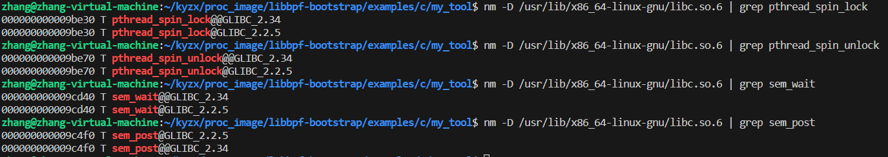

# libbpf函数名模糊匹配问题

在libc.so.6库中若函数名存在如下情况：

<div align='center'></div>

则就会出现libbpf函数名模糊匹配问题，报错信息如下所示：

```
libbpf: elf: ambiguous match for '函数名', '函数名' in '/usr/lib/x86_64-linux-gnu/libc.so.6'
```

可以定位到官方库 libbpf/src/elf.c：

```
long elf_find_func_offset(Elf *elf, const char *binary_path, const char *name)
{
	......
	
				if (ret > 0) {
				/* handle multiple matches */
				if (last_bind != STB_WEAK && cur_bind != STB_WEAK) {
					/* Only accept one non-weak bind. */
					pr_warn("elf: ambiguous match for '%s', '%s' in '%s'\n",
						sym->name, name, binary_path);
					ret = -LIBBPF_ERRNO__FORMAT;
					goto out;
				} else if (cur_bind == STB_WEAK) {
					/* already have a non-weak bind, and
					 * this is a weak bind, so ignore.
					 */
					continue;
				}
			}
			
	......
}
```

发现libbpf没有处理因版本问题导致函数重名的能力

然后又在网上查阅了该问题，发现曾有人向官方提到这个问题：

[Re: [PATCH v2\] libbpf: Improve version handling when attaching uprobe - Andrii Nakryiko (kernel.org)](https://lore.kernel.org/lkml/CAEf4BzZTrjjyyOm3ak9JsssPSh6T_ZmGd677a2rt5e5rBLUrpQ@mail.gmail.com/)

这个 PATCH 还在讨论中，libbpf官网源码并未修改

目前这个问题已经被解决，见pr: https://patchwork.kernel.org/project/netdevbpf/cover/20230904022444.1695820-1-hengqi.chen@gmail.com/