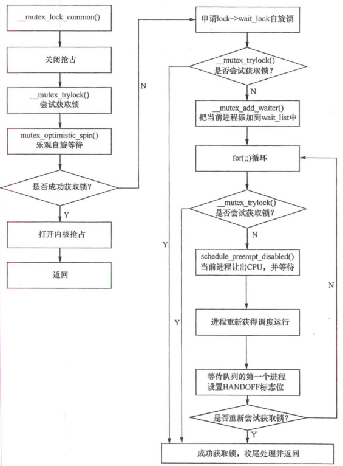
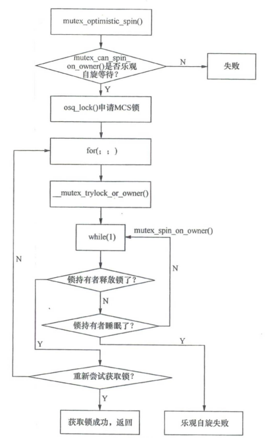

# 互斥锁

使用互斥锁实现线程同步时，系统会为共享资源添加一个称为互斥锁的标记，防止多个线程在同一时刻访问相同的共用资源。互斥锁通常也被称为互斥量（mutex），它相当于一把锁，使用互斥锁可以保证以下3点：

（1）原子性：如果在一个线程设置了一个互斥锁，那么在加锁与解锁之间的操作会被锁定为一个原子操作，这些操作要么全部完成，要么一个也不执行；

（2）唯一性：如果为一个线程锁定了一个互斥锁，在解除锁定之前，没有其它线程可以锁定这个互斥量；

（3）非繁忙等待：如果一个线程已经锁定了一个互斥锁，此后第二个线程试图锁定该互斥锁，则第二个线程会被挂起；直到第一个线程解除对互斥锁的锁定时，第二个线程才会被唤醒，同时锁定这个互斥锁。

## 用户态互斥锁

参考资料：

- [打通用户态程序和内核系列之二：pthread_mutex_lock的实现_存储之厨的技术博客_51CTO博客](https://blog.51cto.com/xiamachao/2434581)
- [(209条消息) pthread_mutex_lock的实现！！_pthread_mutex_lock原理_hzhzh007的博客-CSDN博客](https://blog.csdn.net/hzhzh007/article/details/6535437)
- [(209条消息) pthread_mutex_lock实现_Pslydff的博客-CSDN博客](https://blog.csdn.net/luoyuyou/article/details/73498640)

### pthread_mutex_*()

用户态互斥锁相关函数：

- pthread_mutex_lock()
- pthread_mutex_unlock()

一开始的计划是在原有的用户态测试程序中加入互斥锁写文件的逻辑，但经过探索发现pthread_mutex_lock() 函数并未通过系统调用进入内核，经过查阅资料发现这个函数是在glibc库中进行实现的，如下：
用户态互斥锁的实现都涉及到同一个数据结构pthread_mutex_t：

```
<glibc-/sysdeps/nptl/bits/pthreadtypes.h>

typedef union
{
  struct __pthread_mutex_s __data;
  char __size[__SIZEOF_PTHREAD_MUTEX_T];
  long int __align;
} pthread_mutex_t;
```

pthread_mutex_lock() :

```
<glibc-/sysdeps/mach/hurd/htl/pt-mutex-lock.c>

hidden_def (__pthread_mutex_lock)
strong_alias (__pthread_mutex_lock, _pthread_mutex_lock)
weak_alias (__pthread_mutex_lock, pthread_mutex_lock)
```

这段代码是用于给 `__pthread_mutex_lock` 函数设置别名的宏定义。

1. `hidden_def (__pthread_mutex_lock)`: 这是一个`hidden_def`宏的调用，用于将`__pthread_mutex_lock`函数标记为隐藏符号（hidden symbol）。隐藏符号意味着该函数对外部代码不可见，只能在当前编译单元（源文件）内部访问。这样做的目的是将该函数隐藏在编译单元内，以防止其被外部代码使用或重复定义。

2. `strong_alias (__pthread_mutex_lock, _pthread_mutex_lock)`: 这个宏定义是用来给 `__pthread_mutex_lock` 函数创建一个强别名 `__pthread_mutex_lock`。强别名的意思是，`_pthread_mutex_lock` 和 `__pthread_mutex_lock` 是完全等价的，编译器在处理这两个符号时将视为同一个函数。这通常用于在代码中提供一个简短易记的别名，或者用于向后兼容的目的。

3. `weak_alias (__pthread_mutex_lock, pthread_mutex_lock)`: 这个宏定义是用来给 `__pthread_mutex_lock` 函数创建一个弱别名 `pthread_mutex_lock`。弱别名的意思是，如果已经有另一个符号 `pthread_mutex_lock` 被定义了，编译器将会忽略这个别名。但如果没有 `pthread_mutex_lock` 这个符号定义，那么它将被指向 `__pthread_mutex_lock` 函数。这通常用于在不同平台或不同系统版本中提供不同的实现或兼容性处理。

综合起来，这段代码的作用是定义了三个别名宏，其中 `__pthread_mutex_lock` 函数被设置为隐藏可见性，并且给它创建了两个别名 `_pthread_mutex_lock` 和 `pthread_mutex_lock`，以增加代码的灵活性和可维护性。

__pthread_mutex_lock：

```
<glibc-/sysdeps/mach/hurd/htl/pt-mutex-lock.c>

int
__pthread_mutex_lock (pthread_mutex_t *mtxp)
{
	......
	lll_lock (mtxp->__lock, flags);
	......
	ROBUST_LOCK (self, mtxp, lll_robust_lock, flags);
	......
}
```

lll_lock() → __lll_lock()

ROBUST_LOCK() → lll_robust_lock() → __lll_robust_lock()

最后两者都是在用户态利用原子操作实现了加锁。其中 lll_lock() 用于常规互斥锁（普通、递归和错误检查），而 ROBUST_LOCK() 专门用于鲁棒互斥锁，以确保它们能够从拥有线程意外终止的情况中恢复。

pthread_mutex_unlock()同理。

因此，只能选择在用户态的函数上进行挂载，

### 实验验证

实验代码如下：

```
#include <stdio.h>
#include <unistd.h>
#include <time.h>
#include <pthread.h>

// 定义全局互斥锁
pthread_mutex_t mutex = PTHREAD_MUTEX_INITIALIZER;

// 写入"HELLO WORLD"到test.txt文件
void writeToTestFile(const char *message) {
    FILE *file = fopen("test.txt", "a");
    if (file != NULL) {
        fputs(message, file); 
        fclose(file); 
    }
}

int main()
{
    pthread_mutex_lock(&mutex);
    writeToTestFile("HELLO WORLD\n"); 
    pthread_mutex_unlock(&mutex); 

    pthread_mutex_destroy(&mutex);

    return 0;
}
```

运行结果：

<div align='center'></div>

<div align='center'></div>

可以看到test.txt文件中成功写入HELLO WORLD，终端中并没有和pthread_mutex_*相关的系统调用，可见用户态的互斥锁在用户态通过原子操作即可完成上锁和解锁操作。

## 内核态互斥锁

参考资料：《奔跑本Linux内核》

### 概念

**互斥锁**类似于 count 值等于 1 的信号量，那为什么内核社区要重新开发互斥锁，而不是复用信号量的机制呢？

原因如下：

- 互斥锁相对于信号量要简单轻便一些
- 在锁正用激烈的测试场景下，互斥锁比信号量执行速度更快，可扩展性更好
- mutex数据结构的定义比信号量小

扩展：

| 锁         | 描述                                                         |
| ---------- | ------------------------------------------------------------ |
| 经典自旋锁 | 自旋锁在同一时刻只能被一个内核代码路径持有。如果另外一个内核代码路径试图获取一个已经被持有的自旋锁，那么该内核代码路径需要一直忙等待，直到自旋锁持有者释放该锁。如果该锁没有被其他内核代码路径持有（或者称为锁争用），那么可以立即获得该锁 |
| MCS锁      | MCS锁的出现是为了缓解CPU高速缓存行颠簸的问题，MCS锁的核心思想是每个锁的申请者只在本地CPU的变量上自旋，而不是全局变量上。后来经过其他社区专家的不断优化成为了现在的osq_lock，OSQ锁是MCS锁机制的一个具体实现 |
| 信号量     | 信号量（semaphore）是操作系统中最常见的同步原语之一，简单来说，信号量是一个计数器，它支持两个操作原语，即down和up |
| 互斥锁     | 互斥锁类似于 count 值等于 1 的信号量                         |
| 读写锁     | 弥补信号量没有区分临界区的读写属性。读写锁通常允许多个线程并发地读访问临界区，但是写访问只限于一个线程，读者和写者不能同时进入临界区 |
| 读写信号量 | 利用down_read、up_read、down_write、up_write进行实现         |
| RCU        | RCU机制主要用于解决读多写少的并发场景，它通过一种无锁的方式实现了多个读者同时访问共享数据的能力 |

补充RCU锁的实现：

1. 读取数据时，读取线程通过增加引用计数来标记正在读取的数据结构，确保在读取完成之前数据不会被释放。
2. 写入数据时，写入线程首先复制原有的数据结构，并在复制的数据上进行修改。这样，正在读取的线程可以继续使用旧的数据结构，而写入线程则在新数据结构上进行修改。
3. 等待旧的读取线程完成：写入线程需要等待旧的读取线程完成对旧数据的使用，通常使用一种延迟机制来保证这一点。
4. 释放旧数据结构：当旧数据不再被引用时，写入线程负责释放旧的数据结构内存。
5. 写入新数据结构：写入线程将修改后的新数据结构写入回原来的位置，使得后续的读取线程可以获取到最新的数据。

### mutex 数据结构

```
</include/linux/mutex.h>

struct mutex {
    atomic_long_t owner;             // 用原子长整型（atomic_long_t）保存锁的持有者信息，0表示锁未被持有，非零值则表示锁持有者的task_struct指针的值
    raw_spinlock_t wait_lock;        // 原始自旋锁，用于保护等待队列（wait_list）
#ifdef CONFIG_MUTEX_SPIN_ON_OWNER
    struct optimistic_spin_queue osq; // 乐观自旋队列，用于实现MCS锁机制
#endif
    struct list_head wait_list;     // 等待队列，用于管理所有在互斥锁上睡眠的进程，没有成功获取锁的进程会在此链表上睡眠
#ifdef CONFIG_DEBUG_MUTEXES
    void *magic;                   // 调试标记，用于调试目的，不影响锁的功能
#endif
#ifdef CONFIG_DEBUG_LOCK_ALLOC
    struct lockdep_map dep_map;    // 锁依赖性映射，用于调试和跟踪锁的使用情况
#endif
};
```

osq：用于实现MCS锁机制。

- MUTEX_FLAG_WAITERS:表示互斥锁的等待队列里有等待者，解锁的时候必须唤醒这些等候的进程。
- MUTEX_FLAG_HANDOFF:对互斥锁的等待队列中的第一个等待者会设置这个标志位，锁持有者在解锁的时候把锁直接传递给第一个等待者。
- MUTEX_FLAG_PICKUP：表示锁的传递已经完成。 

互斥锁实现了乐观自旋(optimistic spinning)等待机制。准确地说，互斥锁比读写信号量更早地实现了自旋等待机制。自旋等待机制的核心原理是当发现锁持有者正在临界区执行并且没有其他优先级高的进程要调度时，当前进程坚信锁持有者会很快离开临界区并释放锁，因此与其睡眠等待， 不如乐观地自旋等待，以减少睡眠唤醒的开销。在实现自旋等待机制时，内核实现了一套MCS锁机制来保证只有一个等待者自旋等待锁持有者释放锁。

### 互斥锁的快速通道

互斥锁的初始化有两种方式：

- 静态使用DEFINE_MUTEX()宏
- 在内核代码中动态使用mutex_init()函数

mutex_lock()函数实现如下：

```
</kernel/locking/mutex.c>

void __sched mutex_lock(struct mutex *lock)
{
	might_sleep();

	if (!__mutex_trylock_fast(lock))
		__mutex_lock_slowpath(lock);
}
```

__mutex_trylock_fast()函数判断是否可以快速获取锁，若不能则进入慢速通道。

__mutex_trylock_fast()函数定义如下：

```
</kernel/locking/mutex.c>

static __always_inline bool __mutex_trylock_fast(struct mutex *lock)
{
	unsigned long curr = (unsigned long)current;
	unsigned long zero = 0UL;		// 后缀UL表示无符号长整型（Unsigned Long）

	if (atomic_long_try_cmpxchg_acquire(&lock->owner, &zero, curr))		// 当lock->owner和zero相等时，返回true
		return true;

	return false;
}
```

因此，当判断出lock->owner字段为0时，说明锁没有被进程持有，那么可以进入快速通道以迅速获取锁，把当前进程的task_struct指针的值设置到lock->owner字段中。否则进入慢速通道。

### 互斥锁的慢速通道

```
__mutex_lock_slowpath() → __mutex_lock() → __mutex_lock_common()
```

慢速通道申请互斥锁的流程如下：

<div align='center'></div>

### 乐观自旋锁等待机制

乐观自旋等待机待是互斥锁的一个新特性。乐观自旋等待机制其实就是判断锁持有者正在临界区执行时，可以断定锁持有者会很快退出临界区并且释放锁，与其进入睡眠队列，不如像自旋锁一样自旋等待，因为睡眠与唤醒的代价可能更高。乐观自旋等待机制主要实现在mutex_optimistic_spin()函数中，乐观自旋锁等待机制如下图所示：

<div align='center'></div>

- mutex_can_spin_on_owner()函数：判断当前进程是否应该进行乐观自旋等待
-  __mutex_trylock_or_owner()函数：尝试获取锁
- mutex_spin_on_owner()函数：判断锁持有者是否释放了锁

### mutex_unlock()函数分析

解锁函数 mutex_unlock() 函数：

```
</kernel/locking/mutex.c>

void __sched mutex_unlock(struct mutex *lock)
{
#ifndef CONFIG_DEBUG_LOCK_ALLOC
	if (__mutex_unlock_fast(lock))
		return;
#endif
	__mutex_unlock_slowpath(lock, _RET_IP_);
}
```

解锁与加锁一样有快速通道和慢速通道之分，解锁的快速通道是使用__mutex_unlock_fhst() 函数：

```
static __always_inline bool __mutex_unlock_fast(struct mutex *lock)
{
	unsigned long curr = (unsigned long)current;

	// 当lock->owner的值和当前进程的描述符curr指针的值相等时，可以进行快速解锁
	// 把lock->owner重新指定为0,返回lock->owner的旧值
	return atomic_long_try_cmpxchg_release(&lock->owner, &curr, 0UL);
}
```

### 案例分析

假设系统有4个CPU （每个CPU—个线程）同时争用一个互斥锁，如下图所示：

<div align='center'></div>

### 小结

从互斥锁实现细节的分析可以知道，互斥锁比信号量的实现要高效很多。

- 互斥锁最先实现自旋等待机制。 
- 互斥锁在睡眠之前尝试获取锁。 
- 互斥锁通过实现MCS锁来避免多个CPU争用锁而导致CPU高速缓存行颠簸现象。 

正是因为互斥锁的简洁性和高效性，所以互斥锁的使用场景比信号量要更严格，使用互斥锁需要注意的约束条件如下：

- 同一时刻只有一个线程可以持有互斥锁。 
- 只有锁持有者可以解锁。不能在一个进程中持有互斥锁，而在另外一个进程中释放它。因此互斥锁不适合内核与用户空间复杂的同步场景，信号量和读写信号量比较适合。
- 不允许递归地加锁和解锁。
- 当进程持有互斥锁时，进程不可以退出。 
- 互斥锁必须使用官方接口函数来初始化。 
- 互斥锁可以睡眠，所以不允许在中断处理程序或者中断下半部（如tasklet、定时器等）中使用。

## 错误思维

内核模块A的代码逻辑：

```
mutex_lock(&mutex);
ssleep(10);
write_hello_world();		// 在test.txt中写入HELLO WORLD
mutex_unlock(&mutex);
```

内核模块B的代码逻辑：

```
while(count--){
	write_hello_world();	// 在test.txt中写入hello world
}
```

先插入内核模块A，再插入内核模块B，预期在test.txt中的输出：

```
HELLO WORLD
hello world
hello world
hello world
```

实际输出：

<div align='center'></div>

**原因：归根到底没有搞清楚什么是临界区和什么是临界资源**

临界资源：一次仅允许一个进程使用的共享资源

临界区：访问和操作临界资源的代码段

在上述示例中，若进程A和进程B都会访问下述代码，则test.txt文件就是临界资源，下述代码就是临界区。

```
mutex_lock(&mutex);
ssleep(10);
write_hello_world();		// 在test.txt中写入HELLO WORLD
mutex_unlock(&mutex);
```

## 解疑kthread_create的新线程工作路径

内核模块逻辑：

```
......

static void write_hello_world(char *data) {
    struct file *file;
    ssize_t ret;
    const char *filename = "./test.txt";

    file = filp_open(filename, O_WRONLY | O_CREAT | O_APPEND, 0644);
    if (IS_ERR(file)) {
        printk(KERN_ERR "Error opening file %s\n", filename);
        return;
    }

    ret = kernel_write(file, data, strlen(data), &file->f_pos);
    if (ret < 0) {
        printk(KERN_ERR "Error writing to file %s\n", filename);
    }

    filp_close(file, NULL);
}

......

// 新线程（由insmod线程创建）
    printk(KERN_INFO "I am new kernel thread. PID: %d\n", pid);
    write_hello_world("hello world\n");

......

// insmod线程
    write_hello_world("HELLO WORLD\n");

......
```

运行结果：

<div align='center'></div>

<div align='center'></div>

通过实验证明，内核模块中创建的新线程所在工作路径是根目录，因此创建新线程写文件时，文件的路径最好选用绝对路径，避免写到根目录的文件中。
