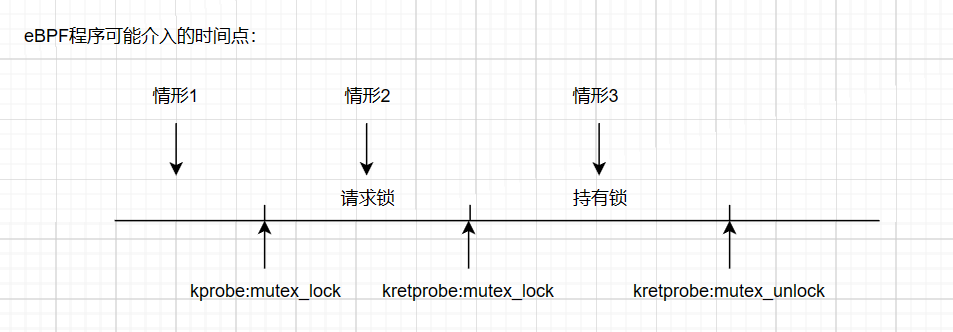
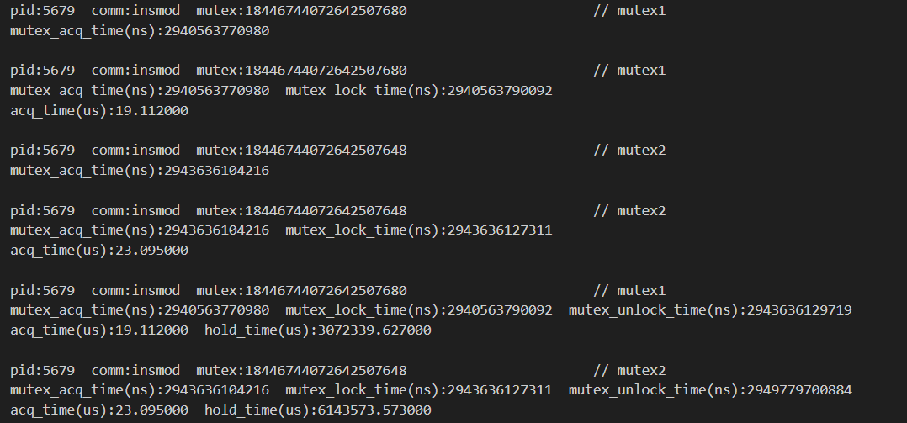

# mutex_development_record

## 开发思路

<div align='center'></div>

### 情形1

eBPF程序内核态程序设计：

- 挂载点选择：

  - kprobe:mutex_lock
  - kretprobe:mutex_lock
  - kretprobe:mutex_unlock

- 统计事件：

  ```
  struct mutex_event{
      int pid;
      char comm[TASK_COMM_LEN];
      long long unsigned int mutex_acq_time;
      long long unsigned int mutex_lock_time;
      long long unsigned int mutex_unlock_time;
  };
  ```

- kprobe:mutex_lock

  初始化mutex_event，完成pid、comm、mutex_acq_time数据的采集，并建立哈希map；通过ringbuf完成第一次输出。

- kretprobe:mutex_lock

  通过哈希map，找到mutex_event，并写入mutex_lock_time；通过ringbuf完成第二次输出。

- kretprobe:mutex_unlock

  通过哈希map，找到mutex_event，并写入mutex_unlock_time；通过ringbuf完成第三次输出。

eBPF程序用户态程序设计：

- 指定画像进程pid以及跟踪时间

- 对ringbuf中的事件进行分类输出

  ```
  if(e->mutex_unlock_time!=0){
      printf("pid:%d  comm:%s  mutex_acq_time:%llu  mutex_lock_time:%llu  mutex_unlock_time:%llu\n",
  		e->pid,e->comm,e->mutex_acq_time,e->mutex_lock_time,e->mutex_unlock_time);
  	acq_time = (e->mutex_lock_time - e->mutex_acq_time)*1.0/1000.0;
  	hold_time = (e->mutex_unlock_time - e->mutex_lock_time)*1.0/1000.0;
  	printf("acq_time:%lf  hold_time:%lf\n",acq_time,hold_time);
  }else if(e->mutex_lock_time!=0){
  	printf("pid:%d  comm:%s  mutex_acq_time:%llu  mutex_lock_time:%llu\n",
  		e->pid,e->comm,e->mutex_acq_time,e->mutex_lock_time);
  	acq_time = (e->mutex_lock_time - e->mutex_acq_time)*1.0/1000.0;
  	printf("acq_time:%lf\n",acq_time);
  }else{
  	printf("pid:%d  comm:%s  mutex_acq_time:%llu\n",
  		e->pid,e->comm,e->mutex_acq_time);
      }
  ```

虽然内核在互斥锁方面不允许递归的加锁解锁，但是对于内核模块，内核在这方面不会进行检查，如下进行实验验证：

递归加锁解锁代码逻辑：

```
printk(KERN_INFO "Hello from kernel module. PID: %d\n", pid);
mutex_lock(&mutex1);
mutex_lock(&mutex2);
write_hello_world("HELLO WORLD\n");
mutex_unlock(&mutex1);
mutex_unlock(&mutex2);
write_hello_world("hello world\n");
```

运行结果：

<div align='center'></div>

<div align='center'></div>

可以看到这个递归的加锁解锁的内核模块可以正常运行。基于这种情况，如果哈希map中的key仍只选用进程pid，那么将不适用异常进程的递归加锁解锁，因此，需在原有的基础上进行迭代，哈希map中的key设置为：

```
struct proc_mutex{
    int pad;
    int pid;
    long long unsigned int lock_ptr;
};
```

由于kretprobe无法获取函数的参数值，所以每次在kprobe处将互斥锁的地址存入哈希表（pid-lock_ptr），然后在kretprobe处通过进程pid获取相应的互斥锁地址，处理完后，删除该表项，以避免不必要的错误。

目前在程序代码中已完成迭代。

### 情形2

在请求锁期间，eBPF不存在合适的挂载点去获取互斥锁的地址，也就无法构建哈希map，因此这里不做编程实现，感兴趣的可以编写内核模块手动设置kprobe探针挂载到__mutex_trylock() 函数上去，以获取互斥锁的地址。正常情况下请求锁的时间很短，可以马上获取到互斥锁，针对进程长时间获取不到互斥锁的情况，后期可开发死锁检测的eBPF程序，找到进程长时间获取不到互斥锁的原因。

意外收获：

- 在BCC中，bpf_trace_printk() 函数用于调试

- 在libbpf中，bpf_printk() 函数用于调试（bpf_trace_printk() 函数被重新定义，与BCC中的bpf_trace_printk() 函数不同）

  在利用 bpf_printk() 函数调试的过程中发现：现在的bpf_printk只便于调试，在输出中加入任何无关参数的内容都不行了

### 情形3

在持有锁期间，进程所执行的代码是不确定的，所以在此期间没有特定的挂载点，无法利用eBPF程序进行实现。正常情况下进程也不会长时间持有锁，为了避免进程长时间持有锁，后期可开发死锁检测的eBPF程序，以便于对长时间持有锁的进程进行处理。

## 实验记录

### 情形1

#### 迭代前的实验

为了验证eBPF程序的正确性，设计测试程序mutex_test1.c（eBPF_Supermarket/eBPF_proc_image/test/mutex_test1.c），测试程序逻辑如下：

```
......
mutex_lock(&my_mutex);
ssleep(3); 					// Sleep for 3 seconds
mutex_unlock(&my_mutex);
......
```

运行结果：

<div align='center'></div>

实验分析：从运行结果中可以看出互斥锁的持有时间为3072189.468000微秒（即3.072189468秒），再结合测试程序，测试程序在持有锁期间睡眠3秒即释放锁，运行结果的误差在合理的范围之内，因此该程序在准确性上满足要求，可以成功的对情形1进行进程互斥锁的画像。

#### 迭代后的实验

为了测试迭代后的eBPF程序正确性，设计测试程序mutex_test2.c（eBPF_Supermarket/eBPF_proc_image/test/mutex_test2.c），测试程序逻辑如下：

```
......
mutex_lock(&mutex1);
ssleep(3);
mutex_lock(&mutex2);
mutex_unlock(&mutex1);
ssleep(6);
mutex_unlock(&mutex2);
......
```

运行结果：

<div align='center'></div>

实验分析：可以看出运行结果符合我们的测试程序逻辑，在持有锁时间方面，mutex1的持有锁时间为3072339.627000微秒（即3.072339627秒），mutex2的持有锁时间为6143573.573000微秒（即6.143573573秒），时间结果的误差在合理的范围之内，因此该程序在准确性上满足要求。