# 进程画像可视化指南

结合2023年开源之夏项目《使用 Prometheus 和 Grafana 构建 Linux 内核监控平台（基于 eBPF 程序采集内核数据）》进行的可视化开发

## 一、方案描述

通过进程画像工具将数据收集起来，并将其加载到Prometheus所支持的metrics中，利用http服务将metrics暴露出来，通过**Prometheus-server**即可实现定期对数据进行收集，将其保存到时序数据库中。再利用**grafana**平台连接Prometheus-server，通过简单的对图表和标签的设置，即可快速实现数据可视化，达到ebpf程序数据的直观展示。

数据流程及模块分解图如下所示：

<div align='center'>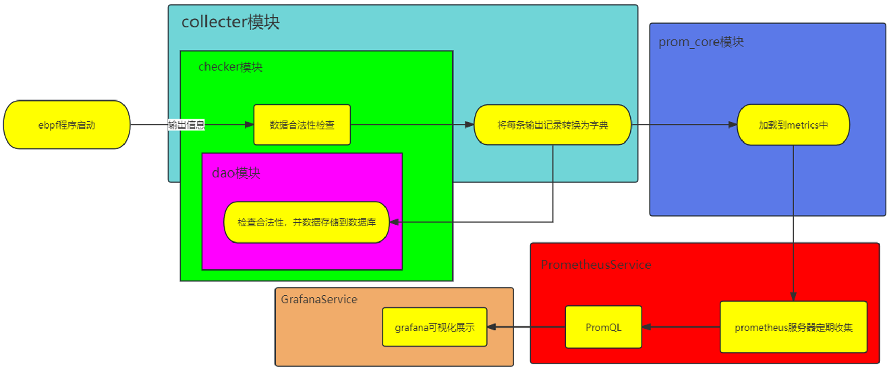</div>

## 二、Prometheus 介绍

Grafana是一个监控仪表系统，由Grafana Labs公司开源的的一个系统监测 (System Monitoring) 工具。帮助用户简化监控的复杂度，用户只需要提供需要监控的数据，它就**可以生成各种可视化仪表。同时它还支持报警功能，可以在系统出现问题时通知用户**。并且Grafana不仅仅只支持Prometheus作为查询的数据库，它还支持如下：

- Prometheus 
- Graphite
- OpenTSDB
- InfluxDB
- MySQL/PostgreSQL
- Microsoft SQL Serve
- 等等

## 三、Grafana 介绍

Prometheus是一个时间序列数据库。但是，它**不仅仅是一个时间序列数据库。它涵盖了可以绑定的整个生态系统工具集及其功能**。Prometheus主要用于对基础设施的监控，包括服务器(CPU、MEM等)、数据库(MYSQL、PostgreSQL等)、Web服务等，几乎所有东西都可以通过Prometheus进行监控。而**它的数据，则是通过配置，建立与数据源的联系来获取的**。

虽然Grafana可以从多种数据(如Prometheus、MySQL/PostgreSQL、OpenTSDB)等等中获取数据，不过Prometheus天生就是为了监控而生，所以我们用的最多的还是Prometheus。这也是我们的标配哦～

## 四、可视化平台

### (一) 可视化平台的代码框架

<div align='center'>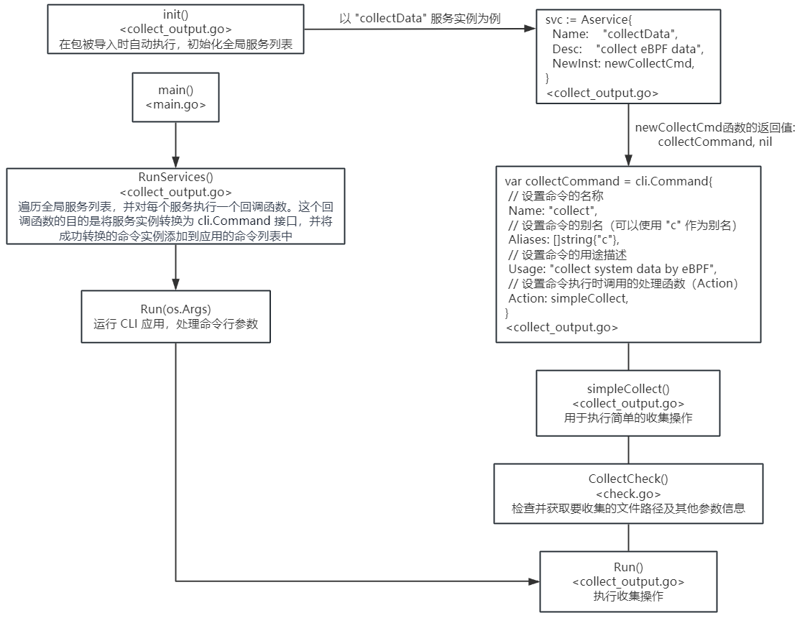</div>

### (二) 数据可视化方法

#### 1. 一般数据的可视化

如果数据的格式满足第一行是各项指标的名称，之后的每一行是数据，并都以空格分隔，那么即可使用一般数据可视化的方法。下面是一个实例：

输出数据：

```
TIME         READ/s  WRITE/s  FSYNC/s   OPEN/s CREATE/s
14:15:45:      1119       22        0       42        0
14:15:46:       831       28        0      726        0
```

可视化方法：

```
./data-visual collect example/vfsstat.py  # collect后接命令（命令中支持二级参数或flag）
```

#### 2. 未完待续。。。

## 五、进程画像的可视化

**首先安装docker**，安装方式参考：https://docs.docker.com/desktop/install/ubuntu/#install-docker-desktop ，在安装过程中会碰到一下问题：

- 执行指令 `sudo apt-get install ./docker-desktop-4.26.1-amd64.deb` 时会遇到报错：

  ```
  The following packages have unmet dependencies:
   docker-desktop : Depends: qemu-system-x86 (>= 5.2.0) but it is not installed
                    Depends: docker-ce-cli but it is not installable
                    Depends: pass but it is not installed
                    Depends: uidmap but it is not installed
  E: Unmet dependencies. Try 'apt --fix-broken install' with no packages (or specify a solution).
  ```

  解决方法：运行以下命令，尝试修复破损的依赖项：

  ```
  sudo apt --fix-broken install
  ```

- 但是还会出现如下报错：

  ```
  The following packages have unmet dependencies:
   docker-desktop : Depends: docker-ce-cli but it is not installable
  E: Unable to correct problems, you have held broken packages.
  ```

  解决方法：使用Docker官方安装脚本，该脚本将帮助你安装Docker及其相关组件。在终端中执行以下命令：

  ```
  curl -fsSL https://get.docker.com -o get-docker.sh
  sudo sh get-docker.sh
  ```

  最后问题成功解决，成功安装Docker Desktop

**进程画像的可视化以进程资源使用情况中的CPU利用率的可视化为例进行讲解：**

- 进入lmp/eBPF_Visualization/eBPF_prometheus目录

- 执行`make`指令，编译可视化的go语言工具

- 执行`make start_service`指令，配置下载docker镜像并启动grafana和prometheus服务

- 执行如下指令开始采集数据以及相关处理：

  ```
  ./data-visual collect /home/zhang/lmp/eBPF_Supermarket/CPU_Subsystem/eBPF_proc_image/proc_image -r -p 16279
  ```

- 个人喜欢在主机上进行可视化设置，这样方便快捷，所以在主机上打开网址http://192.168.109.150:8090/metrics （其中192.168.109.150是虚拟机网络接口的IPv4地址），可以看到暴露在http网页中的数据：

  <div align='center'>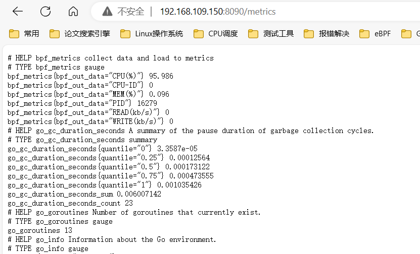</div>

- 在主机上访问http://192.168.109.150:9090/ 可对prometheus-server进行管理，进入Status-Targets,即可看到metrics的状态：

  <div align='center'>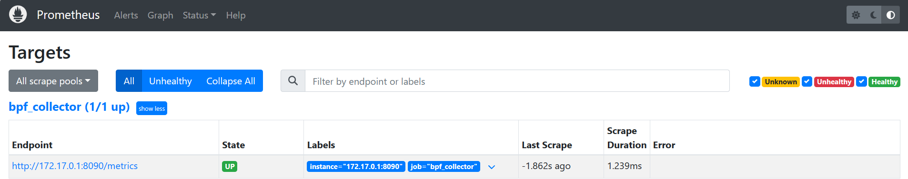</div>

- 在主机上访问http://192.168.109.150:3000/ 即可进入grafana服务，使用初始密码登录（user:admin pswd: admin）进入管理界面：

  - 点击【Home-Connection-Add new connection】，选择Prometheus，建立与Prometheus服务器的连接：

    <div align='center'>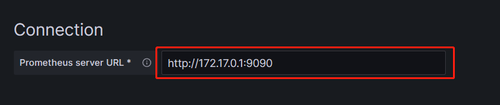</div>

    这个172.17.0.1表示docker0网桥的 IPv4 地址。在 Docker 中，通常会将docker0的第一个 IP 地址分配给Docker主机自身。因此，172.17.0.1是 Docker主机上Docker守护进程的 IP 地址，所以在Grafana数据源这块设置成http://172.17.0.1:9090 ，然后点击下面的【Save & test】按钮

  - 进入可视化配置界面：

    <div align='center'></div>

    <div align='center'>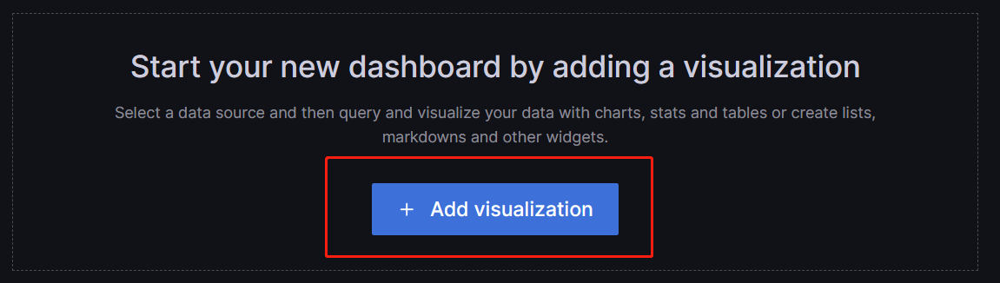</div>

    <div align='center'>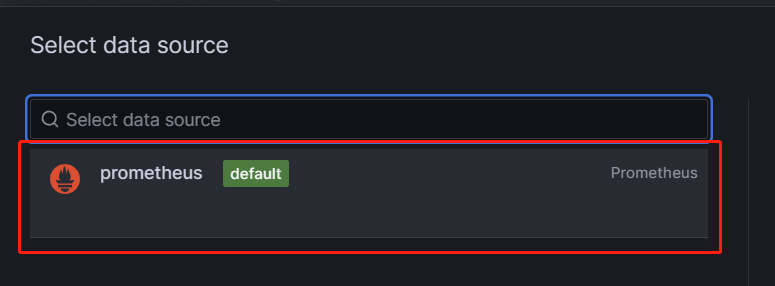</div>

  - 在下方处进行如图所示的配置，点击Run queries即可以可视化的方式监控CPU字段的数据：

    <div align='center'>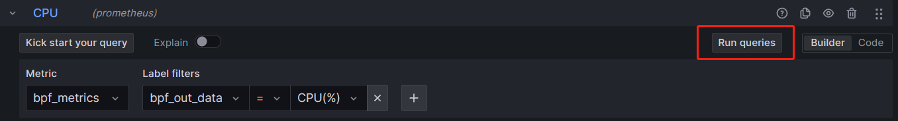</div>

    <div align='center'>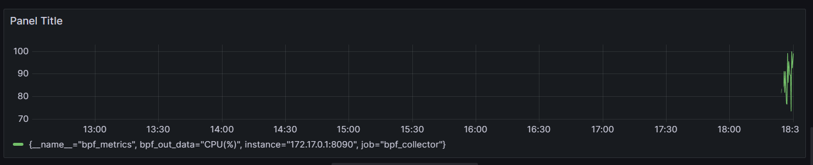</div>

  - 仪表盘右侧是对图像的一些调整，可以选择想要的可视化效果，也可对图像效果进行调整，例如颜色图形样式等：

    <div align='center'>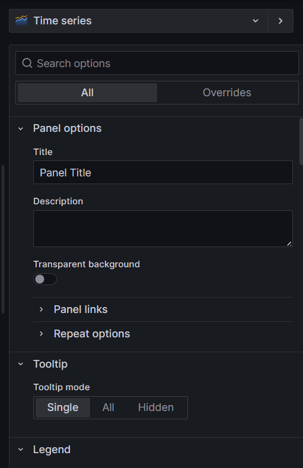</div>

  - 在一切都设置好之后可以点击【Apply】按钮，即可生成一个可视化板块：

    <div align='center'>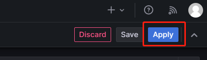</div>

    <div align='center'>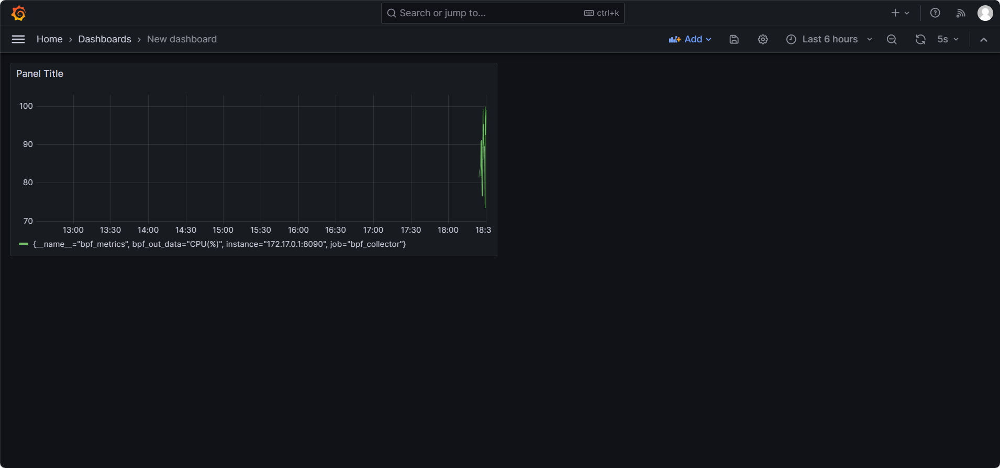</div>