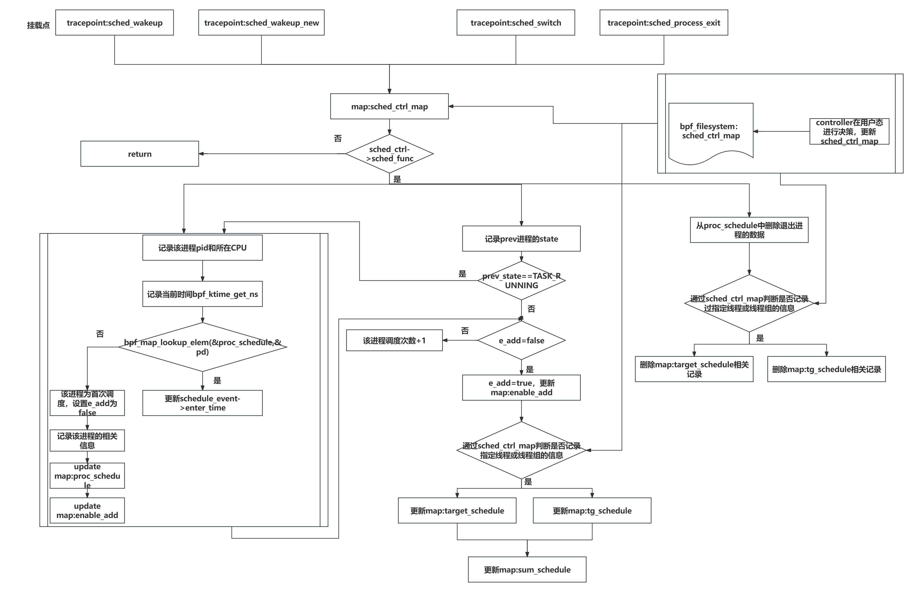
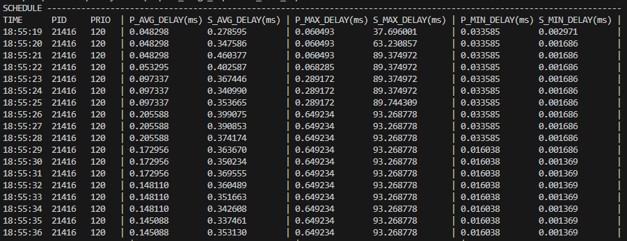

# Schedule_delay工具使用说明

​	Schedule_delay工具是用来检测系统中调度延时的工具，该工具可以监测特定线程或线程组、以及整个系统的调度延迟(最大、最小、平均)。即从一个任务具备运行的条件，到真正执行（获得 CPU 的执行权）的这段时间。实时观测该指标可以帮助我们了解到当前操作系统的负载。

## 原理讲解

​	该工具使用六个map来控制工具的行为和存储数据与用户态交互。分别为：

- **ARRAY MAP**`sched_ctrl_map`:作为调度控制信息的存储,策略上将该map pin到bpf文件系统，即可在用户态更新该map,与内核态交互。其value为`struct sched_ctrl`：

```c
struct sched_ctrl {
    bool sched_func; // 控制是否记录调度相关事件
    pid_t target_pid; // 目标进程的 PID
    int target_cpu_id; // 目标 CPU 的 ID
    pid_t target_tgid; // 目标线程组的 TGID
};
```

​	通过这些控制信息，可以控制该工具在内核态的行为。

- **HASH MAP**`enable add`:用来记录进程是否被调度过，以避免重复计数或错误计数。

- **HASH MAP**`proc_schedule`：用于存储和跟踪每个进程的调度事件信息，key为进程的id和cpu_id,value为` struct schedule_event`:

```c
struct schedule_event {
    pid_t pid;            // 进程ID
    int tgid;             // 线程组ID
    int prio;             // 进程优先级
    u32 count;            // 调度次数
    u64 enter_time;       // 进入调度的时间
    u64 sum_delay;        // 累计调度延迟
    u64 max_delay;        // 最大调度延迟
    u64 min_delay;        // 最小调度延迟
};
```

- **HASH MAP**`target_schedule`：用于存储指定**线程**的调度信息，value为` struct schedule_event`，在用户态通过更新`sched_ctrl_map`指定要记录的线程。
- **HASH MAP**`tg_schedule`：用于存储指定**线程组**的调度信息，value为` struct schedule_event`，在用户态通过更新`sched_ctrl_map`指定要记录的线程组。

- **ARRAY MAP**`sys_schedule`:用于记录整个系调度延时，value为`struct sum_schedule:`

```c
struct sum_schedule {
    long long unsigned int sum_count; // 总调度次数
    long long unsigned int sum_delay; // 总调度延迟
    long long unsigned int max_delay; // 最大调度延迟
    long long unsigned int min_delay; // 最小调度延迟
};
```

**代码逻辑图如下：**	



## 2.使用方法

### 2.1编译

​	首先在`lmp/eBPF_Supermarket/CPU_Subsystem/eBPF_proc_image`目录下进行编译操作。

```shell
make
```

​	编译成功后，会生成两个可执行文件`proc_image`,`controller`。

### 2.2挂载

​	在`lmp/eBPF_Supermarket/CPU_Subsystem/eBPF_proc_image`目录下运行 `proc_image`可执行文件。

​	使用-S选项挂载检测调度延迟的几个挂载点：

```shell
sudo ./proc_image -S
```

```
sudo ./proc_image -S
......
libbpf: map 'sched_ctrl_map': created successfully, fd=3
libbpf: map 'proc_schedule': created successfully, fd=4
libbpf: map 'enable_add': created successfully, fd=5
libbpf: map 'target_schedule': created successfully, fd=6
libbpf: map 'tg_schedule': created successfully, fd=7
libbpf: map 'sys_schedule': created successfully, fd=8
libbpf: map 'schedule.rodata': created successfully, fd=9
libbpf: pinned map '/sys/fs/bpf/proc_image_map/sched_ctrl_map'
```

​	此时用户态内核态交互的**sched_ctrl_map**已经pin上，现在我们可以通过controller执行文件来更改输出策略。

### 2.3用户态控制交互

​	可使用`controller`工具和内核态进行交互，控制输出。

​	重启一个终端, 在`lmp/eBPF_Supermarket/CPU_Subsystem/eBPF_proc_image`目录下运行 `controller`可执行文件。

​	使用schedule_image工具的不同参数，控制该工具的使用策略：

| 参数 |                        |
| :--: | ---------------------- |
|  -S  | 使用schedule_image工具 |
|  -a  | 激活schedule_image工具 |
|  -p  | 指定目标线程           |
|  -P  | 指定目标线程组         |
|  -c  | 指定检测CPU            |
|  -t  | 指定检测时间           |

通过以下指令更改控制策略：	

- 激活对线程21416的调度延迟进行监测：

  ```
   sudo ./controller -S -a -p 21416
  ```

- 激活对线程组21416的调度延迟进行监测：

  ```
   sudo ./controller -s -a -p 21416
  ```

- 关闭对线程21416的调度延迟进行监测：

  ```
   sudo ./controller -S -d -p 21416
  ```

- 关闭对线程组21416的调度延迟进行监测：

  ```
   sudo ./controller -S -d -P 21416
  ```

- 检测整个系统的调度延迟：

  ```
   sudo ./controller -S -a
  ```

- 关闭进程画像工具：

  ```
   sudo ./controller -f
  ```

#### 2.4 输出

​	对线程21416的调度延迟进行监测，可以看到指定进程的调度延迟信息，包括该线程最大、最小、平均的调度延迟（P_xxx_DELAY），以及整个系统的最大、最小、平均的调度延迟（S_xxx_DELAY）。
