# 数据真实性测试

本次测试工作主要包括：

* 针对进程画像的每个功能，涉及测试用例，在逻辑上验证ebpf程序的正确性；
* 学习使用LTTng工具，通过该工具实现相同或相似功能，将测试用例在使用在LTTng工具上，验证进程画像相应工具数据的正确性；
* 学习使用trace compass可视化性能分析工具，将LTTng监测出的数据放在trace compass上查看进程流程，并根据LTTng工具提供的技术文档来梳理不同数据见的关系;
* 输出数据关联性文档;

## 0.准备工作：

学习使用LTTng 来监测数据;

学习将LTTng生成的文件在compass上跑出来,并分析;

### 0.1.LTTng学习使用:

[linux下 LTTng使用详细说明_no package 'liburcu' found-CSDN博客](https://blog.csdn.net/mao_hui_fei/article/details/120654095)

```c
lttng create my-session
lttng enable-event --kernel sched_switch
lttng add-context --kernel --type pid --type tid
lttng track --kernel --pid <pid>
lttng track --kernel --tid <tid>
lttng start
# 运行你想监控的进程或线程
lttng stop
lttng view
lttng destroy
```

### 0.2.trace compass

[Trace Compass User Guide - LTTng Kernel Analysis (eclipse.org)](https://archive.eclipse.org/tracecompass/doc/stable/org.eclipse.tracecompass.doc.user/LTTng-Kernel-Analysis.html#Control_Flow_View)

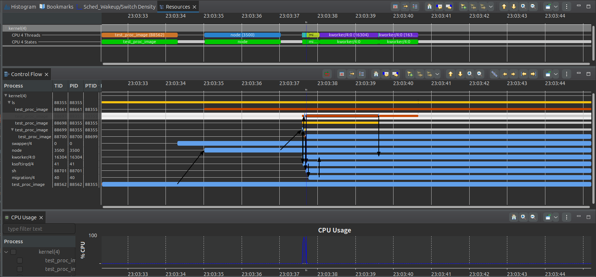

## 1.keytime_image

keytime_image 是一个用于捕获进程关键时间点的工具，聚焦于进程何时创建（fork，vfork, pthread_create）,何时上CPU，何时下CPU，何时执行execve等。通过ebpf技术将其挂载固定的挂载点上，并在进程发生以上几种行为时进行数据收集，并对数据进行处理，可以通过数据描绘出进程在关键时间点上的行为；

本次测试以及数据关联工作分为三部分：

* keytime_image工具逻辑正确性的测试；
* keytime_image工具数据正确性的测试；
* keytime_image工具数据的关联关系，以及原理梳理；

### 1.1 测试用例 test_keytime

为了完成以上三步测试与数据关联工作，需要涉及一个测试用例，使用该测试用例可以测试keytime_image工具的逻辑正确性，并通过和lttng工具测试的结果进行对比，判断keytime_image数据正确性；

#### 1.1.1 测试用例设计思路

测试用例主要目的是为了模拟一个进程的一组行为，包括keytime_image所检测的关键时间点，从而查看keytime_image在进程行为观测上是否正确无误；

测试用例主要思路

* 对测试用例进程进行cpu绑核,提高优先级,保证当前cpu仅运行一个或一组进程;
* 分别通过fork,vfork创建新进程;
* 通过pthread_create创建3个不同的线程,并将三个线程绑核,保证整个线程组在同一个cpu上运行;
	* 线程1:执行cpu密集型任务;
	* 线程2:执行mem密集型任务;
	* 线程3:执行io密集型任务;
	* 注意:这三个线程会存在抢占cpu现象,这是由于三者的优先级一致;
* 通过sleep(3),让当前进程从绑定的cpu上下来,当睡眠结束,进程则会上cpu;
* 通过execve();,让测试程序执行指定的操作,方便测试keytime_image能否监测到进程执行execve;
* 如果execve()执行失败,则执行exit来终止进程;

### 1.1.2 测试脚本:

在通过测试用例对keytime_image工具进行逻辑正确性的验证之后,需要验证keytime_image工具采集到的数据是否是可靠的;

这里通过一个测试脚本实现keytime_image工具和lttng同时监测测试用例的数据，并将数据导出；

### 1.2 结果分析：

通过测试用例和测试脚本，对keytime_image工具的逻辑正确性和数据正确性进行了评估，本小节将针对输出的数据进行正确性检测；

#### 1.2.1.逻辑正确性：

通过脚本，可以获取到keytime_image监测测试用例进程的全过程；以下是输出的数据：

```shell
KEYTIME -------------------------------------------------------------------------------------------------
TIME      PID     EVENT            ARGS/RET/OTHERS
14:46:20  125532  onCPU            oncpu_time:50032701454776 
14:46:20  125532  offCPU           offcpu_time:50032701499005
14:46:22  125532  onCPU            oncpu_time:50035264147470 
14:46:22  125532  forkP_enter      child_pid:127606 
14:46:22  125532  offCPU           offcpu_time:50035264461066
14:46:24  125532  forkP_exit       child_pid:127606 
14:46:24  125532  onCPU            oncpu_time:50037265018542 
14:46:24  125532  offCPU           offcpu_time:50037265183095
14:46:24  125532  vforkP_enter     child_pid:128805 
14:46:26  125532  vforkP_exit      child_pid:128805 
14:46:26  125532  onCPU            oncpu_time:50039273327870 
14:46:26  125532  createT_enter    child_pid:129392 
14:46:26  125532  createT_enter    child_pid:129393 
14:46:26  125532  createT_enter    child_pid:129394 
14:46:26  125532  offCPU           offcpu_time:50039273813650
14:46:29  125532  createT_exit     child_pid:129393 
14:46:29  125532  createT_exit     child_pid:129392 
14:46:29  125532  onCPU            oncpu_time:50042307545368 
14:46:29  125532  offCPU           offcpu_time:50042307567649
14:46:29  125532  onCPU            oncpu_time:50042411845305 
14:46:29  125532  offCPU           offcpu_time:50042411869110
14:46:29  125532  createT_exit     child_pid:129394 
14:46:29  125532  onCPU            oncpu_time:50042412175342 
14:46:29  125532  offCPU           offcpu_time:50042412370717
14:46:32  125532  onCPU            oncpu_time:50045412482772 
14:46:32  125532  exec_enter       /bin/ls -l 
14:46:32  125532  offCPU           offcpu_time:50045412900824
14:46:32  125532  onCPU            oncpu_time:50045413164136 
14:46:32  125532  offCPU           offcpu_time:50045413644970
14:46:32  125532  onCPU            oncpu_time:50045414001685 
14:46:32  125532  exec_exit        0 
14:46:32  125532  exit             0 
14:46:32  125532  offCPU           offcpu_time:50045415933416

```

结合测试用例在执行特定操作时的时间节点输出，可以验证在特定时间点，keytime_image是否正确捕获测试进程的该行为：

```shell
#PID125532绑定CPU4：√
#PID125532 被绑定在以下cpu上: 4 
test_proc进程的TGID:125532       PID:125532      CPU_id:4
输入任意数字继续程序的运行:
程序开始执行...

KEYTIME_TEST-----------------------------------------------

fork逻辑------------------------:
fork开始时间2024-07-11 14:46:22
(fork)子进程pid:127606,睡眠2s后退出
fork结束时间2024-07-11 14:46:24
(fork)pid为127606的子进程退出

输入任意数字开始测试vfork:vfork逻辑------------------------:
vfork开始时间2024-07-11 14:46:24
(vfork)子进程pid:128805,睡眠2s后退出
vfork退出时间2024-07-11 14:46:26
(vfork)pid为128805的子进程退出

输入任意数字开始测试 pthread_create:pthread_create逻辑------------------------:
pthread_create开始时间2024-07-11 14:46:26

  #3.PID:129394 TGID:125532
    #PID129394绑定CPU4：√
    #PID129394 被绑定在以下cpu上: 4 
  #IO密集型

  #2.PID:129393 TGID:125532
    #PID129393绑定CPU4：√
    #PID129393 被绑定在以下cpu上: 4 
  #MEM 密集型

  #1.PID:129392 TGID:125532
    #PID129392绑定CPU4：√
    #PID129392 被绑定在以下cpu上: 4 
  #CPU密集型
    #129393退出
    #129392退出
    #129394退出
pthread_create结束时间2024-07-11 14:46:29

输入任意数字开始测试 上下cpu:进程上下CPU逻辑------------------------:
CPU sleep 开始时间2024-07-11 14:46:29
CPU sleep 结束时间2024-07-11 14:46:32
程序睡眠3s!

输入任意数字开始测试 execve:execve开始时间2024-07-11 14:46:32
execve逻辑------------------------:
total 60
-rw-rw-r--  1 xhb  xhb    194 Jul  9 10:51 Makefile
drwxrwxr-x  5 xhb  xhb   4096 Jul 11 14:46 ebpf
-rwxr-xr-x  1 xhb  xhb    995 Jul 10 23:10 ebpf_test.sh
drwxrwx--- 18 xhb  xhb   4096 Jul 11 14:46 lttng-traces
-rwxr-xr-x  1 xhb  xhb   1913 Jul 10 23:02 test_keytime.sh
-rwxr-xr-x  1 root root 26256 Jul 11 04:43 test_proc_image
-rw-rw-r--  1 xhb  xhb   9493 Jul 11 04:45 test_proc_image.c
```

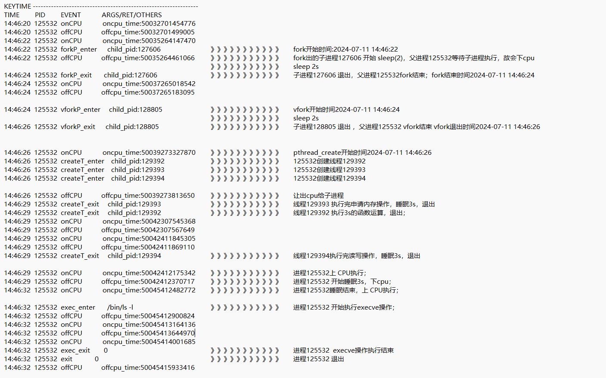

通过对比测试用例关键点的时间和行为，与keytime_image关键点的时间完全一致，且keytime_image可以观测到进程执行cpu、mem、io等行为；至此我们可以得出结论，keytime_image逻辑正确，功能可用；

#### 1.2.2 数据正确性

通过将keytime_image获取的数据同lttng作对比，便可得到  进程的整体行为是否正确，数据获取是否正确，描述该行为需要哪些数据进行关联；

这里通过多次测试（包括但不限于指定某一进程进行数据采集，指定某一个线程组进行数据采集，不指定固定进程或线程采集全部数据信息），均证明可以证明keytime_image获取到的数据是真实可靠且可以描绘进程关键时间点行为的。原始数据在这里：

keytime_image测出的数据：[keytime_image测试数据详细](../data/output.log)

lttng 测出的数据：
- [lttng 测试数据表](../data/keytime_test_data.csv)
- [lttng 测试数据详细](../data/trace_data.txt)

### 1.3.关键数据点的关联关系

通过lttng检测到的数据以及在trace compass上可以看到进程的行为跟踪图，我们这里可以根据lttng所提供的关键数据点指导进程行为分析，从而将这些数据关联到一起。本小节将找到这些关键数据点，并依据内核中的香相关原理来指导进程行为分析。

keytime_image关注点在一个进程或线程，我们以125532进程为例，分析keytime_image观测到该进程的具体行为，该进程的行为众多，这里值分析典型行为：创建进程，上下cpu，执行execve，以及进程退出：

#### 1.3.1 创建进程：

由于lttng关于进程创建的跟踪点为 sched_process_fork 只能识别进程创建了子进程，不能识别到通过什么方式创建的，而keytime_image可以通过uprobe和uretpobe识别到时是fork、vfork还是pythreat_create创建的子进程或线程；

##### 1.3.1.1 fork

**【22:811111842】**

- 行为：主体进程125532，fork出子进程127606 

- 数据点：父进程的信息，子进程的信息；

	* parent_comm = "test_proc_image", parent_tid = 125532, parent_pid = 125532； 

	* child_comm = "test_proc_image", child_tid = 127606，child_pid = 127606；
	* cpu_id = 4；

- 原理：lttng的挂载点在sched_process_fork上，记录了父进程的信息，子进程的信息，以及在哪个cpu上进行的fork；而我们的keytime_image则将挂载点放在了用户态fork上，可以看到父进程fork开始和fork结束的时间；这一点相较于lttng关注到了用户态，更细节；

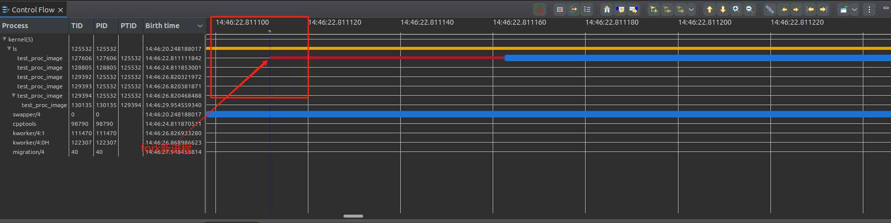

##### 1.3.1.2 vfork

**【24:811853001】**

- 行为：主体进程125532 vfork 出子进程128805；

- 数据点：父进程的信息，子进程的信息；

	-  prev_comm = "test_proc_image", prev_tid = 125532，prev_prio = 20, prev_state = 1； 

	- next_comm = "test_proc_image", next_tid = 127606, next_prio = 20；

- 原理：lttng的挂载点在sched_process_fork上，记录了父进程的信息，子进程的信息，以及在哪个cpu上进行的fork；而我们的keytime_image则将挂载点放在了用户态vfork上，可以看到父进程vfork开始和fork结束的时间；并且可以知道父进程是如何创建了子进程,这一点相较于lttng关注到了用户态，更细节；

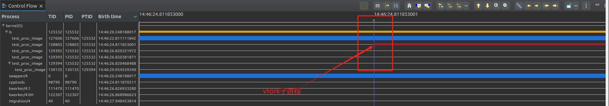

##### 1.3.1.3 pthread_create

**【26:820321972】**

- 行为：主体进程125532创建线程129392，
- 数据点：父进程的信息，子进程的信息；
	* parent_comm = "test_proc_image", parent_tid = 125532, parent_pid = 125532；
	* child_comm = "test_proc_image", child_tid = 129392，child_pid = 125532
- 原理：lttng的挂载点在sched_process_fork上，记录了父进程的信息，子进程的信息，以及在哪个cpu上进行的fork；而我们的keytime_image则将挂载点放在了用户态上pthread_create，可以看到父进程pthread_create开始和fork结束的时间；并且可以知道父进程是如何创建了子进程,这一点相较于lttng关注到了用户态，更细节；

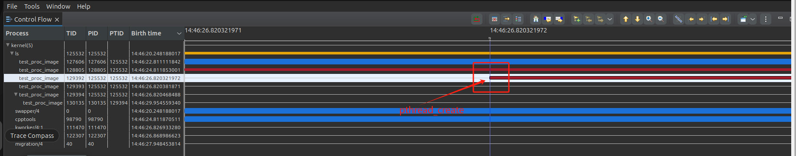

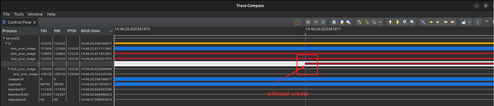

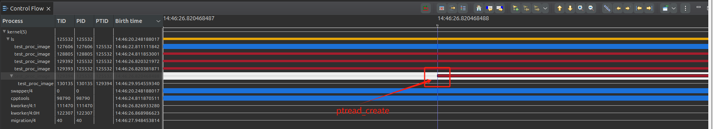


#### 1.3.2 上下CPU：

上下CPU是CPU调度时产生的进程行为，由于不同的调度策略会使不同的进程上下CPU，一般进程上下CPU是在linux内核函数中的`__schedule()`中实现的，具体是通过`__schedule()–>pick_next_task()`选择下一个要上CPU的进程，`__schedule()–>context_switch()`进行上下文切换，完成进程上下CPU操作；

keytime_image和lttng都关注到`__schedule()`中的一个静态挂载点：`sched_switch`，此时cpu知道了哪个进程下cpu，哪个进程上cpu，故而该关键点处的数据便可以描绘出进程上下cpu的行为；

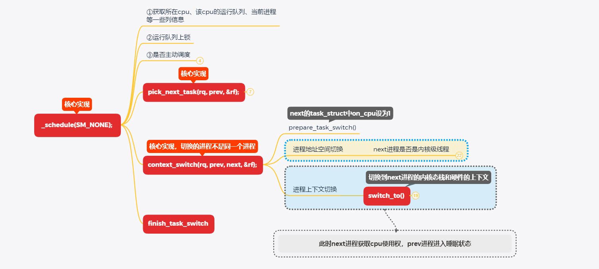

测试用例中涉及到了很多上下CPU的情况，此处将分析主体进程创建的三个线程129392,129393,129394三者之间在CPU4上的切换情况。

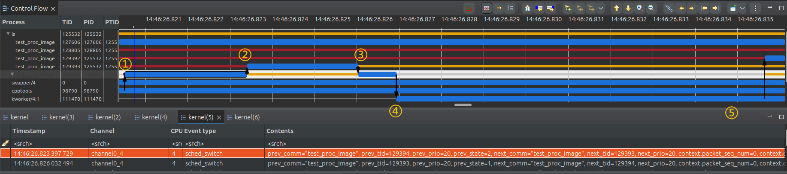

**【26:820503574】**

- 行为：主体进程125532让出cpu，子进程 129394上CPU；
- 数据点：上CPU进程信息，下CPU进程信息；
	- prev_comm = "test_proc_image", prev_tid = 125532, prev_prio = 20, prev_state = 1,；
	- next_comm = "test_proc_image", next_tid = 129394, next_prio = 20； 
- 原理：挂载点在sched_switch上，记录了进程在cpu上切换的数据，哪个进程下cpu，哪个进程上cpu；

**【26:823397729】**

- 行为：线程129394让出cpu，子进程 129393上CPU；
- 数据点：上CPU进程信息，下CPU进程信息；
	- prev_comm = "test_proc_image", prev_tid = 129394, prev_prio = 20, prev_state = 2;
	- next_comm = "test_proc_image", next_tid = 129393, next_prio = 20；
- 原理：挂载点在sched_switch上，记录了进程在cpu上切换的数据，哪个进程下cpu，哪个进程上cpu；

**【26:826032494】**

- 行为：线程129393让出cpu，子进程  129394上CPU；
- 数据点：上CPU进程信息，下CPU进程信息；
	- prev_comm = "test_proc_image", prev_tid = 129393, prev_prio = 20, prev_state = 1；
	- next_comm = "test_proc_image", next_tid = 129394, next_prio = 20 ;
- 原理：挂载点在sched_switch上，记录了进程在cpu上切换的数据，哪个进程下cpu，哪个进程上cpu；

**【26:826933280】**

- 行为：线程129394让出cpu，线程 111470上CPU；
- 数据点：上CPU进程信息，下CPU进程信息；
	- prev_comm = "test_proc_image", prev_tid = 129394, prev_prio = 20, prev_state = 256；
	- next_comm = "kworker/4:1", next_tid = 111470, next_prio = 20；
- 原理：挂载点在sched_switch上，记录了进程在cpu上切换的数据，哪个进程下cpu，哪个进程上cpu；

**【26:835640901】**

- 行为：线程129394让出cpu，线程129392上CPU；
- 数据点：上CPU进程信息，下CPU进程信息；
	- prev_comm = "test_proc_image", prev_tid = 129394, prev_prio = 20, prev_state = 2；
	- next_comm = "test_proc_image", next_tid = 129392, next_prio = 20
- 原理：挂载点在sched_switch上，记录了进程在cpu上切换的数据，哪个进程下cpu，哪个进程上cpu；

通过以上数据就可将keytime_image工具所监测到的数据所描述的进程行为描述出来，做到上下CPU这个行为的数据关联；


#### 1.3.3 execve执行：

execve是进程所执行的一个程序，它是进程的一种行为，会替换当前进程的地址空间，并加载并执行一个新的程序，这里`execve` 不创建新进程，而是替换当前进程。

keytime_image工具通过挂载点sys_enter_execve、sys_exit_execve对进程execve行为进行监测，而lttng通过sched_process_exec实现相同的数据监测。

**【32:960747436】**

- 行为：线程 125532,执性程序/bin/ls;
- 数据点：哪个进程/线程在执行，执行的命令，下CPU进程信息；
	- filename = "/bin/ls", tid = 125532, old_tid = 125532；

* 原理：挂载点在sched_process_exec，或sys_enter_execve、sys_exit_execve上，用户态进程执行execve时会通过系统调用在内核中进行相关操作，通过sys_enter_execve、sys_exit_execve便可以获取到用户态进程执行的execve信息；

#### 1.3.4 exit 执行：

exit可以用于终止进程, 会导致当前进程的执行终止，并返回一个退出状态码给操作系统；同execve一样，exit会通过系统调用到内核中实现终止进程的操作；所以我们在sys_enter_exit、sys_enter_exit_group两处进行插装，获取到关于进程退出时的相关数据，这里主要是进程退出时间的统计；

**【32:962637158】**

- 行为：进程 125532, 退出;
- 数据点：哪个进程/线程，在什么时间点退出；
	- pid : 125532    exit             ret :0；

- 原理：挂载点在sys_enter_exit、sys_enter_exit_group上，用户态进程执行exit时会通过系统调用在内核中进行相关操作，通过sys_enter_exit、sys_enter_exit_group便可以获取到用户态进程终止时的信息；


## 2.lock_image

lock_image 是一个用于捕获进程持有用户态锁的工具，聚焦于进程持有的所有用户态锁(互斥锁、自旋锁、读写锁)。通过ebpf技术将其挂载固定的挂载点上，并在进程持有以上几种锁时进行数据收集，并对数据进行处理；

本次测试以及数据关联工作分为三部分：

- lock_image工具逻辑正确性的测试；
- lock_image工具数据正确性的测试；
- lock_image工具数据的关联关系，以及原理梳理；

### 2.1 测试用例 test_lock

为了完成以上三步测试与数据关联工作，需要设计一个测试用例，使用该测试用例可以测试lock_image工具的逻辑正确性，并通过和lttng工具测试的结果进行对比，判断lock_image数据正确性；

lock_image工具关注的是进程持有用户态锁的情况，故需要用到lttng-ust，我们需要在lttng中自定义跟踪函数用以跟踪测试用例中涉及到的进程对锁的相关行为；

#### 2.1.1 测试用例设计思路

测试用例主要目的是为了模拟进程或线程成功持有锁、未成功持有锁以及争用一个锁的情景。

测试用例主要思路

- 对测试用例进程进行cpu绑核,提高优先级,保证当前cpu仅运行一个或一组进程;
- 分别定义一个自旋锁、互斥锁以及读写锁并初始化，用于线程争用持有这些锁，来查看lock_image是否能准确的获取到线程持有锁的状态以及锁的信息；
- 创建两个线程分别去申请持有提前定义好的锁，并在特殊点插入lttng-ust跟踪函数，用来和lock_image进行数据对比；
	- 线程1分别去持有互斥锁、解锁互斥锁，持有读写锁-写锁、释放读写锁，持有自旋锁、释放自旋锁；
	- 考虑到创建线程2的时间稍晚于线程1，故通过pthread_mutex_trylock等函数去尝试持有互斥锁1（这里涉及到pthread_mutex_lock，pthread_mutex_trylock实现方式差别，后面会提到），若尝试失败，则通过pthread_mutex_trylock去持有互斥锁2；读写锁和自旋锁同理；

#### 2.1.2 lttng-ust跟踪用户应用事件

由于lttng不能像ebpf一样方便的使用uprobe和uretprobe来跟踪用户态的函数，所以我们要自己定义适合本次测试用例的跟踪点定义文件，并将`lttng_ust_tracepoint`加在测试用例相应的跟踪位置；

我们以mutex互斥锁为例，展示线程触发互斥锁时相关跟踪点的定义，其余锁类似：

- 请求互斥锁时的跟踪点；

```c
TRACEPOINT_EVENT(
    lock_monitor,
    mutex_lock_start,
    TP_ARGS(int, thread_id, void*, lock_ptr, long long unsigned int, time),
    TP_FIELDS(
        ctf_integer(int, thread_id, thread_id)
        ctf_integer_dec(void*, lock_ptr, lock_ptr)
        ctf_integer(long long unsigned int, time, time)
    )
)
```

- 获取互斥锁成功的跟踪点：

```c
TRACEPOINT_EVENT(
    lock_monitor,
    mutex_lock_acquired,
    TP_ARGS(int, thread_id, void*, lock_ptr, long long unsigned int, time),
    TP_FIELDS(
        ctf_integer(int, thread_id, thread_id)
        ctf_integer_dec(void*, lock_ptr, lock_ptr)
        ctf_integer(long long unsigned int, time, time)
    )
)
```

- 互斥锁解锁成功的跟踪点：

```c
TRACEPOINT_EVENT(
    lock_monitor,
    mutex_lock_released,
    TP_ARGS(int, thread_id, void*, lock_ptr, long long unsigned int, time),
    TP_FIELDS(
        ctf_integer(int, thread_id, thread_id)
        ctf_integer_dec(void*, lock_ptr, lock_ptr)
        ctf_integer(long long unsigned int, time, time)
    )
)
```

- 尝试申请互斥锁的跟踪点，对应`pthread_mutex_trylock`函数

```c
TRACEPOINT_EVENT(
    lock_monitor,
    mutex_trylock_start,
    TP_ARGS(int, thread_id, void*, lock_ptr, long long unsigned int, time),
    TP_FIELDS(
        ctf_integer(int, thread_id, thread_id)
        ctf_integer_dec(void*, lock_ptr, lock_ptr)
        ctf_integer(long long unsigned int, time, time)
    )
)
```

通过以下指令，将跟踪点定义文件生成跟踪点头文件和实现文件：

```shell
lttng-gen-tp lock_tracepoint.tp
```

这将生成 `lock_tracepoint.h` 和 `lock_tracepoint.c` 文件,便可以将我们定义的跟踪点用在测试用例中，以下是一个示例：

```c
#include <lttng/tracepoint.h>
#include "lock_tracepoint.h"
...
void *thread_lock_func1(void *arg) {
	...
	/*准备开始申请互斥锁*/
	tracepoint(lock_monitor, mutex_lock_start, tid,&mutex1,(long long unsigned int)(ts.tv_sec*1000000000+ts.tv_nsec));
	pthread_mutex_lock(&mutex1)；
    /*锁申请成功*/
	tracepoint(lock_monitor, mutex_lock_acquired, tid,&mutex1,(long long unsigned int)(ts.tv_sec*1000000000+ts.tv_nsec));
    ...
}
```

编译时将我们定义好的lttng跟踪点头文件包含在测试用例中，并进行编译和链接：

```shell
gcc -o test_lock lock_monitor.c lock_tracepoint.c -lpthread -llttng-ust
```

#### 2.1.3 测试脚本:

在通过测试用例对lock_image工具进行逻辑正确性的验证之后,需要验证lock_image工具采集到的数据是否是可靠的;

这里通过一个测试脚本实现lock_image工具和lttng同时监测测试用例的数据，并将数据导出；

```shell
#!/bin/bash

# 获取脚本所在目录的绝对路径
SCRIPT_DIR=$(cd "$(dirname "${BASH_SOURCE[0]}")" && pwd)

# 指定输出目录
OUTPUT_DIR="$SCRIPT_DIR/lttng-traces/lock_test_$(date +'%Y%m%d_%H:%M:%S')"
CSV_FILE="$OUTPUT_DIR/lock_test_data.csv"
mkdir -p "$SCRIPT_DIR/ebpf/ebpf_output_$(date +'%Y%m%d_%H:%M:%S')"
EBPF_OUTPUT_DIR="$SCRIPT_DIR/ebpf/ebpf_output_$(date +'%Y%m%d_%H:%M:%S')"

# 获取目标进程的 PID
TARGET_PID=$(pidof test_proc_image)

if [ -z "$TARGET_PID" ]; then
    echo "目标进程未运行，请先启动目标进程。"
    exit 1
fi
echo "测试程序 PID: $TARGET_PID"

# 创建会话并指定输出目录
sudo lttng create xhb_lock --output=$OUTPUT_DIR

# 启用内核事件，仅针对特定 PID
sudo lttng enable-event -u 'lock_monitor:*'

# 添加上下文信息
sudo lttng add-context --kernel --type pid

sudo lttng track --kernel --pid $TARGET_PID

# 运行proc_image监测工具
cd /home/xhb/lmp2/lmp/eBPF_Supermarket/CPU_Subsystem/eBPF_proc_image/
sudo ./proc_image -l > $EBPF_OUTPUT_DIR/lock_output.log &
PROC_IMAGE_PID=$!
sleep 1
sudo ./controller -l -P $TARGET_PID -a
# 启动会话
sudo lttng start
read

sudo lttng stop 
sudo lttng view
sudo lttng destroy
echo "追踪数据已保存到 $OUTPUT_DIR 目录中"
# 将 LTTng 跟踪数据转换为文本格式
babeltrace2 $OUTPUT_DIR > $OUTPUT_DIR/trace_data.txt

echo "lttng、eBPF 程序数据收集完毕，请 Ctrl+C 结束"
read
echo "数据已导出到 $CSV_FILE"
```

### 2 .2 结果分析：

通过测试用例和测试脚本，对lock_image工具的逻辑正确性和数据正确性进行了评估，本小节将针对输出的数据进行正确性检测；

#### 1.2.1.逻辑正确性：

通过脚本，可以获取到lock_image监测测试用例进程的全过程；以下是输出的数据：

```
   #PID24685绑定CPU4：√
    #PID24685 被绑定在以下cpu上: 4 
test_proc进程的TGID:24685        PID:24685       CPU_id:4
输入任意数字继续程序的运行:1
程序开始执行...

LOCK_TEST--------------------------------------------------
用户态自旋锁地址:94014792843640
用户态互斥锁地址:94014792843456 , 94014792843520
用户态读写锁地址:94014792843584
线程1 tid:24994 ...
tid :24994 申请互斥锁成功,并将持有1s
线程2 tid:24995 ...
tid :24995 申请互斥锁1失败
tid :24995 尝试申请读写锁2...
tid :24995 申请互斥锁2成功,并将持有1s
tid :24994 互斥锁解锁成功
tid:24994 尝试申请读写锁...
tid :24994 申请读写锁-读锁成功,并将持有1s
tid :24995 互斥锁解锁2成功
tid:24995 尝试申请读写锁...
tid :24995 申请读写锁-写锁失败
tid:24995 尝试申请自旋锁...
tid :24995 申请自旋锁成功,并将持有1s
tid :24994 读写锁-读锁解锁成功
tid:24994 尝试申请自旋锁...
tid :24995 自旋锁解锁成功
tid :24994 申请自旋锁成功,并将持有1s
tid :24994 自旋锁解锁成功
```

**【测试用例逻辑分析】**：我们可以根据测试用例输出的信息，对该进程争用锁的整体画像进行梳理，以此为基准，对照lock_image工具查看其逻辑是否正确；

- 目标锁：【用户态自旋锁: 94014792843640】、【用户态互斥锁1:94014792843456]】,【用户态互斥锁2: 94014792843520】、【用户态读写锁:94014792843584】。
- 目标线程：线程1：24994 ；线程2：24995；
- 主要行为：
	- 1.主体进程24685  初始化所有锁；
	- 2.线程1被创建后，立即申请【用户态互斥锁1:94014792843456】，并将持有该锁1s；
	- 3.线程2被创建后，立即尝试申请【用户态互斥锁1:94014792843456】，由于该锁被线程1持有，线程2申请失败，并尝试申请【用户态互斥锁2: 94014792843520】，申请成功并持有该锁1s；
	- 4.线程1持有【用户态互斥锁1:94014792843456】1s后将其释放，解锁成功；
	- 5.线程1申请持有【用户态读写锁:94014792843584】，并将持有1s；
	- 6.线程2解锁【用户态互斥锁2: 94014792843520】成功；
	- 7.线程2尝试持有【用户态读写锁:94014792843584】，由于该锁被线程1持有，线程2申请失败，则放弃申请该锁；
	- 8.线程2尝试持有【用户态自旋锁: 94014792843640】，由于该锁未被持有，故线程2申请成功，并将持有1s
	- 9.线程1持有【用户态读写锁:94014792843584】1s后解锁成功；
	- 10.线程1申请持有【用户态自旋锁: 94014792843640】，由于该锁被线程2持有，故线程1等待该锁被释放后再申请持有；
	- 11.线程2持有【用户态自旋锁: 94014792843640】1s并解锁成功；
	- 12.线程1申请持有【用户态自旋锁: 94014792843640】并将持有1s；
	- 13.线程1解锁【用户态自旋锁: 94014792843640】；

**【lock_image跟踪结果】**

lock_image工具跟踪的是整个进程组的数据，故会有父进程24685关于非指定锁的一些使用情况，这里选择性的删除，仅关注我们提前定义好可以跟踪的锁。

lock_image跟踪到的数据：

```shell
USERLOCK ----------------------------------------------------------
TIME             TGID    PID     LockAddr         LockStatus
10139926674250   24685   24685   94014792843640   spinlock_unlock
10139926898189   24685   24994   94014792843456   mutex_req
10139926902097   24685   24994   94014792843456   mutex_lock-0
10140927410524   24685   24995   94014792843456   mutex_req
10140927416075   24685   24995   94014792843456   mutex_lock-16
10140927418850   24685   24995   94014792843520   mutex_req
10140927423449   24685   24995   94014792843520   mutex_lock-0
10140927462995   24685   24994   94014792843456   mutex_unlock
10140927489736   24685   24994   94014792843584   rdlock_req
10140927496720   24685   24994   94014792843584   rdlock_lock-0
10141927546414   24685   24995   94014792843520   mutex_unlock
10141927603794   24685   24995   94014792843584   wrlock_req
10141927610998   24685   24995   94014792843584   wrlock_lock-16
10141927621508   24685   24995   94014792843640   spinlock_req
10141927627018   24685   24995   94014792843640   spinlock_lock-0
10141927646065   24685   24994   94014792843584   rdlock_unlock
10141927658509   24685   24994   94014792843640   spinlock_req
10142927736555   24685   24995   94014792843640   spinlock_unlock
10142927920498   24685   24994   94014792843640   spinlock_lock-0
10143928473997   24685   24994   94014792843640   spinlock_unlock
```

针对lock_image跟踪到的数据，对其进行逻辑行为分析：

- 目标锁：【用户态自旋锁: 94014792843640】、【用户态互斥锁1:94014792843456]】,【用户态互斥锁2: 94014792843520】、【用户态读写锁:94014792843584】。

- 目标线程：线程1：24994 ；线程2：24995

- 行为分析：

	- **[时间:10139926674250 ]**：由于`pthread_spin_init()`会调用`pthread_spin_unlock()`故主体进程触发pthread_spin_unlock()被检测到,`spinlock_unlock`;
	- **[时间:10139926898189]~[时间:10139926902097 ]**: 线程1发出申请【互斥锁1:94014792843456】请求,并申请成功,`mutex_lock-0`;
	- **[时间:10140927410524]~[时间:10140927416075]**: 线程2发出申请【互斥锁1:94014792843456】请求,申请失败,返回值-16,`mutex_lock-16`;
	- **[时间:10140927418850]~[时间:10140927423449]**:线程2尝试申请用户态互斥锁2: 94014792843520】,申请成功,`mutex_lock-0`;
	- **[时间:10140927462995]**:线程1持有锁1s(10140927462995-10139926902097 =1s)，并解锁成功`mutex_unlock`;
	- **[时间:10140927489736]~[时间:10140927496720]**:线程1申请持有【用户态读写锁:94014792843584】，申请成功，`rdlock_lock-0`；
	- **[时间:10141927546414]** :线程2持有锁1s （10140927423449-10141927546414=1s）并解锁成功`mutex_unlock`；
	- **[时间:10141927603794]~[时间:10141927610998]**:线程2尝试申请【用户态读写锁:94014792843584】写锁，失败，返回值-16,`wrlock_lock-16`;
	- **[时间:10141927621508]~[时间:10141927627018]**:线程2尝试申请自旋锁【用户态自旋锁: 94014792843640】，申请成功，`spinlock_lock-0`;
	- **[时间:10141927646065 ]**:线程1持有【用户态读写锁:94014792843584】1s(10140927496720-10141927646065=1s),并解锁成功，`rdlock_unlock`;
	- **[时间:10141927658509 ]**：线程1尝试申请【用户态自旋锁: 94014792843640】，`spinlock_req`
	- **[时间:10142927736555]**：线程2持有【用户态自旋锁: 94014792843640】1s，并释放成功，`spinlock_unlock`;
	- **[时间:10142927920498]~[时间:10143928473997]**:线程1持有【用户态自旋锁: 94014792843640】，从发出持有申请到实际持有，共等待了10142927920498-10141927658509 =1.00s，并在持有1s后解锁；

	通过将lock_image对进程关于锁的行为分析的逻辑同测试用例的逻辑对比，发现lock_image可以完美的观测到测试用的全部行为，包括一些细微的行为；

	

#### 2.2.2 数据正确

通过将lock_image获取的数据同lttng作对比，便可得到  进程的整体行为是否正确，数据获取是否正确，描述该行为需要哪些数据进行关联；

由于lttng-ust仅仅是将自定义的跟踪点挂到了测试用例上，而不是像uprobe一样挂载到libc用户态函数中，在时间上会存在一定的误差，从实现原理上讲，我们的lock_image所采集到的时间点更贴近真实时间；

### 2.3 关键数据点的联系：

时间点，进程或线程号，锁的地址，对锁的相关操作的结果这些数据点可以描绘出一个进程的行为：哪个线程在具体的时间点对具体哪个锁进行了什么操作？结果如何？

缺乏功能：线程申请锁失败后，不能找到哪个线程持有该锁；

## 3.schedule_image

为了完成以上三步测试与数据关联工作，需要设计一个测试用例，使用该测试用例可以测试schedule_image工具的逻辑正确性，并通过和lttng工具测试的结果进行对比，判断schedule_image数据正确性；

schedule_image工具关注的是进程被调度时的延迟，具体点就是进程从被唤醒到上cpu这段时间的延迟，为了比较数据的正确性，我们采用lttng，将lttng跟踪点放在`sched_switch`、`sched_wakeup`、`sched_wakeup_new`。

### 3.1 测试用例test_sched

#### 3.1.1 测试用例设计思路:

测试用例主要思路是：创建多个线程去执行CPU密集型任务，查看这些线程在被调度时的延迟情况，与此同时采用sysbench工具产生高负载环境，产生大量调度事件，增加系统整体调度频率。

测试用例主要思路

- 对测试进程进行绑核，绑定在cpu4上；
- 创建16个线程去执行CPU密集型任务，营造出调度的环境；
- 线程执行完任务后退出；

在执行测试用例前需要用sysbench创建36个进程执行大量的CPU密集型任务，去提高系统负载，此时再通过`schedule_image()`监测该环境下的线程组的行为。

#### 3.1.2 测试脚本:

在通过测试用例对schedule_image工具进行逻辑正确性的验证之后,需要验证schedule_image工具采集到的数据是否是可靠的;

这里通过一个测试脚本实现schedule_image工具和lttng同时监测测试用例的数据，并将数据导出；

由于lttng输出的结果是详细的单个线程每次发生调度时的数据，为了符合schedule_image的输出结果，设计了python脚本对lttng原始数据进行计算处理；

### 3.2 结果分析：

通过测试用例和测试脚本，对schedule_image工具的逻辑正确性和数据正确性进行了评估，本小节将针对输出的数据进行正确性检测；

#### 3.2.1.逻辑正确性

通过脚本，可以获取到schedule_image监测测试用例进程的在被调度时的延迟情况；由于本次测试仅关注单个进程或线程组的情况，忽略对整个系统当前的调度延迟情况的验证；

下面是测试用例在执行了相关操作后的输出，可以看出测试用例创建了30255~30270共计16个线程来执行cpu密集型任务,在schedule_image的输出中信息中也可以查看到相关线程的调度延迟情况,证明了工具可以监测线程调度延迟;

```
    #PID29705绑定CPU4：√
    #PID29705 被绑定在以下cpu上: 4 
test_proc进程的TGID:29705        PID:29705       CPU_id:4
输入任意数字继续程序的运行:1
程序开始执行...
  #1.PID:30255 TGID:29705
  #CPU密集型

  #1.PID:30256 TGID:29705
  #CPU密集型

  #1.PID:30257 TGID:29705
  #CPU密集型

  #1.PID:30258 TGID:29705
  #CPU密集型

  #1.PID:30259 TGID:29705
  #CPU密集型

  #1.PID:30260 TGID:29705
  #CPU密集型

  #1.PID:30261 TGID:29705
  #CPU密集型

  #1.PID:30262 TGID:29705
  #CPU密集型

  #1.PID:30263 TGID:29705
  #CPU密集型

  #1.PID:30264 TGID:29705
  #CPU密集型

  #1.PID:30270 TGID:29705
  #CPU密集型

  #1.PID:30269 TGID:29705
  #CPU密集型

  #1.PID:30268 TGID:29705
  #CPU密集型

  #1.PID:30267 TGID:29705
  #CPU密集型

  #1.PID:30266 TGID:29705
  #CPU密集型

  #1.PID:30265 TGID:29705
  #CPU密集型
    #30263退出
    #30260退出
    #30256退出
    #30269退出
    #30261退出
    #30262退出
    #30255退出
    #30264退出
    #30257退出
    #30270退出
    #30266退出
    #30258退出
    #30259退出
    #30268退出
    #30267退出
```

schedule_image工具监测到的结果:

```
SCHEDULE ----------------------------------------------------------------------------------------------------------------------
TIME      TGID    PID     PRIO  | P_AVG_DELAY(ms) S_AVG_DELAY(ms) | P_MAX_DELAY(ms) S_MAX_DELAY(ms) | P_MIN_DELAY(ms) S_MIN_DELAY(ms) |
21:55:14  29705   30263   120   | 59.439293       4.486027        | 72.030970       4629.971274     | 37.406719       0.000882        |
21:55:14  29705   30265   120   | 59.277075       4.486027        | 74.783045       4629.971274     | 14.999412       0.000882        |
21:55:14  29705   30267   120   | 59.200207       4.486027        | 71.837144       4629.971274     | 28.286873       0.000882        |
21:55:14  29705   29705   120   | 0.004809        4.486027        | 0.004809        4629.971274     | 0.004809        0.000882        |
21:55:14  29705   30256   120   | 60.343717       4.486027        | 80.016246       4629.971274     | 48.131959       0.000882        |
21:55:14  29705   30269   120   | 60.828869       4.486027        | 104.015723      4629.971274     | 44.202620       0.000882        |
21:55:14  29705   30264   120   | 62.809482       4.486027        | 202.431816      4629.971274     | 41.031998       0.000882        |
21:55:14  29705   30257   120   | 60.246384       4.486027        | 96.055618       4629.971274     | 47.910671       0.000882        |
21:55:14  29705   30260   120   | 59.768547       4.486027        | 92.002259       4629.971274     | 25.142902       0.000882        |
21:55:14  29705   30259   120   | 59.845333       4.486027        | 108.348840      4629.971274     | 19.561148       0.000882        |
21:55:14  29705   30258   120   | 60.156634       4.486027        | 122.003156      4629.971274     | 13.581161       0.000882        |
21:55:14  29705   30262   120   | 58.650610       4.486027        | 104.011502      4629.971274     | 0.019427        0.000882        |
21:55:14  29705   30270   120   | 60.002680       4.486027        | 72.012554       4629.971274     | 44.008079       0.000882        |
21:55:14  29705   30261   120   | 59.596674       4.486027        | 72.089872       4629.971274     | 29.450209       0.000882        |
21:55:14  29705   30268   120   | 60.397836       4.486027        | 82.019640       4629.971274     | 36.338791       0.000882        |
21:55:14  29705   30255   120   | 60.714674       4.486027        | 77.784962       4629.971274     | 48.009419       0.000882        |
21:55:14  29705   30266   120   | 59.679530       4.486027        | 76.011399       4629.971274     | 39.815206       0.000882        |

```


#### 3.2.2 数据正确性

通过将schedule_image获取的数据同lttng作对比，便可得到  schedule_image工具获取到的调度延迟数据是否正确，同时也验证了schedule_image工具在逻辑上的正确性。以下是schedule_image和lttng获取到的数据进行比对：

在时间【21:55:14】时，schedule_image以及lttng产生了如下数据：

- **线程30259**：
	- 平均时延
		- schedule_image：59.845333 ms
		- lttng：60.044201ms
		- 二者相差误差在0.198868ms
	- 最大时延
		- schedule_image：108.348840 ms
		- lttng：108.34258ms
		- 二者相差误差在0.00626ms
	- 最小时延
		- schedule_image：19.561148 ms
		- lttng：19.57056ms
		- 二者相差误差在0.009412ms
- **线程3025966**：

- 平均时延
	- schedule_image：59.679530 ms
	- lttng：59.530130ms
	- 二者相差误差在0.1494ms
- 最大时延
	- schedule_image：76.011399 ms
	- lttng：76.00721ms
	- 二者相差误差在0.004189ms
- 最小时延
	- schedule_image：39.815206 ms
	- lttng：39.82198ms
	- 二者相差误差在0.006774ms
- **线程3025969**：
- 平均时延
	- schedule_image：60.736575 ms
	- lttng：60.496016 ms
	- 二者相差误差在0.2405598ms
- 最大时延
	- schedule_image：104.015723 ms
	- lttng：104.01492  ms
	- 二者相差误差在0.000803ms
- 最小时延
	- schedule_image：44.202620 ms
	- lttng：44.19760ms
	- 二者相差误差在0.00502ms

由于数据量过于庞大，仅从中抽取以上三条数据作为对比，两种监测数据之差可以看出，schedule_image采集到的数据和lttng官方工具采集到的数据是完全一致的（误差小于0.01%），故得到结论schedule_image工具的逻辑正确性与数据正确性完全成立；


### 3.3 关键数据点的关联关系

由于每秒钟产生调度事件十分繁多，schedule_image工具关注于每秒钟线程调度延迟的最大、最小以及平均值。可以将这三个指标作为测评单个进程调度延迟性能的指标，而不关注进程单次调度行为而产生的延迟（这一部分可以通过keytime_image中的上下CPU功能来监测其具体行为）。

schedule_image采集到的这个调度延迟数据指标可以和keytime_image相关联，用于研究当线程发生上cpu行为时，该线程此次调度所等待的时间。


## 4.syscall_image

syscall_image 是一个用于捕获进程发生系统调用的时工具，他致力于发现系统中每一个线程/进程的系统调用行为，他通过将挂载点放在sys_enter，sys_exit来发现系统中产生的系统调用，并计算没每次系统调用的延迟时间，做到在宏观上对系统中产生系统调用进行分析；

本次测试以及数据关联工作分为三部分：

- syscall_image工具逻辑正确性的测试；
- syscall_image工具数据正确性的测试；
- syscall_image工具数据的关联关系，以及原理梳理；

### 4.1 测试用例test_sys

为了完成以上三步测试与数据关联工作，需要设计一个测试用例，使用该测试用例可以测试syscall_image工具的逻辑正确性，并通过和lttng工具测试的结果进行对比，判断syscall_image数据正确性；

syscall_image工具关注的是单个进程发生系统调用时的延迟以及其系统调用序列，为了比较数据的正确性，我们采用lttng，由于lttng没有像sys_enter,sys_exit对应的跟踪点，所以我们将和系统调用有关的全部跟踪点打开，便于捕获所有的系统调用；

#### 4.1.1 测试用例设计思路

测试用例主要思路是：参考 UnixBench 中的 syscall 测试，我们通过syscall(SYS_getpid);来不停地直接调用getpid系统调用，在经过多次调用后，便可以通过查看syscall_image工具监测的结果来验证其正确性。

测试用例主要思路

- 对测试进程进行绑核，绑定在cpu4上；
- 连续执行10次系统调用`syscall(SYS_getpid);`每执行一次休息1s

```c
   if(env.syscall_test){
      printf("SYSCALL_TEST----------------------------------------------\n");

      // 系统调用序列逻辑(参考 UnixBench 中的 syscall 测试)
      printf("系统调用序列逻辑:\n");
      printf("每调用一次 SYS_getpid 系统调用睡眠 1 s,循环 10 次\n");
      int count = 10;
      while(count){
         syscall(SYS_getpid);
         count--;
         sleep(1);
      }
   }
```

在执行我们指定的系统调用SYS_getpid的同时,一定会伴随着其他系统调用的使用,需要用syscall-image工具对结果进行进一步的分析;

#### 4.1.2 测试脚本:

在通过测试用例对syscall_image工具进行逻辑正确性的验证之后,需要验证syscall_image工具采集到的数据是否是可靠的;

这里通过一个测试脚本实现syscall_image工具和lttng同时监测测试用例的数据，并将数据导出；测试脚本主要完成的工作:

- 再打开测试用例之后,使用syscalll_image和lttng两种放法对其进行数据监测;
- 将采集到的数据输入进指定的文件中;
- 为了方便数据分析和结果对比,需要将syscall_image工具拿到的由系统调用号组成的系统调用序列转换为由系统调用名组成的序列;
- 将lttng采集到的数据进行逻辑计算,计算出每个系统调用的时延并作统计;

### 4.2 结果分析：

通过测试用例和测试脚本，已经将采集到的数据处理结束,接下来就需要对syscall_image工具进行逻辑正确性以及数据正确性的验证;

#### 4.2.1.逻辑正确性

由于syscall_image工具主要检测的是进程所产生的系统调用情况,所以在逻辑上我们需要进行一下对比:

- 测试用例所用到的系统调用,syscall_image工具是否全部监测到;
- syscall_image工具检测到的系统调用是否和ttng所检测到的一致;

通过脚本，可以获取到syscall_image监测测试用例进程所用到的系统调用,以及lttng所检测到的系统调用序列,由于本次测试仅关注单个进程或线程组的情况，忽略对整个系统当前的系统调用情况的验证；

**【syscall_image 对比 测试用例】**

测试用例会连续10次调用SYS_getpid，每调用完一次就会睡眠1s；

我们可以在syscall_image工具的输出数据中看到如下信息：

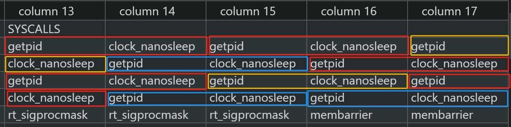

正好是十次连续的系统调用，证明我们的工具是逻辑正确的；

**【syscall_image 对比 lttng结果】**

lttng监测到的结果:

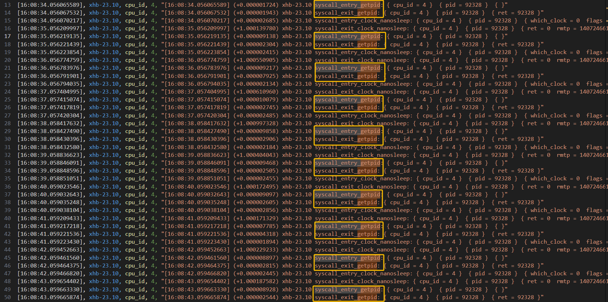

通过lttng以及syscall_image的对比，可以证明我们的syscall_image工具在逻辑上是正确无误的；

#### 4.2.2 数据正确性

前面我们已经对syscall-image工具进行了逻辑真确性验证，接下来我们通过对比一些数据来验证数据正确性，这些数据包括：

- 最大系统调用延迟
- 最小系统调用延迟
- 平均系统调用延迟；
- 被调用最多的系统调用;

通过下图我们可以看到lttng采集到的数据中，调用次数最多的前三个系统调用分别是：rt_sigprocmask、close 、 munmap，而这与我们在syscall-image中统计得到的数据一致；

```shell
SYSCALL ---------------------------------------------------------------------------------------------------------------------------------------------------------------------------
TIME      TGID    PID     1st/num         2nd/num         3nd/num         | P_AVG_DELAY(ns) S_AVG_DELAY(ns) | P_MAX_DELAY(ns) S_MAX_DELAY(ns) | P_MIN_DELAY(ns) S_MIN_DELAY(ns) |  SYSCALLS
...
16:08:44  92328   92328   14 /532         3  /131         11 /129         | 12054909        13682568        | 1000994442      10006484305     | 651             281             |  14,14,3,14,14
```

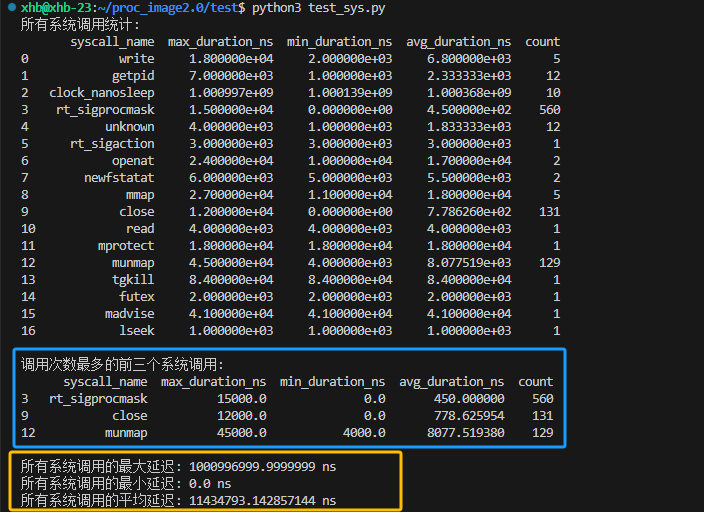

- 最大系统调用延迟：
	- syscall_image：1000994442ns
	- lttng：1000996999.999999ns
	- 差值：2558ns
- 最小系统调用延迟：
	- syscall_image：651ns
	- lttng：1000ns
	- 差值：349ns
- 平均系统调用延迟：
	- syscall_image：11982729ns
	- lttng：11434793.1428ns
	- 差值：547935ns

通过以上数据的对比,我们可以得出结论,syscall_image在数据层面是真实可靠的,他与lttng之间存在0.0000255%的误差,是可以忽略的。


### 4.3 关键数据点的关联关系

由于每秒钟产生系统调用十分繁多，我们可以将其作为分析进程行为非常细粒度的指标，将最大系统调用延迟、最小系统调用延迟以及平均系统调用延迟作为宏观分析指标；

数据关联关系：

- 进程的所有的系统调用信息可以通过以下的数据点进行关联：
	- 线程号/进程号；系统调用号；系统调用时延；进入系统调用时间点；
- 系统调用的总体统计数据可以在宏观层面对进程的行为进行指导判断：
	- 系统调用次数排名；
	- 最大系统调用延迟、平均系统调用延迟、最小系统调用延迟；
