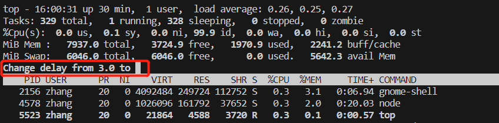
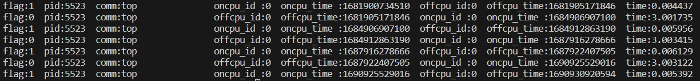
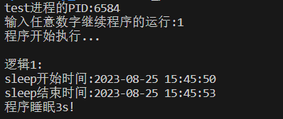
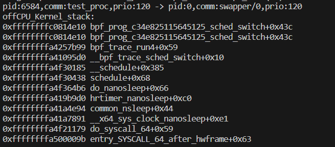

## 一、lifecycle_image 工具

lifecycle_image工具是Linux进程生命周期画像工具，该工具由多个子功能组成。

### 1. 进程上下CPU时间统计(-p,-C)

通过 -p 参数指定要监控的进程，便可以采集到该进程在生命周期中上下CPU的时间信息。

<div align='center'></div>

测试对象：top（默认为每3秒更新一次）

<div align='center'></div>

运行eBPF程序跟踪top进程，执行指令 sudo ./proc_image -p 5523，运行结果：

<div align='center'></div>

结合top进程每3秒更新一次，从运行结果中可以看出该eBPF程序已经成功捕获到top进程上下cpu的时间信息。

在此基础上，通过该工具的-p和-C参数，能捕获到某个CPU所对应0号进程的上下cpu时间信息，进而也可以体现出0号进程所对应的CPU繁忙程度。

### 2. 进程上下CPU原因标注(-r,-s)

通过 -r 参数实现打印进程上下文切换的原因标注，默认打印采集到的全部堆栈信息，可通过-s参数进行设置打印堆栈的数量，若设置的个数大于所采集到的堆栈个数，则将采集到的堆栈全部打印。

测试程序：test_proc（测试程序通过 sleep 函数实现下CPU）

<div align='center'></div>

测试结果：

<div align='center'></div>

## 二、lock_image 工具

lock_image工具可以对进程/线程持有锁的区间进行画像，该工具目前可以对进程的用户态互斥锁、内核态互斥锁和用户态读写锁进行画像。

<div align='center'></div>

lock_image 工具采集到的数据：

1. 请求锁的时间点
2. 上锁的时间点
3. 解锁的时间点
4. 请求锁的时间（时间段）
5. 持有锁的时间（时间段）

lock_image 工具的参数信息：

| 参数                 | 描述                                              |
| -------------------- | ------------------------------------------------- |
| -p, --pid=PID        | 指定跟踪进程的pid，默认为0号进程                  |
| -t, --time=TIME-SEC  | 设置程序的最大运行时间（0表示无限），默认一直运行 |
| -m, --user-mutex     | 对进程的用户态互斥锁进行画像                      |
| -M, --kernel-mutex   | 对进程的内核态互斥锁进行画像                      |
| -r, --user-rwlock-rd | 对进程用户态读模式下的读写锁进行画像              |
| -w, --user-rwlock-wr | 对进程用户态写模式下的读写锁进行画像              |
| -h, --help           | 显示帮助信息                                      |

用户态的自旋锁和信号量，在libbpf程序的开发过程中遇到了 libbpf: elf: ambiguous match  问题，目前这个问题社区也在讨论中，详情见 [libbpf_ambiguous_match_question.md](../docs/libbpf_ambiguous_match_question.md)，经于社区的人沟通，目前已经成功解决见 https://patchwork.kernel.org/project/netdevbpf/cover/20230904022444.1695820-1-hengqi.chen@gmail.com/

## 三、newlife_image 工具

newlife_image工具可以对指定进程fork或vfork出来的新进程以及pthread_create出来的新线程进行画像。

newlife_image 工具采集到的数据：

1. newlife的产生方式以及newlife的pid
2. newlife的开始时间
3. newlife的退出时间
4. newlife的存在时间

newlife_image 工具的参数信息：

| 参数                | 描述                                              |
| ------------------- | ------------------------------------------------- |
| -p, --pid=PID       | 指定跟踪进程的pid，默认为0号进程                  |
| -t, --time=TIME-SEC | 设置程序的最大运行时间（0表示无限），默认一直运行 |
| -f, --fork          | 对fork出来的子进程进行画像                        |
| -F, --vfork         | 对vfork出来的子进程进行画像                       |
| -T, --newthread     | 对pthread_create出来的新线程进行画像              |
| -h, --help          | 显示帮助信息                                      |

问题及解决：

pthread_create函数也存在模糊匹配问题，如下：

```
libbpf: elf: ambiguous match for 'pthread_create', 'pthread_create' in '/usr/lib/x86_64-linux-gnu/libc.so.6'
```

在Ubuntu22.04.1中 fork 和 vfork 调用的都是clone系统调用，而 pthread_create 调用的是 clone3 系统调用，因此暂用 clone3 监控新线程。

## 四、keytime_image工具

keytime_image工具可以对指定进程执行exec和exit时进行画像。

keytime_image工具采集到的数据：

1. exec或exit的开始或结束时间
2. 被监控进程的父进程pid
3. exec从开始到结束的执行时间
4. 函数返回值
5. 函数参数信息

keytime_image 工具的参数信息：

| 参数                | 描述                                              |
| ------------------- | ------------------------------------------------- |
| -p, --pid=PID       | 指定跟踪进程的pid，默认为0号进程                  |
| -t, --time=TIME-SEC | 设置程序的最大运行时间（0表示无限），默认一直运行 |
| -e, --execve        | 跟踪进程的execve系统调用                          |
| -E, --exit          | 跟踪进程的exit系统调用                            |
| -q, --quote         | 在参数周围添加引号(")                             |
| -h, --help          | 显示帮助信息                                      |
