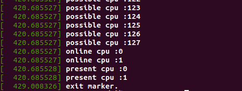

# vmstat

vmstat程序(/system/core/toolbox/vmstat.c)其实只是个简单的信息汇总，它从/proc/stat, /proc/vmstat, /proc/meminfo中读取信息，并择出一些项来构成输出。

/proc/stat中提取的信息：

```
r: runqueue length –> procs_running
b: process blocked(wait in uninterruptible sleep status) –> procs_blocked
in: interrupts –> intr
cs: context switch –> ctxt
us: usertime
ni: nice
sy: system time
id: idle time
wa: iowait time
ir: irq time
```

从/proc/meminfo中提取的信息

```
free
mapped
anon
slab
```

这些与meminfo中的项对应，没什么特别

从/proc/vmstat中提取的信息

```
flt: major page fault –> pgmajfault
```


## /proc/stat


每一行的每个参数依次为：

user (65376847) 从系统启动开始累计到当前时刻，用户态的CPU时间（单位：jiffies） ，不包含 nice值为负进程。1jiffies=0.01秒
nice (362756) 从系统启动开始累计到当前时刻，nice值为负的进程所占用的CPU时间（单位：jiffies）
system (2405159) 从系统启动开始累计到当前时刻，核心时间（单位：jiffies）
idle (10834971593) 从系统启动开始累计到当前时刻，除硬盘IO等待时间以外其它等待时间（单位：jiffies）
iowait (3765180) 从系统启动开始累计到当前时刻，硬盘IO等待时间（单位：jiffies） ，
irq (93399) 从系统启动开始累计到当前时刻，硬中断时间（单位：jiffies）
softirq (2395097) 从系统启动开始累计到当前时刻，软中断时间（单位：jiffies）


CPU时间=user+system+nice+idle+iowait+irq+softirq

“intr”这行给出中断的信息，第一个为自系统启动以来，发生的所有的中断的次数；然后每个数对应一个特定的中断自系统启动以来所发生的次数。
“ctxt”给出了自系统启动以来CPU发生的上下文交换的次数。
“btime”给出了从系统启动到现在为止的时间，单位为秒。
“processes (total_forks) 自系统启动以来所创建的任务的个数目。
“procs_running”：当前运行队列的任务的数目。
“procs_blocked”：当前被阻塞的任务的数目。
那么CPU利用率可以使用以下两个方法。先取两个采样点，然后计算其差值：
cpu usage=(idle2-idle1)/(cpu2-cpu1)*100

cpu usage=[(user_2 +sys_2+nice_2) - (user_1 + sys_1+nice_1)]/(total_2 - total_1)*100


**/proc/stat**的内容由**/fs/proc/stat.c**给出

```c
///fs/proc/stat.c
static int show_stat(struct seq_file *p, void *v)
{
	int i, j;
	u64 user, nice, system, idle, iowait, irq, softirq, steal;
	u64 guest, guest_nice;
	u64 sum = 0;
	u64 sum_softirq = 0;
	unsigned int per_softirq_sums[NR_SOFTIRQS] = {0};
	struct timespec64 boottime;

	user = nice = system = idle = iowait =
		irq = softirq = steal = 0;
	guest = guest_nice = 0;
	getboottime64(&boottime);

	for_each_possible_cpu(i) {
		struct kernel_cpustat *kcs = &kcpustat_cpu(i);

		user += kcs->cpustat[CPUTIME_USER];
		nice += kcs->cpustat[CPUTIME_NICE];
		system += kcs->cpustat[CPUTIME_SYSTEM];
		idle += get_idle_time(kcs, i);
		iowait += get_iowait_time(kcs, i);
		irq += kcs->cpustat[CPUTIME_IRQ];
		softirq += kcs->cpustat[CPUTIME_SOFTIRQ];
		steal += kcs->cpustat[CPUTIME_STEAL];
		guest += kcs->cpustat[CPUTIME_GUEST];
		guest_nice += kcs->cpustat[CPUTIME_GUEST_NICE];
		sum += kstat_cpu_irqs_sum(i);
		sum += arch_irq_stat_cpu(i);

		for (j = 0; j < NR_SOFTIRQS; j++) {
			unsigned int softirq_stat = kstat_softirqs_cpu(j, i);

			per_softirq_sums[j] += softirq_stat;
			sum_softirq += softirq_stat;
		}
	}
	sum += arch_irq_stat();

	seq_put_decimal_ull(p, "cpu  ", nsec_to_clock_t(user));
	seq_put_decimal_ull(p, " ", nsec_to_clock_t(nice));
	seq_put_decimal_ull(p, " ", nsec_to_clock_t(system));
	seq_put_decimal_ull(p, " ", nsec_to_clock_t(idle));
	seq_put_decimal_ull(p, " ", nsec_to_clock_t(iowait));
	seq_put_decimal_ull(p, " ", nsec_to_clock_t(irq));
	seq_put_decimal_ull(p, " ", nsec_to_clock_t(softirq));
	seq_put_decimal_ull(p, " ", nsec_to_clock_t(steal));
	seq_put_decimal_ull(p, " ", nsec_to_clock_t(guest));
	seq_put_decimal_ull(p, " ", nsec_to_clock_t(guest_nice));
	seq_putc(p, '\n');

	for_each_online_cpu(i) {
		struct kernel_cpustat *kcs = &kcpustat_cpu(i);

		/* Copy values here to work around gcc-2.95.3, gcc-2.96 */
		user = kcs->cpustat[CPUTIME_USER];
		nice = kcs->cpustat[CPUTIME_NICE];
		system = kcs->cpustat[CPUTIME_SYSTEM];
		idle = get_idle_time(kcs, i);
		iowait = get_iowait_time(kcs, i);
		irq = kcs->cpustat[CPUTIME_IRQ];
		softirq = kcs->cpustat[CPUTIME_SOFTIRQ];
		steal = kcs->cpustat[CPUTIME_STEAL];
		guest = kcs->cpustat[CPUTIME_GUEST];
		guest_nice = kcs->cpustat[CPUTIME_GUEST_NICE];
		seq_printf(p, "cpu%d", i);
		seq_put_decimal_ull(p, " ", nsec_to_clock_t(user));
		seq_put_decimal_ull(p, " ", nsec_to_clock_t(nice));
		seq_put_decimal_ull(p, " ", nsec_to_clock_t(system));
		seq_put_decimal_ull(p, " ", nsec_to_clock_t(idle));
		seq_put_decimal_ull(p, " ", nsec_to_clock_t(iowait));
		seq_put_decimal_ull(p, " ", nsec_to_clock_t(irq));
		seq_put_decimal_ull(p, " ", nsec_to_clock_t(softirq));
		seq_put_decimal_ull(p, " ", nsec_to_clock_t(steal));
		seq_put_decimal_ull(p, " ", nsec_to_clock_t(guest));
		seq_put_decimal_ull(p, " ", nsec_to_clock_t(guest_nice));
		seq_putc(p, '\n');
	}
	seq_put_decimal_ull(p, "intr ", (unsigned long long)sum);

	show_all_irqs(p);

	seq_printf(p,
		"\nctxt %llu\n"
		"btime %llu\n"
		"processes %lu\n"
		"procs_running %lu\n"
		"procs_blocked %lu\n",
		nr_context_switches(),
		(unsigned long long)boottime.tv_sec,
		total_forks,
		nr_running(),
		nr_iowait());

	seq_put_decimal_ull(p, "softirq ", (unsigned long long)sum_softirq);

	for (i = 0; i < NR_SOFTIRQS; i++)
		seq_put_decimal_ull(p, " ", per_softirq_sums[i]);
	seq_putc(p, '\n');

	return 0;
}

```

procs_running和procs_blocked的值由nr_running()和nr_iowait()两个函数给出

```c
///kernel/sched/core.c
unsigned long nr_iowait_cpu(int cpu)
{
	return atomic_read(&cpu_rq(cpu)->nr_iowait);
}

unsigned long nr_running(void)
{
	unsigned long i, sum = 0;

	for_each_online_cpu(i)
		sum += cpu_rq(i)->nr_running;

	return sum;
}

unsigned long nr_iowait(void)
{
	unsigned long i, sum = 0;

	for_each_possible_cpu(i)
		sum += nr_iowait_cpu(i);

	return sum;
}

///include/linux/cpumask.h
typedef struct cpumask { DECLARE_BITMAP(bits, NR_CPUS); } cpumask_t;

extern struct cpumask __cpu_possible_mask;
extern struct cpumask __cpu_online_mask;
extern struct cpumask __cpu_present_mask;
extern struct cpumask __cpu_active_mask;
#define cpu_possible_mask ((const struct cpumask *)&__cpu_possible_mask)
#define cpu_online_mask   ((const struct cpumask *)&__cpu_online_mask)
#define cpu_present_mask  ((const struct cpumask *)&__cpu_present_mask)
#define cpu_active_mask   ((const struct cpumask *)&__cpu_active_mask)

#define for_each_possible_cpu(cpu) for_each_cpu((cpu), cpu_possible_mask)
#define for_each_online_cpu(cpu)   for_each_cpu((cpu), cpu_online_mask)
#define for_each_present_cpu(cpu)  for_each_cpu((cpu), cpu_present_mask)

#define for_each_cpu(cpu, mask)				\
	for ((cpu) = -1;				\
		(cpu) = cpumask_next((cpu), (mask)),	\
		(cpu) < nr_cpu_ids;)

```

**Q1**:为什么在nr_running中使用for_each_online_cpu，而在nr_iowait中使用for_each_possible_cpu？

假设一台机器上有8个CPU：

1.1 cpu_possible_map

        机器上最多有多少个CPU，包括本机的CPU，以及可以热插拔的CPU。
        1. 假设cpu_possible_map为10，本机CPU个数为8个，则最多可以再添加2个可插拔CPU。

1.2 cpu_present_map

        当前有多少个CPU。
        1. 本机CPU个数为8个，都是online的，则cpu_present_map为8；
        2. 再插入1个可插拔CPU，则cpu_present_map为9。

1.3 cpu_online_map

        在当前的CPU中，有多少个可用的CPU。
        1. 本机CPU个数为8个，都是online的，则cpu_online_map为8；
        2. 将其中一个设置为offline，则cpu_online_map变为7。
1.4 for_each_possible_cpu()/for_each_present_cpu()/for_each_online_cpu()

        for_each_possible_cpu()       - Iterate over cpu_possible_map
        for_each_online_cpu()         - Iterate over cpu_online_map
        for_each_present_cpu()        - Iterate over cpu_present_map
nr_running()给出的是当前所有CPU上运行队列的任务的数目的总和，只有处于online状态下的CPU才会有运行队列，所以只遍历则cpu_online_map为8；nr_iowait()给出的是当前所有CPU上被阻塞的任务的数目的总和，由于内核将进程从uninterruptible转到running时，会将等待iowait的进程随机分配到一个CPU上，然后随机将一个CPU上的uninterruptible减1

使用内核模块测试这3个函数：
```c
#include <linux/module.h>
#include <linux/kernel.h>
 
static int __init init_marker(void)
{
        int i;
 
        printk("init marker.\n");
 
        for_each_possible_cpu(i)
        {
                printk("possible cpu :%d\n", i);
        }
 
        for_each_online_cpu(i)
        {
                printk("online cpu :%d\n", i);
        }
 
        for_each_present_cpu(i)
        {
                printk("present cpu :%d\n", i);
        }
        return 0;
}
 
static void __exit exit_marker(void)
{
        printk("exit marker.\n");
}
 
module_init(init_marker);
module_exit(exit_marker);
```

运行结果：



由于是在虚拟机上运行的，所以possible CPU数量较多

将cpu1设置为offline，再插入模块，卸载模块：

echo 0 > /sys/devices/system/cpu/cpu1/online


可以看到CPU1被关闭了


# 采样程序


采集程序在运行一段时间后会稳定在2左右，这时top计算出的平均负载在0.1左右，结果误差较大，考虑可能是有瞬时进程，导致1s内采样出的数据较大，对结果造成了影响(制造短时进程负载)


# 根据nr_running和nr_iowait进行采样

分别对nr_running和nr_iowait进行采样，在两个不同的采样程序中，采样频率不同；


在第一个程序只对nr_running()进行采样，结果显示nr_running依次间隔2s,8s,15s进行采样；


第二个程序只对nr_iowait()进行采样，结果显示采样间隔大致为1s,9s,10s；


第三个程序对nr_running()和nr_iowait()进行采样，结果显示程序间隔1s,9s,10s进行采样，但会出现1s内nr_running()采样两次的情况

**Q2**:nr_running()和nr_iowait()的运行频率有何原因？


# 通过execsnoop工具进行测试


使用execsnoop在低负载状态测试，可以看到execsnoop没有检测到瞬时进程，但是使用ebpf采集到计算出的负载还是比较大

算法和内核一致，采样数据量和内核一致


通过stress命令产生负载，stress 消耗 CPU 资源的方式是通过调用 sqrt 函数计算由 rand 函数产生的随机数的平方根实现的。我这里分别产生了1个和3个这样的进程不断计算，但观察execsnoop只检测到了一个，但在产生3个这样进程时，可以通过top命令观看到。

# execsnoop

```python
# define BPF program
bpf_text = """
#include <uapi/linux/ptrace.h>
#include <linux/sched.h>
#include <linux/fs.h>

#define ARGSIZE  128

enum event_type {
    EVENT_ARG,
    EVENT_RET,
};

struct data_t {
    u32 pid;  // PID as in the userspace term (i.e. task->tgid in kernel)
    u32 ppid; // Parent PID as in the userspace term (i.e task->real_parent->tgid in kernel)
    u32 uid;
    char comm[TASK_COMM_LEN]; //进程名
    enum event_type type;
    char argv[ARGSIZE];
    int retval;
};

BPF_PERF_OUTPUT(events);

static int __submit_arg(struct pt_regs *ctx, void *ptr, struct data_t *data)
{
    bpf_probe_read_user(data->argv, sizeof(data->argv), ptr);
    events.perf_submit(ctx, data, sizeof(struct data_t));
    return 1;
}

static int submit_arg(struct pt_regs *ctx, void *ptr, struct data_t *data)
{
    const char *argp = NULL;
    bpf_probe_read_user(&argp, sizeof(argp), ptr);
    if (argp) {
        return __submit_arg(ctx, (void *)(argp), data);
    }
    return 0;
}

int syscall__execve(struct pt_regs *ctx,
    const char __user *filename,
    const char __user *const __user *__argv,
    const char __user *const __user *__envp)
{

    u32 uid = bpf_get_current_uid_gid() & 0xffffffff; //取进程id

    UID_FILTER

    if (container_should_be_filtered()) { //不清楚，翻译为检测容器（？）是否过滤
        return 0;
    }

    // create data here and pass to submit_arg to save stack space (#555)
    struct data_t data = {};
    struct task_struct *task;

    data.pid = bpf_get_current_pid_tgid() >> 32; //取组id

    task = (struct task_struct *)bpf_get_current_task();
    // Some kernels, like Ubuntu 4.13.0-generic, return 0
    // as the real_parent->tgid.
    // We use the get_ppid function as a fallback in those cases. (#1883)
    data.ppid = task->real_parent->tgid;

    PPID_FILTER //？

    bpf_get_current_comm(&data.comm, sizeof(data.comm));
    data.type = EVENT_ARG;

    __submit_arg(ctx, (void *)filename, &data);

    // skip first arg, as we submitted filename
    #pragma unroll
    for (int i = 1; i < MAXARG; i++) {
        if (submit_arg(ctx, (void *)&__argv[i], &data) == 0)
             goto out;
    }

    // handle truncated argument list
    char ellipsis[] = "...";
    __submit_arg(ctx, (void *)ellipsis, &data);
out:
    return 0;
}

int do_ret_sys_execve(struct pt_regs *ctx)
{
    if (container_should_be_filtered()) {
        return 0;
    }

    struct data_t data = {};
    struct task_struct *task;

    u32 uid = bpf_get_current_uid_gid() & 0xffffffff;
    UID_FILTER

    data.pid = bpf_get_current_pid_tgid() >> 32;
    data.uid = uid;

    task = (struct task_struct *)bpf_get_current_task();
    // Some kernels, like Ubuntu 4.13.0-generic, return 0
    // as the real_parent->tgid.
    // We use the get_ppid function as a fallback in those cases. (#1883)
    data.ppid = task->real_parent->tgid;

    PPID_FILTER

    bpf_get_current_comm(&data.comm, sizeof(data.comm));
    data.type = EVENT_RET;
    data.retval = PT_REGS_RC(ctx);
    events.perf_submit(ctx, &data, sizeof(data));

    return 0;
}
"""

bpf_text = bpf_text.replace("MAXARG", args.max_args)

if args.uid:
    bpf_text = bpf_text.replace('UID_FILTER',
        'if (uid != %s) { return 0; }' % args.uid)
else:
    bpf_text = bpf_text.replace('UID_FILTER', '')

if args.ppid:
    bpf_text = bpf_text.replace('PPID_FILTER',
        'if (data.ppid != %s) { return 0; }' % args.ppid)
else:
    bpf_text = bpf_text.replace('PPID_FILTER', '')

bpf_text = filter_by_containers(args) + bpf_text
if args.ebpf:
    print(bpf_text)
    exit()

# initialize BPF
b = BPF(text=bpf_text)
execve_fnname = b.get_syscall_fnname("execve")
b.attach_kprobe(event=execve_fnname, fn_name="syscall__execve")
b.attach_kretprobe(event=execve_fnname, fn_name="do_ret_sys_execve")

# header
if args.time:
    print("%-9s" % ("TIME"), end="")
if args.timestamp:
    print("%-8s" % ("TIME(s)"), end="")
if args.print_uid:
    print("%-6s" % ("UID"), end="")
print("%-16s %-7s %-7s %3s %s" % ("PCOMM", "PID", "PPID", "RET", "ARGS"))

class EventType(object):
    EVENT_ARG = 0
    EVENT_RET = 1

start_ts = time.time()
argv = defaultdict(list)

# This is best-effort PPID matching. Short-lived processes may exit
# before we get a chance to read the PPID.
# This is a fallback for when fetching the PPID from task->real_parent->tgip
# returns 0, which happens in some kernel versions.
def get_ppid(pid):
    try:
        with open("/proc/%d/status" % pid) as status:
            for line in status:
                if line.startswith("PPid:"):
                    return int(line.split()[1])
    except IOError:
        pass
    return 0

# process event
def print_event(cpu, data, size):
    event = b["events"].event(data)
    skip = False

    if event.type == EventType.EVENT_ARG:
        argv[event.pid].append(event.argv)
    elif event.type == EventType.EVENT_RET:
        if event.retval != 0 and not args.fails:
            skip = True
        if args.name and not re.search(bytes(args.name), event.comm):
            skip = True
        if args.line and not re.search(bytes(args.line),
                                       b' '.join(argv[event.pid])):
            skip = True
        if args.quote:
            argv[event.pid] = [
                b"\"" + arg.replace(b"\"", b"\\\"") + b"\""
                for arg in argv[event.pid]
            ]

        if not skip:
            if args.time:
                printb(b"%-9s" % strftime("%H:%M:%S").encode('ascii'), nl="")
            if args.timestamp:
                printb(b"%-8.3f" % (time.time() - start_ts), nl="")
            if args.print_uid:
                printb(b"%-6d" % event.uid, nl="")
            ppid = event.ppid if event.ppid > 0 else get_ppid(event.pid)
            ppid = b"%d" % ppid if ppid > 0 else b"?"
            argv_text = b' '.join(argv[event.pid]).replace(b'\n', b'\\n')
            printb(b"%-16s %-7d %-7s %3d %s" % (event.comm, event.pid,
                   ppid, event.retval, argv_text))
        try:
            del(argv[event.pid])
        except Exception:
            pass


# loop with callback to print_event
b["events"].open_perf_buffer(print_event)
while 1:
    try:
        b.perf_buffer_poll()
    except KeyboardInterrupt:
        exit()
```

通过exec() syscall 系统调用来跟踪新进程。

**execsnoop的工作原理：**

跟踪execve系统调用(常用的exec()变体)，并显示execve()参数和返回值的详细信息。这将捕获遵循fork(2)/clone()-> exec()顺序的新进程，以及 re-exec()的进程。

有个特殊情况：一些应用程序在不调用exec()的情况下创建新进程，例如，在使用fork()或单独克隆()创建工作进程池时。因为它们不调用execve()，所以execsnoop输出中不包括这些。这种情况应该不常见：应用程序应该创建工作线程池，而不是进程。 


## sys_execve

```c
//linux5.4
/include/linux/syscalls.h
asmlinkage long sys_execve(const char __user *filename,
		const char __user *const __user *argv,
		const char __user *const __user *envp);

/tools/include/nolibc/nolibc.h
static __attribute__((unused))
int sys_execve(const char *filename, char *const argv[], char *const envp[])
{
	return my_syscall3(__NR_execve, filename, argv, envp);
}

#define my_syscall3(num, arg1, arg2, arg3)                   
({                                                           
	long _ret;                                               
	register long _num  asm("rax") = (num);                 
	register long _arg1 asm("rdi") = (long)(arg1);           
	register long _arg2 asm("rsi") = (long)(arg2);           
	register long _arg3 asm("rdx") = (long)(arg3);           

	asm volatile (                                           
		"syscall\n"                                         
		: "=a" (_ret)                                       
		: "r"(_arg1), "r"(_arg2), "r"(_arg3),               
		  "0"(_num)                                         
		: "rcx", "r8", "r9", "r10", "r11", "memory", "cc"   
	);                                                       
	_ret;                                                   
})
```

​		对于可执行程序的执行环境，一般是shell程序来启动一个可执行程序，shell环境会执行相应的函数来执行可执行文件。

　　在Linux中，对于一个可执行文件的执行，可以通过的方式主要有：execl、execlp、execle、execv、exexvp、execve等6个函数，其使用差异主要体现在命令行参数和环境变量参数的不同，这些函数最终都需要调用系统调用函数sys_execve()来实现执行可执行文件的目的。


# 参考

[load_balance函数代码详解 (wowotech.net)](http://www.wowotech.net/process_management/load_balance_function.html)

[Linux内核CPU负载均衡机制 | OenHan](https://oenhan.com/cpu-load-balance)

[系统调用execve的入口sys_execve()_SunnyBeiKe的博客-CSDN博客](https://blog.csdn.net/sunnybeike/article/details/6899959)

[对于Linux内核执行过程的理解（基于fork、execve、schedule等函数） - Wangyt - 博客园 (cnblogs.com)](https://www.cnblogs.com/wyt123/p/10591297.html)

https://blog.csdn.net/guowenyan001/article/details/44224759
