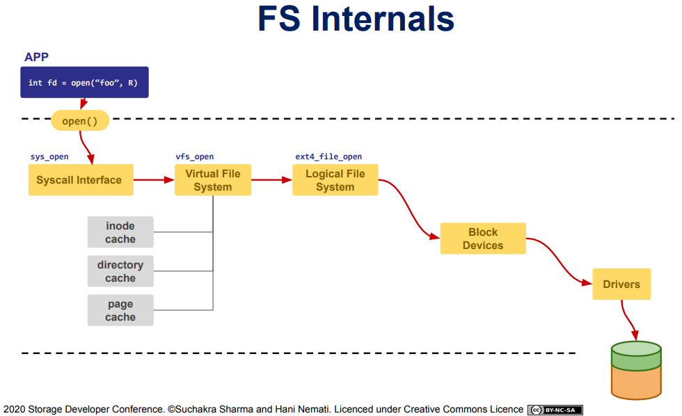
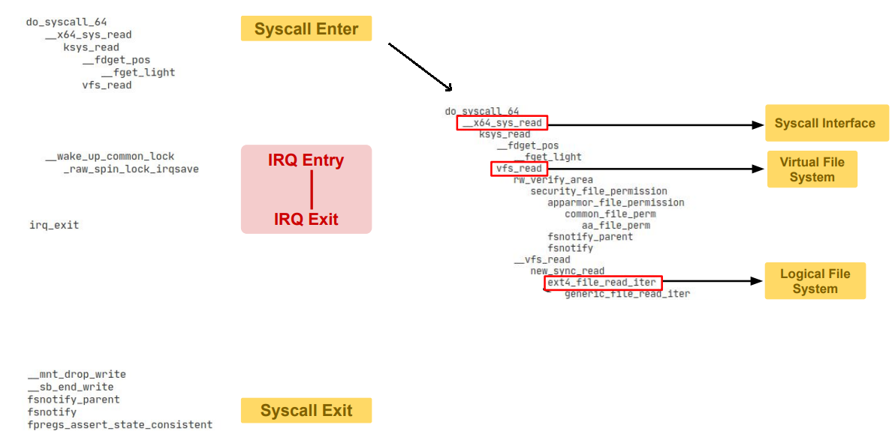

## 基于eBPF的文件系统内部跟踪与可视化

- 有多少文件是打开和正在读取的？
- 哪个进程与用户正在操作？
- 多少文件可以为创建？（雾
- 哪些数据是最常被访问的？
- 它们的构造是什么样？
- 移动它们时都发生了什么？
- 如果其中有一些文件在网络存储中呢？
- 如果在两个不同的存储设备之间你复制文件呢？

当一个应用程序打开文件的时候，其实经历如下步骤才到存储：

在经过VFS的时候，涉及到inode_cache、dentry_cache、page_cache这些缓存机制

***


*以下测试环境为Ubuntu 20.04（Linux 5.4）*
### 用ftrace追踪工作流
#### trace-cmd
`sudo apt install trace-cmd`  
`sudo trace-cmd record -p function -P 15353`
PS:
trace-cmd record [OPTIONS] [command]
- -p tracer  
  指定跟踪器,跟踪器通常不仅仅跟踪事件。常见的跟踪器有： function, function_graph, preemptirqsoff, irqsoff, preemptoff , wakeup。  
  运行中的内核必须支持跟踪程序,查看可用跟踪程序的列表:` trace-cmd list`。
- -P PID  
  进程号，这里选用的当前终端的PID  
`sudo trace-cmd report > report.txt`  
打印出record的内容，默认是输出到屏幕上，这个产量非常大，运行2s后ctrl+c终止程序，打开report.txt：

可以看到这个进程运行所需要调用到的内核函数，其中系统调用涉及到的是vfs_read

为了追踪read和write与磁盘的交互，创建一个持续写入的测试程序：  
详见[../tools/write_time.c](../tools/write_time.c)

运行：
```sh
# gcc write_time.c -o write_time.o
# ./write_time.o > write_time.txt
```

然后用一个新的终端来读取
```sh
# tail -f write_time.txt
```

写入测试程序PID为：9849  
读出测试程序PID为：9879  
使用trace-cmd进行追踪(5s停止)和输出：
```sh
root@lmp:/# trace-cmd record -p function -P 9849
  plugin 'function'
Hit Ctrl^C to stop recording
^CCPU0 data recorded at offset=0x534000
    0 bytes in size
CPU1 data recorded at offset=0x534000
    65536 bytes in size

root@lmp:/# trace-cmd report > /home/zhangfan/report_w.txt 

root@lmp:/# trace-cmd record -p function -P 9879
  plugin 'function'
Hit Ctrl^C to stop recording
^CCPU0 data recorded at offset=0x534000
    57344 bytes in size
CPU1 data recorded at offset=0x542000
    0 bytes in size

root@lmp:/# trace-cmd report > /home/zhangfan/report_r.txt 
```
查看输出文件：
- report_w.txt：对文件系统进行写入的程序探测结果
  - 查找vfs_read无结果，说明该没有调用读操作
  - 查找vfs_write，有非常完整的写操作：
    ```
        write_time.o-9849  [001]  2740.577412: function:             do_syscall_64
        write_time.o-9849  [001]  2740.577412: function:                __x64_sys_write
        write_time.o-9849  [001]  2740.577413: function:                   ksys_write
        write_time.o-9849  [001]  2740.577414: function:                      __fdget_pos
        write_time.o-9849  [001]  2740.577414: function:                         __fget_light
        write_time.o-9849  [001]  2740.577417: function:                      vfs_write
        write_time.o-9849  [001]  2740.577418: function:                         rw_verify_area
        write_time.o-9849  [001]  2740.577419: function:                            security_file_permission
        write_time.o-9849  [001]  2740.577419: function:                               apparmor_file_permission
        write_time.o-9849  [001]  2740.577420: function:                                  common_file_perm
        write_time.o-9849  [001]  2740.577421: function:                                     aa_file_perm
        write_time.o-9849  [001]  2740.577422: function:                         __sb_start_write
        write_time.o-9849  [001]  2740.577422: function:                            _cond_resched
        write_time.o-9849  [001]  2740.577423: function:                               rcu_all_qs
        write_time.o-9849  [001]  2740.577424: function:                         __vfs_write
        write_time.o-9849  [001]  2740.577425: function:                            new_sync_write
        write_time.o-9849  [001]  2740.577426: function:                               ext4_file_write_iter
        write_time.o-9849  [001]  2740.577427: function:                                  down_write_trylock
        write_time.o-9849  [001]  2740.577427: function:                                  ext4_write_checks
    ```
- report_r.txt：对文件系统进行读出的程序探测结果
  - 查找vfs_read，有完整读操作，还涉及到pagecache:
    ```
            tail-9879  [000]  2777.610710: function:             do_syscall_64
            tail-9879  [000]  2777.610711: function:                __x64_sys_read
            tail-9879  [000]  2777.610711: function:                   ksys_read
            tail-9879  [000]  2777.610712: function:                      __fdget_pos
            tail-9879  [000]  2777.610712: function:                         __fget_light
            tail-9879  [000]  2777.610713: function:                      vfs_read
            tail-9879  [000]  2777.610713: function:                         rw_verify_area
            tail-9879  [000]  2777.610714: function:                            security_file_permission
            tail-9879  [000]  2777.610714: function:                               apparmor_file_permission
            tail-9879  [000]  2777.610715: function:                                  common_file_perm
            tail-9879  [000]  2777.610715: function:                                     aa_file_perm
            tail-9879  [000]  2777.610716: function:                               __fsnotify_parent
            tail-9879  [000]  2777.610716: function:                               fsnotify
            tail-9879  [000]  2777.610717: function:                         __vfs_read
            tail-9879  [000]  2777.610718: function:                            new_sync_read
            tail-9879  [000]  2777.610718: function:                               ext4_file_read_iter
            tail-9879  [000]  2777.610719: function:                                  generic_file_read_iter
            tail-9879  [000]  2777.610719: function:                                     _cond_resched
            tail-9879  [000]  2777.610719: function:                                        rcu_all_qs
            tail-9879  [000]  2777.610720: function:                                     pagecache_get_page
            tail-9879  [000]  2777.610720: function:                                        find_get_entry
            tail-9879  [000]  2777.610721: function:                                           PageHuge
            tail-9879  [000]  2777.610722: function:                                     touch_atime
            tail-9879  [000]  2777.610722: function:                                        atime_needs_update
            tail-9879  [000]  2777.610723: function:                                           current_time
            tail-9879  [000]  2777.610723: function:                                              ktime_get_coarse_real_ts64
            tail-9879  [000]  2777.610724: function:                                              timestamp_truncate
            tail-9879  [000]  2777.610725: function:                fpregs_assert_state_consistent    
    ```    
    pagecache_get_page是增加页面的引用计数

  - 查找vfs_write，有写到终端的操作：
    ```
              tail-9879  [000]  2777.610606: function:             do_syscall_64
              tail-9879  [000]  2777.610607: function:                __x64_sys_write
              tail-9879  [000]  2777.610607: function:                   ksys_write
              tail-9879  [000]  2777.610607: function:                      __fdget_pos
              tail-9879  [000]  2777.610608: function:                         __fget_light
              tail-9879  [000]  2777.610610: function:                      vfs_write
              tail-9879  [000]  2777.610610: function:                         rw_verify_area
              tail-9879  [000]  2777.610611: function:                            security_file_permission
              tail-9879  [000]  2777.610612: function:                               apparmor_file_permission
              tail-9879  [000]  2777.610612: function:                                  common_file_perm
              tail-9879  [000]  2777.610613: function:                                     aa_file_perm
              tail-9879  [000]  2777.610614: function:                         __vfs_write
              tail-9879  [000]  2777.610615: function:                            tty_write
    ```


一些别的函数的解释：



### FS及其性能
#### /proc和传统工具
##### 1、/proc/diskstats 
```sh
# cat /proc/diskstats 
   ...
   7       7 loop7 45 0 680 161 0 0 0 0 0 228 124 0 0 0 0
   8       0 sda 170493 79318 4487482 429233 11655 150568 1486392 33129 0 380512 315336 0 0 0 0
   8       1 sda1 170416 79318 4483362 429191 11655 150568 1486392 33129 1 380496 315316 0 0 0 0
  11       0 sr0 0 0 0 0 0 0 0 0 0 0 0 0 0 0 0
  ...
```
每一列的含义分别为：

| 列  | 含义 | 解释 |
| :-: | :--  | :--  |
第一列| 设备号| |
第二列| 次设备号
第三列| 设备名称
第四列| 成功完成读的总次数
第五列| 合并读次数  | 为了效率可能会合并相邻的读和写，从而两次4K的读在它最终被处理到磁盘上之前可能会变成一次8K的读，才被计数（和排队），因此只有一次I/O操作。
第六列| 读扇区的次数
第七列| 读花的时间（ms）| 这是所有读操作所花费的毫秒数（用__make_request()到end_that_request_last()测量）
第八列| 成功完成写的总次数
第九列| 合并写次数
第十列| 写扇区的次数
第十一列| 写花的时间（ms）
第十二列| I/O的当前进度| 只有这个域应该是0，如果这个值为0，同时write_complete read_complete io_processing 一直不变可能就就是IO hang了。
第十三列| 输入输入花的时间（ms）|花在I/O操作上的毫秒数，这个域会增长只要field 9不为0。
第十四列| 输入/输出操作花费的加权时间（ms）

2、/proc/[pid]/io
查看当前终端的io信息：
```sh
# cat /proc/15393/io 
rchar: 336985
wchar: 1303
syscr: 183
syscw: 157
read_bytes: 141239296
write_bytes: 0
cancelled_write_bytes: 0
```
- rchar  
  该程序从存储中已经读取的字节数，仅仅是read()和pread()字节数总和，不受是否需要从实际物理磁盘去读取的影响（因为可能已经从pagecache中读到了）
- wchar  
  该任务已经产生或者将要产生需要写入磁盘的字符数，性质同上
- syscr  
  读系统调用的次数，如read()和pread()
- syscw  
  写系统调用的次数，如write()和pwrite()
- read_bytes  
  程序实际产生的，待从存储层获取的字节数（该进程需要从块设备读取的字节数）
- write_bytes  
  程序实际产生的，待发送到存储层的字节数
-  cancelled_write_bytes:  
  如果一个进程将 1MB 写入文件，然后删除该文件，则实际上不会执行写出。但它这个行为被认为是产生了1MB的写入。换句话说：此字段表示通过截断页面缓存导致未发生的字节数。

3、iostat -d
```sh
# iostat -d sda1
Linux 5.4.0-104-generic (lmp)   09/20/2022      _x86_64_        (2 CPU)

Device             tps    kB_read/s    kB_wrtn/s    kB_read    kB_wrtn
sda1            108.76      5009.85       206.88   64039049    2644460
```
- tps  
  每秒向磁盘设备请求数据次数，包括读，写请求，为rtps与wtps的和
- kB_read/s  
  每秒从设备读取的数据量
- kB_wrtn/s  
  每秒向设备写入的数据量
- kB_read  
  读取的总数据量
- kB_wrtn  
  写入的总数据量

4、iotop
iotop可以监控进程的I/O信息，与iostat工具比较，iostat是系统级别的IO监控，而iotop是进程级别IO监控。  
直接运行动态展示全部线程IO，参数如下：
|参数	| 描述 |
|---- | ---- |
-o	| 只显示正在产生I/O的进程或线程，运行过程中，可以通过按o随时切换
-b	| 非交互式下运行，一般用来记录日志
-n NUM	| 设置监控（显示）次数，主要用于非交互式，默认无限
-d SEC	| 设置显示的间隔秒数，支持非整数
-p PID	| 只显示指定进程（PID）的信息
-u USER	| 显示指定用户的进程信息
-P	| 只显示进程，不显示所有线程
-a	| 累积的I/O，显示从iotop启动后每个进程累积的I/O总数，便于诊断问题
-k	| 显示使用KB单位
-t 	| 非交互模式下，加上时间戳
-q	| 只在第一次监测时显示列名. 去除头部一些行：这个参数可以设置最多3次来移除头部行：-q列头部只在最初交互显示一次；-qq列头部不显示；-qqq，I/O的总结不显示

```sh
# iotop -o -P
Total DISK READ :       0.00 B/s | Total DISK WRITE :       0.00 B/s
Actual DISK READ:       0.00 B/s | Actual DISK WRITE:      10.89 K/s
   TID  PRIO  USER     DISK READ  DISK WRITE  SWAPIN     IO>    COMMAND    
   311 be/3 root        0.00 B/s    0.00 B/s  0.00 %  0.04 % [jbd2/sda1-8]
 17090 be/4 root        0.00 B/s    0.00 B/s  0.00 %  0.01 % [kwork~nbound]
```
- Total DISK READ  
  从磁盘中读取的总速率
- Total DISK WRITE  
  往磁盘里写入的总速率
- Actual DISK READ  
  从磁盘中读取的实际速率
- Actual DISK WRITE  
  往磁盘里写入的实际速率
- TID  
  线程ID，按p可转换成进程ID
- PRIO  
  优先级
- USER  
  线程所有者
- DISK READ  
  从磁盘中读取的速率
- DISK WRITE  
  往磁盘里写入的速率
- SWAPIN  
  swap交换百分比
- IO>  
  IO等待所占用的百分比
- COMMAND  
  具体的进程命令

压力测试：
```sh
# dd if=/dev/zero of=test.txt count=1024 bs=10M

# iotop -o
Total DISK READ :     362.88 K/s | Total DISK WRITE :      33.41 M/s
Actual DISK READ:     500.96 K/s | Actual DISK WRITE:      52.09 M/s
   TID  PRIO  USER     DISK READ  DISK WRITE  SWAPIN     IO>    COMMAND                                             
   311 be/3 root        0.00 B/s    3.21 K/s  0.00 % 99.99 % [kworker/u256:0+flush-8:0]
 22078 be/4 root        0.00 B/s   24.97 M/s  0.00 % 87.71 % dd if=/dev/zero of=test.txt count=1024 bs=100M
```

#### BCC和bpftrace工具
#### bpftrace
**安装bpftrace**  
Ubuntu 19.04或者更新的系统可以直接通过 apt-get 命令安装 bpftrace：
```sh
# apt-get install -y bpftrace
```

Ubuntu 16.04及更高版本:
```sh
# snap install bpftrace
bpftrace 20210911-2290-v0.13.0 from Colin King (cking-kernel-tools) installed
# snap connect bpftrace:system-trace
```

列出与open系统调用相关的跟踪点函数名：
```sh
# bpftrace -l 'tracepoint:syscalls:sys_enter_open*'
tracepoint:syscalls:sys_enter_open
tracepoint:syscalls:sys_enter_open_by_handle_at
tracepoint:syscalls:sys_enter_open_tree
tracepoint:syscalls:sys_enter_openat
```

工具开始运行至Ctrl + C退出，这个时段各个open相关跟踪点调用次数，这个摘要信息是由BPF程序在内核中高效计算出来的：
```sh
# bpftrace -e 'tracepoint:syscalls:sys_enter_open* { @[probe] = count(); }'
Attaching 4 probes...
^C

@[tracepoint:syscalls:sys_enter_openat]: 2513
@[tracepoint:syscalls:sys_enter_open]: 167497
```

**bpftrace-tools**  
我的安装放过是应该不太对，安装完成之后没有bpftrace-tools  
版本高的系统可以直接使用apt-get来安装？  
之后在使用高版本系统试一下  
但是看到bpftrace-tools和bcc-tools重合度很高，这里就使用bcc的samples文件来看看与IO相关的监控工具  

**bcc-tools**  
- biolatency.py*：统计块设备IO请求的耗时并用直方图表现
```sh
# ./biolatency
     usecs           : count     distribution
       0 -> 1        : 0        |                                      |
       2 -> 3        : 0        |                                      |
       4 -> 7        : 0        |                                      |
       8 -> 15       : 0        |                                      |
      16 -> 31       : 0        |                                      |
      32 -> 63       : 0        |                                      |
      64 -> 127      : 1        |                                      |
     128 -> 255      : 12       |********                              |
     256 -> 511      : 15       |**********                            |
     512 -> 1023     : 43       |*******************************       |
    1024 -> 2047     : 52       |**************************************|
    2048 -> 4095     : 47       |**********************************    |
    4096 -> 8191     : 52       |**************************************|
    8192 -> 16383    : 36       |**************************            |
   16384 -> 32767    : 15       |**********                            |
   32768 -> 65535    : 2        |*                                     |
   65536 -> 131071   : 2        |*                                     |
```

- biosnoop.py*：打印每次块设备IO请求的详细信息
```sh
# ./biosnoop
TIME(s)     COMM           PID    DISK    T SECTOR     BYTES   LAT(ms)
0.000004    supervise      1950   xvda1   W 13092560   4096       0.74
0.000178    supervise      1950   xvda1   W 13092432   4096       0.61
0.001469    supervise      1956   xvda1   W 13092440   4096       1.24
0.001588    supervise      1956   xvda1   W 13115128   4096       1.09
1.022346    supervise      1950   xvda1   W 13115272   4096       0.98
1.022568    supervise      1950   xvda1   W 13188496   4096       0.93
1.023534    supervise      1956   xvda1   W 13188520   4096       0.79
1.023585    supervise      1956   xvda1   W 13189512   4096       0.60
2.003920    xfsaild/md0    456    xvdc    W 62901512   8192       0.23
2.003931    xfsaild/md0    456    xvdb    W 62901513   512        0.25
2.004034    xfsaild/md0    456    xvdb    W 62901520   8192       0.35
2.004042    xfsaild/md0    456    xvdb    W 63542016   4096       0.36
2.004204    kworker/0:3    26040  xvdb    W 41950344   65536      0.34
2.044352    supervise      1950   xvda1   W 13192672   4096       0.65
2.044574    supervise      1950   xvda1   W 13189072   4096       0.58
```

- biotop.py*：像top命令一样打印每个进程的block IO详情
```sh
# ./biotop
Tracing... Output every 1 secs. Hit Ctrl-C to end

08:04:11 loadavg: 1.48 0.87 0.45 1/287 14547

PID    COMM             D MAJ MIN DISK       I/O  Kbytes  AVGms
14501  cksum            R 202 1   xvda1      361   28832   3.39
6961   dd               R 202 1   xvda1     1628   13024   0.59
13855  dd               R 202 1   xvda1     1627   13016   0.59
326    jbd2/xvda1-8     W 202 1   xvda1        3     168   3.00
1880   supervise        W 202 1   xvda1        2       8   6.71
1873   supervise        W 202 1   xvda1        2       8   2.51
1871   supervise        W 202 1   xvda1        2       8   1.57
1876   supervise        W 202 1   xvda1        2       8   1.22
1892   supervise        W 202 1   xvda1        2       8   0.62
1878   supervise        W 202 1   xvda1        2       8   0.78
1886   supervise        W 202 1   xvda1        2       8   1.30
1894   supervise        W 202 1   xvda1        2       8   3.46
1869   supervise        W 202 1   xvda1        2       8   0.73
1888   supervise        W 202 1   xvda1        2       8   1.48
```

- bitesize.py*：分别打印每个进程的IO请求直方图
```sh
# ./bitesize.py
Tracing... Hit Ctrl-C to end.
^C

Process Name = 'kworker/u128:1'
     Kbytes              : count     distribution
         0 -> 1          : 1        |********************                    |
         2 -> 3          : 0        |                                        |
         4 -> 7          : 2        |****************************************|

Process Name = 'bitesize.py'
     Kbytes              : count     distribution
         0 -> 1          : 0        |                                        |
         2 -> 3          : 0        |                                        |
         4 -> 7          : 0        |                                        |
         8 -> 15         : 0        |                                        |
        16 -> 31         : 0        |                                        |
        32 -> 63         : 0        |                                        |
        64 -> 127        : 0        |                                        |
       128 -> 255        : 1        |****************************************|

...
```

