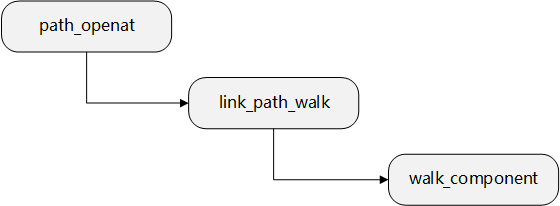
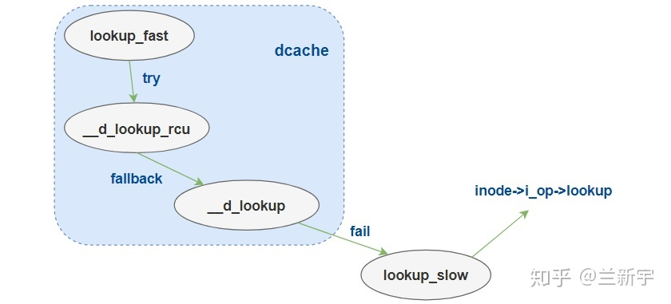

dcache.py
===

### 文件名查找
还是祭出`trace-cmd`，在不知道该怎么去确定监控函数的时候，这个命令可以给出一点参考思路：  
详细使用可以参考另一文档：  
[传统工具与BPF工具](./1_%E7%9B%91%E6%B5%8B%E6%96%87%E4%BB%B6%E7%B3%BB%E7%BB%9F%E7%9A%84%E4%BC%A0%E7%BB%9F%E5%B7%A5%E5%85%B7%E4%B8%8EBPF%E5%B7%A5%E5%85%B7.md)

```sh
             filename_lookup
                path_lookupat
                   path_init
                      set_root
                      nd_jump_root
                   link_path_walk.part.33
                      inode_permission
                         generic_permission
                         security_inode_permission
                      walk_component
                         lookup_fast
                            __d_lookup_rcu
                            __follow_mount_rcu.isra.28
                               __lookup_mnt
                      inode_permission
                         generic_permission
                         security_inode_permission
                   walk_component
                      lookup_fast
                         __d_lookup_rcu
                         __follow_mount_rcu.isra.28
                      pick_link
                   trailing_symlink
                      atime_needs_update
                         current_time
                            ktime_get_coarse_real_ts64
                            timestamp_truncate
                      security_inode_follow_link
                   link_path_walk.part.33
                      inode_permission
                         generic_permission
                         security_inode_permission
                      walk_component
                         follow_dotdot_rcu
                            path_connected
                            __lookup_mnt
                      inode_permission
                         generic_permission
                         security_inode_permission
                      walk_component
                         lookup_fast
                            __d_lookup_rcu
                            __follow_mount_rcu.isra.28
                               __lookup_mnt
                      inode_permission
                         generic_permission
                         security_inode_permission
                      walk_component
                         lookup_fast
                            __d_lookup_rcu
                            __follow_mount_rcu.isra.28
                      inode_permission
                         generic_permission
                         security_inode_permission
                      walk_component
                         lookup_fast
                            __d_lookup_rcu
                            __follow_mount_rcu.isra.28
                      inode_permission
                         generic_permission
                         security_inode_permission
                      walk_component
                         lookup_fast
                            __d_lookup_rcu
                            __follow_mount_rcu.isra.28
                      inode_permission
                         generic_permission
                         security_inode_permission
                   walk_component
                      lookup_fast
                         __d_lookup_rcu
                         __follow_mount_rcu.isra.28
                      pick_link
                   trailing_symlink
                      atime_needs_update
                         current_time
                            ktime_get_coarse_real_ts64
                            timestamp_truncate
                      security_inode_follow_link
                   link_path_walk.part.33
                      inode_permission
                         generic_permission
                         security_inode_permission
                      walk_component
                         follow_dotdot_rcu
                            path_connected
                      inode_permission
                         generic_permission
                         security_inode_permission
                   walk_component
                      lookup_fast
                         __d_lookup_rcu
                         __follow_mount_rcu.isra.28
                   complete_walk
                      unlazy_walk
                         legitimize_links
                         legitimize_path.isra.30
                            __legitimize_mnt
                         legitimize_root
                   terminate_walk
                      dput
                      mntput
                restore_nameidata
                putname
                   kmem_cache_free

```
针对一个写入的程序抓出来关于路径名查找的所有内核函数就是以上了，归纳之后主要的调用关系如下：  
filename_lookup  
    path_lookupat  
        link_path_walk  
            walk_component  
                lookup_fast  
                    __d_lookup_rcu  
                     __d_lookup     //查看源码之后发现还有这个  

### 源码分析
#### 1. filename_lookup
/fs/namei.c
```c
int filename_lookup(int dfd, struct filename *name, unsigned flags,
		    struct path *path, struct path *root)
{
	int retval;
	struct nameidata nd;
	if (IS_ERR(name))
		return PTR_ERR(name);
	set_nameidata(&nd, dfd, name, root);
	retval = path_lookupat(&nd, flags | LOOKUP_RCU, path);
	if (unlikely(retval == -ECHILD))
		retval = path_lookupat(&nd, flags, path);
	if (unlikely(retval == -ESTALE))
		retval = path_lookupat(&nd, flags | LOOKUP_REVAL, path);

	if (likely(!retval))
		audit_inode(name, path->dentry,
			    flags & LOOKUP_MOUNTPOINT ? AUDIT_INODE_NOEVAL : 0);
	restore_nameidata();
	return retval;
}
```
- 首先`IS_ERR(name)`检查传入路径名的有效性;
- 然后`set_nameidata`填充暂存数据的结构体**struct nameidata**：用于保存当前的相关查找结果;
- 其返回值为`path_lookupat`函数的执行结果.

#### 2. path_lookupat
/fs/namei.c
```c
static int path_lookupat(struct nameidata *nd, unsigned flags, struct path *path)
{
	const char *s = path_init(nd, flags);
	int err;

	if (unlikely(flags & LOOKUP_DOWN) && !IS_ERR(s)) {
		err = handle_lookup_down(nd);
		if (unlikely(err < 0))
			s = ERR_PTR(err);
	}

	while (!(err = link_path_walk(s, nd)) &&
	       (s = lookup_last(nd)) != NULL)
		;
	if (!err && unlikely(nd->flags & LOOKUP_MOUNTPOINT)) {
		err = handle_lookup_down(nd);
		nd->state &= ~ND_JUMPED; // no d_weak_revalidate(), please...
	}
	if (!err)
		err = complete_walk(nd);

	if (!err && nd->flags & LOOKUP_DIRECTORY)
		if (!d_can_lookup(nd->path.dentry))
			err = -ENOTDIR;
	if (!err) {
		*path = nd->path;
		nd->path.mnt = NULL;
		nd->path.dentry = NULL;
	}
	terminate_walk(nd);
	return err;
}
```
- 首先执行`path_init`，path_init主要是初始化查询，设置nd结构指向查询开始处的文件;
- 然后循环调用link_path_walk()函数。link_path_walk()函数将传入的路径名转化为dentry目录项.

#### 3. link_path_walk
/fs/namei.c
```c
/*
 * Name resolution.
 * This is the basic name resolution function, turning a pathname into
 * the final dentry. We expect 'base' to be positive and a directory.
 *
 * Returns 0 and nd will have valid dentry and mnt on success.
 * Returns error and drops reference to input namei data on failure.
 */
static int link_path_walk(const char *name, struct nameidata *nd)
{
	int depth = 0; // depth <= nd->depth
	int err;

	nd->last_type = LAST_ROOT;
	nd->flags |= LOOKUP_PARENT;
	if (IS_ERR(name))
		return PTR_ERR(name);
	while (*name=='/') /* 若为绝对路径，则跳过符号“/” */
		name++;
	if (!*name) { /* 若查找到入参name则返回成功*/
		nd->dir_mode = 0; // short-circuit the 'hardening' idiocy
		return 0;
	}
//得到正确的路径名后，进入一个循环
	/* At this point we know we have a real path component. */
	for(;;) {
		struct user_namespace *mnt_userns;
		const char *link;
		u64 hash_len;
		int type;
//每次都调用may_lookup()函数对inode节点做权限检查，如果权限不够也直接返回fail，在Unix中，只有目录是可执行的，它才可以被遍历
		mnt_userns = mnt_user_ns(nd->path.mnt);
		err = may_lookup(mnt_userns, nd);
		if (err)
			return err;
//接下来计算的哈希与dcache_hashtable有关
		hash_len = hash_name(nd->path.dentry, name);

		type = LAST_NORM;
		if (name[0] == '.') switch (hashlen_len(hash_len)) {
			case 2:
				if (name[1] == '.') {
					type = LAST_DOTDOT;/*分量为“..”*/
					nd->state |= ND_JUMPED;
				}
				break;
			case 1:
				type = LAST_DOT;/*分量为“.”*/
		}
		if (likely(type == LAST_NORM)) {/*不是“.”也不是“..”*/
			struct dentry *parent = nd->path.dentry;
			nd->state &= ~ND_JUMPED;
			if (unlikely(parent->d_flags & DCACHE_OP_HASH)) {
				struct qstr this = { { .hash_len = hash_len }, .name = name };
				err = parent->d_op->d_hash(parent, &this);
				if (err < 0)
					return err;
				hash_len = this.hash_len;
				name = this.name;
			}
		}

		nd->last.hash_len = hash_len;
		nd->last.name = name;
		nd->last_type = type;

		name += hashlen_len(hash_len);
		if (!*name)
			goto OK;
		/*
		 * If it wasn't NUL, we know it was '/'. Skip that
		 * slash, and continue until no more slashes.
		 */
		do {
			name++;
		} while (unlikely(*name == '/'));
		if (unlikely(!*name)) {
OK:
			/* pathname or trailing symlink, done */
			if (!depth) {
				nd->dir_uid = i_uid_into_mnt(mnt_userns, nd->inode);
				nd->dir_mode = nd->inode->i_mode;
				nd->flags &= ~LOOKUP_PARENT;
				return 0;
			}
			/* last component of nested symlink */
//通过walk_component函数找到解析字符串对应的inode，并且将nd->inode改称最新inode，准备继续解析后面的字符串信息。
			name = nd->stack[--depth].name;
			link = walk_component(nd, 0);
		} else {
			/* not the last component */
			link = walk_component(nd, WALK_MORE);
		}
		if (unlikely(link)) {
			if (IS_ERR(link))
				return PTR_ERR(link);
			/* a symlink to follow */
			nd->stack[depth++].name = name;
			name = link;
			continue;
		}
		if (unlikely(!d_can_lookup(nd->path.dentry))) {
			if (nd->flags & LOOKUP_RCU) {
				if (!try_to_unlazy(nd))
					return -ECHILD;
			}
			return -ENOTDIR;
		}
	}    
}
```
- 首先跳过路径名的’/’，如果只有'/'则直接返回0；
- 得到正确的路径名后，进入一个循环，每次都调用may_lookup()函数对inode节点做权限检查，如果权限不够也直接返回fail，在Unix中，只有目录是可执行的，它才可以被遍历；
- 接下来计算的哈希与目录项高速缓存有关，该循环不断更新last_type和last，如果是最后一部分的返回，若不是则调用walk_component()函数进行后续处理。

#### 4. walk_component
/fs/namei.c
```c
static const char *walk_component(struct nameidata *nd, int flags)
{
	struct dentry *dentry;
	struct inode *inode;
	unsigned seq;
	/*
	 * "." and ".." are special - ".." especially so because it has
	 * to be able to know about the current root directory and
	 * parent relationships.
	 */
	if (unlikely(nd->last_type != LAST_NORM)) {
		if (!(flags & WALK_MORE) && nd->depth)
			put_link(nd);
		return handle_dots(nd, nd->last_type);
	}
	dentry = lookup_fast(nd, &inode, &seq);
	if (IS_ERR(dentry))
		return ERR_CAST(dentry);
	if (unlikely(!dentry)) {
		dentry = lookup_slow(&nd->last, nd->path.dentry, nd->flags);
		if (IS_ERR(dentry))
			return ERR_CAST(dentry);
	}
	if (!(flags & WALK_MORE) && nd->depth)
		put_link(nd);
	return step_into(nd, flags, dentry, inode, seq);
}
```
- 先处理LAST_DOTS，若发现LAST_NORM类型，即普通文件，则调用lookup_fast()在缓存中查找，因为目录项所管理的inode在系统中通过hash表进行维护，因此通过hash值可以很快速地找到;
- 若没有好的结果则调用lookup_slow()，获得i_mutex，重新检查缓存并向文件系统查找

#### 5. lookup_fast
/fs/namei.c
```c
static struct dentry *lookup_fast(struct nameidata *nd,
				  struct inode **inode,
			          unsigned *seqp)
{
	struct dentry *dentry, *parent = nd->path.dentry;
	int status = 1;

	/*
	 * Rename seqlock is not required here because in the off chance
	 * of a false negative due to a concurrent rename, the caller is
	 * going to fall back to non-racy lookup.
	 */
	if (nd->flags & LOOKUP_RCU) {
		unsigned seq;
		dentry = __d_lookup_rcu(parent, &nd->last, &seq);
		if (unlikely(!dentry)) {
			if (!try_to_unlazy(nd))
				return ERR_PTR(-ECHILD);
			return NULL;
		}

		/*
		 * This sequence count validates that the inode matches
		 * the dentry name information from lookup.
		 */
		*inode = d_backing_inode(dentry);
		if (unlikely(read_seqcount_retry(&dentry->d_seq, seq)))
			return ERR_PTR(-ECHILD);

		/*
		 * This sequence count validates that the parent had no
		 * changes while we did the lookup of the dentry above.
		 *
		 * The memory barrier in read_seqcount_begin of child is
		 *  enough, we can use __read_seqcount_retry here.
		 */
		if (unlikely(__read_seqcount_retry(&parent->d_seq, nd->seq)))
			return ERR_PTR(-ECHILD);

		*seqp = seq;
		status = d_revalidate(dentry, nd->flags);
		if (likely(status > 0))
			return dentry;
		if (!try_to_unlazy_next(nd, dentry, seq))
			return ERR_PTR(-ECHILD);
		if (status == -ECHILD)
			/* we'd been told to redo it in non-rcu mode */
			status = d_revalidate(dentry, nd->flags);
	} else {
		dentry = __d_lookup(parent, &nd->last);
		if (unlikely(!dentry))
			return NULL;
		status = d_revalidate(dentry, nd->flags);
	}
	if (unlikely(status <= 0)) {
		if (!status)
			d_invalidate(dentry);
		dput(dentry);
		return ERR_PTR(status);
	}
	return dentry;
}
```

#### 6. __d_lookup_rcu
/fs/dcache.c
```c
/**
 * __d_lookup_rcu - search for a dentry (racy, store-free)
 * @parent: parent dentry
 * @name: qstr of name we wish to find
 * @seqp: returns d_seq value at the point where the dentry was found
 * Returns: dentry, or NULL
 *
 * __d_lookup_rcu is the dcache lookup function for rcu-walk name
 * resolution (store-free path walking) design described in
 * Documentation/filesystems/path-lookup.txt.
 *
 * This is not to be used outside core vfs.
 *
 * __d_lookup_rcu must only be used in rcu-walk mode, ie. with vfsmount lock
 * held, and rcu_read_lock held. The returned dentry must not be stored into
 * without taking d_lock and checking d_seq sequence count against @seq
 * returned here.
 *
 * A refcount may be taken on the found dentry with the d_rcu_to_refcount
 * function.
 *
 * Alternatively, __d_lookup_rcu may be called again to look up the child of
 * the returned dentry, so long as its parent's seqlock is checked after the
 * child is looked up. Thus, an interlocking stepping of sequence lock checks
 * is formed, giving integrity down the path walk.
 *
 * NOTE! The caller *has* to check the resulting dentry against the sequence
 * number we've returned before using any of the resulting dentry state!
 */
struct dentry *__d_lookup_rcu(const struct dentry *parent,
				const struct qstr *name,
				unsigned *seqp)
{
	u64 hashlen = name->hash_len;
	const unsigned char *str = name->name;
	struct hlist_bl_head *b = d_hash(hashlen_hash(hashlen));
	struct hlist_bl_node *node;
	struct dentry *dentry;

	/*
	 * Note: There is significant duplication with __d_lookup_rcu which is
	 * required to prevent single threaded performance regressions
	 * especially on architectures where smp_rmb (in seqcounts) are costly.
	 * Keep the two functions in sync.
	 */

	/*
	 * The hash list is protected using RCU.
	 *
	 * Carefully use d_seq when comparing a candidate dentry, to avoid
	 * races with d_move().
	 *
	 * It is possible that concurrent renames can mess up our list
	 * walk here and result in missing our dentry, resulting in the
	 * false-negative result. d_lookup() protects against concurrent
	 * renames using rename_lock seqlock.
	 *
	 * See Documentation/filesystems/path-lookup.txt for more details.
	 */
	hlist_bl_for_each_entry_rcu(dentry, node, b, d_hash) {
		unsigned seq;

seqretry:
		/*
		 * The dentry sequence count protects us from concurrent
		 * renames, and thus protects parent and name fields.
		 *
		 * The caller must perform a seqcount check in order
		 * to do anything useful with the returned dentry.
		 *
		 * NOTE! We do a "raw" seqcount_begin here. That means that
		 * we don't wait for the sequence count to stabilize if it
		 * is in the middle of a sequence change. If we do the slow
		 * dentry compare, we will do seqretries until it is stable,
		 * and if we end up with a successful lookup, we actually
		 * want to exit RCU lookup anyway.
		 *
		 * Note that raw_seqcount_begin still *does* smp_rmb(), so
		 * we are still guaranteed NUL-termination of ->d_name.name.
		 */
		seq = raw_seqcount_begin(&dentry->d_seq);
		if (dentry->d_parent != parent)
			continue;
		if (d_unhashed(dentry))
			continue;

		if (unlikely(parent->d_flags & DCACHE_OP_COMPARE)) {
			int tlen;
			const char *tname;
			if (dentry->d_name.hash != hashlen_hash(hashlen))
				continue;
			tlen = dentry->d_name.len;
			tname = dentry->d_name.name;
			/* we want a consistent (name,len) pair */
			if (read_seqcount_retry(&dentry->d_seq, seq)) {
				cpu_relax();
				goto seqretry;
			}
			if (parent->d_op->d_compare(dentry,
						    tlen, tname, name) != 0)
				continue;
		} else {
			if (dentry->d_name.hash_len != hashlen)
				continue;
			if (dentry_cmp(dentry, str, hashlen_len(hashlen)) != 0)
				continue;
		}
		*seqp = seq;
		return dentry;
	}
	return NULL;
}
```

#### 7. d_lookup
/fs/dcache.c
```c
/**
 * __d_lookup - search for a dentry (racy)
 * @parent: parent dentry
 * @name: qstr of name we wish to find
 * Returns: dentry, or NULL
 *
 * __d_lookup is like d_lookup, however it may (rarely) return a
 * false-negative result due to unrelated rename activity.
 *
 * __d_lookup is slightly faster by avoiding rename_lock read seqlock,
 * however it must be used carefully, eg. with a following d_lookup in
 * the case of failure.
 *
 * __d_lookup callers must be commented.
 */
struct dentry *__d_lookup(const struct dentry *parent, const struct qstr *name)
{
	unsigned int hash = name->hash;
	struct hlist_bl_head *b = d_hash(hash);
	struct hlist_bl_node *node;
	struct dentry *found = NULL;
	struct dentry *dentry;

	/*
	 * Note: There is significant duplication with __d_lookup_rcu which is
	 * required to prevent single threaded performance regressions
	 * especially on architectures where smp_rmb (in seqcounts) are costly.
	 * Keep the two functions in sync.
	 */

	/*
	 * The hash list is protected using RCU.
	 *
	 * Take d_lock when comparing a candidate dentry, to avoid races
	 * with d_move().
	 *
	 * It is possible that concurrent renames can mess up our list
	 * walk here and result in missing our dentry, resulting in the
	 * false-negative result. d_lookup() protects against concurrent
	 * renames using rename_lock seqlock.
	 *
	 * See Documentation/filesystems/path-lookup.txt for more details.
	 */
	rcu_read_lock();
	
	hlist_bl_for_each_entry_rcu(dentry, node, b, d_hash) {

		if (dentry->d_name.hash != hash)
			continue;

		spin_lock(&dentry->d_lock);
		if (dentry->d_parent != parent)
			goto next;
		if (d_unhashed(dentry))
			goto next;

		if (!d_same_name(dentry, parent, name))
			goto next;

		dentry->d_lockref.count++;
		found = dentry;
		spin_unlock(&dentry->d_lock);
		break;
next:
		spin_unlock(&dentry->d_lock);
 	}
 	rcu_read_unlock();

 	return found;
}
```

### rcu-walk和ref-walk
打开文件时，查找dcache的核心函数是"link_path_walk"，在路径的遍历中，每一层目录/文件都被视为一个"component"。  


component的查询和判定主要依靠hash表的比对，不需要修改dentry的内容，本质上这是一个“读”的过程，但考虑到并行的需要，需要对途径的dentry的引用计数加1，而后再减1，由于涉及到reference count值的更新，所以这种方式被称为**ref-walk**。

在查找过程中，路径可能会被运行在其他CPU上的线程重命名（比如从"/a/b"更改为"/a/c/b"），你没法防止这种情况的发生，只能通过seqlock检测，如果确实被更改了，就放弃之前的查找结果，再次尝试。因为这个锁主要用来处理“重命名”的问题，所以在代码中被称为**rename_lock**。

频繁地加减reference count可能造成cacheline的刷新，此外，这种"ref-walk"的方式还需要持有所操作dentry的spinlock（即"d_lock"），开销较大。open, stat等系统调用，都离不开dcache的频繁查找，而查找本身的消耗，也占据了这些系统调用大量的时间，因此查找过程的优化，显得至关重要。

内核开发者借鉴RCU的思想，实现了在SMP系统中扩展性更强的**rcu-walk**。关于这两种模式在实现上的区别，还是回到代码上来，看看`实现"ref-walk"的函数 __d_lookup() `和`实现"rcu-walk"的 __d_lookup_rcu()`有何差异。

关于hash比对的环节，两者的逻辑是比较相似的，但rcu-walk没有使用dentry的spin lock，也没有更改dentry的引用计数，而是以一个seqcount来替代（只进行"sequence"的判断），其所要对抗的，也是__d_move()一类的操作。

链表操作中使用的RCU适用于对stale value不敏感的场景，而路径的查找，笔者认为是对「过时的数据」敏感的，所以其和标准RCU是存在区别的。这种seqcount，似乎可以认为是一种更轻量级的seqlock。

而其付出的代价就是：这种铤而走险的"lazy"策略，可能在某些场景下失败。不过失败的后果是可接受的，它还可以通过 unlazy_walk() 去除"LOOKUP_RCU"标志位，fall back到"ref-walk"的方式继续查找。那"ref-walk"也失败呢？说明要找的dentry不在dcache中，这时就只能调用inode的"lookup"(lookup_slow)，老老实实地从磁盘文件系统中查找。  


#### 小结
所以说文件系统的查找是这样的：
- 首先内核进入`rcu-walk`模式，使用*lookup_fast*的__d_lookup_rcu进行查找；

- 如果失败，调用may_lookup->unlazy_walk清除flags中的LOOKUP_RCU属性，通`ref-walk`模式，也就是*lookup_fast*的__d_lookup执行查找；

- 如果继续失败，进入*lookup_slow*，使用文件系统的方法inode->i_op->lookup去查找。

参考：[Linux的VFS实现 - 番外[一] - dcache](https://zhuanlan.zhihu.com/p/261669249)  
参考：[文件系统_Linux EXT4文件系统学习笔记](https://blog.csdn.net/weixin_36110344/article/details/112588660)

### 监测点确定
`lookup_fast`用于探测去Dentry Cache中进行查找的线程数目；  
`__lookup_slow`用于探测去文件系统中进行查找的线程数目；  
`__d_lookup_rcu`用于探测在RCU模式下查找Dentry Cache的线程数目；  
`__d_lookup`用于探测在REF模式下查找Dentry Cache的线程数目；  

|输出参数|说明|
|--|--|
|  SLOW | 慢速查找的个数（在文件系统）|
|  FAST | 快速查找的个数（在Dentry缓存）|
|  FA_RCU |  RCU-WALK模式下查找的个数|
|  FA_REF |  REF-WALK模式下查找的个数|
|  FA_COIN |  快速查找中RCU-WALK模式转入REF-WALK模式的个数|
|  RCU_MISS |  RCU-WALK模式下失败的个数|
|  REF_MISS |  RCU-WALK模式下失败的个数|
|  RCU_HIT% |  RCU-WALK模式下缓存的命中率|
|  REF_HIT% |  REF-WALK模式下缓存的命中率|


### BPF程序
```py
b = BPF(text=bpf_text)
b.attach_kprobe(event_re="^lookup_fast$|^lookup_fast.constprop.*.\d$", fn_name="entry_lookup_fast")
b.attach_kprobe(event="__lookup_slow", fn_name="entry_lookup_slow")
b.attach_kretprobe(event="__d_lookup_rcu", fn_name="exit_d_lookup_rcu")
b.attach_kretprobe(event="__d_lookup", fn_name="exit_d_lookup")
```

### 运行结果
```sh
# ./dcache.py 
Print dentry cache hit stat every 1s
TIME            SLOW       FAST    FA_RCU    FA_REF   FA_COIN  RCU_MISS  REF_MISS   RCU_HIT%    REF_HIT%
14:54:03           2      3063      2303       728       199        10        17       99.6%       97.7%
14:54:04           0       432       324       108         0         0         0      100.0%      100.0%
14:54:05           0       204        75       129         0         0         0      100.0%      100.0%
14:54:06           1       212       100       112         0         1         0       99.0%      100.0%
14:54:07           2      3009      2297       727       199         9        15       99.6%       97.9%
14:54:08           0       324       308        16         0         0         0      100.0%      100.0%
14:54:09           0       223        92       131         0         0         0      100.0%      100.0%
14:54:10           1       188        86       102         0         1         0       98.8%      100.0%
14:54:11           0       174        72       102         0         0         0      100.0%      100.0%
14:54:12           2      3027      2314       728       199         9        15       99.6%       97.9%
```
该结果展示了每秒系统中dentry的查找结果，以第一行为例：
- 在文件系统中查找的dentry数目为2；
- 在缓存中查找的dentry数目为3063；
- 其中RCU模式占2303个，REF模式占728个，由RCU转为REF的占199个；
- RCU查找失败了10个，REF查找失败了17个；
- RCU模式下命中率为99.6% ，REF模式下命中率为97.7% 。

