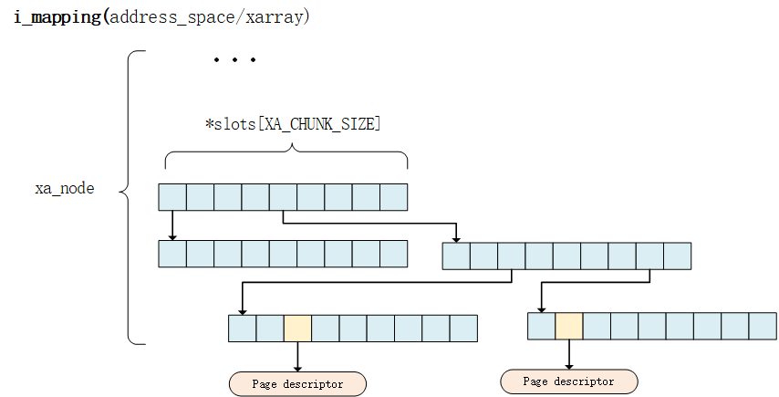
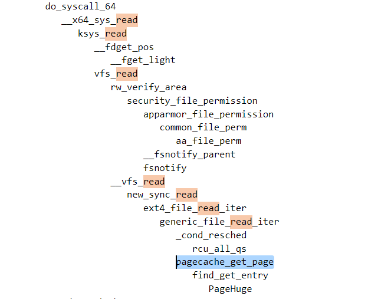

pcache.py
===

### 页缓存-pagecache
- 当从文件中读取数据时，如果要读取的数据所在的页缓存已经存在，那么就直接把页缓存的数据拷贝给用户即可。否则，内核首先会申请一个空闲的内存页（页缓存），然后从文件中读取数据到页缓存，并且把页缓存的数据拷贝给用户。
- 当向文件中写入数据时，如果要写入的数据所在的页缓存已经存在，那么直接把新数据写入到页缓存即可。否则，内核首先会申请一个空闲的内存页（页缓存），然后从文件中读取数据到页缓存，并且把新数据写入到页缓存中。
  
早期的Linux内核版本中，同时存在Page Cache和Buffer Cache，前者用于缓存对文件操作的内容，后者用于缓存直接对块设备操作的内容。  
page cache按照文件的逻辑页进行缓冲，buffer cache按照文件的物理块进行缓冲。  
简单说来，page cache用来缓存文件数据，buffer cache用来缓存磁盘数据。  
在内核版本2.4之后，对Page Cache、Buffer Cache的实现进行了融合，融合后的Buffer Cache不再以独立的形式存在，Buffer Cache的内容直接存在于Page Cache中，同时，保留了对Buffer Cache的描述符单元：buffer_head。

以下源码分析基于5.15版内核

### 从fd到pagecache
当文件被打开的时候会产生一个file结构体：  
/include/linux/fs.h
```c
struct file {
...
	struct path		f_path;
	struct inode		*f_inode;	/* cached value */
    ...
}
```

*f_inode指针指向该文件的唯一索引节点inode，该结构体存放内核在操作文件或目录时所需要的全部信息：  
/include/linux/fs.h
```c
struct inode {
...
	const struct inode_operations	*i_op;
	struct super_block	*i_sb;
	struct address_space	*i_mapping;
...
}
```

其中的*i_mapping字段指向这个文件的地址空间address_space结构，一个address_space结构管理了一个文件在内存中缓存的所有页面：  
/include/linux/fs.h
```c
struct address_space {
	struct inode		*host;
	struct xarray		i_pages;
...
}
```

i_pages指向管理这些页面的基树根节点，之前内核中基树由结构体`radix tree`来管理，现在替换成了`xarray`结构:
```c
struct radix_tree_root{
    ...
    struct radix_tree_node	__rcu *rnode;
}
struct radix_tree_node {
    ...
    void __rcu	*slots[RADIX_TREE_MAP_SIZE];
    ...
}
```
在以下文件中可以看到替换和声明:  
/include/linux/radix-tree.h
```c
/* Keep unconverted code working */
#define radix_tree_root		xarray
#define radix_tree_node		xa_node
```
关于这两个结构的更替可以去看这篇博客：  
[内核工匠 - 从radix tree到xarray](https://www.cnblogs.com/Linux-tech/p/12961281.html)


这个基树所有的节点均存储着一个缓存好的页面，之前的`radix_tree_node`和现在的`xa_node`是真正存放数据的地方
```c
struct xa_node {
...
	void __rcu	*slots[XA_CHUNK_SIZE];
...
}
```

*slots的每一个成员就是一个page结构体：  



### 怎么去找pagecache
使用`tail -f`命令读取一个文件，主要的目的是为了触发系统调用，然后用`trace-cmd`抓取read被调用以后触发了那些内核函数：  
详细使用可以参考另一文档：  
[传统工具与BPF工具](./1_%E7%9B%91%E6%B5%8B%E6%96%87%E4%BB%B6%E7%B3%BB%E7%BB%9F%E7%9A%84%E4%BC%A0%E7%BB%9F%E5%B7%A5%E5%85%B7%E4%B8%8EBPF%E5%B7%A5%E5%85%B7.md)



可以看出vfs_read方法会调用`pagecache_get_page -> find_get_entry`去pagecache中请求页面，查看此函数定义:  
/mm/filemap.c
```c
/**
 * pagecache_get_page - find and get a page reference
...
 * Return: the found page or %NULL otherwise.
 */
struct page *pagecache_get_page(struct address_space *mapping, pgoff_t offset,
	int fgp_flags, gfp_t gfp_mask)
{
	struct page *page;

repeat:
	page = find_get_entry(mapping, offset);
	if (xa_is_value(page))
		page = NULL;
	if (!page)
		goto no_page;

	if (fgp_flags & FGP_LOCK) {
		if (fgp_flags & FGP_NOWAIT) {
			if (!trylock_page(page)) {
				put_page(page);
				return NULL;
			}
		} else {
			lock_page(page);
		}

		/* Has the page been truncated? */
		if (unlikely(compound_head(page)->mapping != mapping)) {
			unlock_page(page);
			put_page(page);
			goto repeat;
		}
		VM_BUG_ON_PAGE(page->index != offset, page);
	}

	if (fgp_flags & FGP_ACCESSED)
		mark_page_accessed(page);

no_page:
	if (!page && (fgp_flags & FGP_CREAT)) {
		int err;
		if ((fgp_flags & FGP_WRITE) && mapping_cap_account_dirty(mapping))
			gfp_mask |= __GFP_WRITE;
		if (fgp_flags & FGP_NOFS)
			gfp_mask &= ~__GFP_FS;

		page = __page_cache_alloc(gfp_mask);
		if (!page)
			return NULL;

		if (WARN_ON_ONCE(!(fgp_flags & (FGP_LOCK | FGP_FOR_MMAP))))
			fgp_flags |= FGP_LOCK;

		/* Init accessed so avoid atomic mark_page_accessed later */
		if (fgp_flags & FGP_ACCESSED)
			__SetPageReferenced(page);

		err = add_to_page_cache_lru(page, mapping, offset, gfp_mask);
		if (unlikely(err)) {
			put_page(page);
			page = NULL;
			if (err == -EEXIST)
				goto repeat;
		}

		/*
		 * add_to_page_cache_lru locks the page, and for mmap we expect
		 * an unlocked page.
		 */
		if (page && (fgp_flags & FGP_FOR_MMAP))
			unlock_page(page);
	}

	return page;
}
```

*find_get_entry的实现如下：  
/mm/filemap.c
```c
/**
 * find_get_entry - find and get a page cache entry
 * @mapping: the address_space to search
 * @offset: the page cache index
 *
 * Looks up the page cache slot at @mapping & @offset.  If there is a
 * page cache page, it is returned with an increased refcount.
 *
 * If the slot holds a shadow entry of a previously evicted page, or a
 * swap entry from shmem/tmpfs, it is returned.
 *
 * Return: the found page or shadow entry, %NULL if nothing is found.
 */
struct page *find_get_entry(struct address_space *mapping, pgoff_t offset)
{
	XA_STATE(xas, &mapping->i_pages, offset);
	struct page *page;

	rcu_read_lock();
repeat:
	xas_reset(&xas);
	page = xas_load(&xas);
	if (xas_retry(&xas, page))
		goto repeat;
	/*
	 * A shadow entry of a recently evicted page, or a swap entry from
	 * shmem/tmpfs.  Return it without attempting to raise page count.
	 */
	if (!page || xa_is_value(page))
		goto out;

	if (!page_cache_get_speculative(page))
		goto repeat;

	/*
	 * Has the page moved or been split?
	 * This is part of the lockless pagecache protocol. See
	 * include/linux/pagemap.h for details.
	 */
	if (unlikely(page != xas_reload(&xas))) {
		put_page(page);
		goto repeat;
	}
	page = find_subpage(page, offset);
out:
	rcu_read_unlock();

	return page;
}
```

### 确定监测点与方法
利用`find_get_entry`的特性对其进行监控，每当内核调用到find_get_entry的时候就对其调用总数all+1，再用宏`PT_REGS_RC`得到被监控函数的返回值，若有返回值hit+1，如果无返回值则miss+1。  
**问题：**
```sh
# ./pcache.py 
Print pagecache hit ratio every 1s
cannot attach kprobe, probe entry may not exist
Traceback (most recent call last):
  File "./pcache.py", line 80, in <module>
    b.attach_kretprobe(event="find_get_entry", fn_name="exit_find_get_entry")
  File "/usr/lib/python2.7/dist-packages/bcc/__init__.py", line 873, in attach_kretprobe
    (fn_name, event))
Exception: Failed to attach BPF program exit_find_get_entry to kretprobe find_get_entry
```
`find_get_entry`无法绑定BPF程序  
于是转对`pagecache_get_page`进行监控。

###　BPF程序
####　绑定内核函数
```py
b = BPF(text=bpf_text)
b.attach_kprobe(event="pagecache_get_page", fn_name="count_total")
b.attach_kretprobe(event="pagecache_get_page", fn_name="count_hit")
```

####　按列打印输出
```py
    for stype, idx in sorted(stats.items(), key=lambda k_v: (k_v[1], k_v[0])):
        try:
            val = b["counts"][c_int(idx)].value / interval
            print(" %8d" % val, end="")
        except:
            print(" %8s" % "/", end="")
```

####　计算命中率
```py
    try:
        all = b["counts"][c_int(stats["ALL"])].value
        hit = b["counts"][c_int(stats["HIT"])].value
        pct =  float(100) * hit / all 
        print(" %9.1f%%" % pct)
    except:
        print(" %8s" % "-")
```

#### 打印详细信息
```py
struct data_t {
    u32 pid;
    u32 uid;
    char comm[TASK_COMM_LEN];
};
int count_hit(struct pt_regs *ctx) {
...
        u32 pid = bpf_get_current_pid_tgid();
        u32 uid = bpf_get_current_uid_gid();
        u64 ts  = bpf_ktime_get_ns();
        
        data.pid = pid;
        data.uid = uid;
        bpf_get_current_comm(&data.comm, sizeof(data.comm));
...
}
```

### 运行及结果
```sh
# ./pcache.py 
Print pagecache hit ratio every 1s
'-m' to show the miss info.
------------------------------------------------
TIME            ALL      HIT     MISS     RATIO
21:50:15        84       80        4      95.2%
21:50:16        21       21        0     100.0%
21:50:17         0        0        0        -
21:50:18         0        0        0        -
21:50:19        79       79        0     100.0%
21:50:20        29       25        4      86.2%
21:50:21         0        0        0        -
21:50:22         0        0        0        -
21:50:23         0        0        0        -
21:50:24        81       81        0     100.0%
```

使用**m**参数：
```sh
# ./pcache.py -m
Print pagecache hit ratio every 1s
'-m' to show the miss info.
------------------------------------------------
TIME            ALL      HIT     MISS     RATIO
18:10:14        16       16        0     100.0%
18:10:15         0        0        0        -
18:10:16         0        0        0        -
18:10:17        89       85        4      95.5%
Miss_info:
TS(s)             UID     USER    PID     COMM    
28350094674486    0       root    220      jbd2/nvme0n1p3-   
28350094681116    0       root    220      jbd2/nvme0n1p3-   
28350095228095    0       root    220      jbd2/nvme0n1p3-   
28350095233490    0       root    220      jbd2/nvme0n1p3-   

18:10:18        21       21        0     100.0%
18:10:19         0        0        0        -
18:10:20         2        2        0     100.0%
```

### 遇到的问题
- 1、在旧版本（Ubuntu 20.04 - Linux 5.4）使用`ksym(k.ip)`以及`bpf_get_current_comm`获取到的函数名称显示是正常的，而在新环境（Ubuntu 22.04 - Linux 5.15）是这样显示：
```
b'vfs_read'
```
**原因：**
排查以后发现是python版本的问题，Ubuntu 20.04的`python`命令默认使用的是python2.7，而Ubuntu 22.04用的是python3.10。

**解决：**
在新版本安装python2并指定为`python`命令默认版本：
```sh
# apt install python2

# update-alternatives --install /usr/bin/python python /usr/bin/python2 1
# update-alternatives --install /usr/bin/python python /usr/bin/python2 1

# python -V
Python 3.10.6

# update-alternatives --config python
有 2 个候选项可用于替换 python (提供 /usr/bin/python)。

  选择       路径            优先级  状态
------------------------------------------------------------
  0            /usr/bin/python3   2         自动模式
  1            /usr/bin/python2   1         手动模式
* 2            /usr/bin/python3   2         手动模式

要维持当前值[*]请按<回车键>，或者键入选择的编号：1
update-alternatives: 使用 /usr/bin/python2 来在手动模式中提供 /usr/bin/python (python)

# python -V
Python 2.7.18
```

- 2、安装了python2之后直接运行py脚本，报错：
```sh
# ./pcache.py
Traceback (most recent call last):
  File "./pcache.py", line 10, in <module>
    from bcc import BPF
ImportError: No module named bcc
```
**原因：**
之前编译bcc的时候是基于python3的，现在的python2找不到依赖包。

**解决：**
进入编译目录重新基于python2`make install`一下：
```sh
cd bcc/build
cmake -DPYTHON_CMD=python2 .. # build python2 binding
pushd src/python/
make
make install
popd
```

- 3、报错BPF stack limit of 512 bytes is exceeded
```
error: /virtual/main.c:33:25: in function trace_miss i32 (%struct.pt_regs*): Looks like the BPF stack limit of 512 bytes is exceeded. Please move large on stack variables into BPF per-cpu array map.
```
**原因：**
一个bpf程序不能申请太多的栈空间，目前限度512Byte:
```c
# define NAME_MAX           255
    char fname[NAME_MAX];
    char fstype[NAME_MAX];
```
**解决：**
```c
    char fname[NAME_MAX];
    char fstype[64];
```