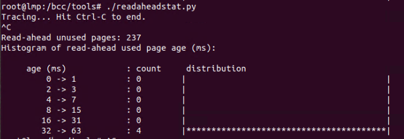

### 场景：Read-ahead
文件系统的预读取功能是指如果检测到一个顺序的读操作，就预测出接下来要读到页面，将这些页面加载到页缓存中。

程序使用`madvise()`函数（同时这也是一个系统调用）建议内核，在从 addr 指定的地址开始，长度等于 len 参数值的范围内，该区域的用户虚拟内存应遵循特定的使用模式。
```c
madvise(addr, len, MADV_SEQUENTIAL)g
```
` MADV_SEQUENTIAL`标志表示建议内核在一定内存范围内积极的预读，读完之后马上释放。

问题是：  
应用程序知道怎么使用这样的advise吗？（雾  
应用程序不知道底层的架构  
不同的操作系统怎么使得这点的使用达到最优  
缺少一个可以动态并深层的实时监控工具  

### 挑选一个监测点：
- **___do_page_cache_readahead()**  
  BPF_HASH存pid和flag
    - **__page_cache_alloc()**  
      BPF_HASH存返回值page地址和初始时间，同时pagecache数目++
        - **mark_page_accessed(*page)**  
          BPF_HISTOGRAM存时间差和页面数


PID对应的进程执行到__page_cache_alloc，bpf程序存储下进程所需要到的页面和时间戳，之后mark_page_accessed(*page)标记到相同的页面地址，就使得count++  
TS2-TS1=ΔTS page分到内存的时间？

#### 函数解释：
1. `__do_page_cache_readahead()`首先检查页面是否已经在cache中，若没有则用`__page_cache_alloc`分配内存页，并将页面加入页面池;
2. `__page_cache_alloc`返回分配好的page结构体；
3. `mark_page_accessed`标记被访问过的页面。
<font color=red>
PS：  
</font>
内核是通过mark_page_accessed函数显式标记页的活跃程度。初始分配的匿名页被放置到活跃链表中，而文件页被放置到非活跃链表中，并由内核在后续操作过程中显式标记活跃程度：连续两次被访问后，该页将被移动到活跃页链表中。相关函数如下:

```c
void mark_page_accessed(struct page *page)
{
	page = compound_head(page);
	if (!PageActive(page) && !PageUnevictable(page) &&
			PageReferenced(page)) {

		/*
		 * If the page is on the LRU, queue it for activation via
		 * activate_page_pvecs. Otherwise, assume the page is on a
		 * pagevec, mark it active and it'll be moved to the active
		 * LRU on the next drain.
		 */
		if (PageLRU(page))
			activate_page(page);
		else
			__lru_cache_activate_page(page);
		ClearPageReferenced(page);
		if (page_is_file_cache(page))
			workingset_activation(page);
	} else if (!PageReferenced(page)) {
		SetPageReferenced(page);
	}
	if (page_is_idle(page))
		clear_page_idle(page);
}
```

#### BPF程序：
```c
#include <uapi/linux/ptrace.h>
#include <linux/mm_types.h>
BPF_HASH(flag, u32, u8);            // used to track if we are in do_page_cache_readahead()
BPF_HASH(birth, struct page*, u64); // used to track timestamps of cache alloc'ed page
BPF_ARRAY(pages);                   // increment/decrement readahead pages
BPF_HISTOGRAM(dist);
```
创建了几个不同的映射关系用于存储中转的数据：
- 第一个BPF_HASH表`flag`在追踪do_page_cache_readahead的时候存储PID和Flag；
- 第二个BPF_HASH表`birth`在追踪__page_cache_alloc的时候存储页面时的时间以及页面结构体；
- BPF_ARRAY表`pages`用来存储要预读的页面；
- BPF_HISTOGRAM表`dist`用来打印直方图。

```c
int entry__do_page_cache_readahead(struct pt_regs *ctx) {
    u32 pid;
    u8 one = 1;
    pid = bpf_get_current_pid_tgid();
    flag.update(&pid, &one);
    return 0;
}
```
- 在__do_page_cache_readahead入口处获得调用此函数的进程's PID，存入flag表，打一个标志“1”；  
update应该是更新一条新数据的意思

```c
int exit__do_page_cache_readahead(struct pt_regs *ctx) {
    u32 pid;
    u8 zero = 0;
    pid = bpf_get_current_pid_tgid();
    flag.update(&pid, &zero);
    return 0;
}
```
- 在__do_page_cache_readahead出口处获得调用此函数的进程's PID，存入flag表，打一个标志“0”；

```c
int exit__page_cache_alloc(struct pt_regs *ctx) {
    u32 pid;
    u64 ts;
    struct page *retval = (struct page*) PT_REGS_RC(ctx);
    u32 zero = 0; // static key for accessing pages[0]
    pid = bpf_get_current_pid_tgid();
    u8 *f = flag.lookup(&pid);
    if (f != NULL && *f == 1) {
        ts = bpf_ktime_get_ns();
        birth.update(&retval, &ts);
        u64 *count = pages.lookup(&zero);
        if (count) (*count)++; // increment read ahead pages count
    }
    return 0;
}
```
- 在__page_cache_alloc执行完后触发：
    - 获得调用此函数的进程's PID；
    - 用宏`PT_REGS_RC`得到被监控函数__page_cache_alloc的返回值，也就是page结构体，并转换成指针类型；
    - 通过进程PID在flag表中找它的标志是否是1，可以理解为：如果这个进程同时也是__do_page_cache_readahead入口处抓到的，就打印其现在的时间戳，也就是开始调用__page_cache_alloc进行页面分配的精确时间；
    - 把分配了的页面以及开始分配该页面的时间写入birth表；
    - 下一步就是预读页面数目计算了  
      这里不太明白这个表里的数据时怎么并且什么时候写进去的？  
      是不是检测到相应的结构体就自动写入了？  
      那这样岂不是要区分一下自己定义的数据类型防止写错表？  
      为什么去lookup(&zero)，并且这样肯定是没有结果的，怎么能起到改变count值的作用呢？

```c
int entry_mark_page_accessed(struct pt_regs *ctx) {
    u64 ts, delta;
    struct page *arg0 = (struct page *) PT_REGS_PARM1(ctx);
    u32 zero = 0; // static key for accessing pages[0]
    u64 *bts = birth.lookup(&arg0);
    if (bts != NULL) {
        delta = bpf_ktime_get_ns() - *bts;
        dist.increment(bpf_log2l(delta/1000000));
        u64 *count = pages.lookup(&zero);
        if (count) (*count)--; // decrement read ahead pages count
        birth.delete(&arg0); // remove the entry from hashmap
    }
    return 0;
}
```
- 在执行mark_page_accessed时触发：
  - 用宏`PT_REGS_PARM1`得到被监控内核函数mark_page_accessed的第一个参数，查看其代码发现它只有一个参数，即page结构体；
  - 在birth表中找到这个结构体，获得它对应的时间戳TS1，并用现在的时间TS2-TS1，就得到了预读机制在分配页面到用上页面着之间所用了的时间；
  - 而且如果这个页面被mark_page_accessed，就从预读页面表birth中删除它，预读页面数相应也要减一。


```py
b.attach_kprobe(event="__do_page_cache_readahead", fn_name="entry__do_page_cache_readahead")
b.attach_kretprobe(event="__do_page_cache_readahead", fn_name="exit__do_page_cache_readahead")
b.attach_kretprobe(event="__page_cache_alloc", fn_name="exit__page_cache_alloc")
b.attach_kprobe(event="mark_page_accessed", fn_name="entry_mark_page_accessed")
```
把函数和要监控的内核函数进行绑定。

```py
def print_stats():
    print()
    print("Read-ahead unused pages: %d" % (b["pages"][ct.c_ulong(0)].value))
    print("Histogram of read-ahead used page age (ms):")
    print("")
    b["dist"].print_log2_hist("age (ms)")
    b["dist"].clear()
    b["pages"].clear()
    
while True:
    try:
        sleep(args.duration)
        print_stats()
    except KeyboardInterrupt:
        print_stats()
        break
```
打印输出  
最后还有一个预读机制加载了，但是并没有被用上的页面数计算（其实就是没有调用mark_page_accessed，页面没有被从表birth中删掉，把表中的值转成了unsigned long类型累加得到？）：
```py
    b["pages"][ct.c_ulong(0)].value
```

运行结果：  



#### 总结
这个脚本看起来虽然代码并不多，但是其实非常精简，在别的地方可以有一些可以输出的东西，比如在__do_page_cache_readahead函数入口处可以不止输出PID，__page_cache_alloc可以动态输出实时页面数，再结合mark_page_accessed打印被标记了的和未命中的页面数。以及__do_page_cache_readahead函数检查了页面是否在cache中的话，可以通过返回值来判断pagecache命中率。


