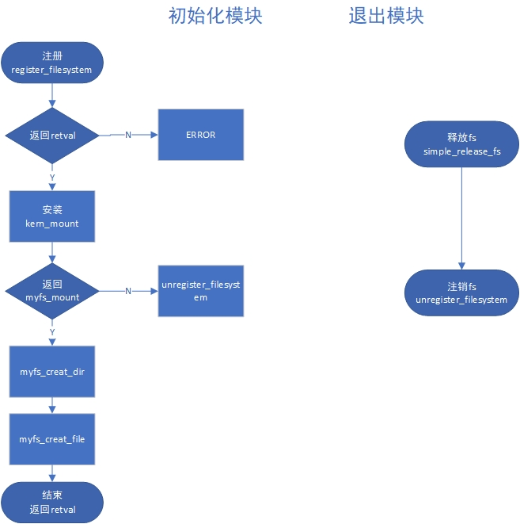
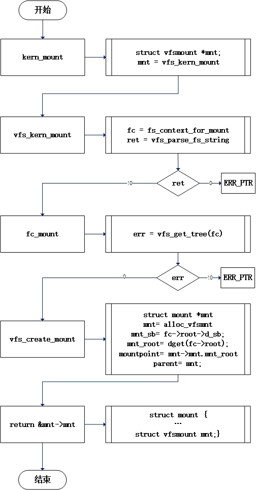

### 关于内核支持的文件系统
3类文件系统：
- 1、ext2/ext3/ext4,nfs,fat32-内核运行的时候，用来组织管理物理磁盘的
- 2、gfs,tfs,fastdfs,hdfs-分布式文件系统,做存储,网络服务器+文件系统
- 3、fuse-在内核中放在用户空间来调用的
        回调：监控内核，文件系统中每个文件的变化
可以在系统中查看所支持的文件系统（文件系统模块列表）：
```sh
root@server:/lib/modules/5.11.0-37-generic/kernel/fs# pwd
/lib/modules/5.11.0-37-generic/kernel/fs
root@server:/lib/modules/5.11.0-37-generic/kernel/fs# ls
9p      binfmt_misc.ko  efs       gfs2     minix       omfs       romfs       zonefs
adfs    btrfs           erofs     hfs      nfs         orangefs   shiftfs.ko
affs    cachefiles      exfat     hfsplus  nfs_common  overlayfs  sysv
afs     ceph            f2fs      hpfs     nfsd        pstore     ubifs
aufs    cifs            fat       isofs    nilfs2      qnx4       udf
autofs  coda            freevxfs  jffs2    nls         qnx6       ufs
befs    cramfs          fscache   jfs      ntfs        quota      vboxsf
bfs     dlm             fuse      lockd    ocfs2       reiserfs   xfs
```

那么/proc/filesystems又是做什么用的呢？
```sh
root@server:/lib/modules/5.11.0-37-generic/kernel/fs# cat /proc/filesystems 
nodev	sysfs
nodev	tmpfs
nodev	bdev
nodev	proc
nodev	cgroup
nodev	cgroup2
nodev	cpuset
nodev	devtmpfs
nodev	configfs
nodev	debugfs
nodev	tracefs
nodev	securityfs
nodev	sockfs
nodev	bpf
nodev	pipefs
nodev	ramfs
nodev	hugetlbfs
nodev	devpts
        ext3
        ext2
        ext4
        squashfs
        vfat
nodev	ecryptfs
	    fuseblk
nodev	fuse
nodev	fusectl
nodev	mqueue
nodev	pstore
nodev	autofs
```
/proc/filesystems译为编译到内核中的文件系统的文本列表。
第一列中的“nodev”字符串意味着文件系统不需要安装块设备，这就是所谓的虚拟文件系统。

经过对比发现只有**fuse、pstore、autofs**出现在件系统模块列表中，其他都没有，即使是ext类型

实在是想不明白这两个地方的差异是为什么，在网上看到这样一段机翻回答：
> 如果你想挂载的文件系统有一个可用的模块,但它尚未加载,因此尚未显示在/ proc/filesystems中,那么它将按需加载,这就是为什么你没有任何问题安装.
安装了这样的文件系统后,该文件系统类型应该出现在/proc/filesystems中.
因此,它是“已加载驱动程序的受支持文件系统列表”;可以通过加载适当的模块来添加其他文件系统.

我想他要表达的大概是：
> /proc/filesystems中列出的是其模块已经被加载到操作系统的fs类型，而那些没加载的需要去按需手动加载，所以/proc/filesystems称作“已加载驱动程序的受支持文件系统列表”。

### 如何设计一个文件系统
设置一个myfs.h头文件来存放所有的函数，myfs.c仅用来做模块的初始化和卸载

#### myfs.c
在初始化模块中需要先对文件系统注册，再安装，随后创建几个测试用的目录与文件



##### 1、注册文件系统
直接调用函数**register_filesystem**
- filesystem.c - 72
```c
int register_filesystem(struct file_system_type * fs)
{
	int res = 0;
	struct file_system_type ** p;
        //二级指针p中存储的是一个一级指针，这个指针指向file_system_type结构

	if (fs->parameters &&
	    !fs_validate_description(fs->name, fs->parameters))
		return -EINVAL;

	BUG_ON(strchr(fs->name, '.'));  //判断文件名中是否有“.”
	if (fs->next)
		return -EBUSY;
	write_lock(&file_systems_lock);
	p = find_filesystem(fs->name, strlen(fs->name));
        //按照name在file_systems查找，找到返回二级指针p
	if (*p)
		res = -EBUSY;
        //有同名的p，则报错
	else
		*p = fs;
        //如果没有找到的话就把新文件系统类型fs的结构放在指针二级p所指向的那个一级指针里，而这个一级指针指向file_systems链表的最后一项
	write_unlock(&file_systems_lock);
	return res;
}
```
这是由于find_filesystem函数的返回值是二级指针p，要是没有找到同名文件系统的话，经过for循环现在p所指向的那个地方存放着一个位置：p = &(*p)->next，也就是链表最后一个元素的下一个位置，所以没有匹配到同名的话，新的fs会放在file_systems链表的最后一项。

**find_filesystem**
```c
static struct file_system_type **find_filesystem(const char *name, unsigned len)
{
	struct file_system_type **p;
        //在file_systems链表中按照传入的name挨个匹配，找到的话返回p
	for (p = &file_systems; *p; p = &(*p)->next)
		if (strncmp((*p)->name, name, len) == 0 &&
		    !(*p)->name[len])
			break;
	return p;
}
```

##### 2、挂载文件系统
直接调用**kern_mount**函数
- namespace.c - 3863
```c
struct vfsmount *kern_mount(struct file_system_type *type)
{
	struct vfsmount *mnt;
	mnt = vfs_kern_mount(type, SB_KERNMOUNT, type->name, NULL);
	if (!IS_ERR(mnt)) {
		/*这是一个长期的挂载，注销和卸载之前不要释放mnt*/
		real_mount(mnt)->mnt_ns = MNT_NS_INTERNAL;
	}
	return mnt;
}
EXPORT_SYMBOL_GPL(kern_mount);
```

**vfs_kern_mount**
```c
struct vfsmount *vfs_kern_mount(struct file_system_type *type,
				int flags, const char *name,
				void *data)
{
	struct fs_context *fc;
	struct vfsmount *mnt;
	int ret = 0;

	if (!type)
		return ERR_PTR(-EINVAL);
        //为挂载分配文件系统上下文 struct fs_context
	fc = fs_context_for_mount(type, flags);
	if (IS_ERR(fc))
		return ERR_CAST(fc);
        //解析传入的名字字符串
	if (name)
		ret = vfs_parse_fs_string(fc, "source",
					  name, strlen(name));
	if (!ret)
		ret = parse_monolithic_mount_data(fc, data);
	//解析没有问题执行fc_mount
        if (!ret)
		mnt = fc_mount(fc);
	else
		mnt = ERR_PTR(ret);

	put_fs_context(fc);
	return mnt;
}
EXPORT_SYMBOL_GPL(vfs_kern_mount);
```

**fc_mount**
```c
struct vfsmount *fc_mount(struct fs_context *fc)
{
	int err = vfs_get_tree(fc);	//获取一个可用于挂载的根节点和超级块
	if (!err) {
		up_write(&fc->root->d_sb->s_umount);
		return vfs_create_mount(fc);
		//获取成功以后则配置
	}
	return ERR_PTR(err);
}
EXPORT_SYMBOL(fc_mount);
```

**vfs_get_tree**
```c
//获取一个可用于挂载的根节点和超级块，fc是超级块配置信息
{
	struct super_block *sb;
	int error;

	if (fc->root)
		return -EBUSY;

	/* Get the mountable root in fc->root, with a ref on the root and a ref
	 * on the superblock.
	 */
	error = fc->ops->get_tree(fc);
	if (error < 0)
		return error;

	if (!fc->root) {
		pr_err("Filesystem %s get_tree() didn't set fc->root\n",
		       fc->fs_type->name);
		/* We don't know what the locking state of the superblock is -
		 * if there is a superblock.
		 */
		BUG();
	}

	sb = fc->root->d_sb;
	WARN_ON(!sb->s_bdi);

	/*
	 * Write barrier is for super_cache_count(). We place it before setting
	 * SB_BORN as the data dependency between the two functions is the
	 * superblock structure contents that we just set up, not the SB_BORN
	 * flag.
	 */
	smp_wmb();
	sb->s_flags |= SB_BORN;

	error = security_sb_set_mnt_opts(sb, fc->security, 0, NULL);
	if (unlikely(error)) {
		fc_drop_locked(fc);
		return error;
	}

	/*
	 * filesystems should never set s_maxbytes larger than MAX_LFS_FILESIZE
	 * but s_maxbytes was an unsigned long long for many releases. Throw
	 * this warning for a little while to try and catch filesystems that
	 * violate this rule.
	 */
	WARN((sb->s_maxbytes < 0), "%s set sb->s_maxbytes to "
		"negative value (%lld)\n", fc->fs_type->name, sb->s_maxbytes);

	return 0;
}
EXPORT_SYMBOL(vfs_get_tree);
```

**vfs_create_mount**
```c
//为一个已配置的超级块分配mount实例
struct vfsmount *vfs_create_mount(struct fs_context *fc)
{
	struct mount *mnt;

	if (!fc->root)
		return ERR_PTR(-EINVAL);

	mnt = alloc_vfsmnt(fc->source ?: "none");	//从内存中分配mount实例
	if (!mnt)
		return ERR_PTR(-ENOMEM);

	if (fc->sb_flags & SB_KERNMOUNT)
		mnt->mnt.mnt_flags = MNT_INTERNAL;

	atomic_inc(&fc->root->d_sb->s_active);
	mnt->mnt.mnt_sb		= fc->root->d_sb;	//关联超级块
	mnt->mnt.mnt_root	= dget(fc->root);	//关联根dentry
	mnt->mnt_mountpoint	= mnt->mnt.mnt_root;//关联挂载点
	mnt->mnt_parent		= mnt;				//父节点指向自己

	lock_mount_hash();
	list_add_tail(&mnt->mnt_instance, &mnt->mnt.mnt_sb->s_mounts);
	unlock_mount_hash();
	return &mnt->mnt;
}
EXPORT_SYMBOL(vfs_create_mount);
```

至此挂载结束，整个流程大致如下：


#### myfs.h
设计一个文件系统的时候有3个接口是需要自己定义的，为什么这三个是必须的呢：
- file_system_type-表述文件系统
- inode_operations-文件的具体内容该怎么存，文件的组织方式
- file_operations-文件操作的关联函数

**第一步**先定义一个文件系统类型
```c
struct file_system_type my_fs_type
{
    .module = THIS_MODULE,
    .name = "zffs",
    .mount = zf_mount,      //挂载
    .kill_sb = zf_kill_sb   //卸载
};
```
挂载与卸载这两个函数需要自己实现，参照源码中的定义方式将实现写在前面并更名
```c
//挂载
struct dentry zf_mount (struct file_system_type *fs_type, int flags, const char *devname, void *data)
{
    return mount_nodev(fs_type, flags, data, zf_fill_super);
    //相当于mount -t zffs none 
    //这里前四个定义了，所以fill_super也照着源码定义
}

//卸载，或者直接调用super.c中的kill_litter_super
void zf_kill_sb (struct super_block *sb)
{
    
}

//fill_super来填充超级块
int zf_fill_super(struct super_block *sb, void *data, int client)
{
    
}
```

**第二步**定义inode_operations
```c
struct inode_operations zf_inode_operations
{
    .create = zf_create,
};
```
Create函数自己写：
```c
//inode_ops -> zf_create
int zf_create (struct inode *inode ,struct dentry *dty, umode_t mode, bool excl)
{

}
```

**第三步**定义file_operations
```c
struct file_operations zf_file_operations
{
    .read = zf_read,
    .write = zf_write,
};
```
读写函数需要自己写：
```c
ssize_t zf_read (struct file *, char __user *, size_t, loff_t *)
{

}
ssize_t zf_write (struct file *, const char __user *, size_t, loff_t *)
{
    
}
```