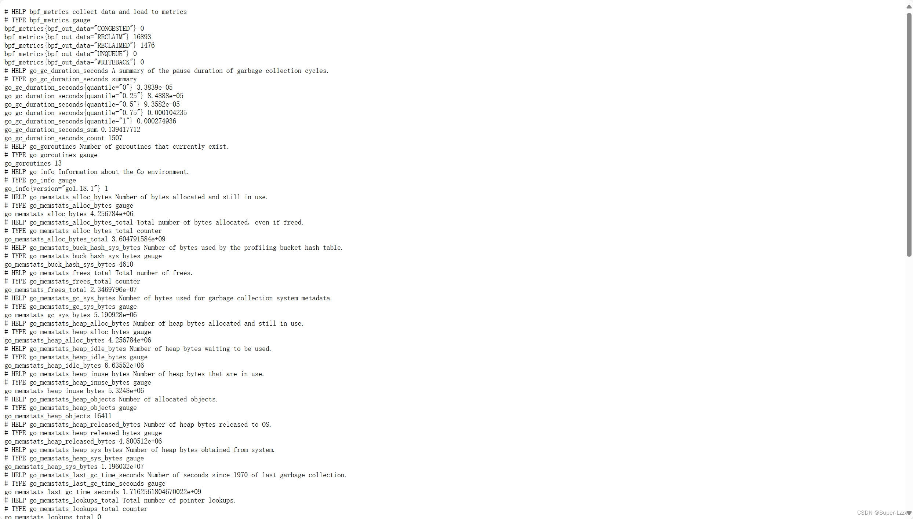

# mem_watcher可视化
## 配置环境
在使用mem_watcher可视化之前，请先配置docker、go的环境,具体配置方法可参考：
### 配置docker
[在 Ubuntu 上安装 Docker Desktop |Docker 文档](https://docs.docker.com/desktop/install/ubuntu/#install-docker-desktop)
[在 Linux 上安装 Docker Desktop |Docker 文档](https://docs.docker.com/desktop/install/linux-install/)
### go环境
配置好dacker环境后接着配置go的环境 
我们首先对我们现有的工具进行编译
- 首先先进入lmp目录下的`lmp/eBPF_Supermarket/Memory_Subsystem/mem_watcher`文件夹
然后进行编译，其实这一步也可以忽略掉
```c
 make -j 20	
```
- 在lmp目录下的`eBPF_Visualization/eBPF_prometheus`文件夹下
- 执行make指令，编译可视化的go语言工具
- 执行`make start_service`指令，配置下载docker镜像并启动grafana和prometheus服务
- 执行如下指令开始采集数据以及相关处理：
```c
 ./data-visual collect /home/ubuntu/lmp/eBPF_Supermarket/Memory_Subsystem/mem_watcher/mem_watcher -p
```
切记根据自己的文件所在目录进行修改，如果不知道或者不确定的可以在自己的程序文件下输入`pwd`命令进行查看，如果目录出现错误会失败。

在网页打开网址：http://81.70.204.7:8090/metrics 此处为localhost:8090/metrics,便可以看到http网页中的数据；
这个网址需要根据你自己的虚拟机的ip进行修改。

- 在网页打开网址：http://81.70.204.7:3000/ 即可进入grafana服务，使用初始密码登录（user:admin pswd: admin）进入管理界面：
- 点击【Home-Connection-Add new connection】，选择Prometheus，建立与Prometheus服务器的连接：


这个172.17.0.1表示docker0网桥的 IPv4 地址。在 Docker 中，通常会将docker0的第一个 IP 地址分配给Docker主机自身。因此，172.17.0.1是 Docker主机上Docker守护进程的 IP 地址，所以在Grafana数据源这块设置成http://172.17.0.1:9090 ，然后点击下面的【Save & test】按钮
- 进入可视化配置界面：


## mem_watcher子工具可视化输出（样例）
### mem_watcher -p
- reclaimed

可以进行压力测试 
首先使用`sudo apt-get install stress`安装压力测试工具。
使用下面的命令对内存进行施压 `stress -m 3 --vm-bytes 300M`
会生成3个进程，每个进程占用300M内存。
