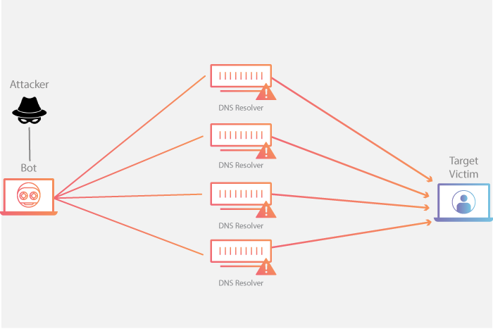

## 概述
### 什么是DNS放大攻击？

简单来说，DNS放大攻击是攻击者向DNS服务器发送大量请求，这些请求会尽可能多地查询区域信息，使响应的大小“膨胀”数倍。这样，攻击者就能够以少量的请求流量导致巨大的响应流量，淹没正常的通信链路。
> 所有放大攻击都利用攻击者和目标 Web 资源之间的带宽消耗差异。当消耗差异经过多次请求而被放大时，所产生的流量可导致网络基础设施中断。通过发送小型请求来导致大规模响应，恶意用户就能达到四两拨千斤的效果。当通过某个僵尸网络中的每个自动程序都发出类似请求来使这种放大效果倍增时，攻击者既能躲避检测，又能收获攻击流量大增的好处。



### 检测DNS放大攻击
在DNS放大攻击中，攻击者为了尽可能地“放大”响应，通常会将查询类型设置为ANY
> In most attacks of this type observed by US-CERT, the spoofed queries sent by the attacker are of the type, “ANY,” which returns all known information about a DNS zone in a single request.

> 每个 UDP 数据包都向 DNS 解析器发出请求，通常传递一个参数（例如“ANY”）以接收尽可能最大的响应。

#### DNS查询类型
DNS报文的格式如下：


查询的类型在Question中，Question的结构如下：


其中QTYPE即代表此次查询的类型，表示此次响应的状态：


对于ANY类型的查询，QTYPE值为255

#### 统计ANY查询的次数
如果在一段时间内ANY查询的次数超过了阈值，则判定当前正受到DNS放大攻击。

#### 实现
维护一个ebpf map<ip, any_count>，key为请求源ip，any_count为该ip发出ANY查询的次数。在XDP程序中，每收到一个请求，如果该请求的查询类型为ANY（QTYPE=255），则该ip对应的any_count+1，同时全局的any_count+1

### 防御DNS放大攻击
在XDP程序中，对于每个ANY查询：
1. 从ebpf map中获取请求源ip对应的ANY查询次数，如果次数超过阈值，则直接返回XDP_DROP
2. 从ebpf map中获取全局的ANY查询次数，如果次数超过阈值，则直接返回XDP_DROP

## 实践

### 前提
内核版本>=5.4，更低版本未验证

已安装：
- Docker
- dig（DNS客户端，用于测试）

### 快速开始
1. 构建测试镜像
```sh
make builder
```
demo的所有依赖都包含在docker镜像中，不需要在宿主机中安装

2. 运行DNS服务器，并加载eBPF程序
```sh
make test
```
此时已在本机用docker运行了一个DNS服务器，可以使用dig命令测试DNS服务器是否正常运行
```sh
dig @localhost gateway.example.com +retry=0
```

3. 配置每个源ip的ANY查询次数阈值
```sh
make any-threshold value=3 # bpftool map update pinned /sys/fs/bpf/xdp/globals/configuration key 2 value 3 0 0 0
```
这意味着在60s内（默认），最多允许一个ip发出3次ANY查询

4. 模拟DNS NXDOMAIN Flood
使用dig向DNS服务器连续发送3次ANY查询请求
```sh
dig @localhost gateway.example.com +retry=0 -t any +notcp
dig @localhost gateway.example.com +retry=0 -t any +notcp
dig @localhost gateway.example.com +retry=0 -t any +notcp
```
可以发现这3次请求都能够正常的返回结果

 再发送1次请求
```sh
dig @localhost gateway.example.com +retry=0 -t any +notcp
```
会发现这次请求超时，原因是该请求被XDP程序正确地丢弃了

5. 清理测试环境
```sh
make clean-test
```

### 使用说明
运行相关的参数都使用bpf map的方式动态配置

|  key |  value |  说明  |
| :------------: | :------------|:------------|
| 0  |  连续域名错误阈值（每个源ip） | 超过阈值后，该ip发出的请求会被直接丢弃 |
|  1 |  请求次数阈值（每个源ip） | 超过阈值后，该ip发出的请求会被直接丢弃 |
|  2 |  ANY查询阈值（每个源ip） | 超过阈值后，该ip发出的请求会被直接丢弃 |
|  3 |  ANY查询阈值（全局） | 超过阈值后，服务器将拒绝接收ANY查询 |
| 4  |  域名错误阈值（全局） | 超过阈值后，将自动强制使用TCP |
| 200  | 刷新间隔时间（s）  | 统计数据的刷新间隔，默认为60s |
| 201  |  是否强制使用TCP | 0/未设置代表否，非0代表是 |

例：
#### 将刷新间隔设置为100s
```sh
make interval value=100 # bpftool map update pinned /sys/fs/bpf/xdp/globals/configuration key 200 value 100 0 0 0
```
这意味着每过100s，会刷新所有计数值

#### 将全局ANY查询阈值设置为100
```sh
make global-any-threshold value=100 # bpftool map update pinned /sys/fs/bpf/xdp/globals/configuration key 3 value 100 0 0 0
```
这意味着在刷新间隔时间内，DNS服务器最多相应100个ANY查询，更多的查询将被丢弃

#### 将请求阈值设置为200
```sh
make count-threshold value=200 # bpftool map update pinned /sys/fs/bpf/xdp/globals/configuration key 1 value 200 0 0 0
```
这意味着在刷新间隔时间内，每个ip最多允许发出200次请求

#### 编译eBPF程序
本demo有2个eBPF程序，XDP和socket filter，其中socket filter是由BCC在python运行时编译和加载的，所以只需编译XDP程序：
```sh
make xdp_dns
```
编译后的obj文件为`src/xdp_dns_kern.o`

## 参考
[1] https://www.cloudflare.com/zh-cn/learning/ddos/dns-amplification-ddos-attack/

[2] https://mislove.org/teaching/cs4700/spring11/handouts/project1-primer.pdf

[3] https://www.imperva.com/learn/ddos/dns-amplification/

[4] http://jaminzhang.github.io/dns/DNS-Message-Format/
