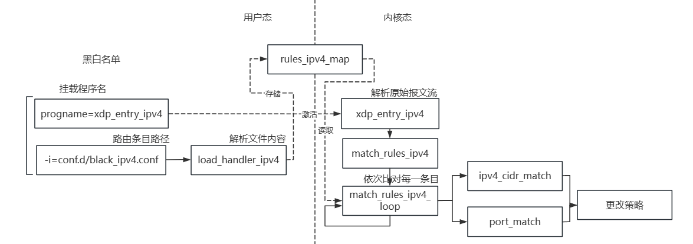

## 黑白名单

### 概述

​	本工具通过XDP技术，在内核层面实现高效的网络流量监控和过滤。通过配置规则文件，可以灵活地定义黑白名单策略，对特定IP、端口和协议的报文进行过滤。结合实际网络环境，这种工具能够有效提升网络安全性，减少恶意流量，优化网络性能，特别适用于需要高性能数据包处理的场景，如大型数据中心和云计算平台。

### 实现

其具体的代码架构如下图所示



核心代码逻辑如下:

```c
static int match_rules_ipv4_loop(__u32 index, void *ctx)
{
	int i = 0;
	unsigned char *saddr;
	unsigned char *daddr;
	struct match_rules_loop_ctx *p_ctx = (struct match_rules_loop_ctx *)ctx;
	if(index != p_ctx->next_rule)
		return 0;

	struct rules_ipv4 *p_r = bpf_map_lookup_elem(&rules_ipv4_map, &index);
	if(!p_r){
		return 1; //out of range
	}

	p_ctx->next_rule = p_r->next_rule;

	if(index == 0)
		goto out_match_rules_ipv4_loop;
	bpf_printk("match_rules_ipv4_loop %d",index);
	if( ipv4_cidr_match(p_ctx->conn->saddr, p_r->saddr, p_r->saddr_mask) && 
		ipv4_cidr_match(p_ctx->conn->daddr, p_r->daddr, p_r->daddr_mask) &&
		port_match(p_ctx->conn->sport, p_r->sport) &&
		port_match(p_ctx->conn->dport, p_r->dport) &&
		port_match(p_ctx->conn->ip_proto, p_r->ip_proto) ) 
	{
		p_ctx->action = p_r->action;
		...
		return 1;
	}
```

​	其通过加载预先配置好的文件，将其读取到对应map中，在接收到报文时，使用规则逐条对该报文进行匹配，其中包括精准匹配和泛化匹配(CIDR)，最终，将我们给出的决策结果赋给XDP行为，使其进行具体的逻辑操作。

#### 输入参数优化

在原先的黑白名单中，名单的路径参数十分固定

```c
    if (cfg.ip_filter) {
		load_bpf_map();
        err = load_handler_ipv4(argc - 3, argv + 6);
        if (err) {
            fprintf(stderr, "ERR: loading IP filter config file\n");
            return err;
        }
```

因此其使用的方法十分固定，要求路径必须在相应的位置，如：

```
sudo ./netmanager -d ens33 -S --progname=xdp_entry_ipv4 -i conf.d/black_ipv4.conf -t
```

将其绑定到-i参数上

```c
cfg->ip_filter_file = (char *)&cfg->ip_filter_file_buf; //初始化ip_filter_file
strncpy(cfg->ip_filter_file, optarg, FILE_MAXSIZE);
```

通过先将 `cfg->ifname` 指向 `cfg->ifname_buf`，确保了 `cfg->ifname` 指向的是一个有效的缓冲区，然后再使用 `strncpy` 将字符串复制到该缓冲区中，从而避免了潜在的内存访问错误。

去掉这种限制

```
sudo ./netmanager -d ens33 -S --progname=xdp_entry_ipv4 -i conf.d/black_ipv4.conf -t
```

#### 增添输出格式

原先的程序中，除了对所有策略的统计输出，并无其余输出，对可读性有一定的限制，现在通过增添filter_info将数据打印在日志中，使用户可以清晰看到相应规则所匹配到的条目信息。

### 使用方法

本功能的使用命令为

```
sudo ./netmanager -d ens33 -S --progname=xdp_entry_ipv4 -i conf.d/black_ipv4.conf
```

也可以在其中加入-t/T选项，t参数会定时统计所有策略对应的报文数，T参数会输出所有匹配条目与策略

之后可以使用xdp-loader查看挂载程序及卸载

```shell
sudo xdp-loader status
```


其中可以看到对应网卡上挂载的XDP程序

当不使用时进行卸载

```shell
sudo xdp-loader unload ens33 --all
```

在 ./conf.d 目录里有样例规则文件 black_ipv4.conf 别代表条目名单。程序会按顺序逐行加载进BPF Map，同样，XDP程序执行时也会逐行匹配规则，所以写在前面的规则具有更高的优先级。每行规则的格式为：

```
[SIP/MASK] [DIP/MASK] [SPORT] [DPORT] [PROTO] [ALLOW/DENY]
```

其中分别为源地址/源码、目的地址/源码、源端口、目的端口、协议类型、条目策略。

需要注意，**XDP只对收包路径上的数据有效，因此此处的源地址/端口为另一端，而目的地址/端口为本机**。

**当某段字段为0时，代表不进行此处的过滤，为全部匹配**。如需要匹配所有的ICMP报文，则为

```
0.0.0.0/0 0.0.0.0/0 0 0 ICMP DENY
```

若要实现黑名单，根据匹配的优先级顺序，则需要在规则的最后⼀条写上（也可不加），默认为ALLOW，当匹配不到其余规则时会默认进行PASS策略（但仍建议增添）

```c
0.0.0.0/0 0.0.0.0/0 0 0 0 ALLOW
```

若要实现白名单，需要将最后⼀条规则写为（必须增添，否则没有实际效果）

```
0.0.0.0/0 0.0.0.0/0 0 0 0 DENY
```

如需禁止源IP为 172.17.0.0/24 ，目的IP为任意 0.0.0.0/0 ，源端⼝号为任意 0 ，⽬的端⼝号为 80 的 TCP 协议

```
172.17.0.2/32 0.0.0.0/0 0 80 TCP DENY
```

对于掩码，本功能用以过滤同一IP组的报文，如

```
192.168.239.0/24 192.168.239.132/32 0 0 ICMP DENY
```

此处的192.168.239.0/24表示掩码为24位，及仅留取前24位的IP用以匹配，同样的，**收到的实际报文也会按照此掩码屏蔽掉相应字节**， 所以此句将会屏蔽192.168.239.*地址发来的ICMP报文，所以此处192.168.239.0/24 中的0并无实际意义，其可以写为任意实际ip，但需注意掩码位数，尤其掩码不为8的整数倍时，但是本功能**建议屏蔽掉的相应字节归零**，便于阅读，如192.168.239.194/26应写为192.168.239.192/26，此处的192为194屏蔽掉后后6位的实际值。

最终给出示例，我们在配置文件中写入，用以配置规则，其实现类似黑名单的功能，及禁止所有目的地地址为本机的ICMP及TCP报文

```c
0.0.0.0/0 192.168.239.132/32 0 0 ICMP DENY
0.0.0.0/0 192.168.239.132/32 80 0 TCP DENY
0.0.0.0/0 0.0.0.0/0 0 0 0 ALLOW //此条目可省略
```

之后加载到程序中

```bash
sudo ./xdp_loader -d ens33 -S --progname=xdp_entry_ipv4 -i conf.d/black_ipv4.conf -t
```

可以发现已经drop了所有报文


### 输出分析

本功能将输出所有匹配到的报文，此为无其余输出，由于用户态程序只用于激活，不作为循环监听的载体，故在内核态进行输出，当XDP程序挂载到相应网卡并且与相应条目匹配后输出。

需要使用相关命令查看

```
sudo cat /sys/kernel/debug/tracing/trace_pipe
```


其中可以看到符合匹配的相关报文信息，其中包括四元组、协议类型、XDP策略行为以及匹配条目的序号。