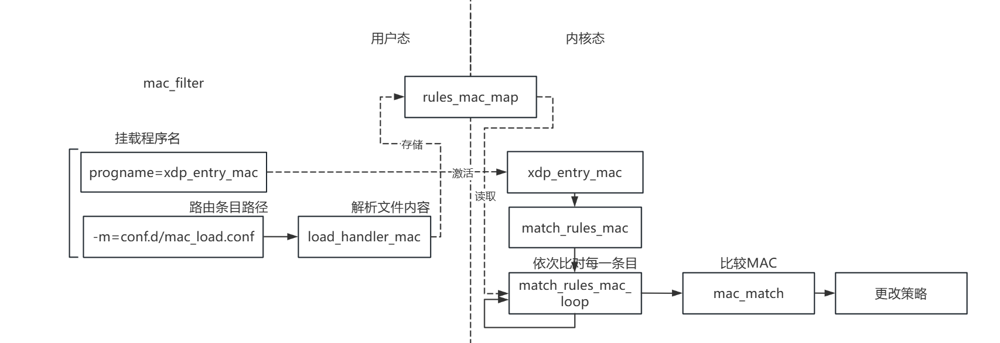
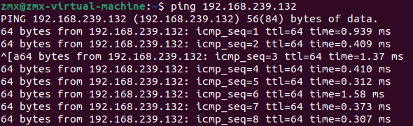
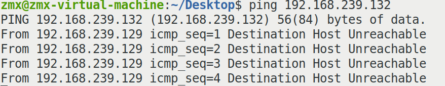
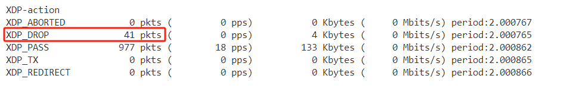

## MAC过滤

### 概述

​	本工具通过XDP技术，在内核层实现了高效的MAC地址过滤，专注于基于设备物理地址的流量控制。MAC地址过滤能够在网络层面上直接识别和控制特定设备的访问权限，无需依赖上层协议的验证机制。通过配置特定设备的MAC地址黑白名单，能够有效防止未经授权的设备接入网络，确保网络安全性。

其主要应用在于

1. **硬件级别过滤**: MAC地址是网络接口卡的唯一标识，不会像IP地址那样频繁变化，因此在底层网络设备上做过滤更有效。
2. **物理位置绑定**: 在局域网中，MAC地址通常和设备物理位置绑定，有助于对物理设备进行精确控制。
3. **隔离内外网**：通过限制外部设备基于MAC地址接入本地网络，可以强化内外网隔离的策略，从而间接提高内部网络的安全性。

MAC地址仅在局域网中有效，跨路由器的网络（如广域网）无法通过MAC地址进行过滤

### 实现

总体框架流程如下：



具体匹配策略如下：

```c
int mac_match(__u8 *conn_mac, __u8 *rule_mac) {
    __u8 zero_mac[ETH_ALEN] = {0};  // 全零的MAC地址

    // 如果rule_mac全为零，匹配所有MAC地址
    if (bpf_memcmp(rule_mac, zero_mac, ETH_ALEN) == 0) {
        return 1;
    }

    // 如果rule_mac的后三个字节为零，且前三个字节与conn_mac相同
    if (bpf_memcmp(&rule_mac[3], zero_mac, 3) == 0) {
        if (bpf_memcmp(conn_mac, rule_mac, 3) == 0) {
            return 1;  // 匹配前三字节
        }
    }

    // 检查规则MAC与连接MAC是否完全匹配
    if (bpf_memcmp(rule_mac, conn_mac, ETH_ALEN) == 0) {
        return 1;  // 完全匹配
    }

    return 0;  // 不匹配
}
```

### 使用方法

本功能的使用命令为

```c
sudo ./netmanager -d ens33 -S --progname=xdp_entry_mac -m conf.d/mac_load.conf -t
```

之后可以使用xdp-loader查看挂载程序及卸载

在 ./conf.d 目录里有样例规则文件 mac_load.conf 代表条目名单。程序会按顺序逐行加载进BPF Map，同样，XDP程序执行时也会逐行匹配规则，所以写在前面的规则具有更高的优先级。每行规则的格式为：

```
[SOURCE_MAC] [DEST_MAC] [ALLOW/DENY]
```

其中分别为源MAC地址、目的MAC地址及条目策略。

需要注意，**XDP只对收包路径上的数据有效，因此此处的源为另一端，而目的为本机**。

**当某段字段为0时，代表不进行此处的过滤，为全部匹配**。

若要实现黑名单，根据匹配的优先级顺序，则需要在规则的最后⼀条写上（也可不加），默认为ALLOW，当匹配不到其余规则时会默认进行PASS策略（但仍建议增添）

```c
00:00:00:00:00:00 00:00:00:00:00:00 ALLOW
```

若要实现白名单，需要将最后⼀条规则写为（必须增添，否则没有实际效果）

```c
00:00:00:00:00:00 00:00:00:00:00:00 DENY
```

我们还对某一厂商的MAC地址进行泛化匹配，当前三字节不为0（固定厂商）且后三字节为0时,可以对其进行泛化，匹配到所有该厂商的MAC地址，如

```
00:0c:29:00:00:00 00:00:00:00:00:00 ALLOW
```

最终给出实例，我们在规则配置文件中写入

```c
00:0c:29:57:00:4d 00:00:00:00:00:00 ALLOW
00:0c:29:00:00:00 00:00:00:00:00:00 DENY
00:00:00:00:00:00 00:00:00:00:00:00 ALLOW
```

其中，00:0c:29开头的MAC地址是VMware虚拟网卡固定分配的前缀

之后加载到程序中

```shell
sudo ./netmanager -d ens33 -S --progname=xdp_entry_mac -m conf.d/mac_load.conf -t
```

之后通过不同虚拟机使用ping/curl来连接该主机

当MAC地址为00:0c:29:57:00:4d（特定主机），其可以正常连接



而其余虚拟机进行访问时会被拒绝



可以看到，相应报文已经被DROP

