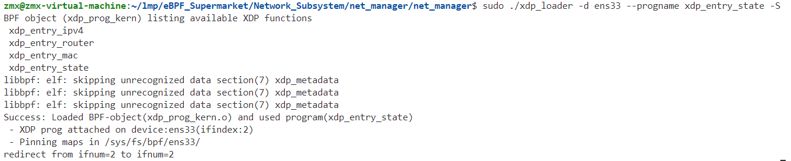
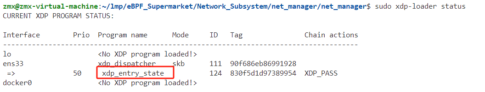
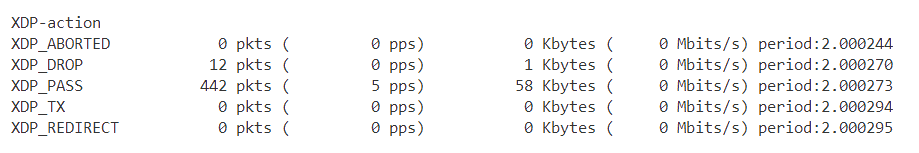
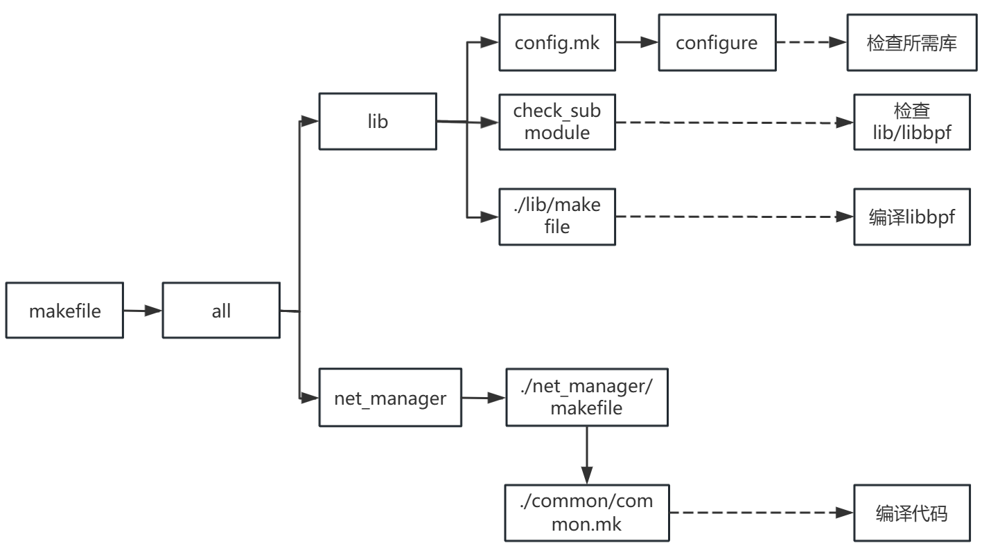
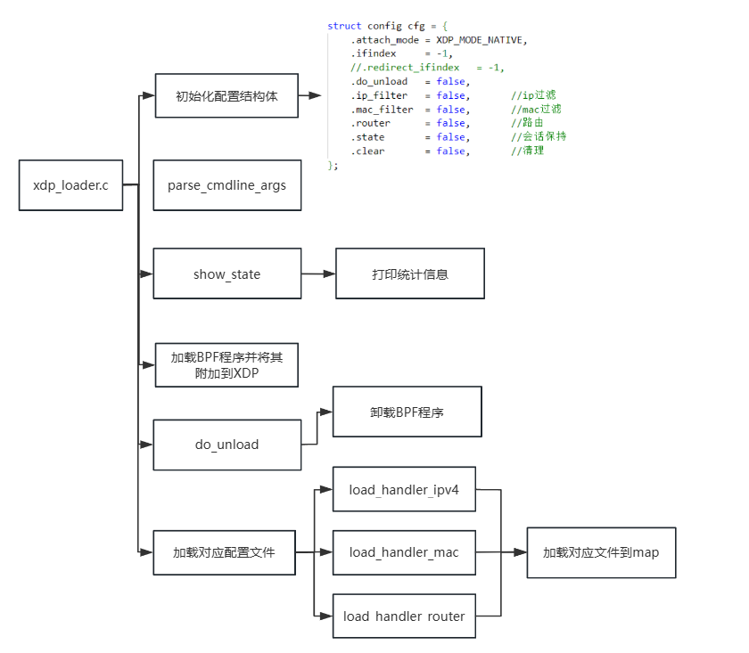
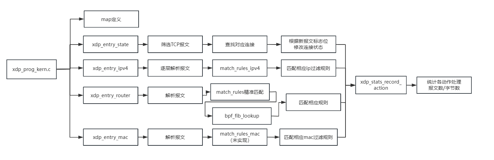

## netmanager

netmanager是一款基于 eBPF 技术的高效网络管理工具，核心技术是 eBPF 的 XDP模块。eBPF 是一种强大的内核技术，允许在不修改内核源代码的情况下执行自定义代码，而 XDP 则是 eBPF 的一个子集，专门用于高速数据包处理。NetManager 利用 XDP 的高速数据包处理能力，实现了过滤、转发、统计信息和会话保持等主要功能。这款工具通过在网络数据包进入内核堆栈之前处理它们，显著提升了数据包处理的性能和效率。在高流量环境下，NetManager 能够保持卓越的性能和低延迟，帮助用户优化网络管理，提升系统效率。

## 框架

目前netmanager的整体框架为


netmanager 的整体框架从主程序入口（main）开始，首先进行启动程序并解析命令行参数（parse_cmdline_args）。解析得到的参数会被解译，并用于挂载相应的处理函数。接下来，程序会根据参数进行进一步操作，如加载对应的配置文件，初始化处理程序，包括加载IPv4、MAC地址和路由器的处理函数（load_handler_ipv4, load_handler_mac, load_handler_router）。

在用户态与内核态的交互中，用户态通过map与内核态进行数据交换。内核态的默认处理入口包括多个XDP处理函数，如xdp_entry_state、xdp_entry_ipv4、xdp_entry_router和xdp_entry_mac，这些函数分别负责不同类型数据包的解析和处理。xdp_entry_state负责筛选TCP报文，并根据新的报文标志位修改连接状态；xdp_entry_ipv4处理逐层解析报文，并匹配相应的IPv4过滤规则；xdp_entry_router则解析报文并进行标准匹配，通过bpf_fib_lookup实现路由转发；xdp_entry_mac则负责MAC报文的解析和过滤。

最终，所有的处理结果都会通过xdp_stats_record_action进行统计和记录，处理后的报文和字节数也会被记录下来。这一系列操作确保了NetManager能够高效地执行过滤、转发、统计信息和会话保持等主要功能，为用户提供了强大的网络管理能力。

## 功能

netmanager目前实现了过滤、转发、统计信息和会话保持四大功能

**xdp_entry_state**

通过解析进入网络设备的数据包，跟踪和记录 IPv4 连接的状态变化，特别是 TCP 连接的状态。

1. **数据包解析**：
   - 通过 `parse_ethhdr` 函数解析以太网头部，检查是否为 IPv4 数据包。
   - 如果是 IPv4 数据包，则继续解析 IP 头部，获取源地址（saddr）、目的地址（daddr）和协议（proto）。
2. **TCP 连接处理**：
   - 如果协议是 TCP，解析 TCP 头部，获取源端口（sport）和目的端口（dport）。
   - 创建或查找一个包含源地址、目的地址、源端口、目的端口和协议的连接键（conn_k）。
   - 在 `conn_ipv4_map` 哈希表中查找该连接键对应的连接值（p_conn_v）。如果找不到，交换源和目的地址端口后再次查找。
   - 如果依然找不到，并且是 TCP SYN 包（表示新连接请求），则创建一个新的连接项并插入到哈希表中，同时记录日志。
   - 如果找到现有连接项，处理 TCP 标志位以更新连接状态（如 SYN_SENT, SYN_RECV, ESTABLISHED, FIN_WAIT1, CLOSE 等）。
   - 根据不同的连接状态，更新哈希表或删除连接项，并记录日志。
3. **UDP 连接处理**：
   - 如果协议是 UDP，解析 UDP 头部，获取源端口和目的端口。
   - 打印除 SSH（端口 22）协议以外的所有连接信息（在调试模式下）。
4. **日志记录**：
   - 对新创建的连接项和状态变化的连接项记录日志，便于后续分析和调试。
5. **状态记录**：
   - 使用 `xdp_stats_record_action` 函数记录操作状态。

**xdp_entry_mac**

其功能是根据源 MAC 地址查找映射表，决定是否放行数据包。如果源 MAC 地址在映射表中存在，则根据映射表中的值设置相应的操作（例如，放行、丢弃或重定向）；如果不存在，则默认放行数据包。

**xdp_entry_router**

功能是根据数据包的目标地址进行查找和转发处理，支持 IPv4 和 IPv6 两种协议。通过查找转发表和最长前缀匹配表，决定如何处理数据包（例如，放行、丢弃或重定向）。

​	其核心功能是对路由进行匹配：解析 IP 头部，获取源地址 `ip4_saddr`。检查 IP 头部的 TTL创建并初始化路由表项 `nitem`，将源地址赋值给 `nitem.saddr`。调用 `match_rules` 函数进行精确查找转发表。

​	如果找到匹配项，进行数据包的转发处理：减少 IP 头部的 TTL。更新以太网头部的目的地址和源地址。用 `bpf_redirect_map` 函数进行数据包重定向。

如果精确查找未找到匹配项，执行最长前缀匹配查找：初始化 `bpf_fib_lookup` 结构体 `ifib`，设置相关字段（如 IP 头部信息、接口索引等）。调用 bpf_fib_lookup函数进行查找，检查返回值并根据结果进行处理：

- `BPF_FIB_LKUP_RET_SUCCESS`：查找成功，减少 IP 头部的 TTL，更新以太网头部的目的地址和源地址，调用 `bpf_redirect` 函数进行数据包重定向。
- `BPF_FIB_LKUP_RET_BLACKHOLE`、`BPF_FIB_LKUP_RET_UNREACHABLE`、`BPF_FIB_LKUP_RET_PROHIBIT`：目标地址不可达，丢弃数据包。
- 其他返回值：默认放行数据包。

**xdp_entry_ipv4**

其功能是解析 IPv4 数据包的头部信息，记录连接信息，并根据预定义的规则对数据包进行处理。代码支持对 TCP 和 UDP 数据包的解析和处理，通过匹配规则函数 `match_rules_ipv4` 来决定数据包的最终处理方式。

## 代码运行实例

目前功能的具体使用操作如下，

```c
黑白名单：加载到本地链路 ens33 上
		sudo ./netmanager -d ens33 --progname=xdp_entry_state -S
会话保持：
		sudo ./netmanager -d ens33 -S --progname=xdp_entry_ipv4 -i conf.d/black_ipv4.conf

```

**以会话保持为例**



可以借助xdp-loader工具进行操作



可以看到我们的程序被挂载到相应的端口上


可以看到其能抓到本机网络通信的各个报文，并获取其中的基本信息和连接状态。

#### 黑白名单

在 ./conf.d ⽬录里有样例规则⽂件 black_ipv4.conf 别代表黑白名单。程序会按顺序逐行加载进BPF Map，同样，XDP程序执行时也会逐⾏匹配规则，所以写在前面的规则具有更高的优先级。每行规则的格式为：

```
[SIP/MASK] [DIP/MASK] [SPORT] [DPORT] [PROTO] [ALLOW/DENY]
```

若要实现⿊名单，根据匹配的优先级顺序，则需要在规则的最后⼀条写上

```c
0.0.0.0/0 0.0.0.0/0 0 0 0 ALLOW
```

同理，若要实现⽩名单，需要将最后⼀条规则写为

```
0.0.0.0/0 0.0.0.0/0 0 0 0 DENY
```

如需禁⽌源IP为 172.17.0.0/24 ，⽬的IP为任意 0.0.0.0/0 ，源端⼝号为任意 0 ，⽬的端⼝号为 80 的 TCP 协议

```
172.17.0.2/32 0.0.0.0/0 0 80 TCP DENY
```

如需禁⽌任意来源的PING请求，可以写为：

```
0.0.0.0/0 0.0.0.0/0 0 0 ICMP DENY
```

我们在配置文件中写入，用以配置规则

```c
192.168.239.132/24 0.0.0.0/0 0 0 ICMP DENY
192.168.239.132/24 0.0.0.0/0 0 80 TCP DENY
0.0.0.0/0 0.0.0.0/0 0 0 0 ALLOW
```

之后加载到程序中

```bash
sudo ./netmanager -d ens33 -S --progname=xdp_entry_ipv4 -i conf.d/black_ipv4.conf -t
```

之后加载到程序中

```bash
sudo ./netmanager -d ens33 -S --progname=xdp_entry_ipv4 -i conf.d/black_ipv4.conf -t
```

统计信息如下



可以发现已经drop了所有icmp报文

卸载命令

```bash
sudo xdp-loader unload ens33 --all
```

## ## 代码分析

现阶段的目录结构如下

```c
.
├── bpf_use_errno_test.o
├── common
│   ├── ...
├── config.mk
├── configure
├── lib
│   ├── ...
├── Makefile
├── net_manager
│   ├── common_kern_user.h
│   ├── conf.d
│   │   ├── black_ipv4.conf
│   │   ├── mac_load.conf
│   │   └── router_load.conf
│   ├── Makefile
│   ├── xdp_loader
│   ├── xdp_loader.c
│   ├── xdp_prog_kern.c
│   ├── xdp_prog_kern.ll
│   └── xdp_prog_kern.o
├── README.md
//以下为子项目
├── router
│   ├── ...
├── testenv
│   ├── ...
├── xacl_ip
│   ├── ...
├── xacl_mac
│   ├── ...
```

### Makefile结构



为递归make，尝试修改，较为困难

### ./net_manager/xdp_loader.c

主用户态代码



### ./net_manager/xdp_prog_kern.c

