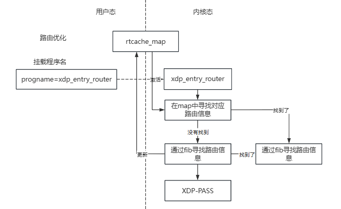
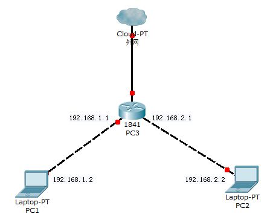
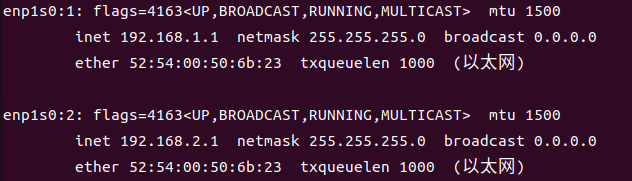
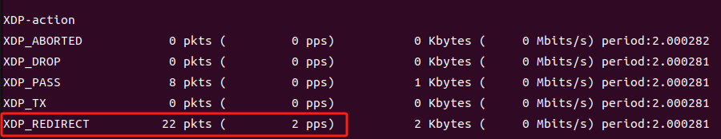

## 路由优化

### 概述

**XDP 技术通过高效的数据包处理实现了路由优化，专注于网络层面的快速包转发和流量管理。** XDP在内核层直接处理数据包，绕过传统的网络协议栈，从而显著降低延迟和提高数据转发效率。通过在数据包到达协议栈之前对其进行处理，XDP 能够根据实时路由信息和流量策略快速做出转发决策，优化网络性能。

其主要应用在于：

1. **高效路由**: XDP 在数据包到达协议栈之前进行处理，可以快速查找并应用路由规则，从而减少传统路由查找的延迟。通过内存中的路由缓存和快速前缀匹配，XDP 能够显著提高路由决策速度，优化网络流量的处理效率。
2. **减小延迟**: 由于 XDP 处理的数据包是在网络协议栈之前，避免了传统网络栈中可能发生的额外处理步骤，从而减少了数据包的处理延迟。这种低延迟特性特别适用于对实时性要求高的应用，如高频交易或视频流传输。
3. **动态路由更新**: XDP 允许动态更新路由信息并立即生效。通过与 eBPF 程序结合，可以实时响应网络状态变化，例如链路状态或路由变化，从而保持路由信息的及时性和准确性，增强网络的灵活性和鲁棒性。
4. **负载均衡和流量控制**: XDP 可以与流量控制和负载均衡策略结合使用，通过对流量的高效处理和路由优化，确保流量在网络中得到合理分配和高效转发。这有助于防止网络瓶颈和提升整体网络性能。

**XDP 的路由优化功能主要体现在提升数据包转发效率和减少处理延迟**，使得网络设备能够在高负载条件下保持高性能。虽然 XDP 主要在数据包层面进行优化，但与现有的路由协议和网络配置相结合，可以实现更智能、更高效的网络流量管理策略。

### 实现

总体框架流程如下：



我们通过两层判断来实现路由优化，首先我们维护了一个路由表，在其中寻找到对应路由时，快速找到对应MAC地址与对应重定向接口，其次，我们可以使用eBPF提供的路由查找函数，当查找成功时，将其加入我们维护的路由表之中。从而分别实现快慢转发（但均比普通的协议栈流程快）
核心代码如下

```c
	pitem = bpf_map_lookup_elem(&rtcache_map, &daddr);
	// 首先精确查找转发表，如果找到就直接转发，不必再经历最长前缀匹配的慢速通配查找
	// 这个动作是可以offload到硬件中的。
	if (pitem) {
		__ip_decrease_ttl(iph);
		memcpy(eth->h_dest, pitem->eth_dest, ETH_ALEN);
		memcpy(eth->h_source, pitem->eth_source, ETH_ALEN);
		bpf_printk("%s----daddr : %d prot:%d",fast_info,daddr,pitem->ifindex);
		//bpf_trace_printk(fast_info, sizeof(fast_info), pitem->ifindex);
		action = bpf_redirect(pitem->ifindex, 0);
		goto out;
	}

	// 否则只能执行最长前缀匹配了
	ifib.family = AF_INET;
	ifib.tos = iph->tos;
	ifib.l4_protocol = iph->protocol;
	ifib.tot_len = bpf_ntohs(iph->tot_len);
	ifib.ipv4_src = iph->saddr;
	ifib.ipv4_dst = iph->daddr;
	ifib.ifindex = ctx->ingress_ifindex;

	// 调用eBPF封装的路由查找函数，虽然所谓慢速查找，也依然不会进入协议栈的。
	if (bpf_fib_lookup(ctx, &ifib, sizeof(ifib), 0) == 0) {
		struct rt_item_tab nitem;

		__builtin_memset(&nitem, 0, sizeof(nitem));
		memcpy(&nitem.eth_dest, ifib.dmac, ETH_ALEN);
		memcpy(&nitem.eth_source, ifib.smac, ETH_ALEN);
		nitem.ifindex = ifib.ifindex;
		// 插入新的表项
		bpf_map_update_elem(&rtcache_map, &daddr, &nitem, BPF_ANY);
		__ip_decrease_ttl(iph);
		memcpy(eth->h_dest, ifib.dmac, ETH_ALEN);
		memcpy(eth->h_source, ifib.smac, ETH_ALEN);
		bpf_printk("%s----daddr : %d prot:%d",slow_info,daddr,nitem.ifindex);
		//bpf_trace_printk(slow_info, sizeof(slow_info), ifib.ifindex);
		action = bpf_redirect(ifib.ifindex, 0);
		goto out;
	}
```
### 环境搭建

为了模拟真实的网络环境，我们部署了一个包含两个主机和一个路由器的虚拟化环境，并涉及两个不同的网段。该环境通过虚拟机进行仿真，提供了一个可靠的测试平台，用于评估网络配置、路由优化及流量管理策略。



其中PC1的ip为192.168.1.2/24，默认网关为192.168.1.1；

PC2的ip为192.168.2.2/24，默认网关为192.168.2.1

在PC3上，我们在其网卡上配置多个虚拟接口，并启用IP转发，使其充当路由器连接两个网段。分别将ip设置为192.168.1.1与192.168.2.1；



## 使用方法

本功能的使用命令为

```c
sudo ./netmanager -d enp1s0 -S --progname=xdp_entry_router -m 
```

之后我们在PC1上访问PC2，其可以正常进行连接，并且在PC3上有相应的输出，证明其是被路由优化了



