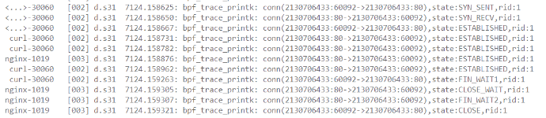

## 会话保持

### 概述

​	工具能够检测多种类型的网络报文，包括TCP、UDP和ICMP。通过对TCP连接状态的监控，了解连接的建立和关闭过程；UDP数据包的监测提供了数据传输的详细信息，如源和目标端口以及数据包大小；而ICMP报文则用于网络诊断，帮助确认主机在线状态和测量网络延迟。可以帮助全面掌握网络流量状况和性能。

### 实现

在先前的功能中，仅能实现对lo端口的监测，不能实现对通用网卡的监测，且ip输出格式不易懂

其在lo网卡上监测的信息



增加对通用网卡的监测，UDP、ICMP的监测，输出格式的转化，但由于XDP仅在收包路径，所以发送报文/相关状态获取不到

### 使用方法

使用命令将程序挂载到相应网卡

```c
sudo ./netmanager -d ens33 --progname=xdp_entry_state -S
```

查看挂载程序

```
sudo xdp-loader status
```

查看输出

```c
sudo cat /sys/kernel/debug/tracing/trace_pipe
```

实例截图


进行卸载	

```c
sudo xdp-loader unload ens33 --all
```

### 输出分析

**tcp连接**

​	程序可以监测源IP地址、目标IP地址、端口号、连接状态以及连接的角色（C/S），通过分析和统计其连接状态，可以获取到其连接的相应信息

```c
tcp(96.91.189.91:80->132.239.168.192:36676),state:ESTABLISHED,client
```

**udp**

​	程序可以监测源IP地址、目标IP地址、端口号、数据包长度等信息。通过分析此日志，可以了解网络中的DNS查询活动，并监控数据传输的细节，故障排除以及检测异常流量。

```c
udp(192.168.239.2:53->192.168.239.132:36874),len=247
```

**ICMP**

​	程序可以监测源IP地址、目标IP地址、icmp报文的类型和代码等信息，用于确认目标主机是否在线或检查网络连接的延迟，有助于检查网络连接的正常性和响应时间。

```c
icmp(1.1.1.1->192.168.239.132),type=0,code=0
```

