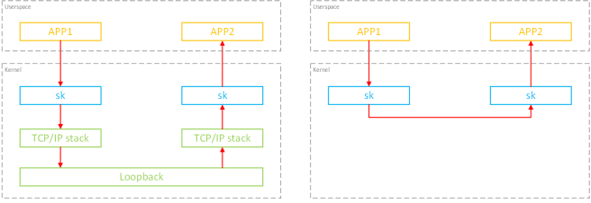
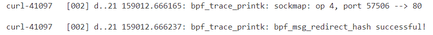
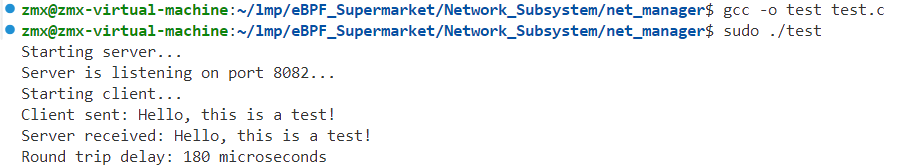
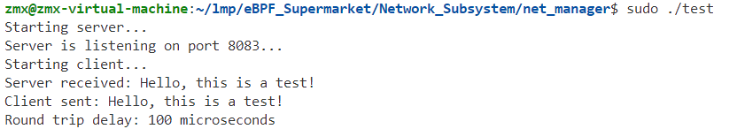

# 优化同主机内多个进程之间的网络包传输

### 简介

结合 XDP和 socketmap 技术，针对源和目的端均在同一台机器的应用场景，实现数据传输路径的高效优化。利用 XDP 的高性能数据处理能力，工具能够绕过传统的 TCP/IP 协议栈，将数据直接发送至 socket 对端。这样不仅减少了协议栈处理的开销，还显著降低了延迟，提升了整体系统的吞吐量，适用于本地高并发、高性能的通信场景。

对于**源和目的端都在同一台机器**的应用来说，可以通过这种方式 **绕过整个 TCP/IP 协议栈**，直接将数据发送到 socket 对端



相关依赖：

1. sockmap：这是一个存储 socket 信息的映射表。作用：

   1. 一段 BPF 程序**监听所有的内核 socket 事件**，并将新建的 socket 记录到这个 map；
   2. 另一段 BPF 程序**拦截所有 `sendmsg` 系统调用**，然后去 map 里查找 socket 对端，之后 调用 BPF 函数绕过 TCP/IP 协议栈，直接将数据发送到对端的 socket queue。

2. cgroups：指定要**监听哪个范围内的 sockets 事件**，进而决定了稍后要对哪些 socket 做重定向。

   sockmap 需要关联到某个 cgroup，然后这个 cgroup 内的所有 socket 就都会执行加 载的 BPF 程序。

> cgroup，用于将进程分组并对这些进程施加资源限制和管理。
>
> 1. **资源限制**：可以限制进程组使用的资源数量，例如限制一个进程组只能使用特定数量的内存或CPU时间。
> 2. **优先级分配**：可以设置不同进程组之间的优先级，以确保某些关键进程获得更多资源。
> 3. **资源监控**：可以监控每个cgroup的资源使用情况，帮助管理员分析和优化资源分配。
> 4. **进程隔离**：通过将进程分组，能够实现进程之间的隔离，避免不同进程相互影响。
> 5. **进程冻结**：可以暂停某个cgroup中的所有进程，暂时停止该组的运行。

### 实现

#### BPF类型

能拦截到 socket 操作（例如 TCP `connect`、`sendmsg` 等）的类型：

- `BPF_PROG_TYPE_SOCK_OPS`：socket operations 事件触发执行。
- `BPF_PROG_TYPE_SK_MSG`：`sendmsg()` 系统调用触发执行。****

创建一个全局的**映射表**（map）来**记录所有的 socket 信息**。基于这个 sockmap，编写两段 BPF 程序分别完成以下功能：

- 程序一：拦截所有 TCP connection 事件，然后将 socket 信息存储到这个 map；
- 程序二：拦截所有 `sendmsg()` 系统调用，然后从 map 中查 询这个socket 信息，之后直接将数据**重定向到对端**。

#### 存储socket信息

1. **系统中有 socket 操作时**（例如 connection establishment、tcp retransmit 等），触发执行；
   - **指定加载位置来实现**：`__section("sockops")`
2. **执行逻辑**：提取 socket 信息，并以 key & value 形式存储到 sockmap。****

```c
SEC("sockops") // 加载到 ELF 中的 `sockops` 区域，有 socket operations 时触发执行
int bpf_sockmap(struct bpf_sock_ops *skops)
{
    switch (skops->op) {
        case BPF_SOCK_OPS_PASSIVE_ESTABLISHED_CB: // 被动建连
        case BPF_SOCK_OPS_ACTIVE_ESTABLISHED_CB:  // 主动建连
            if (skops->family == 2) {             // AF_INET
                bpf_sock_ops_ipv4(skops);         // 将 socket 信息记录到到 sockmap
            }
            break;
        default:
            break;
    }
    return 0;
}
```

对于**两端都在本节点**的 socket 来说，这段代码会执行两次：

- **源端发送 SYN 时**会产生一个事件，命中 case 2
- **目的端发送 SYN+ACK 时**会产生一个事件，命中 case 1

因此对于每一个成功建连的 socket，sockmap 中会有两条记录（key 不同）。

提取 socket 信息以存储到 sockmap 是由函数 `bpf_sock_ops_ipv4()` 完成的。

```c
static inline
void bpf_sock_ops_ipv4(struct bpf_sock_ops *skops)
{
    struct sock_key key = {};
    int ret;

    extract_key4_from_ops(skops, &key);
	ret = bpf_sock_hash_update(skops, &sock_ops_map, &key, BPF_NOEXIST);
    //ret = sock_hash_update(skops, &sock_ops_map, &key, BPF_NOEXIST);
    if (ret != 0) {
        bpf_printk("sock_hash_update() failed, ret: %d\n", ret);
    }

    bpf_printk("sockmap: op %d, port %d --> %d\n", skops->op, skops->local_port, bpf_ntohl(skops->remote_port));
}
```

1. 调用 `extract_key4_from_ops()` 从 `struct bpf_sock_ops *skops`（socket metadata）中提取 key；
2. 调用 `sock_hash_update()` 将 key:value 写入全局的 sockmap `sock_ops_map`，这 个变量定义在我们的头文件中。

##### 提取sockmap key

map 的类型可以是：

- `BPF_MAP_TYPE_SOCKMAP`
- `BPF_MAP_TYPE_SOCKHASH`

```c
struct{
	__uint(type, BPF_MAP_TYPE_SOCKHASH);
	__type(key,struct sock_key);
	__type(value, int);
	__uint(max_entries, 65535);
}sock_ops_map SEC(".maps");
```

key 定义如下：

```c
struct sock_key {
	uint32_t sip4;    // 源 IP
	uint32_t dip4;    // 目的 IP
	uint8_t  family;  // 协议类型
	uint8_t  pad1;    // this padding required for 64bit alignment
	uint16_t pad2;    // else ebpf kernel verifier rejects loading of the program
	uint32_t pad3;
	uint32_t sport;   // 源端口
	uint32_t dport;   // 目的端口
} __attribute__((packed));
```

提取 key 的实现

```c
static inline
void extract_key4_from_ops(struct bpf_sock_ops *ops, struct sock_key *key)
{
    // keep ip and port in network byte order
    key->dip4 = ops->remote_ip4;
    key->sip4 = ops->local_ip4;
    key->family = 1;

    // local_port is in host byte order, and remote_port is in network byte order
    key->sport = (bpf_htonl(ops->local_port) >> 16);
    key->dport = FORCE_READ(ops->remote_port) >> 16;
}
```

##### 插入 sockmap

`sock_hash_update()` 将 socket 信息写入到 sockmap，这个函数是我们定义的一个宏， 会展开成内核提供的一个 hash update 函数

#### 拦截 `sendmsg` 系统调用，socket 重定向

1. 拦截所有的 `sendmsg` 系统调用，从消息中提取 key；

   在 socket 发起 `sendmsg` 系统调用时**触发执行**，

   - **指定加载位置来实现**：`__section("sk_msg")`

2. 根据 key 查询 sockmap，找到这个 socket 的对端，然后绕过 TCP/IP 协议栈，直接将 数据重定向过去。

​	通过将 sockmap attach 到 BPF 程序实现：map 中的所有 socket 都会继承这段程序， 因此其中的任何 socket 触发 sendmsg 系统调用时，都会执行到这段代码。

##### 从 socket message 中提取 key

```c
SEC("sk_msg") // 加载目标文件（ELF ）中的 `sk_msg` section，`sendmsg` 系统调用时触发执行
int bpf_redir(struct sk_msg_md *msg)
{
    struct sock_key key = {};
    extract_key4_from_msg(msg, &key);
    bpf_msg_redirect_hash(msg, &sock_ops_map, &key, BPF_F_INGRESS);
	bpf_printk("bpf_msg_redirect_hash successful!");
    return SK_PASS;
}
```

##### Socket 重定向

`msg_redirect_hash()` 也是我们定义的一个宏，最终调用的是 BPF 内置的辅助函数。

> 最终需要用的其实是内核辅助函数 `bpf_msg_redirect_hash()`，但后者无法直接访问， 只能通过预定义的 `BPF_FUNC_msg_redirect_hash` 来访问，否则校验器无法通过。

`msg_redirect_hash(msg, &sock_ops_map, &key, BPF_F_INGRESS)` 几个参数：

- `struct sk_msg_md *msg`：用户可访问的待发送数据的元信息（metadata）
- `&sock_ops_map`：这个 BPF 程序 attach 到的 sockhash map
- `key`：在 map 中索引用的 key
- `BPF_F_INGRESS`：放到对端的哪个 queue（rx 还是 tx）

### 使用方法

使用命令激活程序

```c
sudo ./netmanager -f
```

之后令开终端，并将该shell的pid记录在命名空间中

```shell
sudo bash -c "echo $$ >> /sys/fs/cgroup/foo/cgroup.procs"
```

之后任何在当前 shell 内启动的程序都将属于这个 cgroupv2 了

在这个shell中运行测试代码/测试用例，如访问本机的80端口

```shell
curl 127.0.0.1:80
```

可以看到相应程序被触发



编写测试用例，查看开启功能和不开启的耗时差距，获取从输入命令到相关端口收到信息的延时

```c
#include <stdio.h>
#include <stdlib.h>
#include <string.h>
#include <unistd.h>
#include <arpa/inet.h>
#include <sys/time.h>
#include <sys/socket.h>
#include <netinet/in.h>

#define PORT 8080
#define BUFFER_SIZE 1024
#define MESSAGE "Hello, this is a test!"

int main() {
    int server_fd, client_fd, new_socket;
    struct sockaddr_in address;
    int addrlen = sizeof(address);
    char buffer[BUFFER_SIZE] = {0};
    struct timeval send_time, recv_time;

    pid_t pid = fork();  // 创建子进程

    if (pid == 0) {
        // 子进程：服务端代码
        printf("Starting server...\n");

        if ((server_fd = socket(AF_INET, SOCK_STREAM, 0)) == 0) {
            perror("Socket failed");
            exit(EXIT_FAILURE);
        }

        address.sin_family = AF_INET;
        address.sin_addr.s_addr = INADDR_ANY;
        address.sin_port = htons(PORT);

        // 绑定套接字
        if (bind(server_fd, (struct sockaddr *)&address, sizeof(address)) < 0) {
            perror("Bind failed");
            close(server_fd);
            exit(EXIT_FAILURE);
        }

        // 开始监听
        if (listen(server_fd, 3) < 0) {
            perror("Listen failed");
            close(server_fd);
            exit(EXIT_FAILURE);
        }

        printf("Server is listening on port %d...\n", PORT);

        // 接受客户端连接
        if ((new_socket = accept(server_fd, (struct sockaddr *)&address, (socklen_t *)&addrlen)) < 0) {
            perror("Accept failed");
            close(server_fd);
            exit(EXIT_FAILURE);
        }

        // 接收客户端消息
        read(new_socket, buffer, BUFFER_SIZE);
        printf("Server received: %s\n", buffer);

        // 发送响应
        send(new_socket, "Message received", strlen("Message received"), 0);

        close(new_socket);
        close(server_fd);
        exit(0);  // 服务端子进程结束
    } else {
        // 父进程：客户端代码
        sleep(1);  // 确保服务端先启动

        printf("Starting client...\n");

        struct sockaddr_in serv_addr;

        if ((client_fd = socket(AF_INET, SOCK_STREAM, 0)) < 0) {
            printf("Socket creation error\n");
            return -1;
        }

        serv_addr.sin_family = AF_INET;
        serv_addr.sin_port = htons(PORT);

        // 使用本地回环地址
        if (inet_pton(AF_INET, "127.0.0.1", &serv_addr.sin_addr) <= 0) {
            printf("Invalid address / Address not supported\n");
            return -1;
        }

        // 连接服务端
        if (connect(client_fd, (struct sockaddr *)&serv_addr, sizeof(serv_addr)) < 0) {
            printf("Connection Failed\n");
            return -1;
        }

        // 记录发送时间
        gettimeofday(&send_time, NULL);

        // 发送消息
        send(client_fd, MESSAGE, strlen(MESSAGE), 0);
        printf("Client sent: %s\n", MESSAGE);

        // 接收响应
        read(client_fd, buffer, BUFFER_SIZE);

        // 记录接收时间
        gettimeofday(&recv_time, NULL);

        // 计算延时
        long elapsed = (recv_time.tv_sec - send_time.tv_sec) * 1000000 + (recv_time.tv_usec - send_time.tv_usec);
        printf("Round trip delay: %ld microseconds\n", elapsed);

        close(client_fd);
    }

    return 0;
}

```

启用前



启用后



可以看到使用功能之后可以减少本机网络通信的时间