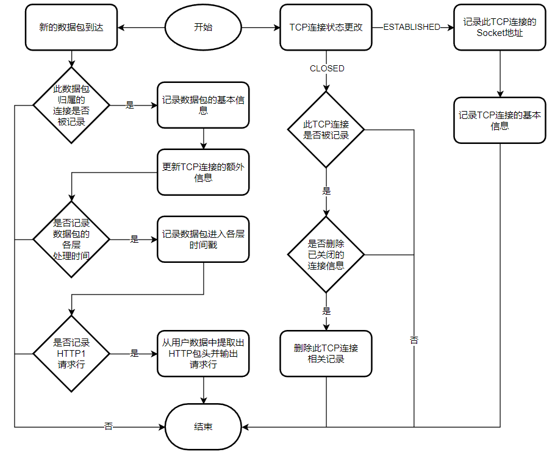

# netwatcher设计文档
- 本文详细说明netwatcher的代码设计
## 监控流程


如图所示，`netwatcher`监控每个建立的TCP连接与各个连接上的数据包：
- 当TCP连接建立时，`netwatcher`记录下此TCP连接的基本信息，即连接id,连接socket地址,相关COMMAND,连接四元组以及连接方向
- 当数据包到来时，`netwatcher`首先记录此数据包的基础信息，即SEQ,ACK,TCP包sock地址（用于明确TCP连接），接着根据指定参数
  - 记录数据包的额外信息
  - 更新相关TCP连接的额外信息
## 数据结构
### kernal struct
- `struct ktime_info`
	- 记录每个包到达各层的时间戳
- `packet_tuple`
  - 记录tcp包核心信息，以供辅助函数使用
### user struct
- `struct sonn_t`
  - tcp连接相关信息
- `struct pack_t`
  - tcp包相关信息
### eBPF MAP
- `BPF_MAP_TYPE_LRU_HASH timestamps`
	- key: `struct packet_tuple`
	- value: `struct ktime_info`
	- 存储每个包所对应的`ktime_info`
- `BPF_MAP_TYPE_RINGBUF rb`
  - 包相关信息通过此buffer提供给user space
- `BPF_MAP_TYPE_LRU_HASH conns_info`
  - key: `struct sock *`
  - value: `conn_t`
  - 存储每个tcp连接所对应的`conn_t`
- `BPF_MAP_TYPE_LRU_HASH sock_stores`
  -	key: `u64 ptid`
	- value: `struct sock*`
	- 根据`ptid`存储`sock`指针，从而在上下文无`sock`的内核探测点获得`sock`

## kernel space探测
### APP层
#### `kprobe/skb_copy_datagram_iter`
- rx数据包经过TCP层处理后进入此函数
- netwatcher在此探测点做出如下动作
  - 记录rx数据包到达APP层的时间戳，存入`timestamps`
  - 根据`timestamps`中的时间戳计算数据包的各层处理时间
  - 从`sock`中提取出用户数据，从而供user space提取出HTTP1/1.1请求头
  - 将数据包相关信息存入`rb`以供user space消费

### TCP层

#### `kretprobe/inet_csk_accept`
- `accept()`系统调用最终会调用此函数，成功后此函数会返回一个`struct sock* sk`，此`sk`管理着被accept的tcp连接
- netwatcher在此探测点做出如下动作
  - 根据`sk`记录tcp连接的基本信息并存入`conns_info`
  - 由于是accept，将conn的方向设为server
#### `kprobe/tcp_v4/v6_connect`
- `connect(struct sock* sk)`系统调用最终会调用此函数
- netwatcher在此探测点做出如下动作
  - 记录`ptid`与`sk`的对应关系，并存入`sock_stores`
#### `kretprobe/tcp_v4/v6_connect`
- `connect(struct sock* sk)`系统调用最终会调用此函数
- netwatcher在此探测点做出如下动作
  - 根据`kprobe`中记录的信息，将tcp连接的基本信息存入`conns_info`
  - 由于是connect，将conn的方向设为client
#### `kprobe/tcp_set_state`
- 每次tcp连接状态发生变化会调用此函数
- netwatcher在此探测点做出如下动作
  - 若未指定运行参数`-a`，则当tcp连接状态变为`TCP_CLOSE`时，将此tcp连接信息从`sock_stores`与`conns_info`中删去（如果有的话）
#### `kprobe/tcp_v4/v6_rcv`
- 当rx数据包到达TCP层时，会调用此函数
- netwatcher在此探测点做出如下动作
  - 记录IP数据包到达TCP层的时间戳，存入`timestamps`
#### `tcp_v4/v6_do_rcv`
- `tcp_v4/v6_rcv`在此函数进一步处理rx包
- netwatcher在此探测点做出如下动作
  - 根据`sock`得到`tcp_sock`，更新tcp连接的额外信息到相应的`conn_t`

#### `kprobe/tcp_validate_incoming`
- linux协议栈使用此函数对tcp包进行校验
- netwatcher在此探测点做出如下动作
  - 校验TCP包seq是否在接收窗口中
  - 如果TCP包seq错误，将此包相关信息存入`rb`以供user space消费

#### `kretprobe/__skb_checksum_complete`
- 此函数返回非0表明数据包校验和错误
- netwatcher在此探测点做出如下动作
  - 对校验和错误的数据包相关信息存入`rb`以供user space消费

#### `kprobe/tcp_sendmsg`
- linux协议栈在TCP层调用此函数对tx包进行处理
- netwatcher在此探测点做出如下动作
  - 记录tx包到达TCP层的时间戳
  - 根据`sock`得到`tcp_sock`，更新tcp连接的额外信息到相应的`conn_t`
  - 从`struct msghdr* msg`中提取用户层数据，从而供user space提取出HTTP1/1.1请求头

### IP层

#### `kprobe/ip/ip6_rcv_core`
- 当rx数据包到达IP层时，会调用此函数
- netwatcher在此探测点做出如下动作
  - 记录rx数据包到达IP层的时间戳，存入`timestamps`

#### `kprobe/ip_queue_xmit` / `kprobe/inet6_csk_xmit`
- linux协议栈调用此函数来处理tx数据包的IP层
- netwatcher在此探测点做出如下动作
  - 记录tx数据包到达IP层的时间戳，存入`timestamps`


### MAC层

#### `kprobe/eth_type_trans`
- 当rx数据包到达MAC层时，将调用此函数
- netwatcher在此探测点做出如下动作
  - 记录rx数据包到达MAC层的时间戳，存入`timestamps`

#### `kprobe/__dev_queue_xmit`
- linux协议栈调用此函数处理tx数据包的MAC层
- netwatcher在此探测点做出如下动作
  - 记录tx数据包到达MAC层的时间戳，存入`timestamps`

#### `kprobe/dev_hard_start_xmit`
- linux协议栈调用此函数将tx数据包发送给网卡驱动
- netwatcher在此探测点做出如下动作
  - 记录tx数据包离开MAC层的时间戳，存入`timestamps`
  - 将数据包相关信息存入`rb`以供user space消费

## user space 输出
### 连接相关信息
- netwatcher通过`bpf_map_get_next_key`对`conns_info`进行遍历，将其中存储的所有TCP连接信息按如下格式输出到`data/connects.log`文件中
```
fprintf(file, "connection{pid=\"%d\",sock=\"%p\",src=\"%s\",dst=\"%s\",is_server=\"%d\"",
d.pid, d.sock, s_ip_port_str, d_ip_port_str, d.is_server);
```
### 数据包相关信息
- 数据包相关信息首先以如下格式输出至标准输出
```
printf("%-22s %-10s %-10s %-10s %-10s %-10s %-5s %s\n",
 "SOCK", "SEQ", "ACK", "MAC_TIME", "IP_TIME", "TCP_TIME", "RX", "HTTP");
```
- 数据包相关信息还以如下格式输出至`data/packets.log`中
```
fprintf(file,"packet{sock=\"%p\",seq=\"%u\",ack=\"%u\",mac_time=\"%llu\",ip_time=\"%llu\",tcp_time=\"%llu\",http_info=\"%s\",rx=\"%d\"} 0\n",
pack_info->sock, pack_info->seq, pack_info->ack, pack_info->mac_time, pack_info->ip_time, pack_info->tcp_time, http_data, pack_info->rx);
```
### 数据包错误
- 数据包错误信息首先以如下格式输出至标准输出
```
printf("[X] invalid SEQ: sock = %p,seq= %u,ack = %u\n",
                   pack_info->sock, pack_info->seq, pack_info->ack);
printf("[X] invalid checksum: sock = %p\n", pack_info->sock);
```
- 数据包错误信息还以如下格式输出至`data/err.log`中
```
fprintf(file, "error{sock=\"%p\",seq=\"%u\",ack=\"%u\",reason=\"%s\"} 0\n",
pack_info->sock, pack_info->seq, pack_info->ack, reason);
```
fprintf(file, "connection{pid=\"%d\",sock=\"%p\",src=\"%s\",dst=\"%s\",is_server=\"%d\"",