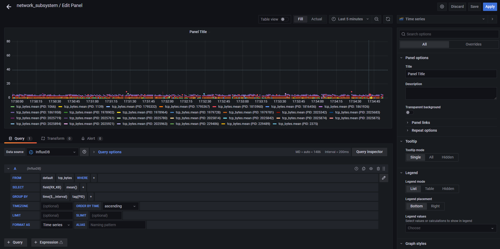

# 基于eBPF的Linux系统性能监测工具-网络子系统

## 0. 介绍

本目录下的工具为基于eBPF机制对Linux系统网络子系统关键性能参数进行监测。


## 1. 准备工作

开发环境
* 系统：Debian GNU/Linux 11
* 内核：5.10.0-13-amd64
* Python 3.9.2
* bcc

## 2. 应用
### 2.1 nic_throughput

每秒输出指定网卡发送与接收的字节数、包数与包平均大小。

参数如下：
```
-n，--name
    [必选] 网卡名称
-i, --interval
    [可选] 输出时间间隔，默认为1s
-c, --count
    [可选] 输出条数，默认为99999999
--print
    [可选] 在命令行打印结果
--visual
    [可选] 将结果通过influxdb-grafana可视化
```

运行示例 `sudo python nic_throughput.py --print -n lo`

输出样例
``` shell
Sat Jul 23 21:50:51 2022
TX
 QueueID    avg_size   BPS        PPS
 0          64.0       384.0      6.0
 Total      64.0       384.0      6.0
RX
 QueueID    avg_size   BPS        PPS
 0          50.0       300.0      6.0
 Total      50.0       300.0      6.0
------------------------------------------------------------
```

### 2.2 tcp_connection

实时输出成功建立的tcp连接，输出包括时间、进程号、进程名称、IPv4/IPv6、目标ip、目标端口、源ip、源端口、方向（connect/accept）。

参数如下：
```
-P，--pid
    [可选] 指定进程
-p, --port
    [可选] 指定源端口
-r, --direction
    [可选] 仅输出方向为connect或accept的连接
-c, --count
    [可选] 输出条数，默认为99999999
-4, --ipv4
    [可选] 仅输出IPv4连接
-6, --ipv6
    [可选] 仅输出IPv6连接
--print
    [可选] 在命令行打印结果
--visual
    [可选] 将结果通过influxdb-grafana可视化
```

运行示例
``` shell
sudo python tcp_connection.py --print -P 181    # only trace PID 181
sudo python tcp_connection.py --print -p 80,81  # only trace port 80 and 81
sudo python tcp_connection.py --print -4        # only trace IPv4 family
sudo python tcp_connection.py --print -6        # only trace IPv6 family
sudo python tcp_connection.py --print -r accept # only trace accept tcp connections
```

输出样例
``` shell
TIME      PID     TASK         IP SADDR:SPORT                                DADDR:DPORT                                 DIRECTION
17:16:52  1083981 sshd         4  xxx.xxx.226.109:2222                       xxx.xxx.80.116:9323                            accept
17:17:01  2023299 auth-thu     4  xxx.xxx.226.109:47824                      xxx.xxx.204.120:80                            connect
17:17:01  2023299 auth-thu     4  xxx.xxx.226.109:47278                      xxx.xxx.4.100:443                             connect
17:17:01  2023300 auth-thu     4  xxx.xxx.226.109:41286                      xxx.xxx.100:80                                connect
```

### 2.3 tcp_bytes

按指定的时间间隔输出不同TCP进程发送与接收的字节数，输出包括进程号、进程名称、源ip：端口、目标ip：端口、接收KB、发送KB。

参数如下：
```
-P，--pid
    [可选] 指定进程
-i, --interval
    [可选] 输出时间间隔，默认为1s
-c, --count
    [可选] 输出条数，默认为99999999
-4, --ipv4
    [可选] 仅输出IPv4连接
-6, --ipv6
    [可选] 仅输出IPv6连接
--print
    [可选] 在命令行打印结果
--visual
    [可选] 将结果通过influxdb-grafana可视化
```

运行示例
``` shell
sudo python tcp_bytes.py --print           # trace TCP send/recv bytes by host
sudo python tcp_bytes.py --print -P 181    # only trace PID 181
sudo python tcp_bytes.py --print -i 5      # print results every 5 seconds
sudo python tcp_bytes.py --print -4        # trace IPv4 family only
sudo python tcp_bytes.py --print -6        # trace IPv6 family only
```

输出样例
``` shell
Mon Sep 12 17:32:01 2022
PID     COMM            SADDR:SPORT            DADDR:DPORT             RX_KB  TX_KB
2024669 auth-thu        xxx.xxx.226.109:47364  xxx.xxx.4.100:443           5      0
2012378 sshd            xxx.xxx.226.109:2222   xxx.xxx.80.116:5787         0      0

PID     COMM            SADDR6:SPORT                           DADDR6:DPORT                                    RX_KB  TX_KB
1066    gitlab-runner   2402:f000:xx:xx:xx:xx:ae03:a462:49676  2402:f000:xx:xx:xx:xx:8:149:443                     0      0
1066    gitlab-runner   2402:f000:xx:xx:xx:xx:ae03:a462:49664  2402:f000:xx:xx:xx:xx:8:149:443                     0      0
```


### 2.4 tcp_inerrs

实时输出所有收到的有问题的TCP包数量，输出包括时间、进程号、进程名称、IPv4/IPv6、源ip：端口、目标ip：端口、问题原因、tcp连接状态。


参数如下：
```
-P，--pid
    [可选] 指定进程
-c, --count
    [可选] 输出条数，默认为99999999
-4, --ipv4
    [可选] 仅输出IPv4连接
-6, --ipv6
    [可选] 仅输出IPv6连接
--print
    [可选] 在命令行打印结果
--visual
    [可选] 将结果通过influxdb-grafana可视化
```

运行示例
``` shell
sudo python tcp_inerrs.py --print           # trace TCP send/recv by host
sudo python tcp_inerrs.py --print -P 181    # only trace PID 181
sudo python tcp_inerrs.py --print -4        # trace IPv4 family only
sudo python tcp_inerrs.py --print -6        # trace IPv6 family only
```

输出样例
``` shell
TIME      PID     TASK         IP SADDR:SPORT                                DADDR:DPORT                                REASON       STATE
18:04:29  0       swapper/21   6  ::xx:xx:xx:14:5:1718                      ::xx:xx:xx:14:5:40998                       invalid seq  ESTABLISHED
18:04:29  0       swapper/27   6  ::xx:xx:xx:14:5:40998                     ::xx:xx:xx:14:5:1718                        invalid seq  ESTABLISHED
18:04:32  0       swapper/7    4  xxx.xxx.0.1:46854                         xxx.xxx.0.6:8086                            invalid seq  ESTABLISHED
18:04:32  0       swapper/8    4  xxx.xxx.0.1:44382                         xxx.xxx.0.1:8086                            invalid seq  ESTABLISHED
```

不足:

inerrs的统计目前只统计了tcp_validate_incoming的seq，tcp_v4_do_rcv和tcp_v6_do_rcv中包长度与TCP header比较及skb_checksum_complete，但缺少tcp_v4_rcv和tcp_v6_rcv中的部分验证。


### 2.5 delay_analysis_in/delay_analysis_in_v6

#### bcc_version

实时输出所有接收包信息及内核各层处理过程所花费的时间。


参数如下：
```
--sport
    [可选] 指定源端口
--dport
    [可选] 指定目标端口
-s, --sample
    [可选] 随机选包进行输出
-c, --count
    [可选] 输出条数，默认为99999999
--print
    [可选] 在命令行打印结果
--visual
    [可选] 将结果通过influxdb-grafana可视化
```

运行示例
``` shell
sudo python delay_analysis_in.py --print                # in packets delay analysis
sudo python delay_analysis_in.py --print --sport 181    # only trace dport 181
sudo python delay_analysis_in.py --print -s             # print random packets
```

输出样例-ipv4
``` shell
SADDR:SPORT            DADDR:DPORT            SEQ          ACK          TIME                 TOTAL      MAC        IP         TCP
xxx.xxx.80.116:4764    xxx.xxx.226.109:2222   2552894083   3022847673   1965572.051824       60         2          5          53
xxx.xxx.0.1:8086       xxx.xxx.0.1:47524      473644034    601104234    1965572.055672       20         1          1          17
xxx.xxx.0.1:8086       xxx.xxx.0.1:47524      473644288    601104680    1965572.057494       9          1          1          6
xxx.xxx.0.1:8086       xxx.xxx.0.1:47524      473644542    601105124    1965572.059016       8          1          1          5
```

输出样例-ipv6
``` shell
SADDR:SPORT                                DADDR:DPORT                                SEQ          ACK          TIME                 TOTAL      MAC        IP         TCP
2402:f000:xx:xx:xx:xx:8:149:443            2402:f000:xx:xx:xx:xx:ae03:a462:53068      1330936861   1442164181   1966205.030733       58         5          5          48
2402:f000:xx:xx:xx:xx:8:149:443            2402:f000:xx:xx:xx:xx:ae03:a462:60062      1677550202   2546935294   1966205.445864       39         1          0          36
2402:f000:xx:xx:xx:xx:8:149:443            2402:f000:xx:xx:xx:xx:ae03:a462:60062      1677554298   2546935294   1966205.459252       36         4          1          30
2402:f000:xx:xx:xx:xx:8:149:443            2402:f000:xx:xx:xx:xx:ae03:a462:60062      1677555872   2546935387   1966205.462547       40         2          2          35
```

#### libbpf_version

参数与输出结果基本与bcc_version一致，但增加了指定输出收包/发包方向结果的参数

```
-D,  --dir
    [可选] 收发包方向（收包1，发包0），默认为收包方向（1）
```

### 2.6 delay_analysis_out/delay_analysis_out_v6

实时输出所有发送包信息及内核各层处理过程所花费的时间。

#### bcc_version

参数如下：
```
--sport
    [可选] 指定源端口
--dport
    [可选] 指定目标端口
-s, --sample
    [可选] 随机选包进行输出
-c, --count
    [可选] 输出条数，默认为99999999
--print
    [可选] 在命令行打印结果
--visual
    [可选] 将结果通过influxdb-grafana可视化
```

运行示例
``` shell
sudo python delay_analysis_out.py --print               # in packets delay analysis
sudo python delay_analysis_out.py --print --dport 181   # only trace dport 181
sudo python delay_analysis_out.py --print -s            # print random packets
```

输出样例-ipv4
``` shell
SADDR:SPORT            DADDR:DPORT            SEQ          ACK          TIME                 TOTAL      QDisc      IP         TCP
xxx.xxx.226.109:2222   xxx.xxx.80.116:4764    3024514817   2553916591   1966734601415.804932 7          1          3          2
xxx.xxx.0.1:47688      xxx.xxx.0.1:8086       704108815    4232475180   1966734602529.614990 5          0          3          0
xxx.xxx.0.1:47688      xxx.xxx.0.1:8086       704109101    4232475180   1966734602550.580078 1          0          0          0
xxx.xxx.0.1:47688      xxx.xxx.0.1:8086       704109274    4232475434   1966734606068.666016 3          0          2          0
```

输出样例-ipv6
``` shell
SADDR:SPORT                                DADDR:DPORT                                SEQ          ACK          TIME                 TOTAL      QDisc      IP         TCP
2402:f000:xx:xx:xx:xx:ae03:a462:52604      2402:f000:xx:xx:xx:xx:8:149:443            175178107    2213596842   1967081875839.106934 14         2          8          3
2402:f000:xx:xx:xx:xx:ae03:a462:52604      2402:f000:xx:xx:xx:xx:8:149:443            175179085    2213597276   1967082196119.920898 13         2          7          3
2402:f000:xx:xx:xx:xx:ae03:a462:52910      2402:f000:xx:xx:xx:xx:8:149:443            3170199073   715481605    1967082376292.343994 15         2          9          3
2402:f000:xx:xx:xx:xx:ae03:a462:52910      2402:f000:xx:xx:xx:xx:8:149:443            3170200051   715482039    1967082553342.146973 12         2          7          3
```

#### libbpf_version

参数与输出结果基本与bcc_version一致，但增加了指定输出收包/发包方向结果的参数

```
-D,  --dir
    [可选] 收发包方向（收包1，发包0），默认为收包方向（1）
```

### 2.7 tcp_flow

实时输出各tcp数据流的统计信息，包括：状态、标志位、拥塞窗口、接收窗口、重传、超时、快重传、平滑往返时间等参数。

参数如下：
```
--sport
    [可选] 指定源端口
--dport
    [可选] 指定目标端口
-s, --sample
    [可选] 随机选包进行输出
-c, --count
    [可选] 输出条数，默认为99999999
--print
    [可选] 在命令行打印结果
--visual
    [可选] 将结果通过influxdb-grafana可视化
```

运行示例
``` shell
sudo python tcp_flow.py --print             # tcp flow statistics
sudo python tcp_flow.py --print --dport 181 # only trace dport 181
sudo python tcp_flow.py --print -s          # print random packets
sudo python tcp_flow.py --print -4          # trace IPv4 family only
sudo python tcp_flow.py --print -6          # trace IPv6 family only
```

输出样例
``` shell
SADDR:SPORT                                DADDR:DPORT                                SEQ        ACK        RTT(us)  CWnd     STATE        (FLAGS    ) DURATION
2402:f000:xx:xx:xx:xx:ae03:a462:443        2402:f000:xx:xx:xx:xx:8:149:58230          3279403148 3752340864 854      10       ESTABLISHED  (ACK      ) 2066736550134762
xxx.xxx.226.109:4226                       xxx.xxx.80.116:2222                        2652781974 3020686912 36548    10       ESTABLISHED  (ACK      ) 2066736613815177
xxx.xxx.1.5:443                            xxx.xxx.193.104:36186                      2636216057 447398489  0        10       SYN_SENT     (SYN|ACK  ) 2066736647411306
2402:f000:xx:xx:xx:xx:ae03:a462:443        2402:f000:xx:xx:xx:xx:8:149:38236          4268349827 1370032259 27239    10       ESTABLISHED  (PSH|ACK  ) 2066736692171207
```


## 3. 可视化
python-influxdb-grafana

pushgateway+prometheus: 由prome主导的，长期监控，prome去scrap（爬虫+数据库，带有监控性质）
influxdb: 单纯的时序数据库，可以更灵活的掌握数据的插入方式

**1.Docker启动influxdb**

```bash
docker run -d -p 8086:8086 influxdb:1.8
```

**2.Docker启动Grafana**

```bash
$ docker run -d -p 3000:3000 --name grafana -v /etc/localtime:/etc/localtime grafana/grafana-enterprise:8.1.3
```

**3.Grafana Database配置**
打开`http://yourIP:3000`即可查看Grafana界面，在Configuration的Data Sources中添加InfluxDB，并配置地址及InfluxDB Details中`database`为`network_subsystem`：


**4.数据收集**
开启将结果通过influxdb-grafana可视化的功能，需在运行命令时添加`--visual`。

运行示例
``` shell
sudo python nic_throughput.py --visual -n lo
sudo python tcp_connection.py --visual
sudo python tcp_bytes.py --visual
sudo python tcp_inerrs.py --visual
sudo python delay_analysis_in.py --visual
sudo python delay_analysis_out.py --visual
sudo python tcp_flow.py --visual
```

**5.数据展示**
对于按照一定时间间隔输出的数据，可以将数据画为点线图：



对于离散事件，可以将数据展示为表格：


## 4. 文档
docs目录下主要放置了开发过程中，形成的文档

| doc | content |
| ------ | ------ |
| README | 网络子系统性能监测工具-项目介绍与各工具使用方法 |
| apply | GitLink项目介绍与申请方案 |
| Systems_Performance_Network.md | 《性能之巅》网络子系统相关部分阅读笔记 |
| Traditional Network Tool | 传统网络性能监测分析工具 |
| notes | 开发过程中遇到的问题与解决方案 |
| Structures | 网络子系统的eBPF程序开发中常用的内核结构体解析 |
