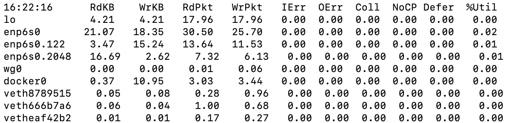

# 传统网络性能监测分析工具学习：

## 1. proc文件系统

TCP 相关统计信息包含在如下文件中
> /proc/net/netstat     tcp/ip协议相关的各种参数 
> 
> /proc/net/snmp        简单网络管理（ip协议、icmp协议等）

| 类别 | counters |
| --- | --- |
| 常量 | RtoAlgorithm, RtoMin, RtoMax, MaxConn
| 建链统计 | ActiveOpens, PassiveOpens, AttemptFails, CurrEstab, EstabResets |
| 数据包统计 | InSegs, OutSegs, RetransSegs, InErrs, OutRsts, InCsumErrors, EmbryonicRsts |
| syncookies 相关 | SyncookiesSent, SyncookiesRecv, SyncookiesFailed |
| TIME_WAIT 相关 | TW, TWRecycled, TWKilled, TCPTimeWaitOverflow |
| RTO 相关 | TCPTimeouts, TCPSpuriousRTOs, TCPLossProbes, TCPLossProbeRecovery, TCPRenoRecoveryFail, TCPSackRecoveryFail, TCPRenoFailures, TCPSackFailures, TCPLossFailures |
| Retrans 相关 | TCPFastRetrans, TCPForwardRetrans, TCPSlowStartRetrans, TCPLostRetransmit, TCPRetransFail |
| FastOpen 相关 | TCPFastOpenActive, TCPFastOpenPassive, TCPFastOpenPassiveFail, TCPFastOpenListenOverflow, TCPFastOpenCookieReqd |
| MD5 相关 | TCPMD5NotFound, TCPMD5Unexpected |
| DelayedACK 相关 | DelayedACKs, DelayedACKLocked, DelayedACKLost, TCPSchedulerFailed |
| DSACK 相关 | TCPDSACKOldSent, TCPDSACKOfoSent, TCPDSACKRecv, TCPDSACKOfoRecv, TCPDSACKIgnoredOld, TCPDSACKIgnoredNoUndo |
| Reorder 相关 | TCPFACKReorder, TCPSACKReorder, TCPRenoReorder, TCPTSReorder |
| Recovery 相关 | TCPRenoRecovery, TCPSackRecovery, TCPRenoRecoveryFail, TCPSackRecoveryFail|
| Abort 相关 | TCPAbortOnData, TCPAbortOnClose, TCPAbortOnMemory, TCPAbortOnTimeout, TCPAbortOnLingerTCPAbortFailed |
| Reset 相关 | EstabResets |
| 内存 prune | PruneCalled, RcvPruned, OfoPruned, TCPMemoryPressures |
| PAWS 相关 | PAWSPassive, PAWSActive, PAWSEstab |
| Listen 相关 | ListenOverflows, ListenDrops |
| Undo 相关 | TCPFullUndo, TCPPartialUndo, TCPDSACKUndo, TCPLossUndo |
| 快速路径与慢速路径 | TCPHPHits, TCPHPHitsToUser, TCPPureAcks, TCPHPAcks |


------


## 2. netstat - 多种网络栈和接口统计信息
基于使用的选项，`netstat`命令能报告多种类型的网络统计数，就像具有多种功能的组合工具。而`netstat`是通过读取`/proc/net/`路径下的文件来获取各种网络相关信息：
+ （默认）：列出连接的套接字
+ -a：列出所有套接字的信息
+ -s：网络栈统计信息
+ -i：网络接口信息
+ -r：列出路由表

 `netstat -s` 输出示例如下：
```shell
root@vagrant-ubuntu-trusty:~] $ strace -e open netstat -s
...
open("/proc/meminfo", O_RDONLY|O_CLOEXEC) = 3
open("/proc/net/snmp", O_RDONLY)        = 3
...
Ip:
    23207 total packets received
    26 with invalid addresses
    0 forwarded
    0 incoming packets discarded
    23181 incoming packets delivered
    17146 requests sent out
    40 outgoing packets dropped
Icmp:
    83 ICMP messages received
    0 input ICMP message failed.
    ICMP input histogram:
        destination unreachable: 83
    80 ICMP messages sent
    0 ICMP messages failed
    ICMP output histogram:
        destination unreachable: 80
IcmpMsg:
        InType3: 83
        OutType3: 80
Tcp:
    2577 active connections openings
    3 passive connection openings
    2570 failed connection attempts
    0 connection resets received
    2 connections established
    21855 segments received
    16307 segments send out
    0 segments retransmited
    0 bad segments received.
    2574 resets sent
Udp:
    659 packets received
    80 packets to unknown port received.
    0 packet receive errors
    767 packets sent
    IgnoredMulti: 506
UdpLite:
open("/proc/net/netstat", O_RDONLY)     = 3
TcpExt:
    4 TCP sockets finished time wait in fast timer
    55 delayed acks sent
    7 delayed acks further delayed because of locked socket
    Quick ack mode was activated 4 times
    8 packets directly queued to recvmsg prequeue.
    3551 packet headers predicted
    85 acknowledgments not containing data payload received
    10436 predicted acknowledgments
    TCPRcvCoalesce: 462
    TCPOrigDataSent: 10445
    TCPHystartTrainDetect: 1
    TCPHystartTrainCwnd: 18
IpExt:
    InBcastPkts: 506
    InOctets: 3732899
    OutOctets: 1305530
    InBcastOctets: 44382
    InNoECTPkts: 24856
+++ exited with 0 +++
```
可以看出，`/proc/net/netstat`文件中包含：
- TcpExt
- IpExt

`/proc/net/snmp`文件中包含：
- Ip
- Icmp
- IcmpMsg
- Tcp
- Udp
- UdpLite


------


## 2. sar - 统计信息历史

系统活动报告工具`sar(1)`可以观测当前活动并且能配置为保存和报告历史统计数据。其可以按照一定时间间隔显示实时数据，也可以收集每天的系统性能数据并将其存储在日志文件中，以供以后显示。`sar`所需的内核数据也从`/proc`文件系统获得：
+ （默认）：列出连接的套接字
+ -n DEV：列出所有套接字的信息
+ -n EDEV：网络栈统计信息
+ -n IP：网络接口信息
+ -n EIP：列出路由表
+ -n TCP：TCP统计信息
+ -n ETCP：TCP错误统计信息
+ -n SOCK：套接字使用


------


## 3. ip - 网络接口统计信息
`ip(8)`命令能配置网络接口和路由，并观测它们的状态和统计信息。除了添加了接收和传输字节，其他计数器与`netstat -i`命令一致。`ip(8)`不提供按时间间隔输出报告的方式。


------


## 4. nicstat - 网络接口吞吐量和使用率
`nicstat`开源工具输出包括吞吐量和使用率在内的网络接口统计信息，输出示例如下：


其中比较有特色的输出为网络接口的`Util`（使用率）。大部分的网卡相关的统计信息来源于：
> /proc/net/dev
> 
> /proc/net/netstat
> 
> /proc/uptime


------


## 5. tcpdump - 网络数据包嗅探器
`tcpdump`工具可以捕捉并详细查看网络数据包，它可以将数据包信息输出到STDOUT，或将数据包写入文件以供后续分析，如将eth4接口的数据写入`/tmp`下的文件：
```shell
tcpdump -i eth4 -w /tmp/out.tcpdump
```


------


## 6. perf - TCP/IP栈跟踪：连接、数据包、丢包、延时
perf是Linux下的一款性能分析工具，能够进行函数级与指令级的热点查找，但其仅能挂载于有限的tracepoint上，可通过`perf list`命令查看。如与tcp相关的Tracepoint有：
```shell
$ sudo perf list 2>&1 | grep tcp
tcp:tcp_destroy_sock                               [Tracepoint event]
tcp:tcp_probe                                      [Tracepoint event]
tcp:tcp_rcv_space_adjust                           [Tracepoint event]
tcp:tcp_receive_reset                              [Tracepoint event]
tcp:tcp_retransmit_skb                             [Tracepoint event]
tcp:tcp_retransmit_synack                          [Tracepoint event]
tcp:tcp_send_reset                                 [Tracepoint event]
```


------


## 参考文献：

man proc

man netstat

[sar - Linux max page](https://linux.die.net/man/1/sar)

《性能之巅：洞悉系统、企业与云计算》